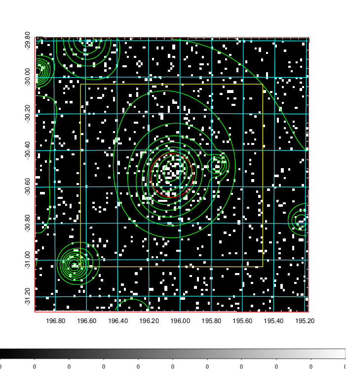
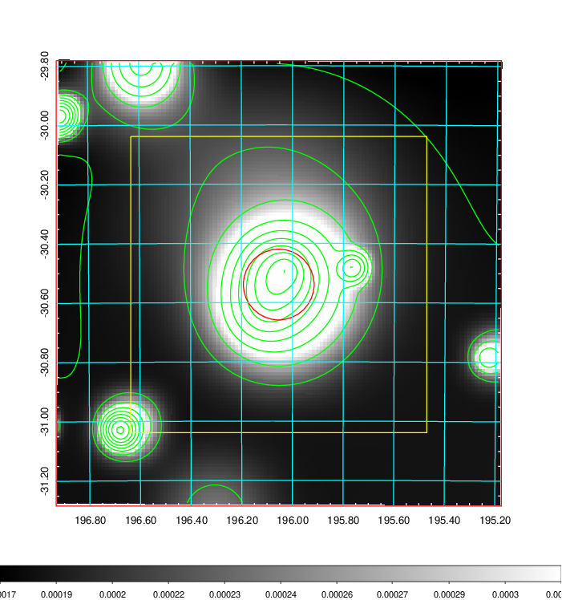
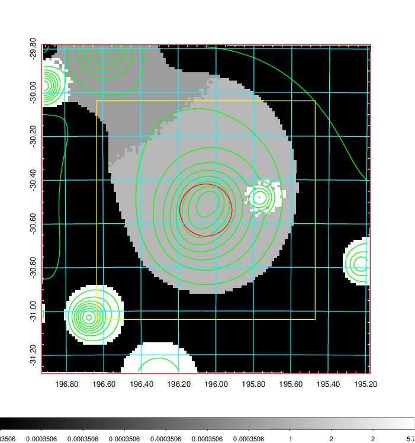
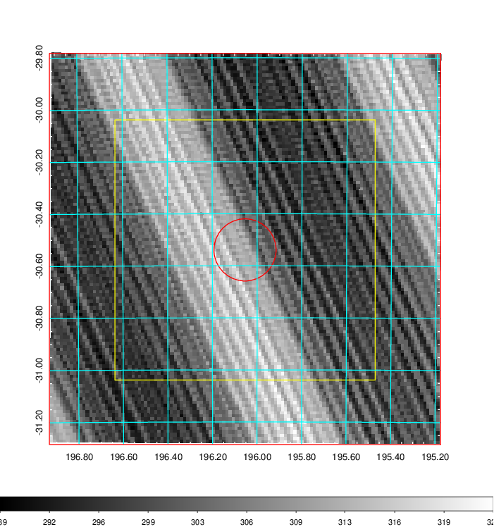
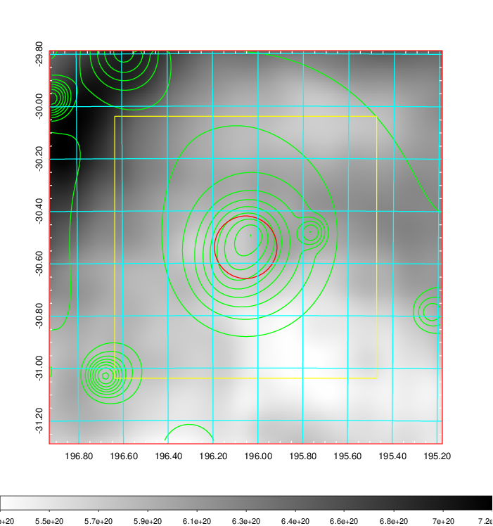
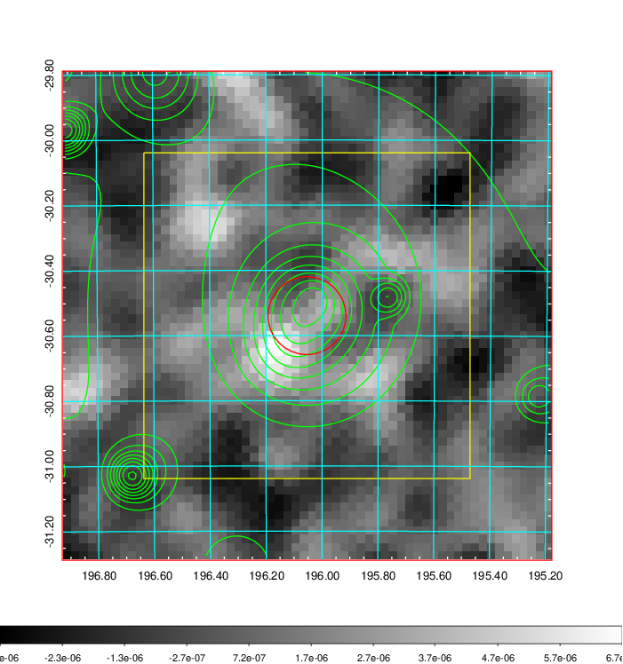
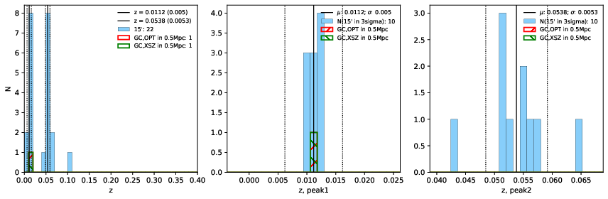
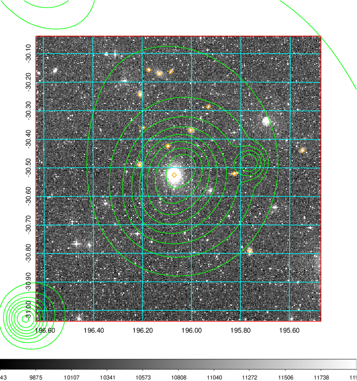
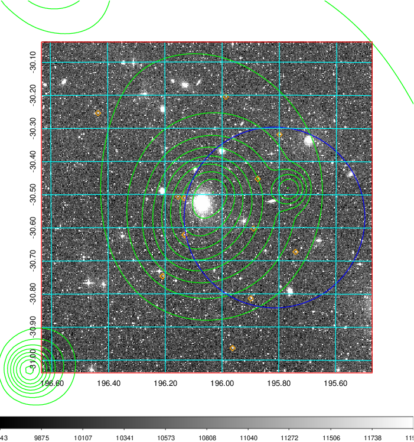
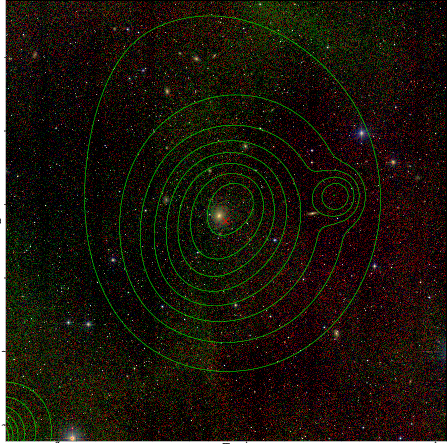

### 481

|Name|RAJ2000[deg]|DEJ2000[deg] |Ext[arcmin]| Ext,ml | z | z_src| C|GC(XSZ,Delta_z<0.01)| GC(OPT,Delta_z<0.01)|GC| R_sig[arcmin] | R500[arcmin] | R500[Mpc]| CRsig[c/s] | CR500[c/s] |L500[1E44 erg/s]|F500[1E-12 erg/s/cm^2]| M500[1E14 Msun]|Tx[keV]|Cnt_sig|Beta|Rc[arcmin]|Comment|Alias|
|---|---|---|---|---|---|------|---|--------|---------|----------|---|---|---|---|---|---|---|---|---|---|---|---|---|---|
|481| 196.054| -30.539| 7.17| 160.00| 0.0112(0.005)| z1, z_xsz| B| MCXC| N| MCXC, N| 20.750| 32.569| 0.448| 0.470(0.080)| 0.520(0.088)| 0.018(0.002)| 6.496(0.849)| 0.26(0.02)| 0.93(0.04)| 166.2| 0.951(-0.063+0.036)| 10.282(-0.801+0.593)| -| k559|

|[RASS image](../image/481/481_img.pdf)|[filtered image](../image/481/481_fil.pdf)|[Segment image](../image/481/481_seg.pdf)|
|-------------------|--------------------|-------------------|
|   |    |   |

|[Exposure image](../image/481/481_mex.pdf)| [nH image](../image/481/481_nh.pdf)| [Planck image](../image/481/481_p.pdf)|
|-------------------|--------------------|-------------------|
|   |     |  |

|[Redshift Histogram](../image/481/481_zg.pdf) | [DSS image(z1)](../image/481/481_dss_z1.pdf)      |  [DSS image(z2)](../image/481/481_dss_z2.pdf)    |
|-------------------|--------------------|-------------------|
| |  Blue circle for optical clusters;  Magenta circle for XSZ clusters;  all with r=1Mpc;  Only GC with Delta_z<0.01 are shown. |  Blue circle for optical clusters;  Magenta circle for XSZ clusters;  all with r=1Mpc;  Only GC with Delta_z<0.01 are shown.  |

|[known Abell/XSZ clusters](../image/481/481_gc.pdf) | [2MASS image](../image/481/481_2mass.pdf)      |
|-------------------|-------------------|
|  Magenta, blue and green circles  for optical, X-ray and SZ clusters  respectively, with redshift of clusters  labelled. The radius of circles  are 1Mpc.|  |

|[PS1 image](../image/481/481_ps1.pdf)            |
|-------------------|
|   |
