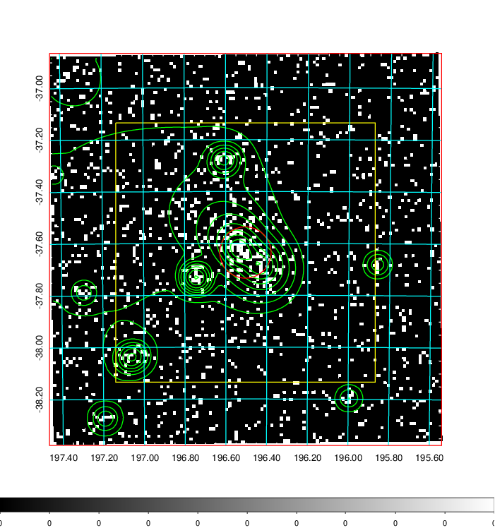
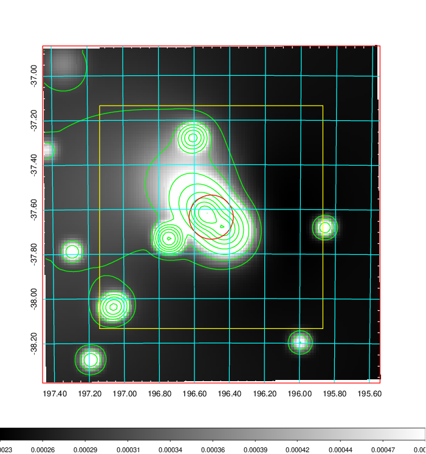
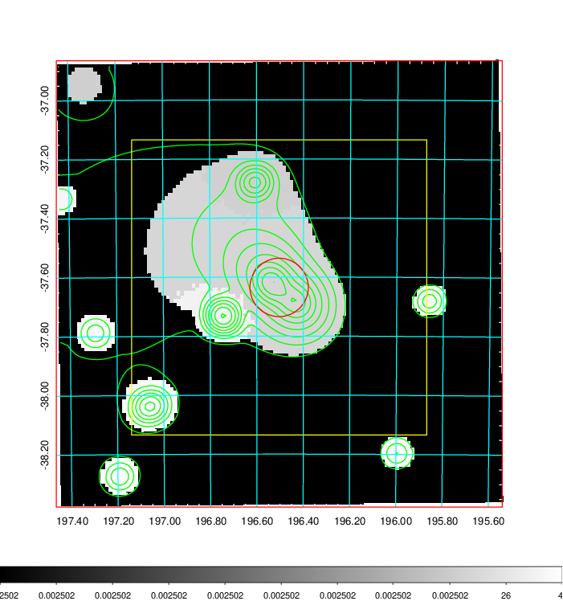
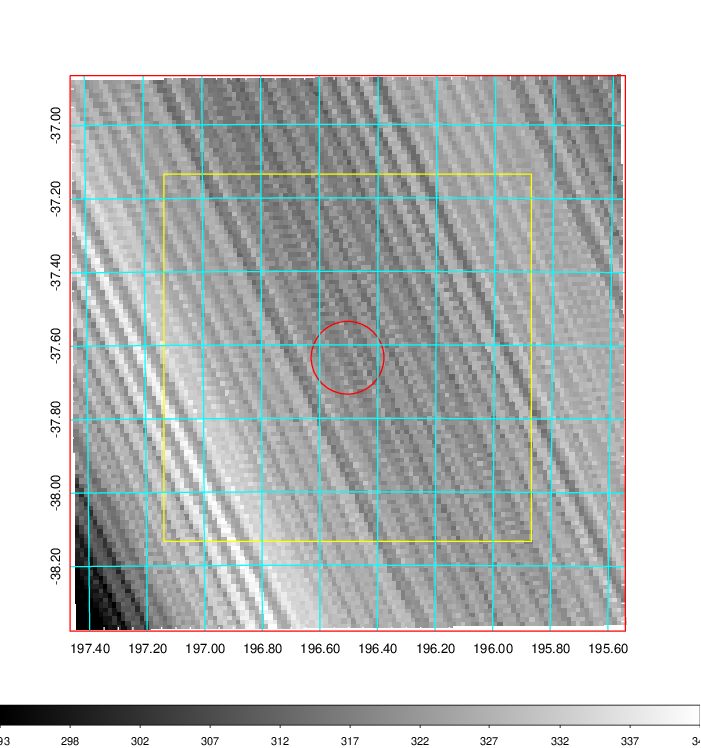
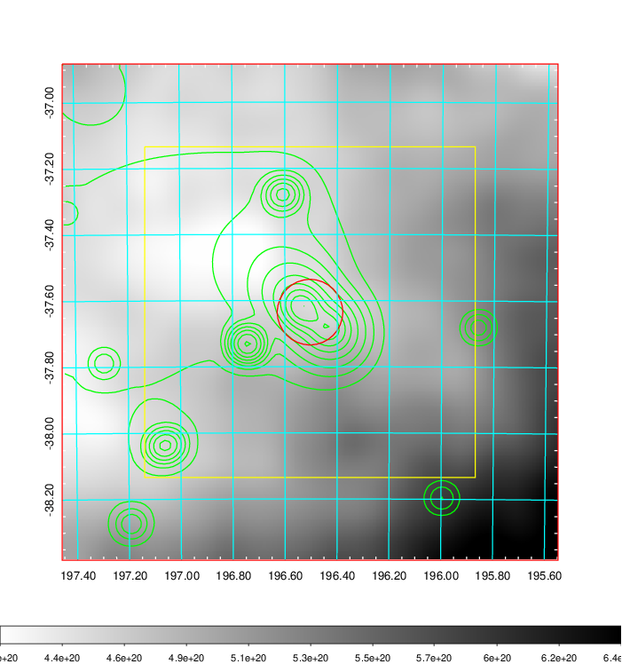
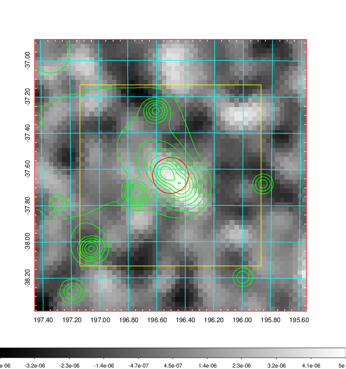
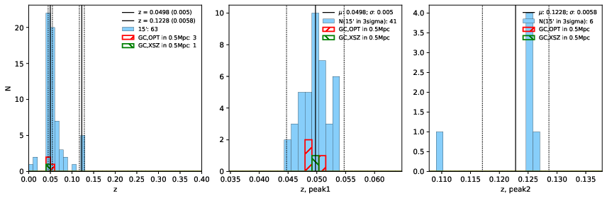
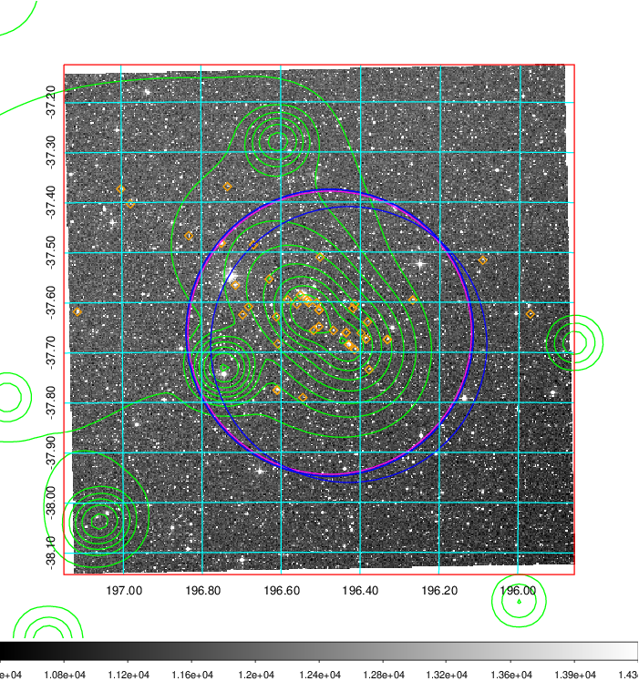
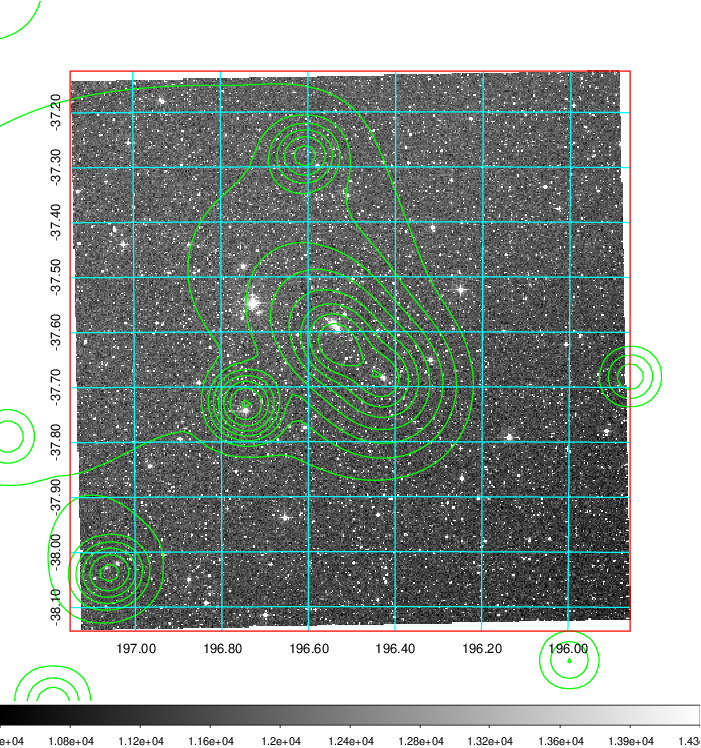
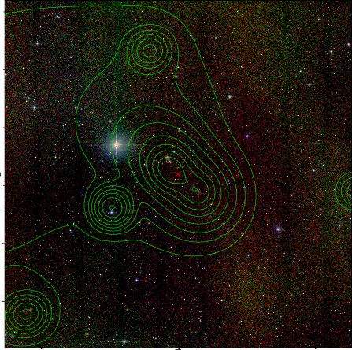

### 484

|Name|RAJ2000[deg]|DEJ2000[deg] |Ext[arcmin]| Ext,ml | z | z_src| C|GC(XSZ,Delta_z<0.01)| GC(OPT,Delta_z<0.01)|GC| R_sig[arcmin] | R500[arcmin] | R500[Mpc]| CRsig[c/s] | CR500[c/s] |L500[1E44 erg/s]|F500[1E-12 erg/s/cm^2]| M500[1E14 Msun]|Tx[keV]|Cnt_sig|Beta|Rc[arcmin]|Comment|Alias|
|---|---|---|---|---|---|------|---|--------|---------|----------|---|---|---|---|---|---|---|---|---|---|---|---|---|---|
|484| 196.504| -37.635| 5.94| 130.43| 0.0498(0.005)| z1, z_xsz| B| MCXC| A, W| A, MCXC, N, W| 21.244| 14.061| 0.822| 0.512(0.089)| 0.485(0.084)| 0.504(0.052)| 8.601(0.891)| 1.65(0.09)| 2.97(0.10)| 189.3| 0.796(-0.092+0.110)| 7.413(-1.232+1.313)| -| k539|

|[RASS image](../image/484/484_img.pdf)|[filtered image](../image/484/484_fil.pdf)|[Segment image](../image/484/484_seg.pdf)|
|-------------------|--------------------|-------------------|
|   |    |   |

|[Exposure image](../image/484/484_mex.pdf)| [nH image](../image/484/484_nh.pdf)| [Planck image](../image/484/484_p.pdf)|
|-------------------|--------------------|-------------------|
|   |     |  |

|[Redshift Histogram](../image/484/484_zg.pdf) | [DSS image(z1)](../image/484/484_dss_z1.pdf)      |  [DSS image(z2)](../image/484/484_dss_z2.pdf)    |
|-------------------|--------------------|-------------------|
| |  Blue circle for optical clusters;  Magenta circle for XSZ clusters;  all with r=1Mpc;  Only GC with Delta_z<0.01 are shown. |  Blue circle for optical clusters;  Magenta circle for XSZ clusters;  all with r=1Mpc;  Only GC with Delta_z<0.01 are shown.  |

|[Previous-identified clusters](../image/484/484_gc.pdf) | [2MASS image](../image/484/484_2mass.pdf)      |
|-------------------|-------------------|
|  Green, magenta, and blue circles  for optical, X-ray and SZ clusters  respectively, with redshift of clusters  labelled. The radius of circles  are 1Mpc.|  |

