

### 485

|Name|RAJ2000[deg]|DEJ2000[deg] |Ext[arcmin]| Ext,ml | z | z_src| C|GC(XSZ,Delta_z<0.01)| GC(OPT,Delta_z<0.01)|GC| R_sig[arcmin] | R500[arcmin] | R500[Mpc]| CRsig[c/s] | CR500[c/s] |L500[1E44 erg/s]|F500[1E-12 erg/s/cm^2]| M500[1E14 Msun]|Tx[keV]|Cnt_sig|Beta|Rc[arcmin]|Comment|Alias|
|---|---|---|---|---|---|------|---|--------|---------|----------|---|---|---|---|---|---|---|---|---|---|---|---|---|---|
|485| 196.526| 9.134| 11.21| 50.45| 0.0546(0.005)| z1, z_opt| S| -| N, W| N, W| 15.138| 10.619| 0.676| 0.175(0.050)| 0.167(0.048)| 0.216(0.051)| 3.040(0.718)| 0.93(0.11)| 2.08(0.16)| 69.0| 0.838(-0.170+0.115)| 9.160(-1.966+1.626)| -| t474|

|[RASS image](../image/485/485_img.pdf)|[filtered image](../image/485/485_fil.pdf)|[Segment image](../image/485/485_seg.pdf)|
|-------------------|--------------------|-------------------|
| 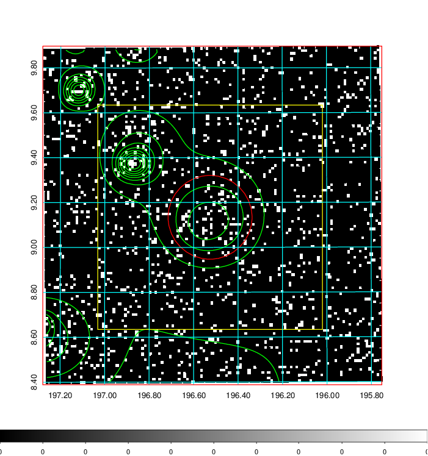  | 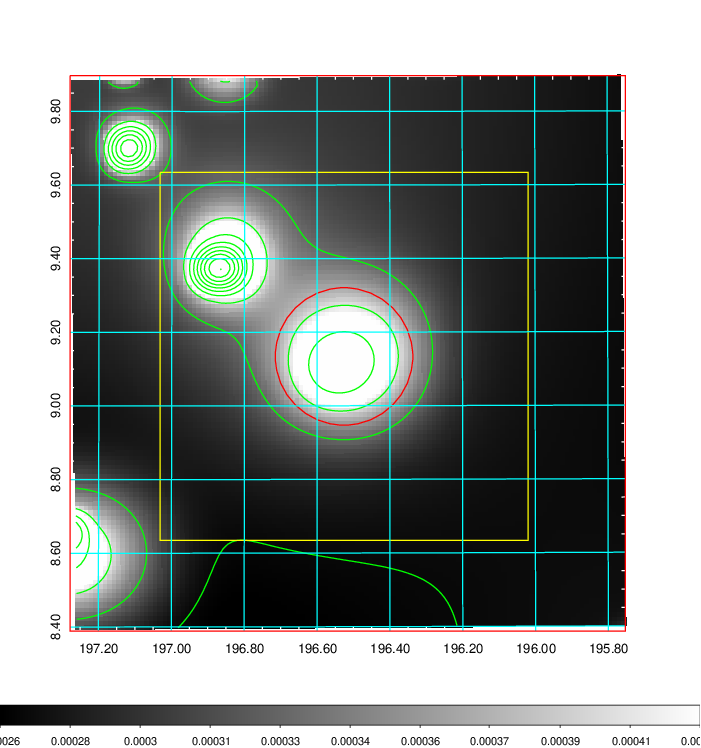   | 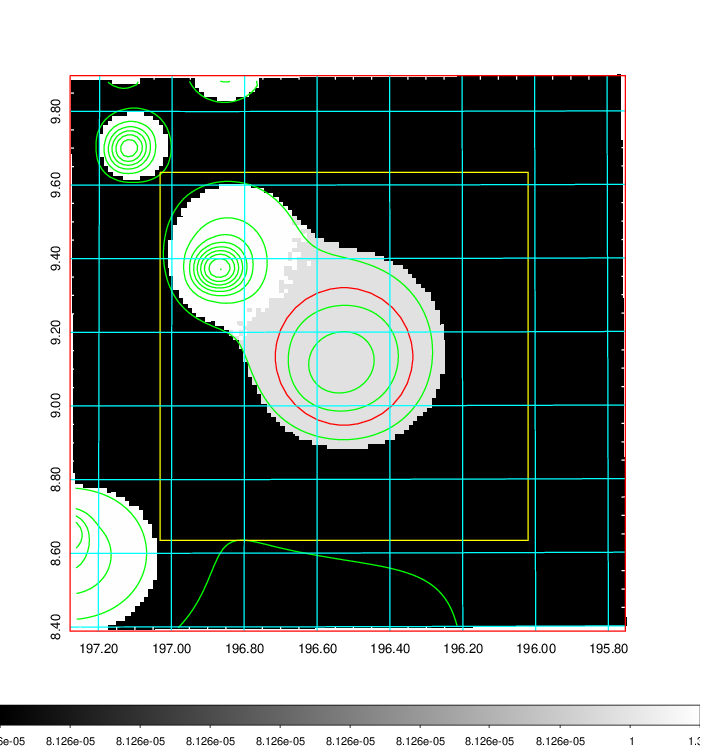  |

|[Exposure image](../image/485/485_mex.pdf)| [nH image](../image/485/485_nh.pdf)| [Planck image](../image/485/485_p.pdf)|
|-------------------|--------------------|-------------------|
|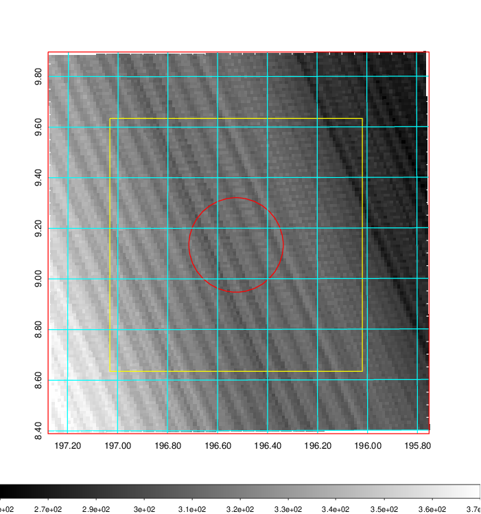   | 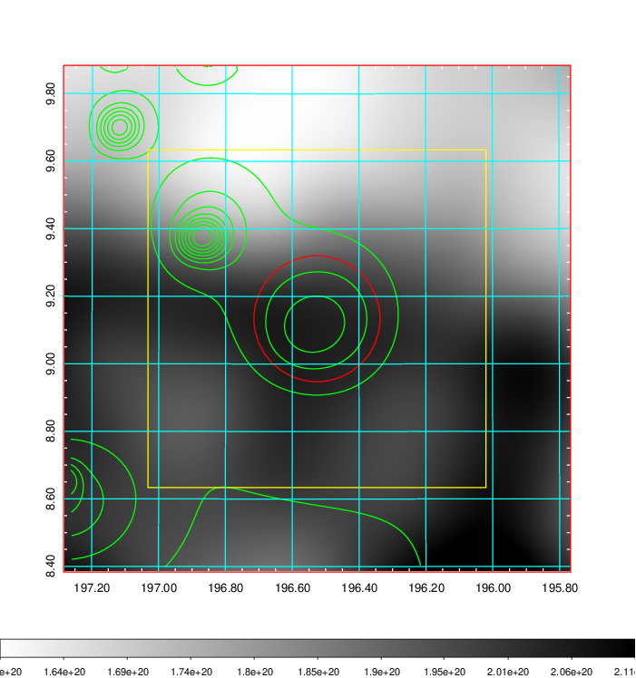    | 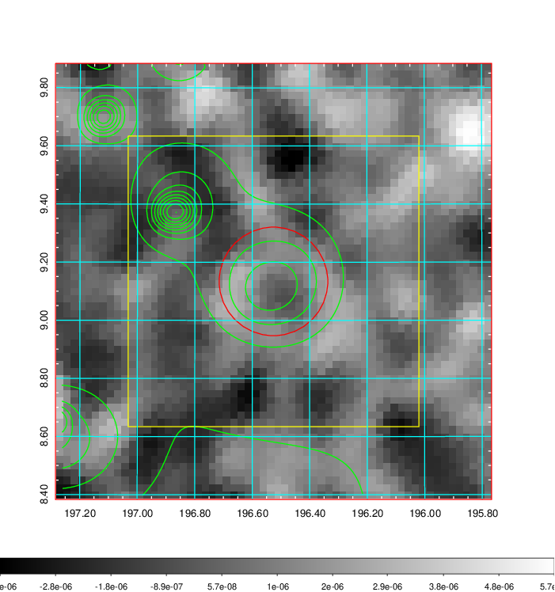 |

|[Redshift Histogram](../image/485/485_zg.pdf) | [DSS image(z1)](../image/485/485_dss_z1.pdf)      |  [DSS image(z2)](../image/485/485_dss_z2.pdf)    |
|-------------------|--------------------|-------------------|
|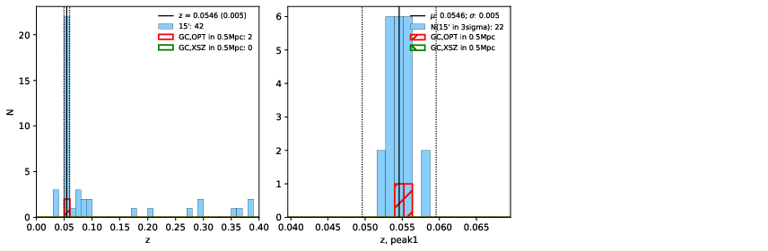 |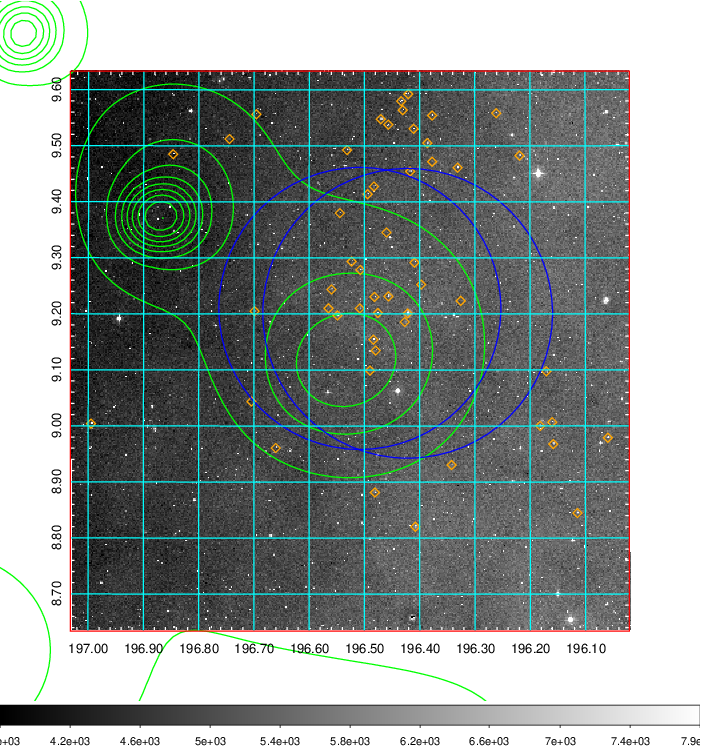  Blue circle for optical clusters;  Magenta circle for XSZ clusters;  all with r=1Mpc;  Only GC with Delta_z<0.01 are shown. | 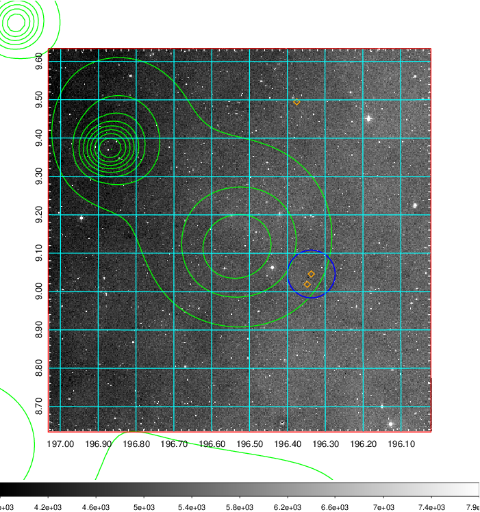 Blue circle for optical clusters;  Magenta circle for XSZ clusters;  all with r=1Mpc;  Only GC with Delta_z<0.01 are shown.  |

|[Previous-identified clusters](../image/485/485_gc.pdf) | [2MASS image](../image/485/485_2mass.pdf)      |[SDSS image](../image/485/485_sdss.pdf)   |
|-------------------|-------------------|-------------------|
|  Green, magenta, and blue circles  for optical, X-ray and SZ clusters  respectively, with redshift of clusters  labelled. The radius of circles  are 1Mpc.|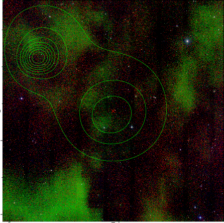  | 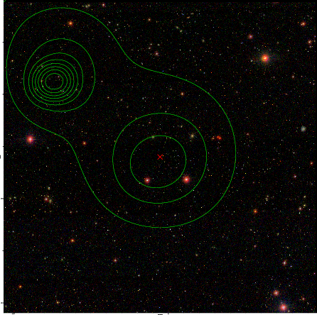  |

