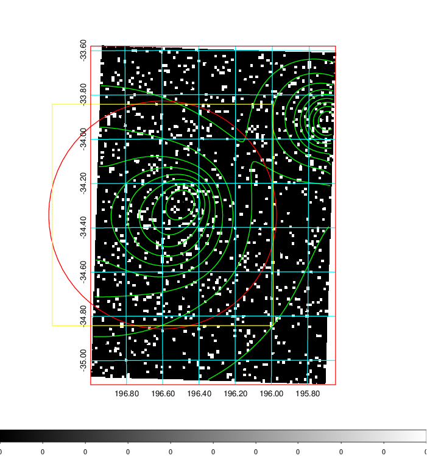
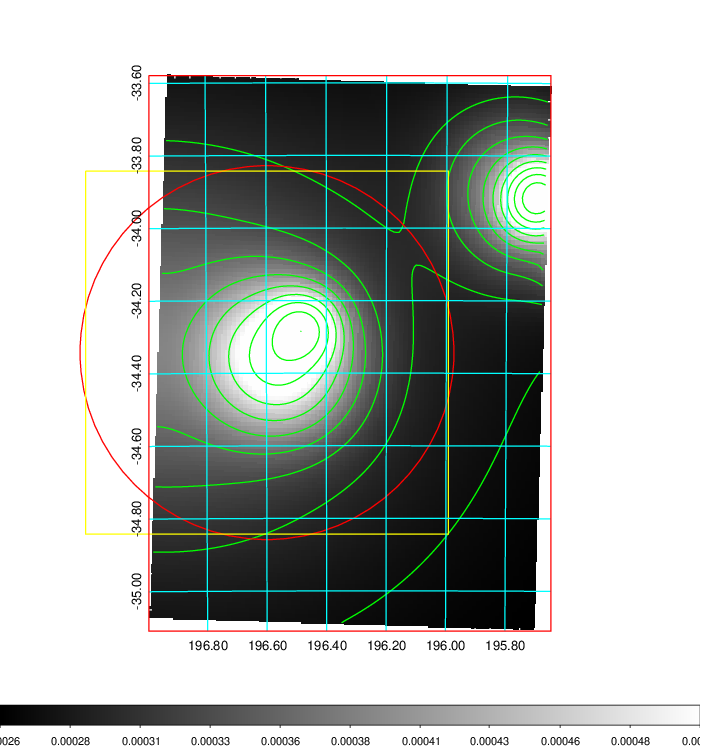
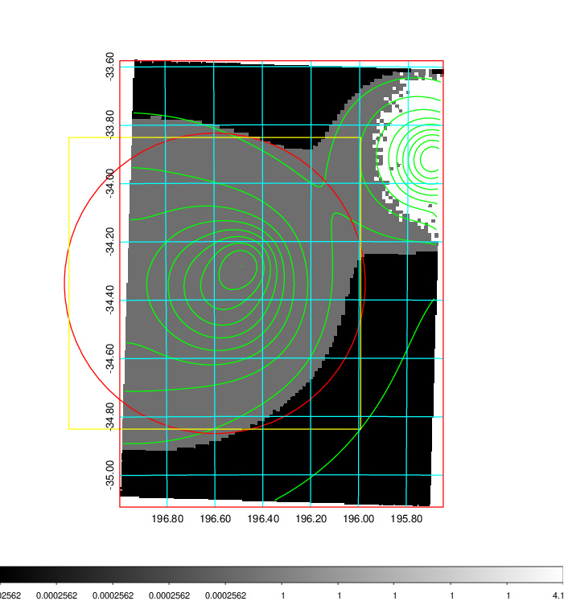
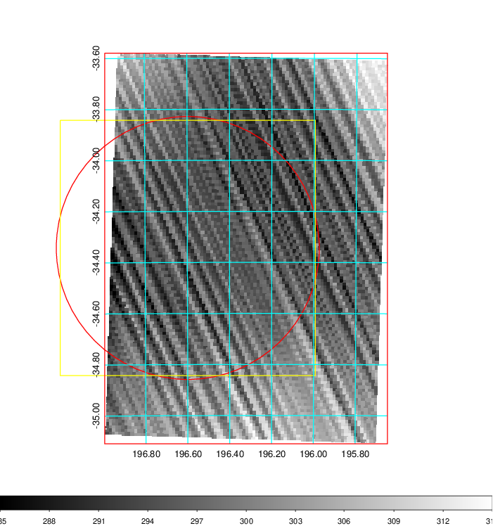
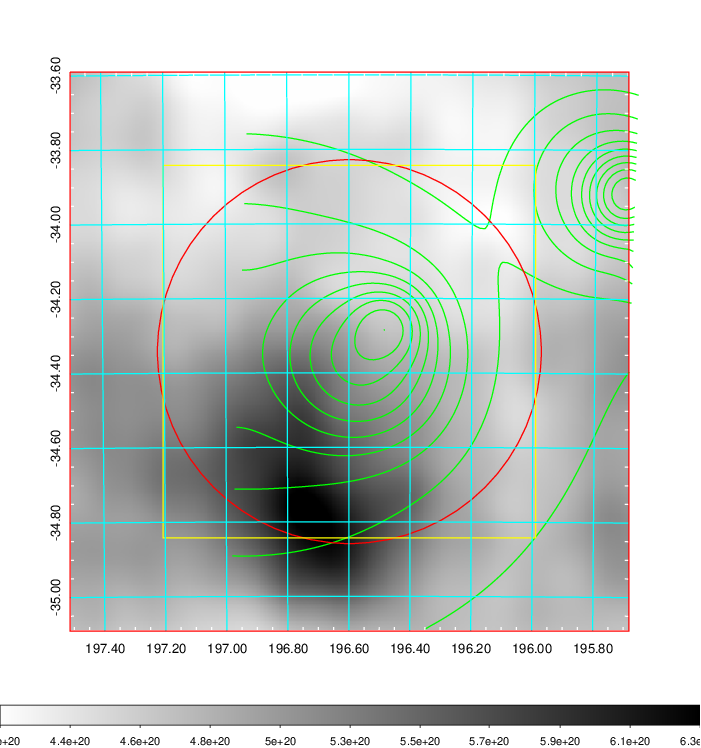
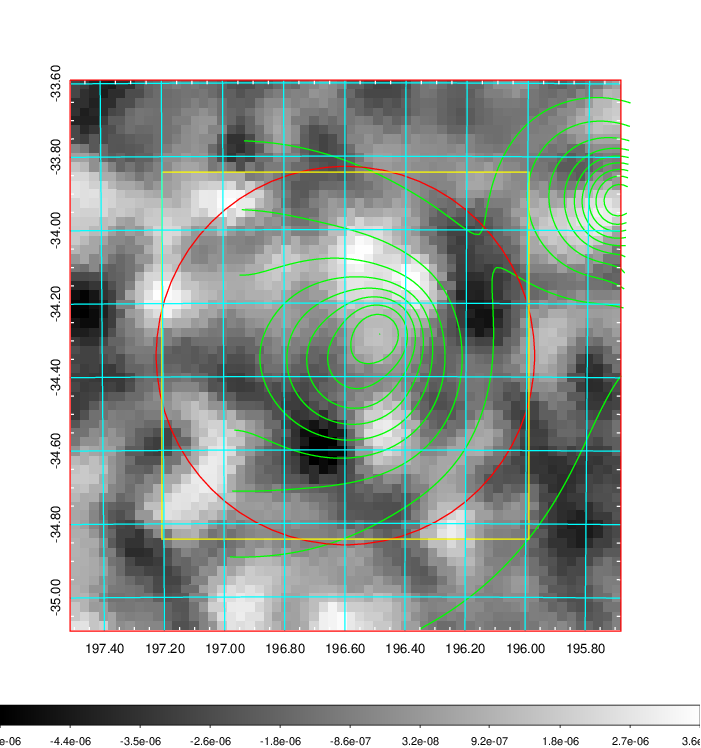
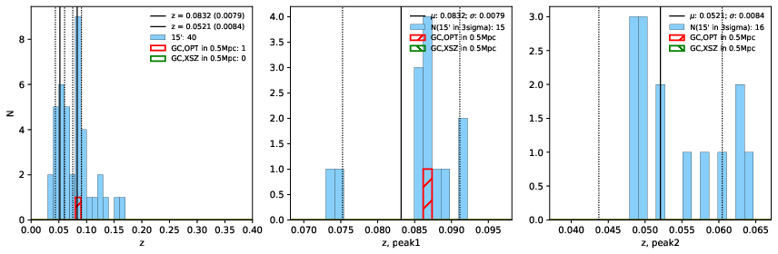
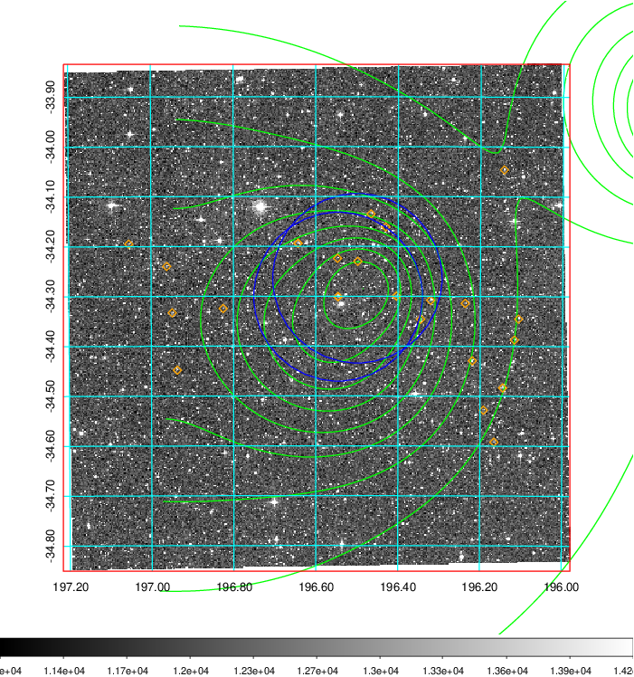
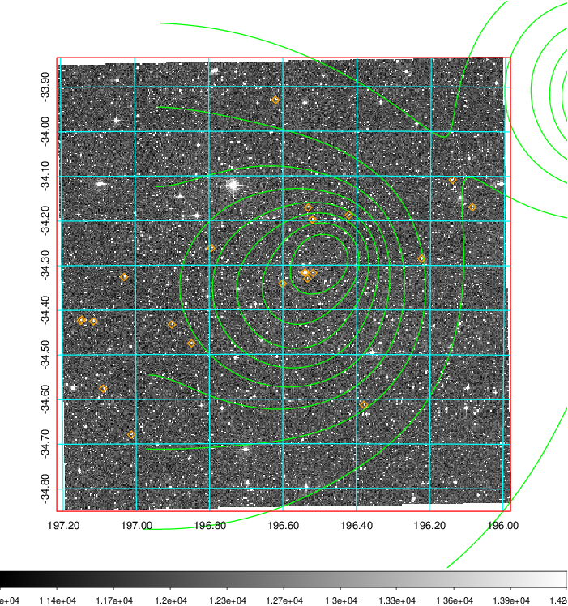
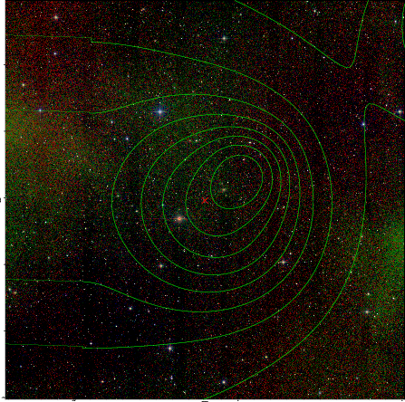

### 486

|Name|RAJ2000[deg]|DEJ2000[deg] |Ext[arcmin]| Ext,ml | z | z_src| C|GC(XSZ,Delta_z<0.01)| GC(OPT,Delta_z<0.01)|GC| R_sig[arcmin] | R500[arcmin] | R500[Mpc]| CRsig[c/s] | CR500[c/s] |L500[1E44 erg/s]|F500[1E-12 erg/s/cm^2]| M500[1E14 Msun]|Tx[keV]|Cnt_sig|Beta|Rc[arcmin]|Comment|Alias|
|---|---|---|---|---|---|------|---|--------|---------|----------|---|---|---|---|---|---|---|---|---|---|---|---|---|---|
|486| 196.598| -34.343| 30.91| 131.51| 0.0832(0.008)| z1, z_opt| S| -| W| N, W| 12.212| 8.872| 0.833| 0.199(0.049)| 0.190(0.047)| 0.577(0.108)| 3.366(0.628)| 1.78(0.17)| 3.13(0.19)| 77.7| 0.844(-0.167+0.112)| 15.457(-2.665+2.181)| -| t643|

|[RASS image](../image/486/486_img.pdf)|[filtered image](../image/486/486_fil.pdf)|[Segment image](../image/486/486_seg.pdf)|
|-------------------|--------------------|-------------------|
|   |    |   |

|[Exposure image](../image/486/486_mex.pdf)| [nH image](../image/486/486_nh.pdf)| [Planck image](../image/486/486_p.pdf)|
|-------------------|--------------------|-------------------|
|   |     |  |

|[Redshift Histogram](../image/486/486_zg.pdf) | [DSS image(z1)](../image/486/486_dss_z1.pdf)      |  [DSS image(z2)](../image/486/486_dss_z2.pdf)    |
|-------------------|--------------------|-------------------|
| |  Blue circle for optical clusters;  Magenta circle for XSZ clusters;  all with r=1Mpc;  Only GC with Delta_z<0.01 are shown. |  Blue circle for optical clusters;  Magenta circle for XSZ clusters;  all with r=1Mpc;  Only GC with Delta_z<0.01 are shown.  |

|[Previous-identified clusters](../image/486/486_gc.pdf) | [2MASS image](../image/486/486_2mass.pdf)      |
|-------------------|-------------------|
|  Green, magenta, and blue circles  for optical, X-ray and SZ clusters  respectively, with redshift of clusters  labelled. The radius of circles  are 1Mpc.|  |

