

### 487

|Name|RAJ2000[deg]|DEJ2000[deg] |Ext[arcmin]| Ext,ml | z | z_src| C|GC(XSZ,Delta_z<0.01)| GC(OPT,Delta_z<0.01)|GC| R_sig[arcmin] | R500[arcmin] | R500[Mpc]| CRsig[c/s] | CR500[c/s] |L500[1E44 erg/s]|F500[1E-12 erg/s/cm^2]| M500[1E14 Msun]|Tx[keV]|Cnt_sig|Beta|Rc[arcmin]|Comment|Alias|
|---|---|---|---|---|---|------|---|--------|---------|----------|---|---|---|---|---|---|---|---|---|---|---|---|---|---|
|487| 196.747| 46.543| 2.31| 80.38| 0.2255(0.005)| z1, z_xsz| B| F20, MCXC, PSZ2, SPI, Tar, XB| A, C, N, RM, W| A, C, F20, MCXC, N, PSZ2, SPI, Tar, W, XB| 7.338| 5.448| 1.183| 0.194(0.030)| 0.186(0.028)| 5.864(0.417)| 3.898(0.277)| 5.91(0.20)| 6.89(0.15)| 104.1| 0.949(-0.069+0.037)| 4.440(-0.414+0.336)| -| k265|

|[RASS image](../image/487/487_img.pdf)|[filtered image](../image/487/487_fil.pdf)|[Segment image](../image/487/487_seg.pdf)|
|-------------------|--------------------|-------------------|
| 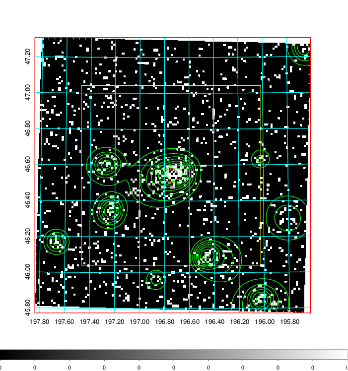  | 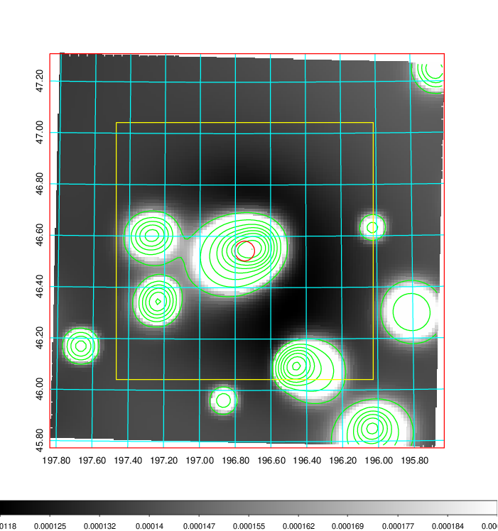   | 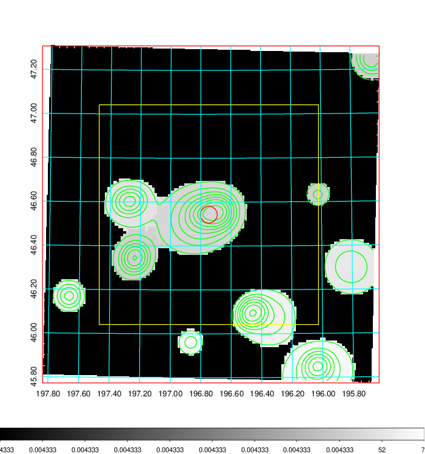  |

|[Exposure image](../image/487/487_mex.pdf)| [nH image](../image/487/487_nh.pdf)| [Planck image](../image/487/487_p.pdf)|
|-------------------|--------------------|-------------------|
|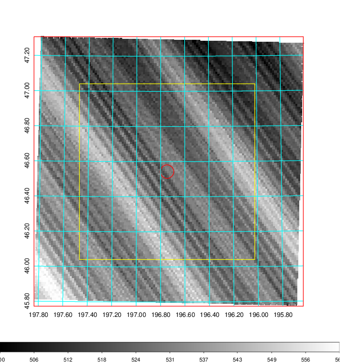   | 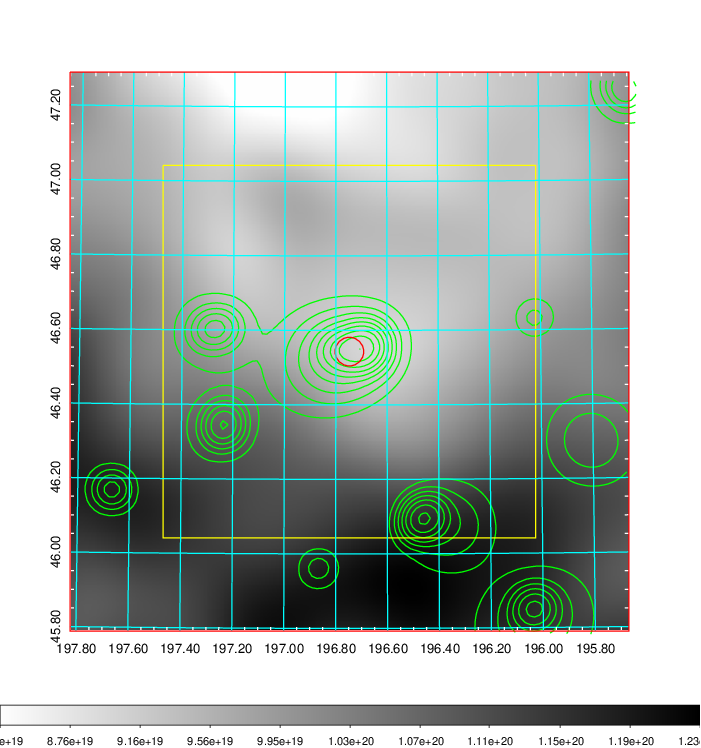    | 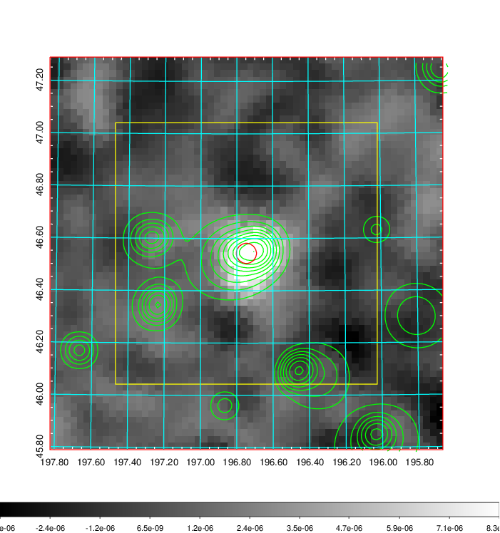 |

|[Redshift Histogram](../image/487/487_zg.pdf) | [DSS image(z1)](../image/487/487_dss_z1.pdf)      |  [DSS image(z2)](../image/487/487_dss_z2.pdf)    |
|-------------------|--------------------|-------------------|
|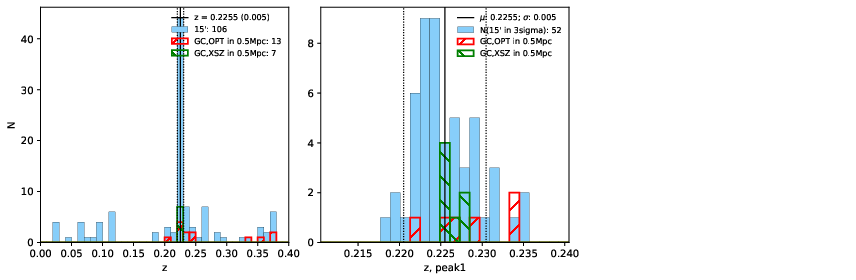 |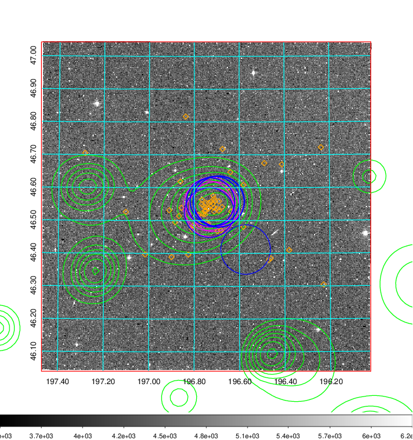  Blue circle for optical clusters;  Magenta circle for XSZ clusters;  all with r=1Mpc;  Only GC with Delta_z<0.01 are shown. | 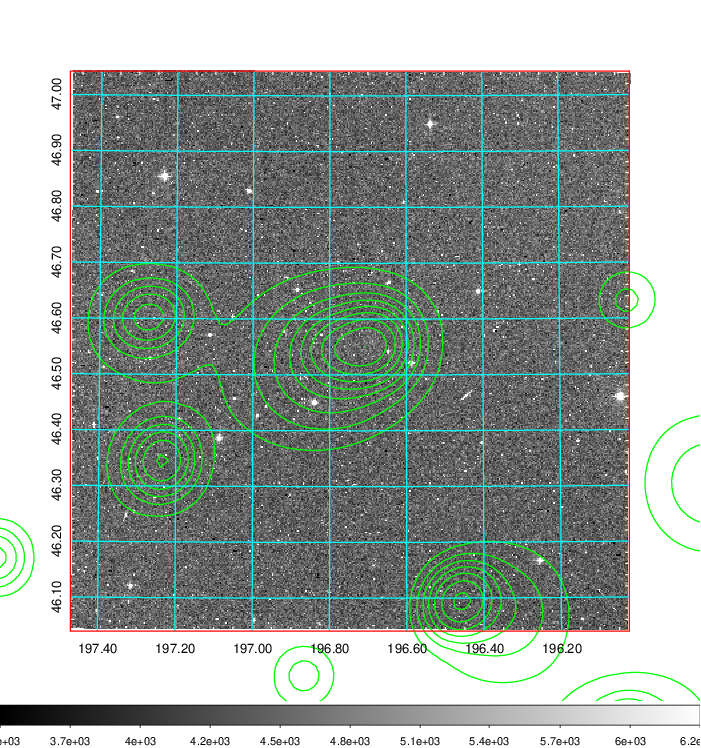 Blue circle for optical clusters;  Magenta circle for XSZ clusters;  all with r=1Mpc;  Only GC with Delta_z<0.01 are shown.  |

|[known Abell/XSZ clusters](../image/487/487_gc.pdf) | [2MASS image](../image/487/487_2mass.pdf)      |[SDSS image](../image/487/487_sdss.pdf)   |
|-------------------|-------------------|-------------------|
|  Magenta, blue and green circles  for optical, X-ray and SZ clusters  respectively, with redshift of clusters  labelled. The radius of circles  are 1Mpc.|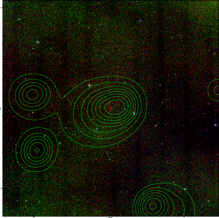  | 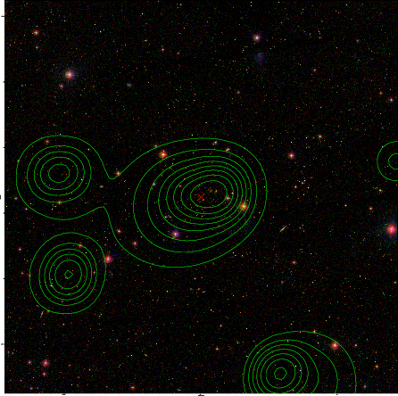  |

