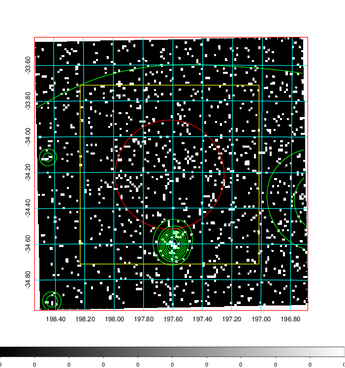
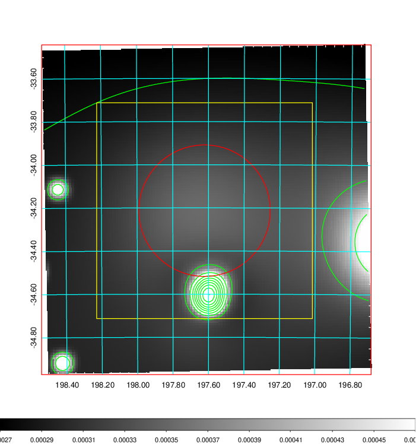
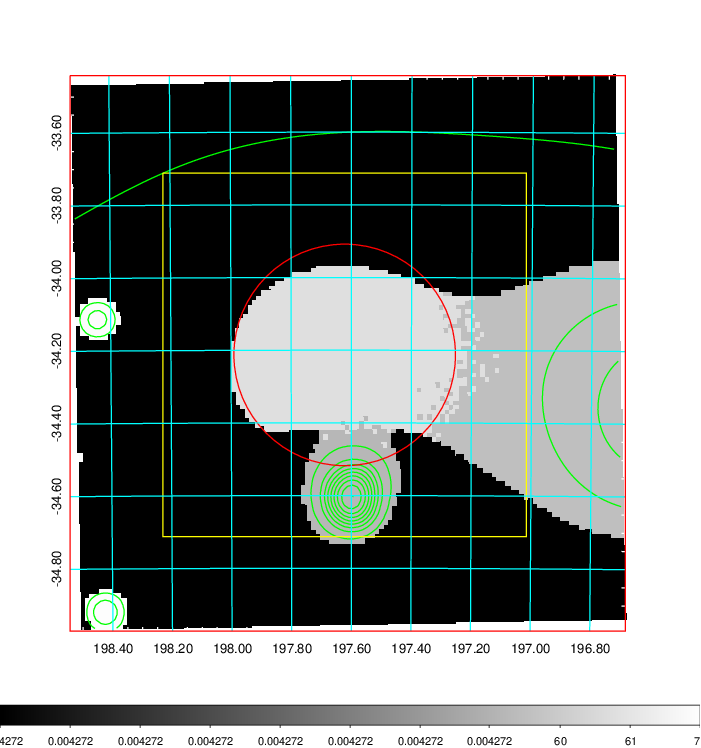
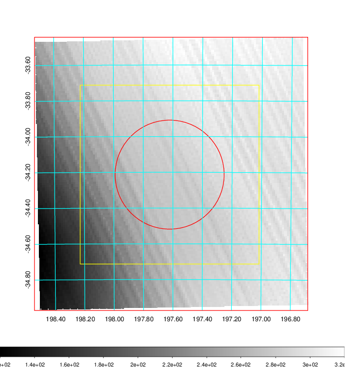
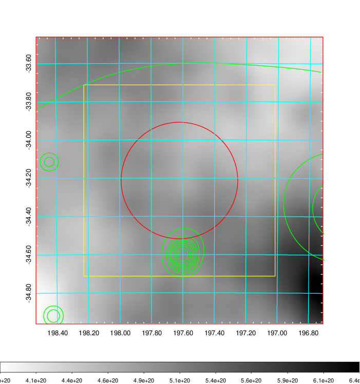
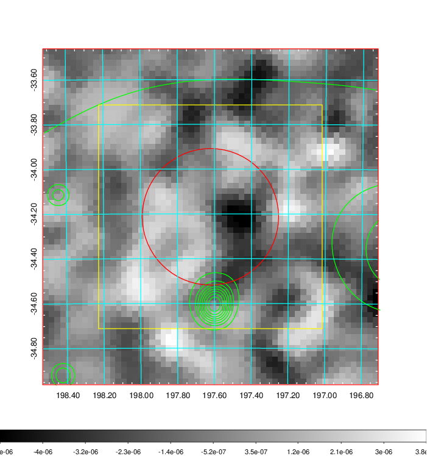
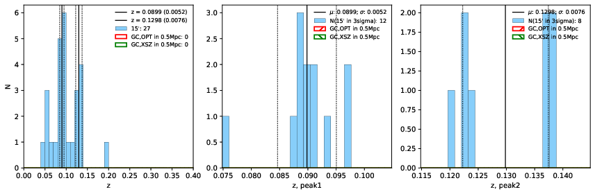
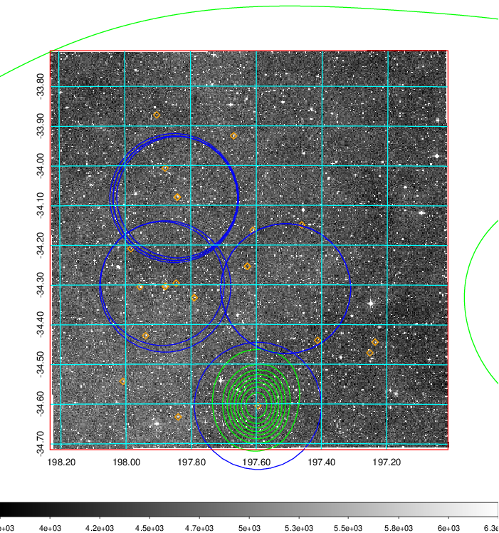
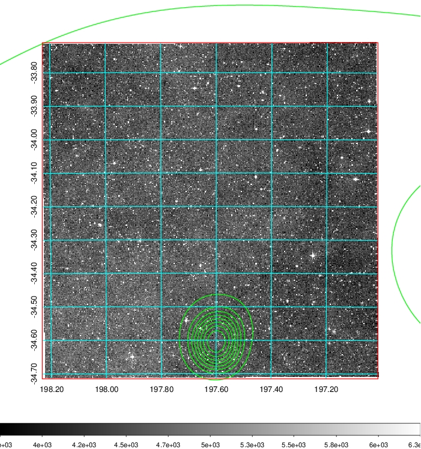
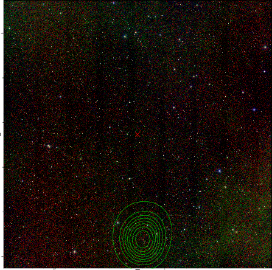

### 488

|Name|RAJ2000[deg]|DEJ2000[deg] |Ext[arcmin]| Ext,ml | z | z_src| C|GC(XSZ,Delta_z<0.01)| GC(OPT,Delta_z<0.01)|GC| R_sig[arcmin] | R500[arcmin] | R500[Mpc]| CRsig[c/s] | CR500[c/s] |L500[1E44 erg/s]|F500[1E-12 erg/s/cm^2]| M500[1E14 Msun]|Tx[keV]|Cnt_sig|Beta|Rc[arcmin]|Comment|Alias|
|---|---|---|---|---|---|------|---|--------|---------|----------|---|---|---|---|---|---|---|---|---|---|---|---|---|---|
|488| 197.622| -34.213| 18.29| 37.20| 0.0899(0.005)| z1,| G| -| -| A, N, W| 16.800| 7.734| 0.778| 0.130(0.077)| 0.120(0.071)| 0.425(0.435)| 2.101(2.154)| 1.46(0.76)| 2.78(0.91)| 62.9| 0.539(-0.030+0.078)| 4.932(-0.673+1.037)| -| t568|

|[RASS image](../image/488/488_img.pdf)|[filtered image](../image/488/488_fil.pdf)|[Segment image](../image/488/488_seg.pdf)|
|-------------------|--------------------|-------------------|
|   |    |   |

|[Exposure image](../image/488/488_mex.pdf)| [nH image](../image/488/488_nh.pdf)| [Planck image](../image/488/488_p.pdf)|
|-------------------|--------------------|-------------------|
|   |     |  |

|[Redshift Histogram](../image/488/488_zg.pdf) | [DSS image(z1)](../image/488/488_dss_z1.pdf)      |  [DSS image(z2)](../image/488/488_dss_z2.pdf)    |
|-------------------|--------------------|-------------------|
| |  Blue circle for optical clusters;  Magenta circle for XSZ clusters;  all with r=1Mpc;  Only GC with Delta_z<0.01 are shown. |  Blue circle for optical clusters;  Magenta circle for XSZ clusters;  all with r=1Mpc;  Only GC with Delta_z<0.01 are shown.  |

|[Previous-identified clusters](../image/488/488_gc.pdf) | [2MASS image](../image/488/488_2mass.pdf)      |
|-------------------|-------------------|
|  Green, magenta, and blue circles  for optical, X-ray and SZ clusters  respectively, with redshift of clusters  labelled. The radius of circles  are 1Mpc.|  |

