

### 489

|Name|RAJ2000[deg]|DEJ2000[deg] |Ext[arcmin]| Ext,ml | z | z_src| C|GC(XSZ,Delta_z<0.01)| GC(OPT,Delta_z<0.01)|GC| R_sig[arcmin] | R500[arcmin] | R500[Mpc]| CRsig[c/s] | CR500[c/s] |L500[1E44 erg/s]|F500[1E-12 erg/s/cm^2]| M500[1E14 Msun]|Tx[keV]|Cnt_sig|Beta|Rc[arcmin]|Comment|Alias|
|---|---|---|---|---|---|------|---|--------|---------|----------|---|---|---|---|---|---|---|---|---|---|---|---|---|---|
|489| 197.810| 39.245| 2.86| 118.13| 0.0722(0.005)| z1, z_xsz| B| F20, L03, MCXC, PSZ2, SPI, Tar| A, N, RM, W| A, C, F20, L03, MCXC, N, PSZ2, SPI, Tar, W| 25.194| 10.735| 0.886| 0.403(0.054)| 0.368(0.049)| 0.915(0.091)| 7.190(0.712)| 2.12(0.11)| 3.48(0.11)| 227.9| 0.591(-0.031+0.037)| 4.031(-0.504+0.580)| -| k361|

|[RASS image](../image/489/489_img.pdf)|[filtered image](../image/489/489_fil.pdf)|[Segment image](../image/489/489_seg.pdf)|
|-------------------|--------------------|-------------------|
| 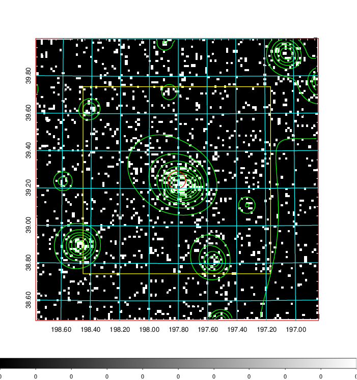  | 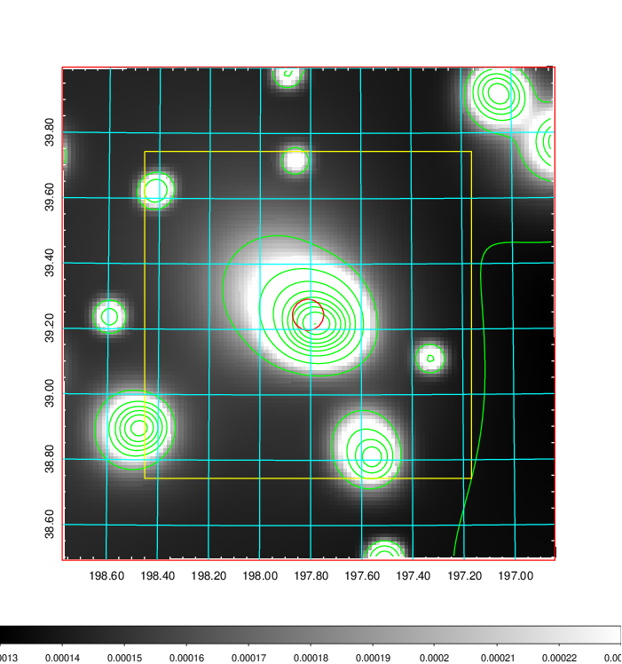   | 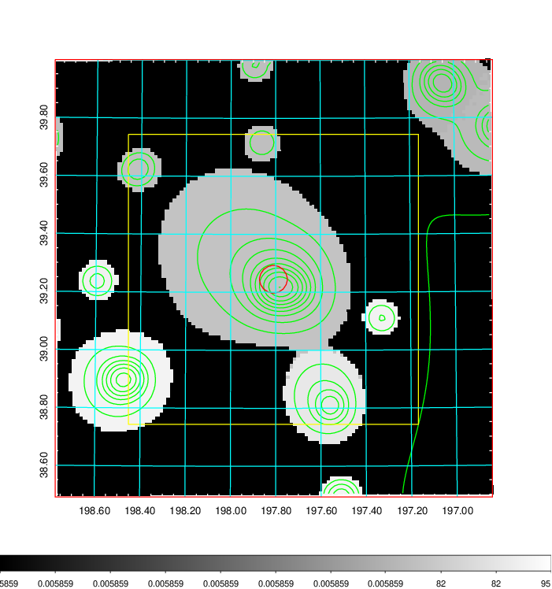  |

|[Exposure image](../image/489/489_mex.pdf)| [nH image](../image/489/489_nh.pdf)| [Planck image](../image/489/489_p.pdf)|
|-------------------|--------------------|-------------------|
|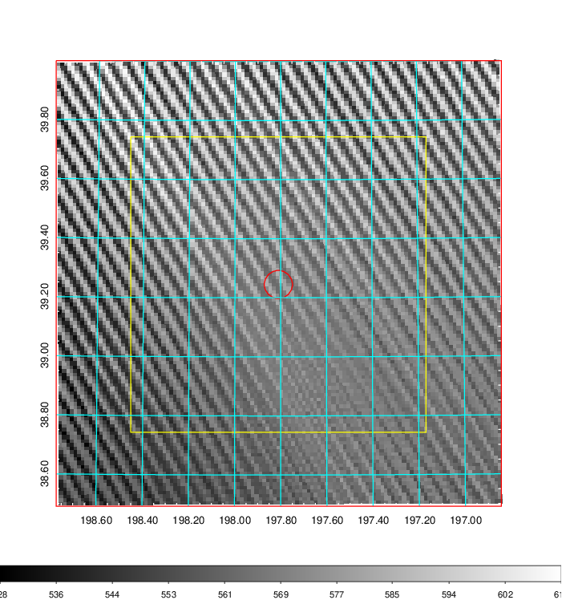   | 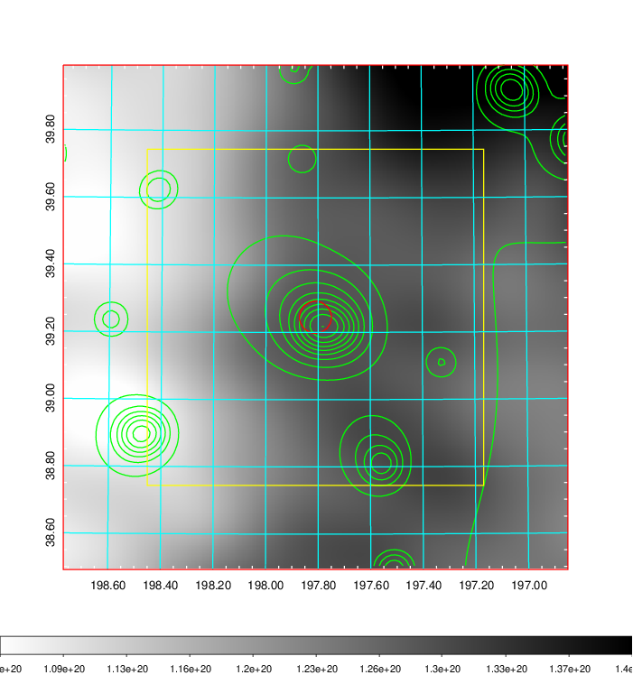    | 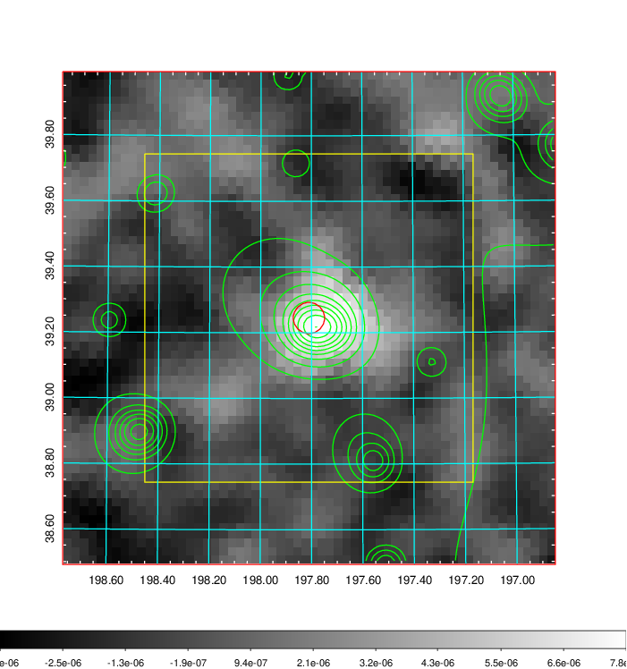 |

|[Redshift Histogram](../image/489/489_zg.pdf) | [DSS image(z1)](../image/489/489_dss_z1.pdf)      |  [DSS image(z2)](../image/489/489_dss_z2.pdf)    |
|-------------------|--------------------|-------------------|
|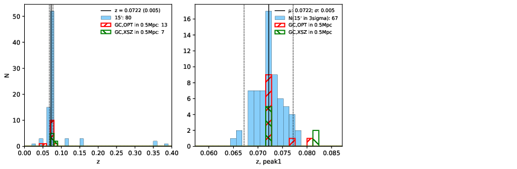 |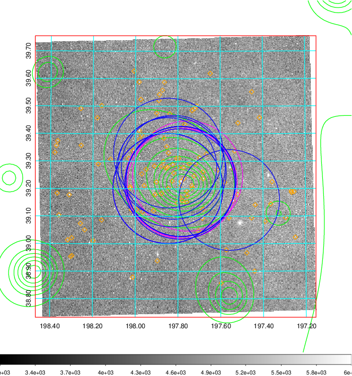  Blue circle for optical clusters;  Magenta circle for XSZ clusters;  all with r=1Mpc;  Only GC with Delta_z<0.01 are shown. | 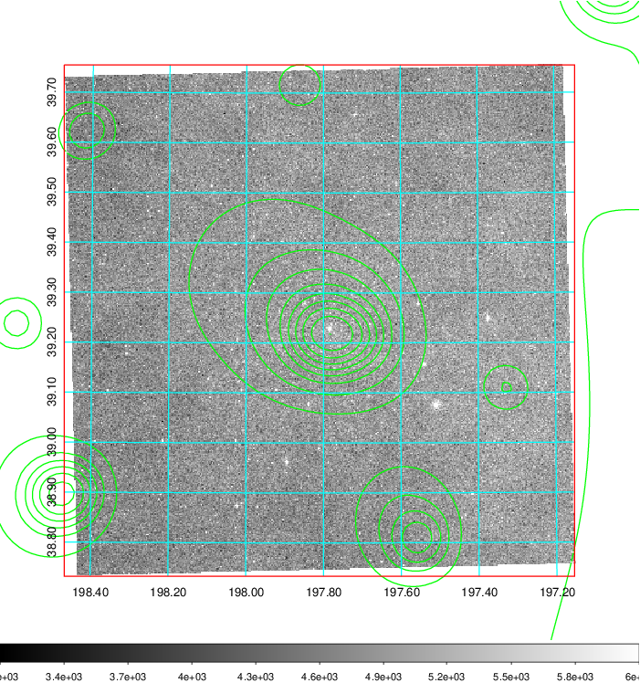 Blue circle for optical clusters;  Magenta circle for XSZ clusters;  all with r=1Mpc;  Only GC with Delta_z<0.01 are shown.  |

|[Previous-identified clusters](../image/489/489_gc.pdf) | [2MASS image](../image/489/489_2mass.pdf)      |[SDSS image](../image/489/489_sdss.pdf)   |
|-------------------|-------------------|-------------------|
|  Green, magenta, and blue circles  for optical, X-ray and SZ clusters  respectively, with redshift of clusters  labelled. The radius of circles  are 1Mpc.|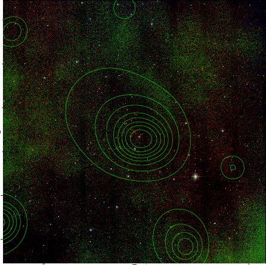  | 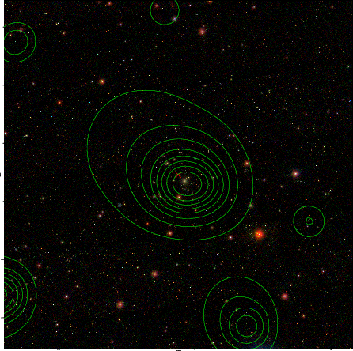  |

