

### 49

|Name|RAJ2000[deg]|DEJ2000[deg] |Ext[arcmin]| Ext,ml | z | z_src| C|GC(XSZ,Delta_z<0.01)| GC(OPT,Delta_z<0.01)|GC| R_sig[arcmin] | R500[arcmin] | R500[Mpc]| CRsig[c/s] | CR500[c/s] |L500[1E44 erg/s]|F500[1E-12 erg/s/cm^2]| M500[1E14 Msun]|Tx[keV]|Cnt_sig|Beta|Rc[arcmin]|Comment|Alias|
|---|---|---|---|---|---|------|---|--------|---------|----------|---|---|---|---|---|---|---|---|---|---|---|---|---|---|
|49| 16.149| -23.973| 1.99| 25.44| 0.1562(0.006)| z1, z_xsz| B| MCXC| A, W| A, MCXC, W| 11.238| 6.217| 1.009| 0.172(0.042)| 0.160(0.039)| 2.104(0.286)| 3.164(0.429)| 3.40(0.22)| 4.79(0.20)| 56.8| 0.868(-0.136+0.093)| 3.847(-0.820+0.637)| -| k217|

|[RASS image](../image/49/49_img.pdf)|[filtered image](../image/49/49_fil.pdf)|[Segment image](../image/49/49_seg.pdf)|
|-------------------|--------------------|-------------------|
| 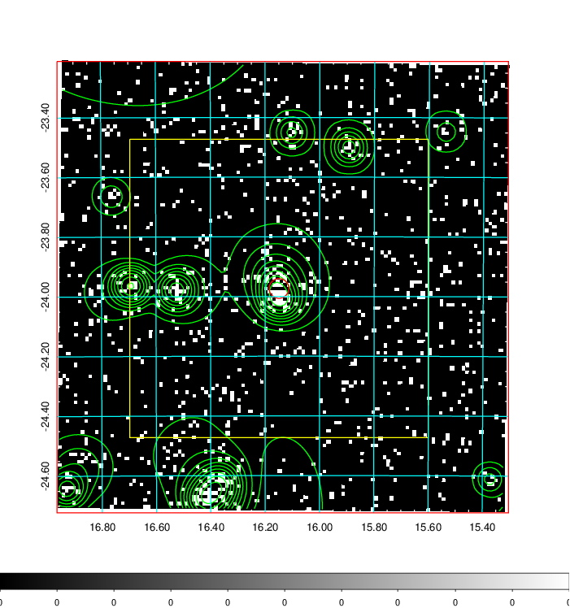  | 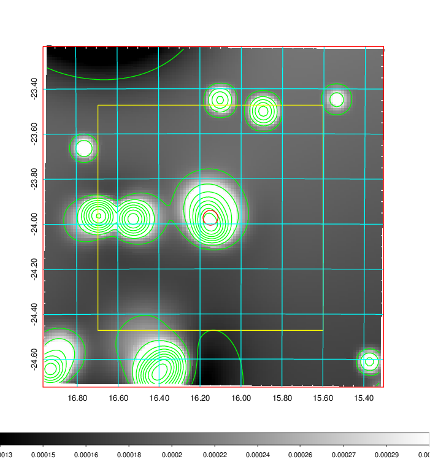   | 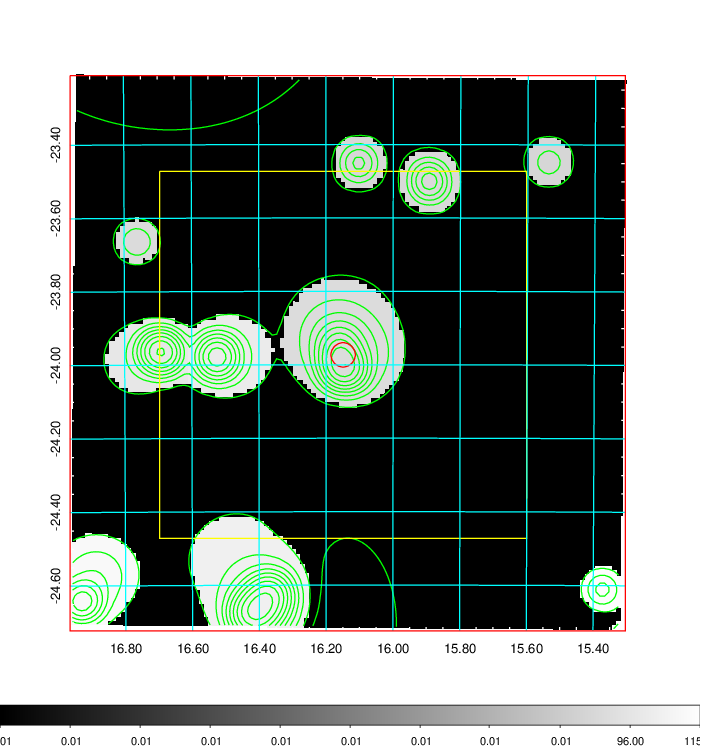  |

|[Exposure image](../image/49/49_mex.pdf)| [nH image](../image/49/49_nh.pdf)| [Planck image](../image/49/49_p.pdf)|
|-------------------|--------------------|-------------------|
|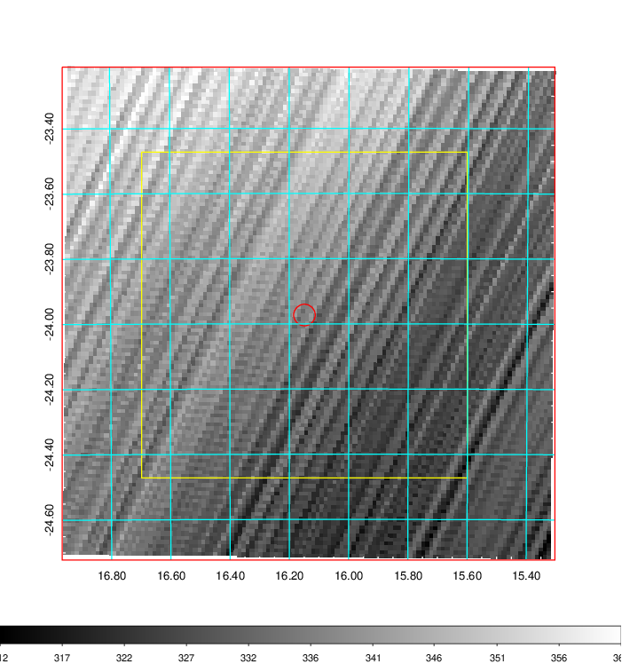   | 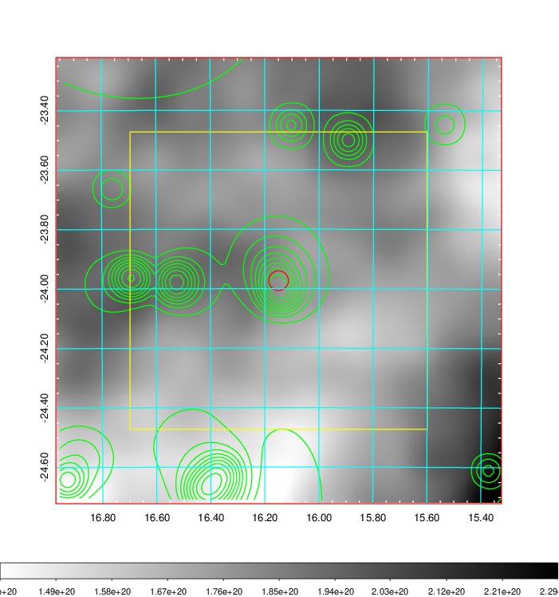    | 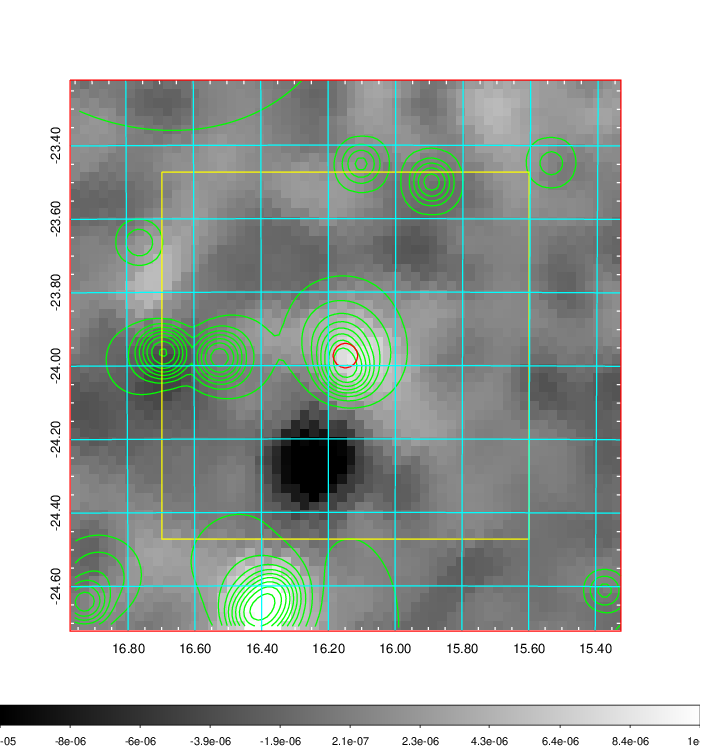 |

|[Redshift Histogram](../image/49/49_zg.pdf) | [DSS image(z1)](../image/49/49_dss_z1.pdf)      |  [DSS image(z2)](../image/49/49_dss_z2.pdf)    |
|-------------------|--------------------|-------------------|
|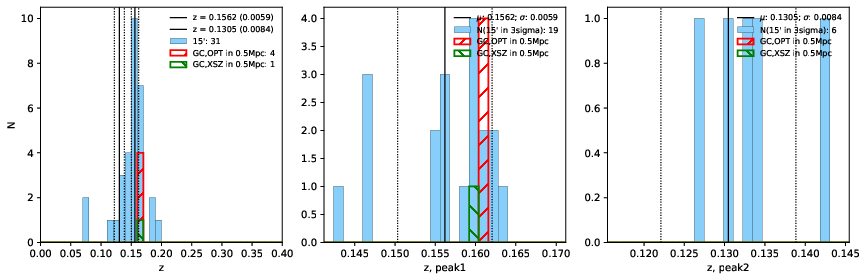 |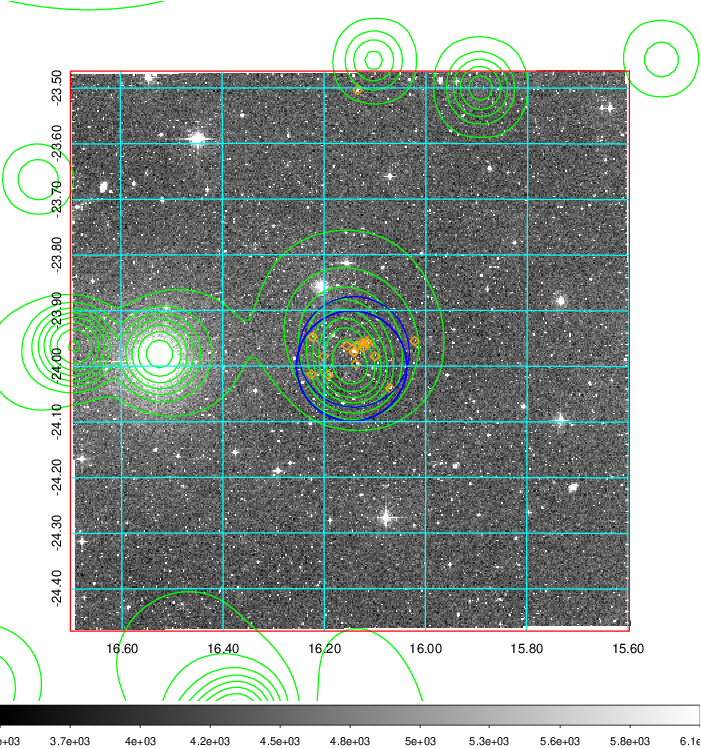  Blue circle for optical clusters;  Magenta circle for XSZ clusters;  all with r=1Mpc;  Only GC with Delta_z<0.01 are shown. | 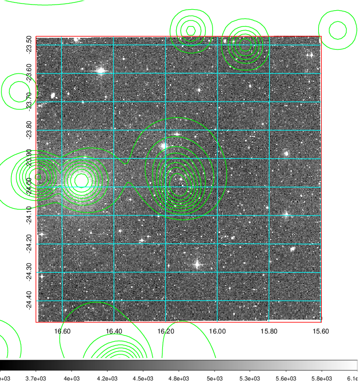 Blue circle for optical clusters;  Magenta circle for XSZ clusters;  all with r=1Mpc;  Only GC with Delta_z<0.01 are shown.  |

|[Previous-identified clusters](../image/49/49_gc.pdf) | [2MASS image](../image/49/49_2mass.pdf)      |
|-------------------|-------------------|
|  Green, magenta, and blue circles  for optical, X-ray and SZ clusters  respectively, with redshift of clusters  labelled. The radius of circles  are 1Mpc.|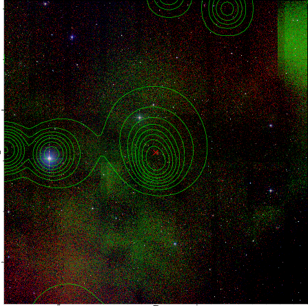  |

|[DES image](../image/49/49_des.pdf)   |[ATLAS image](../image/49/49_s.pdf)        |
|-------------------|-------------------|
| 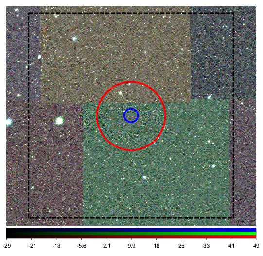  | 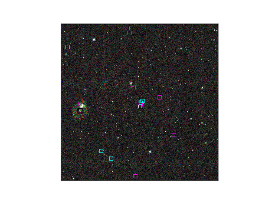  |
