

### 490

|Name|RAJ2000[deg]|DEJ2000[deg] |Ext[arcmin]| Ext,ml | z | z_src| C|GC(XSZ,Delta_z<0.01)| GC(OPT,Delta_z<0.01)|GC| R_sig[arcmin] | R500[arcmin] | R500[Mpc]| CRsig[c/s] | CR500[c/s] |L500[1E44 erg/s]|F500[1E-12 erg/s/cm^2]| M500[1E14 Msun]|Tx[keV]|Cnt_sig|Beta|Rc[arcmin]|Comment|Alias|
|---|---|---|---|---|---|------|---|--------|---------|----------|---|---|---|---|---|---|---|---|---|---|---|---|---|---|
|490| 198.101| -0.946| 5.17| 36.12| 0.0847(0.005)| z1, z_xsz| B| F20| A, N, RM, W| A, F20, N, W| 18.775| 8.909| 0.850| 0.237(0.077)| 0.218(0.071)| 0.742(0.216)| 4.164(1.215)| 1.89(0.28)| 3.26(0.30)| 72.2| 0.810(-0.145+0.127)| 9.084(-2.246+1.752)| -| t267|

|[RASS image](../image/490/490_img.pdf)|[filtered image](../image/490/490_fil.pdf)|[Segment image](../image/490/490_seg.pdf)|
|-------------------|--------------------|-------------------|
| 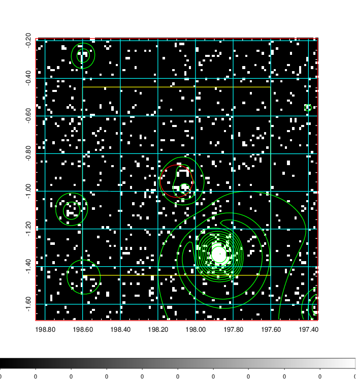  | 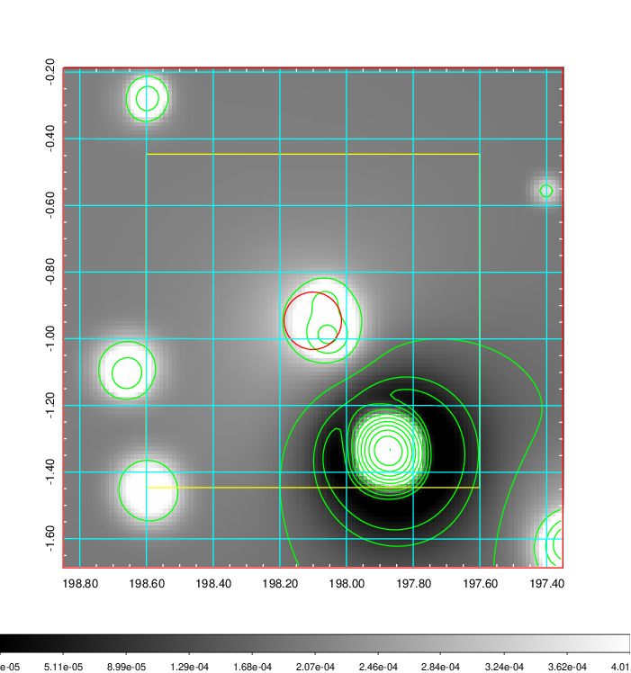   | 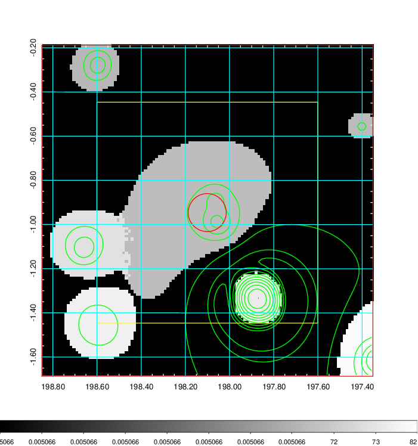  |

|[Exposure image](../image/490/490_mex.pdf)| [nH image](../image/490/490_nh.pdf)| [Planck image](../image/490/490_p.pdf)|
|-------------------|--------------------|-------------------|
|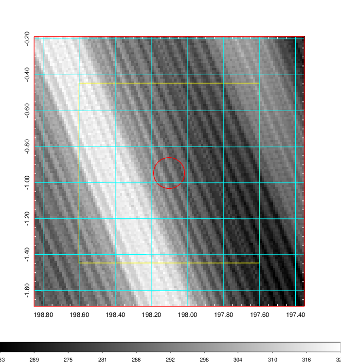   | 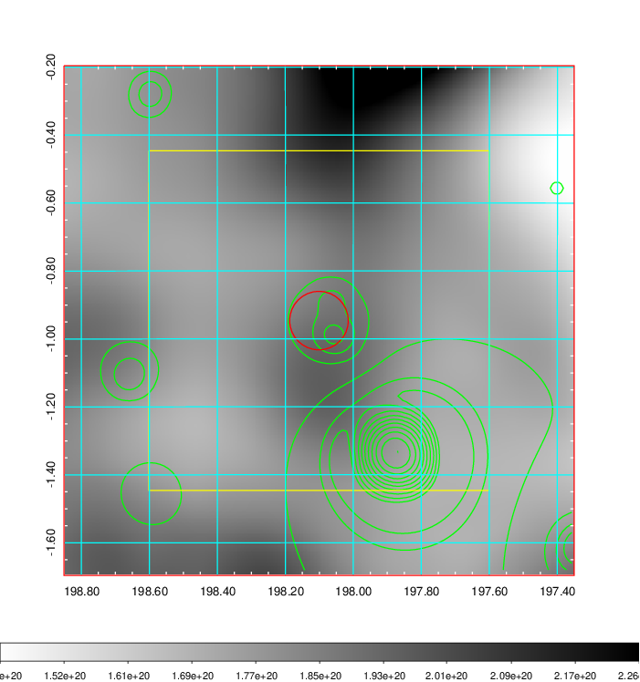    | 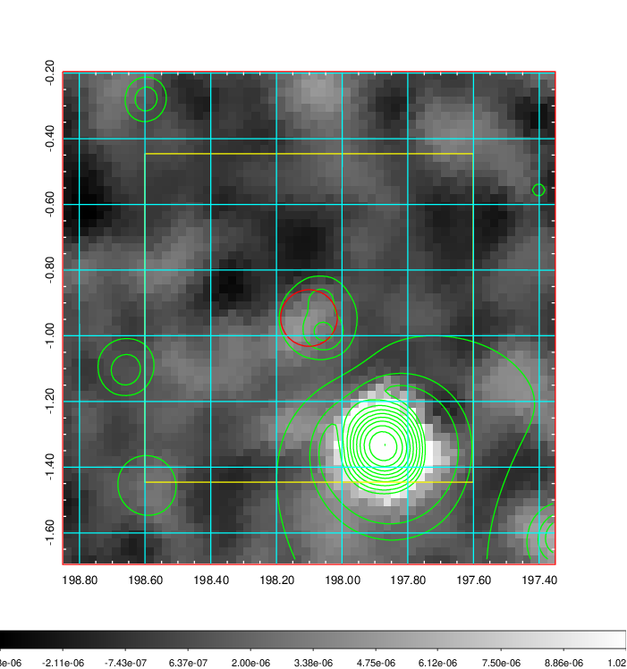 |

|[Redshift Histogram](../image/490/490_zg.pdf) | [DSS image(z1)](../image/490/490_dss_z1.pdf)      |  [DSS image(z2)](../image/490/490_dss_z2.pdf)    |
|-------------------|--------------------|-------------------|
|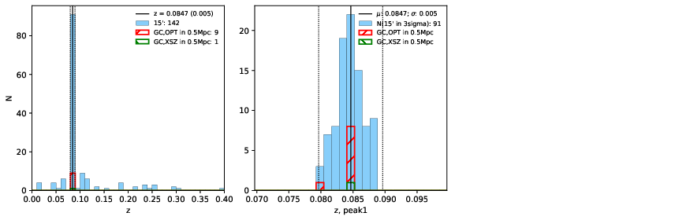 |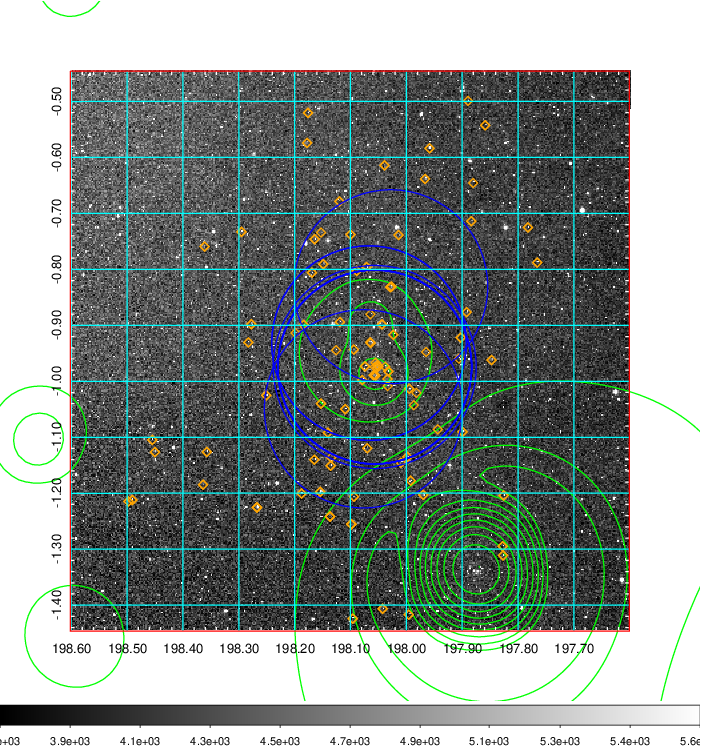  Blue circle for optical clusters;  Magenta circle for XSZ clusters;  all with r=1Mpc;  Only GC with Delta_z<0.01 are shown. | 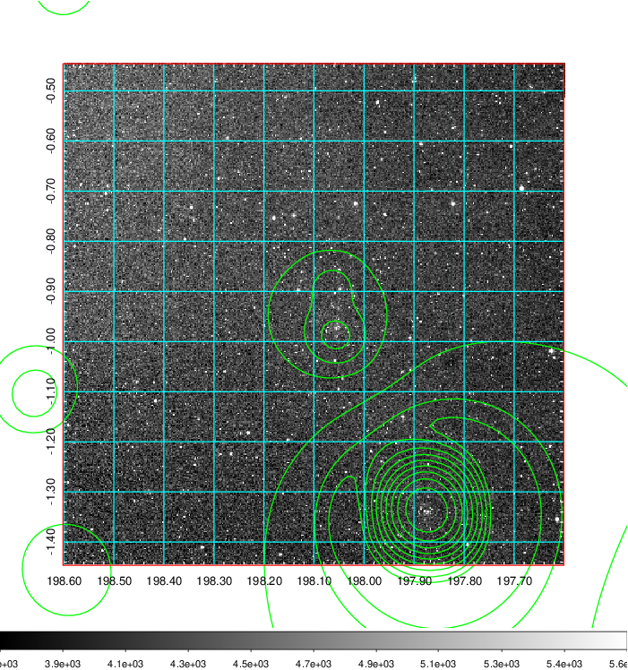 Blue circle for optical clusters;  Magenta circle for XSZ clusters;  all with r=1Mpc;  Only GC with Delta_z<0.01 are shown.  |

|[Previous-identified clusters](../image/490/490_gc.pdf) | [2MASS image](../image/490/490_2mass.pdf)      |[SDSS image](../image/490/490_sdss.pdf)   |
|-------------------|-------------------|-------------------|
|  Green, magenta, and blue circles  for optical, X-ray and SZ clusters  respectively, with redshift of clusters  labelled. The radius of circles  are 1Mpc.|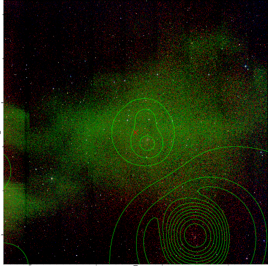  | 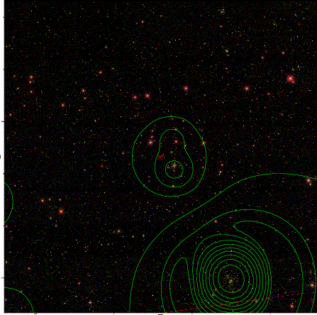  |

