

### 491

|Name|RAJ2000[deg]|DEJ2000[deg] |Ext[arcmin]| Ext,ml | z | z_src| C|GC(XSZ,Delta_z<0.01)| GC(OPT,Delta_z<0.01)|GC| R_sig[arcmin] | R500[arcmin] | R500[Mpc]| CRsig[c/s] | CR500[c/s] |L500[1E44 erg/s]|F500[1E-12 erg/s/cm^2]| M500[1E14 Msun]|Tx[keV]|Cnt_sig|Beta|Rc[arcmin]|Comment|Alias|
|---|---|---|---|---|---|------|---|--------|---------|----------|---|---|---|---|---|---|---|---|---|---|---|---|---|---|
|491| 198.256| 46.279| 1.83| 35.28| 0.1808(0.005)| z1, z_xsz| B| F20, MCXC, PSZ2, SPI, Tar| A, C, N, RM, W| A, C, F20, MCXC, N, PSZ2, SPI, Tar, W| 12.212| 5.745| 1.050| 0.165(0.029)| 0.151(0.027)| 2.842(0.292)| 3.095(0.318)| 3.93(0.19)| 5.28(0.17)| 94.4| 0.838(-0.128+0.109)| 4.359(-0.909+0.722)| -| k176|

|[RASS image](../image/491/491_img.pdf)|[filtered image](../image/491/491_fil.pdf)|[Segment image](../image/491/491_seg.pdf)|
|-------------------|--------------------|-------------------|
| 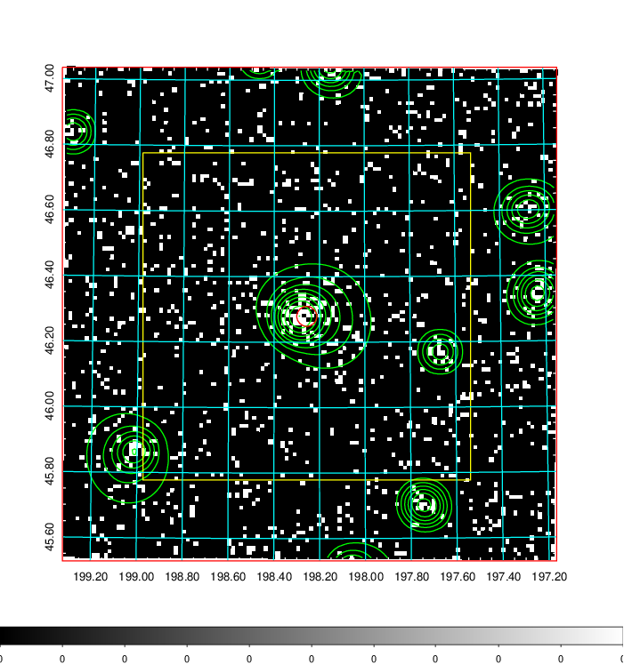  | 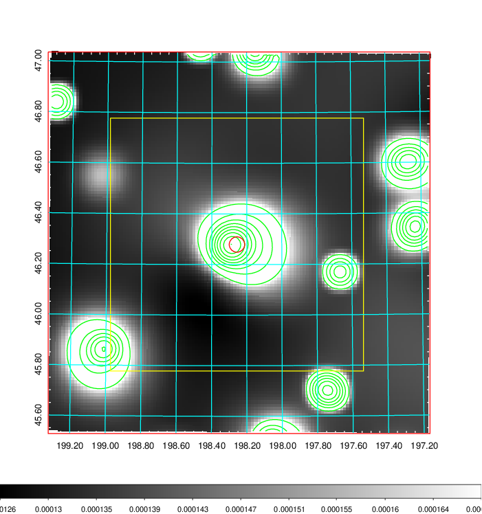   | 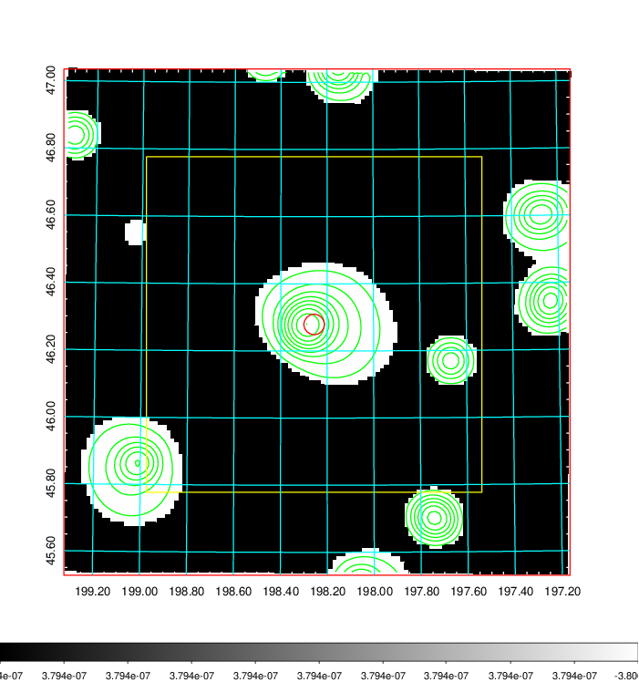  |

|[Exposure image](../image/491/491_mex.pdf)| [nH image](../image/491/491_nh.pdf)| [Planck image](../image/491/491_p.pdf)|
|-------------------|--------------------|-------------------|
|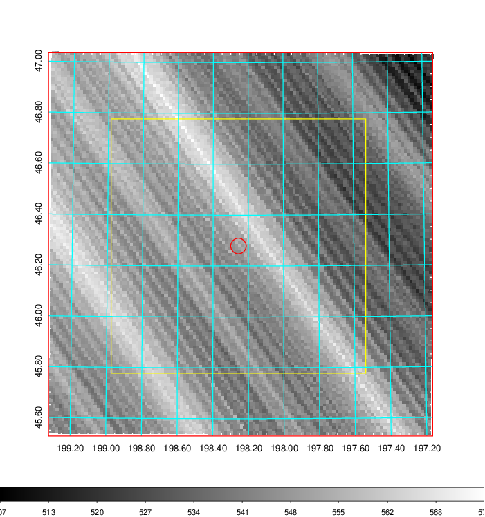   | 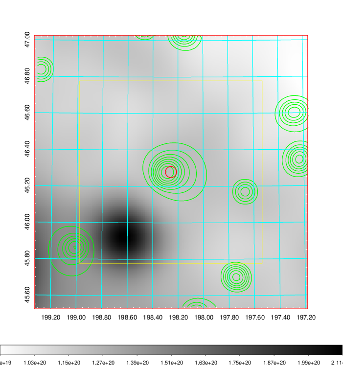    | 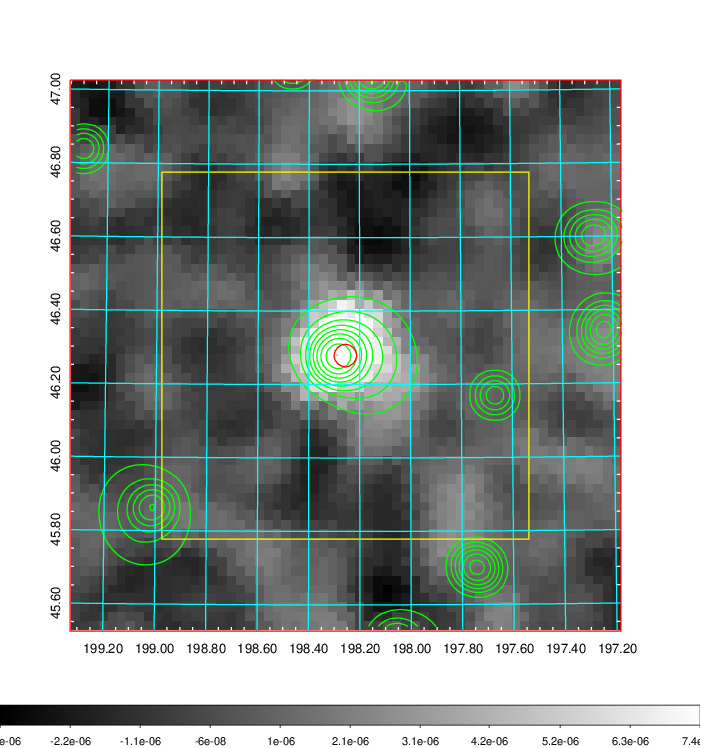 |

|[Redshift Histogram](../image/491/491_zg.pdf) | [DSS image(z1)](../image/491/491_dss_z1.pdf)      |  [DSS image(z2)](../image/491/491_dss_z2.pdf)    |
|-------------------|--------------------|-------------------|
|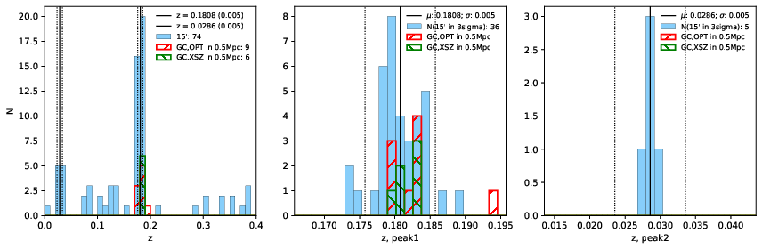 |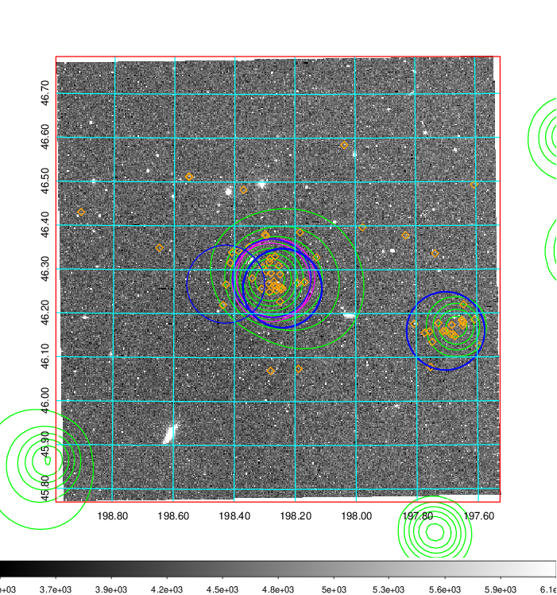  Blue circle for optical clusters;  Magenta circle for XSZ clusters;  all with r=1Mpc;  Only GC with Delta_z<0.01 are shown. | 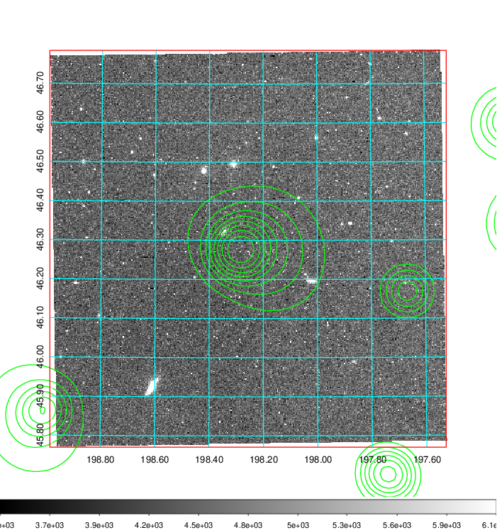 Blue circle for optical clusters;  Magenta circle for XSZ clusters;  all with r=1Mpc;  Only GC with Delta_z<0.01 are shown.  |

|[known Abell/XSZ clusters](../image/491/491_gc.pdf) | [2MASS image](../image/491/491_2mass.pdf)      |[SDSS image](../image/491/491_sdss.pdf)   |
|-------------------|-------------------|-------------------|
|  Magenta, blue and green circles  for optical, X-ray and SZ clusters  respectively, with redshift of clusters  labelled. The radius of circles  are 1Mpc.|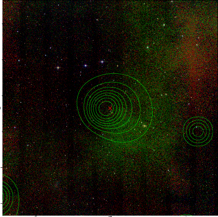  | 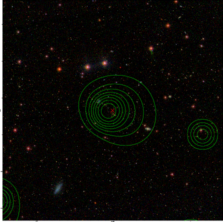  |

