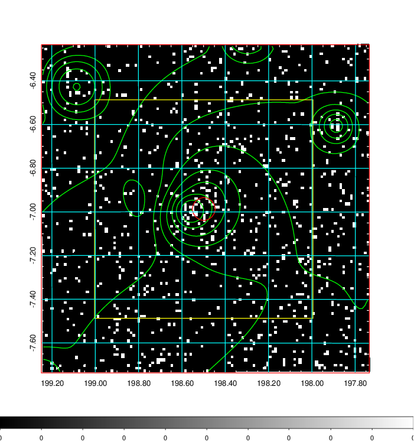
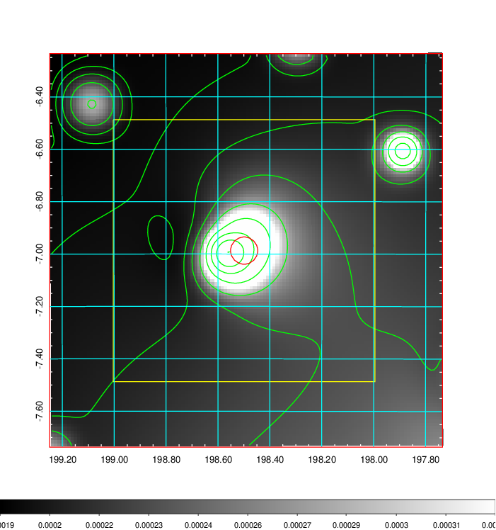
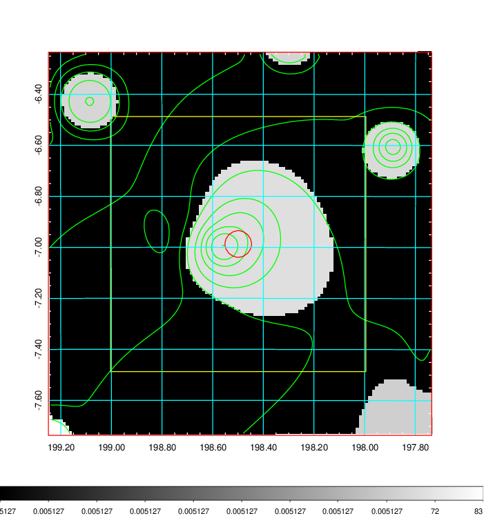
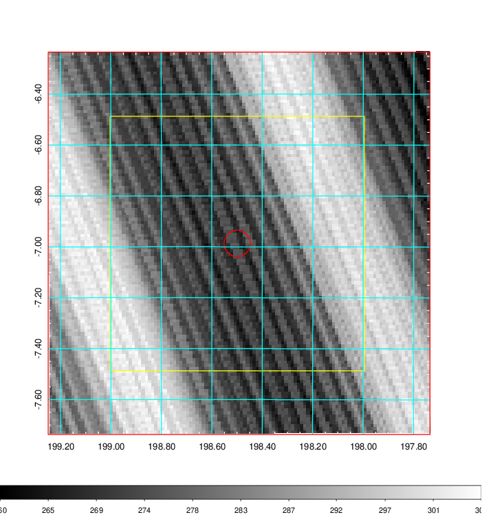
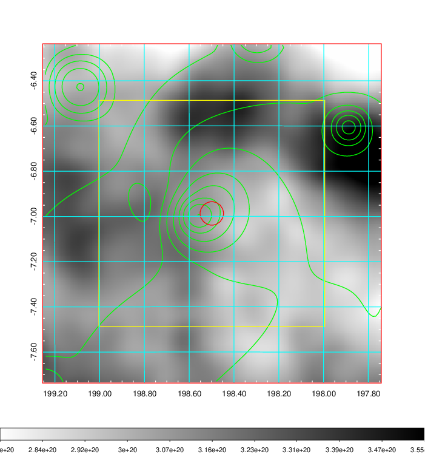
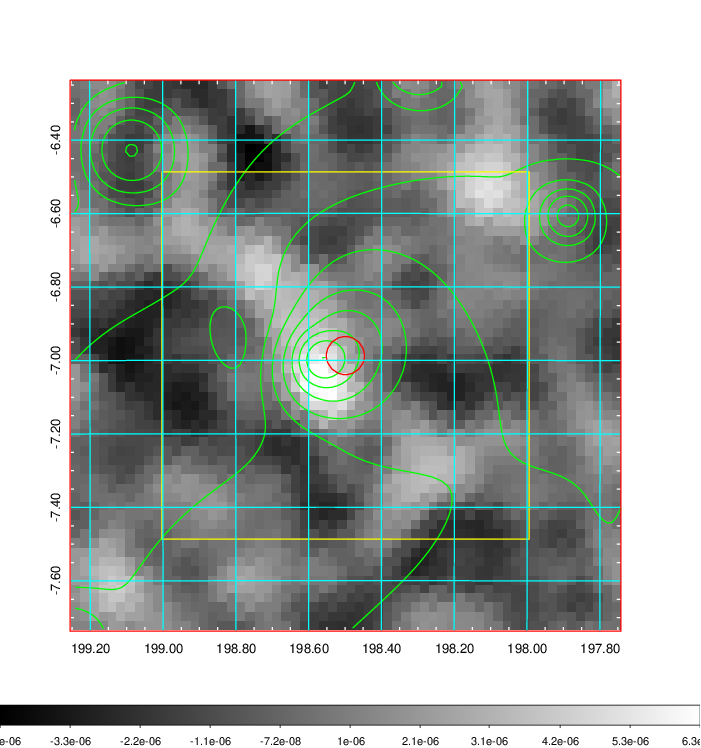
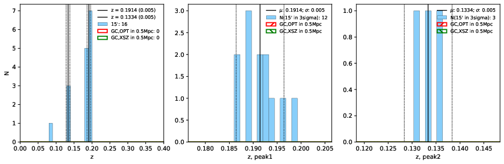
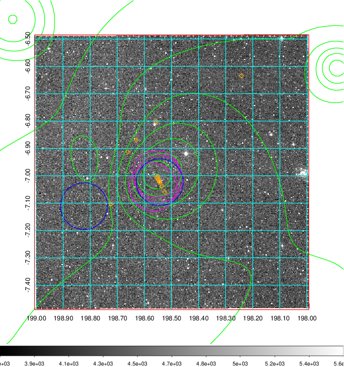
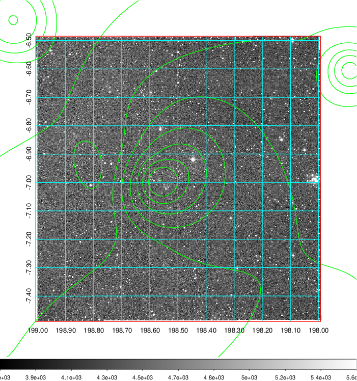
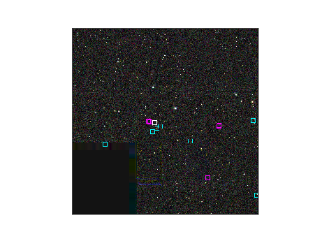

### 492

|Name|RAJ2000[deg]|DEJ2000[deg] |Ext[arcmin]| Ext,ml | z | z_src| C|GC(XSZ,Delta_z<0.01)| GC(OPT,Delta_z<0.01)|GC| R_sig[arcmin] | R500[arcmin] | R500[Mpc]| CRsig[c/s] | CR500[c/s] |L500[1E44 erg/s]|F500[1E-12 erg/s/cm^2]| M500[1E14 Msun]|Tx[keV]|Cnt_sig|Beta|Rc[arcmin]|Comment|Alias|
|---|---|---|---|---|---|------|---|--------|---------|----------|---|---|---|---|---|---|---|---|---|---|---|---|---|---|
|492| 198.499| -6.987| 3.12| 25.17| 0.1914(0.005)| z1,| G| -| -| A, MCXC, N, PSZ2, Tar, W| 10.750| 5.939| 1.136| 0.205(0.047)| 0.191(0.044)| 3.868(0.465)| 3.712(0.446)| 5.04(0.29)| 6.17(0.23)| 59.9| 0.894(-0.126+0.076)| 7.178(-1.130+0.855)| An SZ cluster with $z$ = 0.1892 and offset = 0.61 Mpc(3.19 arcmin)| k386|

|[RASS image](../image/492/492_img.pdf)|[filtered image](../image/492/492_fil.pdf)|[Segment image](../image/492/492_seg.pdf)|
|-------------------|--------------------|-------------------|
|   |    |   |

|[Exposure image](../image/492/492_mex.pdf)| [nH image](../image/492/492_nh.pdf)| [Planck image](../image/492/492_p.pdf)|
|-------------------|--------------------|-------------------|
|   |     |  |

|[Redshift Histogram](../image/492/492_zg.pdf) | [DSS image(z1)](../image/492/492_dss_z1.pdf)      |  [DSS image(z2)](../image/492/492_dss_z2.pdf)    |
|-------------------|--------------------|-------------------|
| |  Blue circle for optical clusters;  Magenta circle for XSZ clusters;  all with r=1Mpc;  Only GC with Delta_z<0.01 are shown. |  Blue circle for optical clusters;  Magenta circle for XSZ clusters;  all with r=1Mpc;  Only GC with Delta_z<0.01 are shown.  |

|[Previous-identified clusters](../image/492/492_gc.pdf) | [2MASS image](../image/492/492_2mass.pdf)      |
|-------------------|-------------------|
|  Green, magenta, and blue circles  for optical, X-ray and SZ clusters  respectively, with redshift of clusters  labelled. The radius of circles  are 1Mpc.|  |

|[ATLAS image](../image/492/492_s.pdf)        |
|-------------------|
|   |
