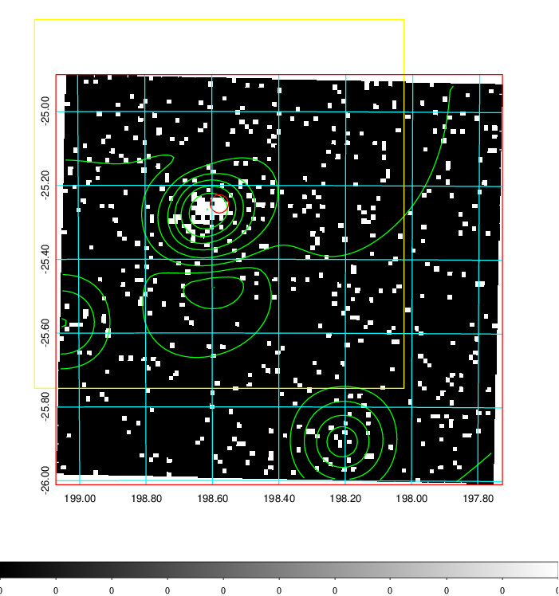
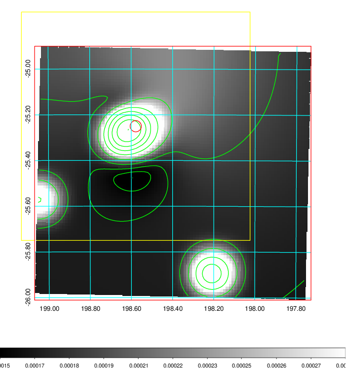
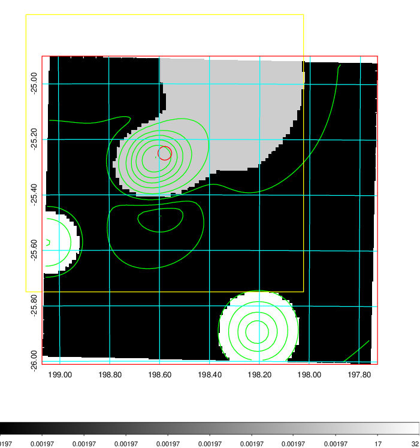
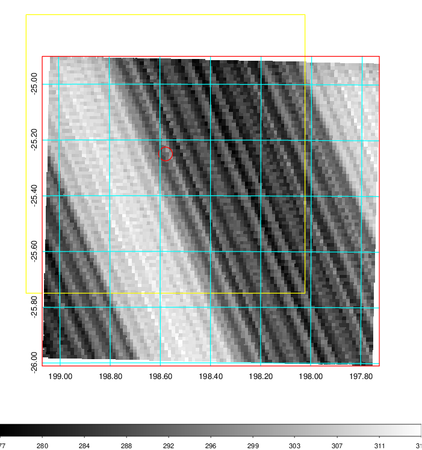
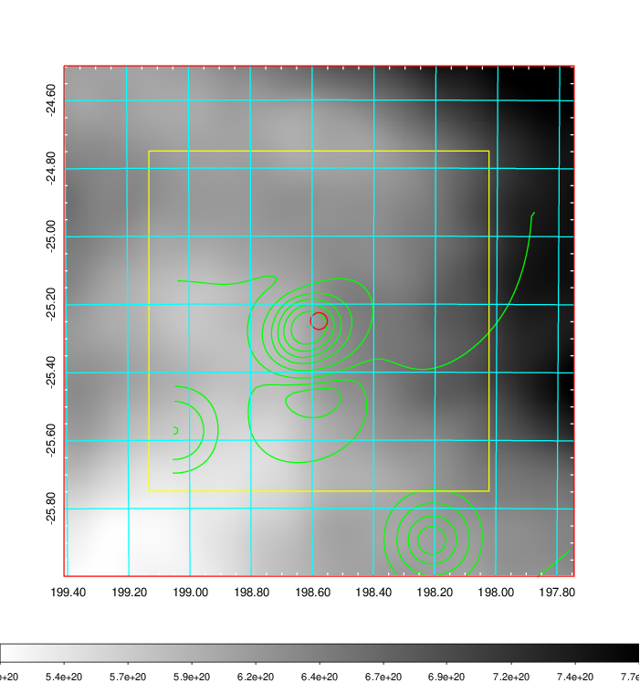
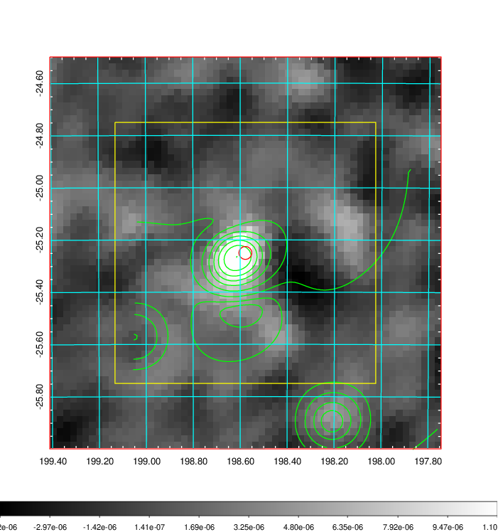
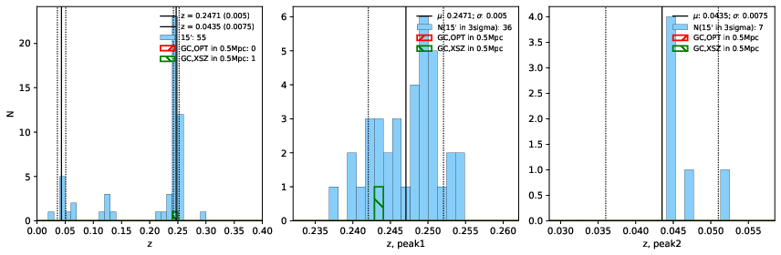
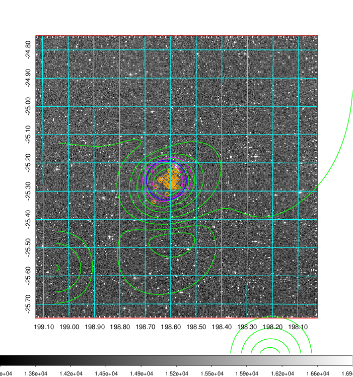
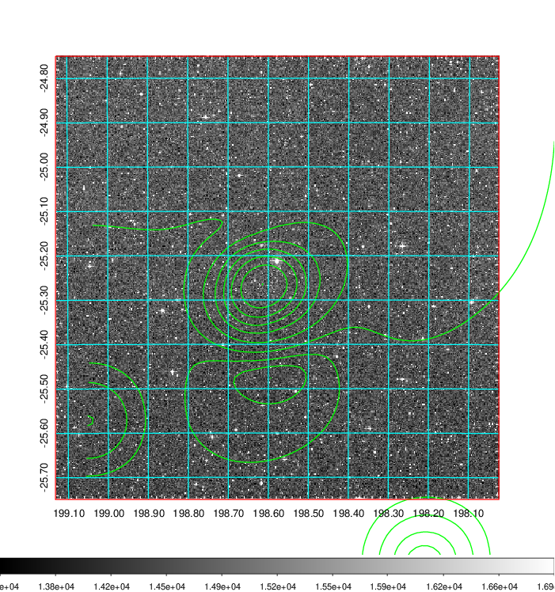
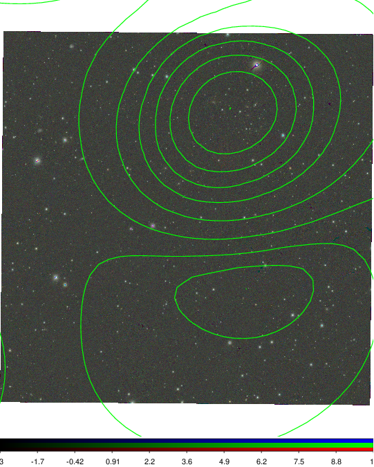

### 493

|Name|RAJ2000[deg]|DEJ2000[deg] |Ext[arcmin]| Ext,ml | z | z_src| C|GC(XSZ,Delta_z<0.01)| GC(OPT,Delta_z<0.01)|GC| R_sig[arcmin] | R500[arcmin] | R500[Mpc]| CRsig[c/s] | CR500[c/s] |L500[1E44 erg/s]|F500[1E-12 erg/s/cm^2]| M500[1E14 Msun]|Tx[keV]|Cnt_sig|Beta|Rc[arcmin]|Comment|Alias|
|---|---|---|---|---|---|------|---|--------|---------|----------|---|---|---|---|---|---|---|---|---|---|---|---|---|---|
|493| 198.578| -25.250| 1.48| 33.95| 0.2471(0.005)| z1, z_xsz| B| Tar| -| MCXC, N, PSZ2, Tar, W| 15.812| 5.821| 1.354| 0.300(0.062)| 0.272(0.056)| 9.419(0.798)| 5.090(0.431)| 9.06(0.35)| 9.04(0.23)| 97.3| 0.830(-0.098+0.105)| 4.297(-0.847+0.794)| -| k108|

|[RASS image](../image/493/493_img.pdf)|[filtered image](../image/493/493_fil.pdf)|[Segment image](../image/493/493_seg.pdf)|
|-------------------|--------------------|-------------------|
|   |    |   |

|[Exposure image](../image/493/493_mex.pdf)| [nH image](../image/493/493_nh.pdf)| [Planck image](../image/493/493_p.pdf)|
|-------------------|--------------------|-------------------|
|   |     |  |

|[Redshift Histogram](../image/493/493_zg.pdf) | [DSS image(z1)](../image/493/493_dss_z1.pdf)      |  [DSS image(z2)](../image/493/493_dss_z2.pdf)    |
|-------------------|--------------------|-------------------|
| |  Blue circle for optical clusters;  Magenta circle for XSZ clusters;  all with r=1Mpc;  Only GC with Delta_z<0.01 are shown. |  Blue circle for optical clusters;  Magenta circle for XSZ clusters;  all with r=1Mpc;  Only GC with Delta_z<0.01 are shown.  |

|[Previous-identified clusters](../image/493/493_gc.pdf) | [2MASS image](../image/493/493_2mass.pdf)      |
|-------------------|-------------------|
|  Green, magenta, and blue circles  for optical, X-ray and SZ clusters  respectively, with redshift of clusters  labelled. The radius of circles  are 1Mpc.|  |

|[PS1 image](../image/493/493_ps1.pdf)            |
|-------------------|
|   |
