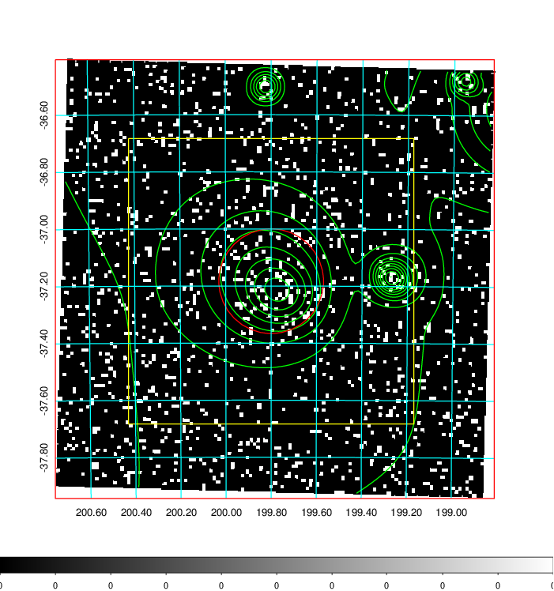
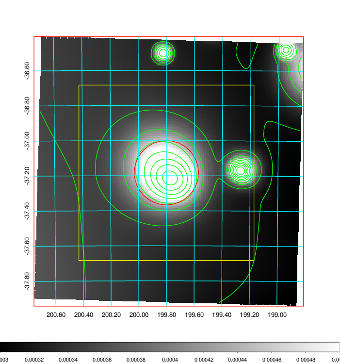
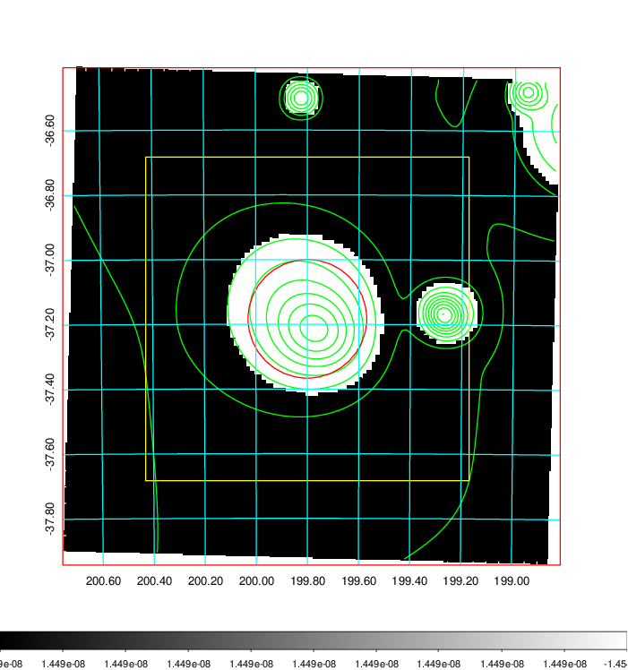
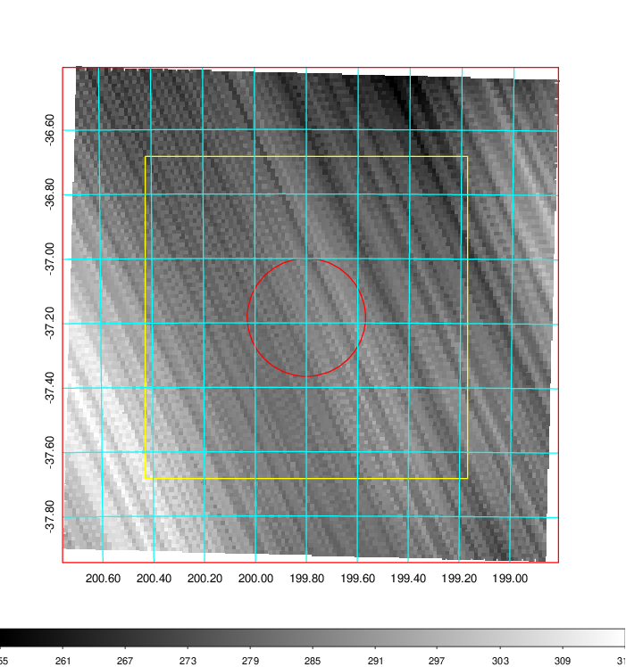
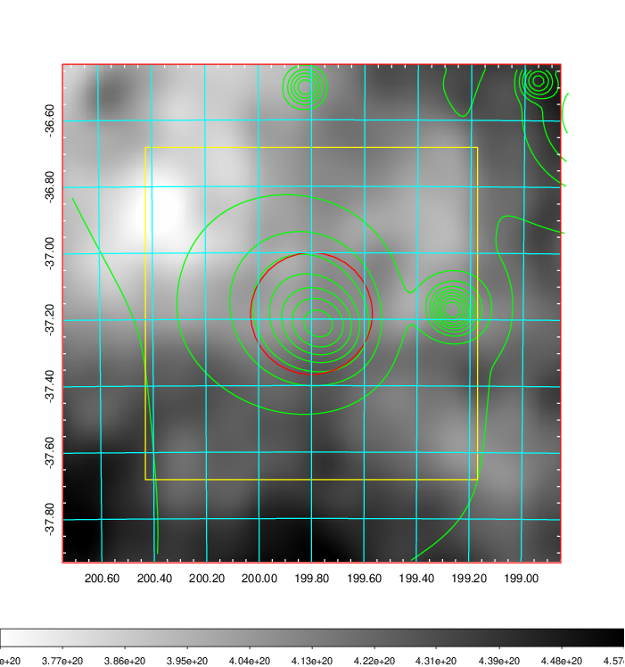
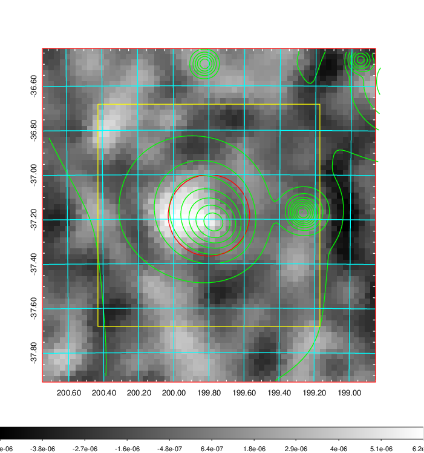
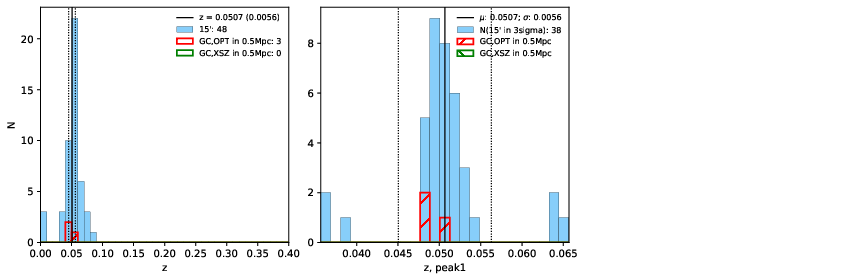
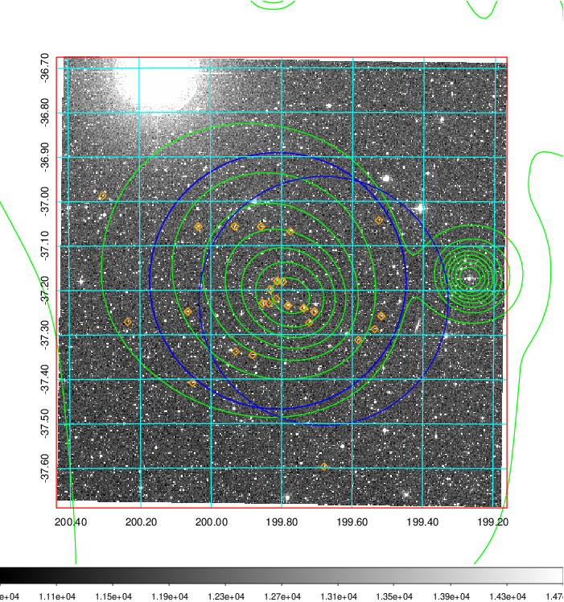
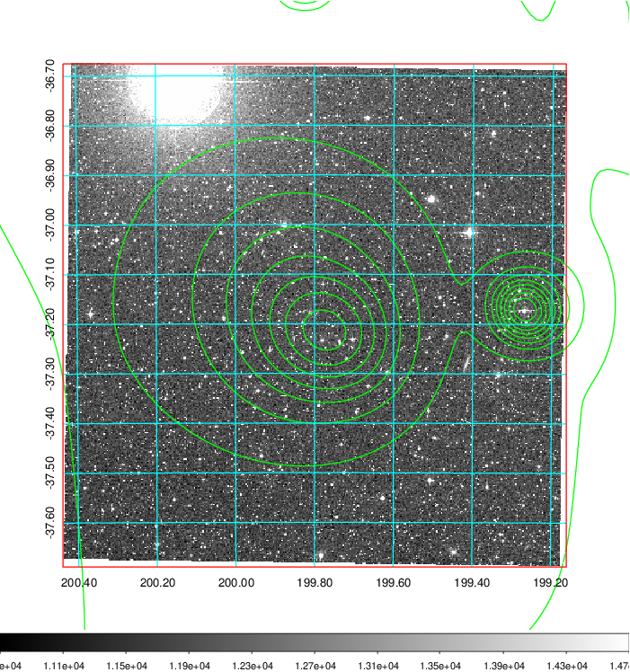
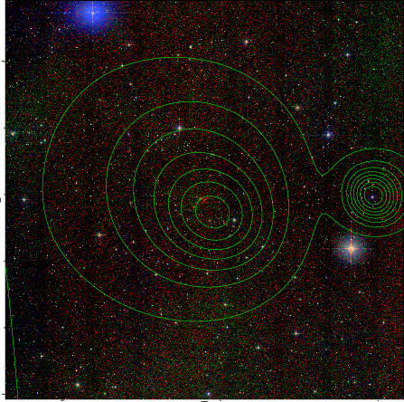

### 495

|Name|RAJ2000[deg]|DEJ2000[deg] |Ext[arcmin]| Ext,ml | z | z_src| C|GC(XSZ,Delta_z<0.01)| GC(OPT,Delta_z<0.01)|GC| R_sig[arcmin] | R500[arcmin] | R500[Mpc]| CRsig[c/s] | CR500[c/s] |L500[1E44 erg/s]|F500[1E-12 erg/s/cm^2]| M500[1E14 Msun]|Tx[keV]|Cnt_sig|Beta|Rc[arcmin]|Comment|Alias|
|---|---|---|---|---|---|------|---|--------|---------|----------|---|---|---|---|---|---|---|---|---|---|---|---|---|---|
|495| 199.800| -37.183| 11.01| 47.29| 0.0507(0.006)| z1, z_opt| S| -| A, N| A, N| 11.238| 11.192| 0.665| 0.175(0.054)| 0.175(0.054)| 0.177(0.030)| 2.907(0.488)| 0.88(0.08)| 2.01(0.11)| 65.6| 0.840(-0.167+0.113)| 10.246(-2.112+1.793)| -| t469|

|[RASS image](../image/495/495_img.pdf)|[filtered image](../image/495/495_fil.pdf)|[Segment image](../image/495/495_seg.pdf)|
|-------------------|--------------------|-------------------|
|   |    |   |

|[Exposure image](../image/495/495_mex.pdf)| [nH image](../image/495/495_nh.pdf)| [Planck image](../image/495/495_p.pdf)|
|-------------------|--------------------|-------------------|
|   |     |  |

|[Redshift Histogram](../image/495/495_zg.pdf) | [DSS image(z1)](../image/495/495_dss_z1.pdf)      |  [DSS image(z2)](../image/495/495_dss_z2.pdf)    |
|-------------------|--------------------|-------------------|
| |  Blue circle for optical clusters;  Magenta circle for XSZ clusters;  all with r=1Mpc;  Only GC with Delta_z<0.01 are shown. |  Blue circle for optical clusters;  Magenta circle for XSZ clusters;  all with r=1Mpc;  Only GC with Delta_z<0.01 are shown.  |

|[known Abell/XSZ clusters](../image/495/495_gc.pdf) | [2MASS image](../image/495/495_2mass.pdf)      |
|-------------------|-------------------|
|  Magenta, blue and green circles  for optical, X-ray and SZ clusters  respectively, with redshift of clusters  labelled. The radius of circles  are 1Mpc.|  |

