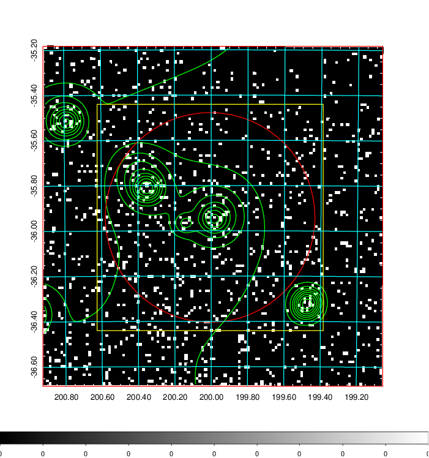
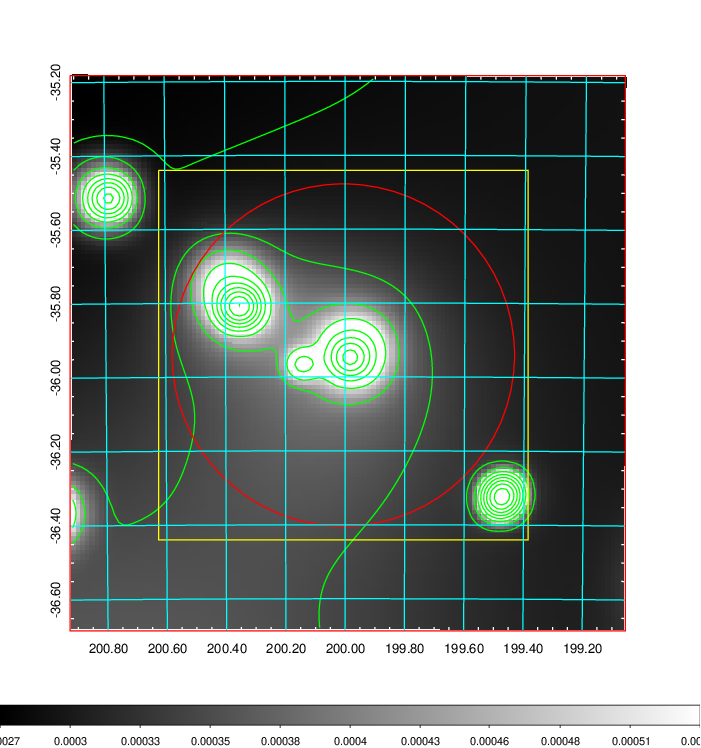
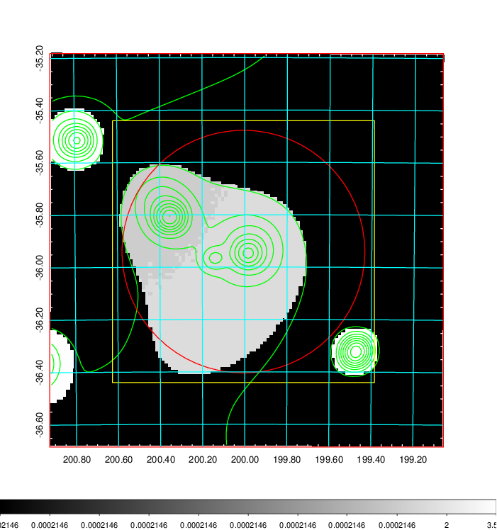
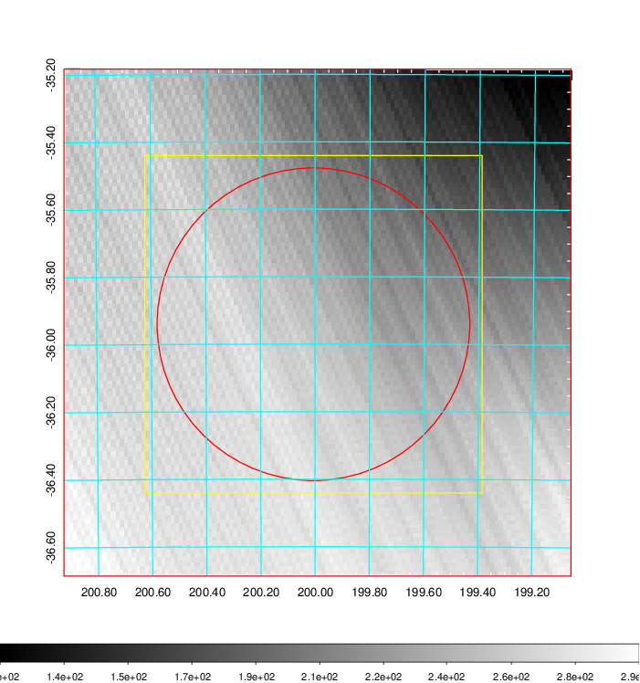
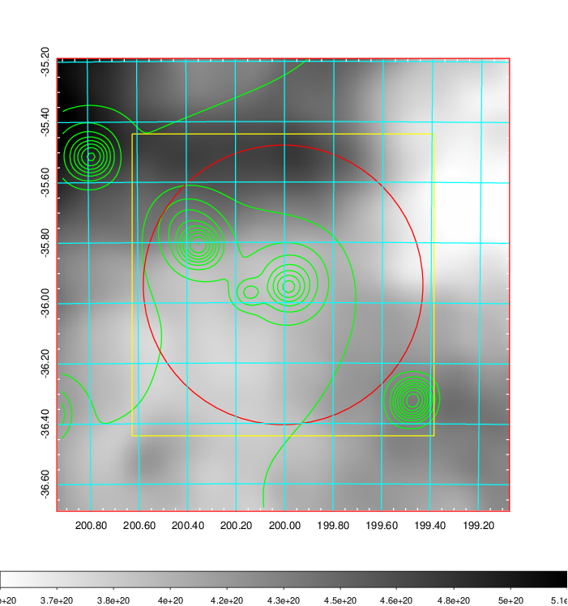
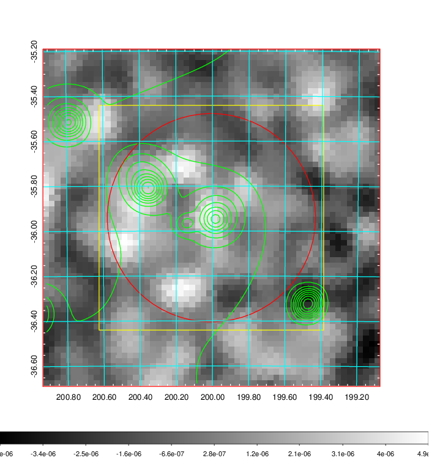
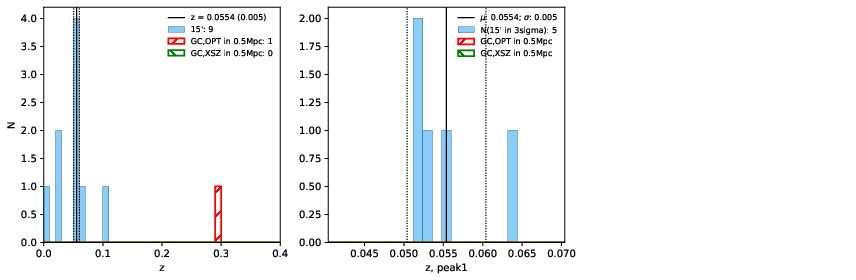
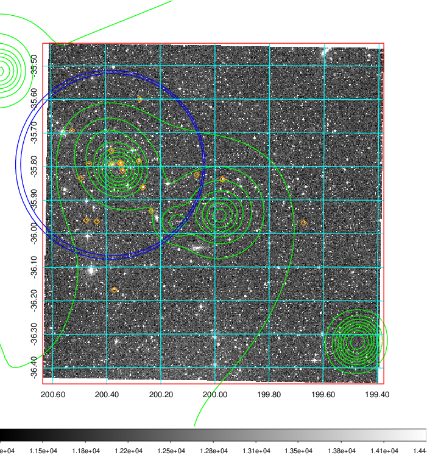
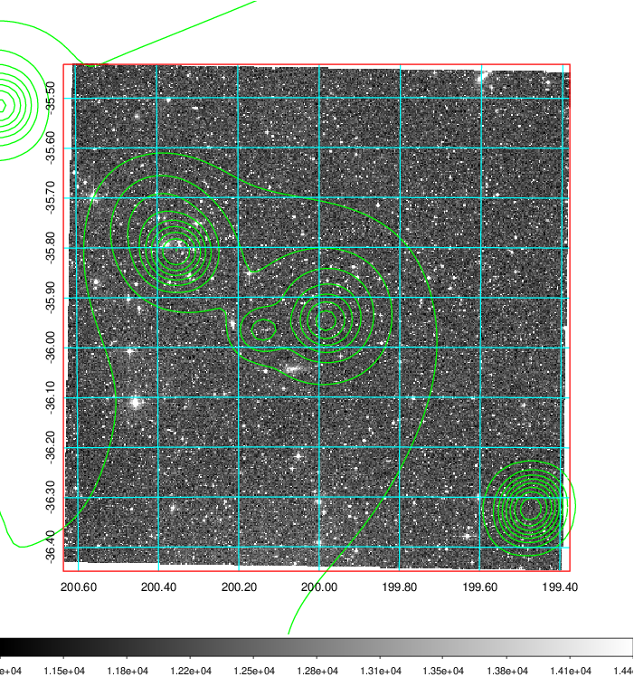
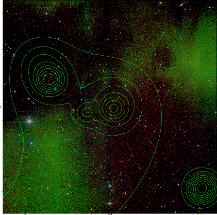

### 496

|Name|RAJ2000[deg]|DEJ2000[deg] |Ext[arcmin]| Ext,ml | z | z_src| C|GC(XSZ,Delta_z<0.01)| GC(OPT,Delta_z<0.01)|GC| R_sig[arcmin] | R500[arcmin] | R500[Mpc]| CRsig[c/s] | CR500[c/s] |L500[1E44 erg/s]|F500[1E-12 erg/s/cm^2]| M500[1E14 Msun]|Tx[keV]|Cnt_sig|Beta|Rc[arcmin]|Comment|Alias|
|---|---|---|---|---|---|------|---|--------|---------|----------|---|---|---|---|---|---|---|---|---|---|---|---|---|---|
|496| 200.006| -35.941| 27.80| 42.96| 0.2953(0.000)| z_opt| S| -| W| W| 27.169| 5.638| 1.490| 0.386(0.110)| 0.341(0.098)| 18.566(9.511)| 6.675(3.419)| 12.74(2.90)| 11.36(1.67)| 146.9| 0.518(-0.014+0.031)| 9.574(-0.869+0.917)| $z$ of optical cluster; the large extent from the overlapping of the emission from the upper-left peak (ACOS729, $z$ = 0.0499).| t632|

|[RASS image](../image/496/496_img.pdf)|[filtered image](../image/496/496_fil.pdf)|[Segment image](../image/496/496_seg.pdf)|
|-------------------|--------------------|-------------------|
|   |    |   |

|[Exposure image](../image/496/496_mex.pdf)| [nH image](../image/496/496_nh.pdf)| [Planck image](../image/496/496_p.pdf)|
|-------------------|--------------------|-------------------|
|   |     |  |

|[Redshift Histogram](../image/496/496_zg.pdf) | [DSS image(z1)](../image/496/496_dss_z1.pdf)      |  [DSS image(z2)](../image/496/496_dss_z2.pdf)    |
|-------------------|--------------------|-------------------|
| |  Blue circle for optical clusters;  Magenta circle for XSZ clusters;  all with r=1Mpc;  Only GC with Delta_z<0.01 are shown. |  Blue circle for optical clusters;  Magenta circle for XSZ clusters;  all with r=1Mpc;  Only GC with Delta_z<0.01 are shown.  |

|[Previous-identified clusters](../image/496/496_gc.pdf) | [2MASS image](../image/496/496_2mass.pdf)      |
|-------------------|-------------------|
|  Green, magenta, and blue circles  for optical, X-ray and SZ clusters  respectively, with redshift of clusters  labelled. The radius of circles  are 1Mpc.|  |

