

### 497

|Name|RAJ2000[deg]|DEJ2000[deg] |Ext[arcmin]| Ext,ml | z | z_src| C|GC(XSZ,Delta_z<0.01)| GC(OPT,Delta_z<0.01)|GC| R_sig[arcmin] | R500[arcmin] | R500[Mpc]| CRsig[c/s] | CR500[c/s] |L500[1E44 erg/s]|F500[1E-12 erg/s/cm^2]| M500[1E14 Msun]|Tx[keV]|Cnt_sig|Beta|Rc[arcmin]|Comment|Alias|
|---|---|---|---|---|---|------|---|--------|---------|----------|---|---|---|---|---|---|---|---|---|---|---|---|---|---|
|497| 200.059| 33.151| 1.48| 46.99| 0.0368(0.005)| z1, z_xsz| B| MCXC| N| C, F20, MCXC, N, SPI, W| 14.162| 14.645| 0.642| 0.287(0.034)| 0.289(0.034)| 0.166(0.013)| 5.271(0.430)| 0.78(0.03)| 1.86(0.05)| 148.6| 0.561(-0.043+0.073)| 1.621(-0.466+0.668)| -| k109|

|[RASS image](../image/497/497_img.pdf)|[filtered image](../image/497/497_fil.pdf)|[Segment image](../image/497/497_seg.pdf)|
|-------------------|--------------------|-------------------|
| 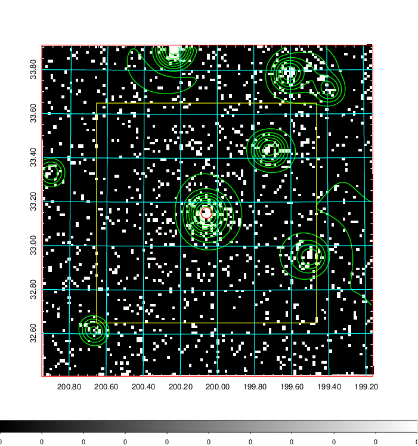  | 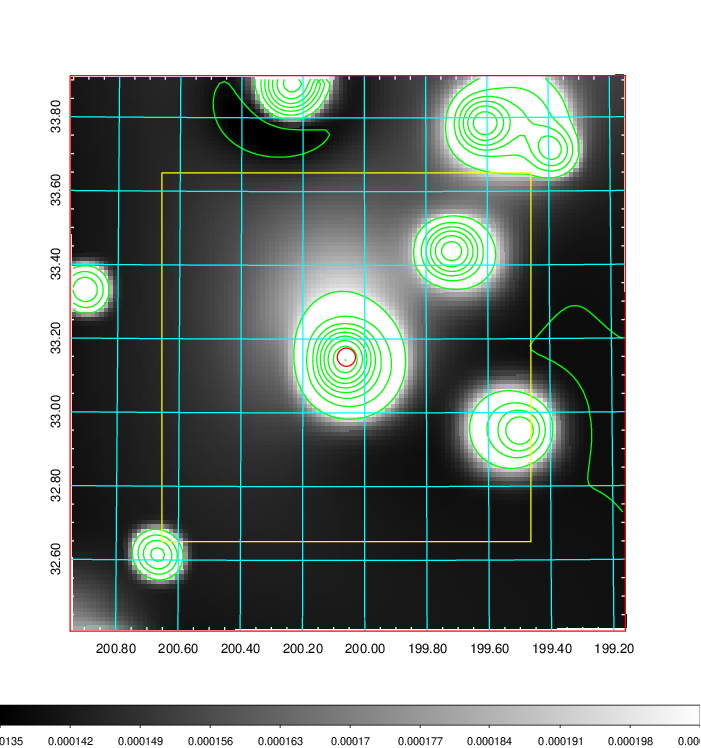   | 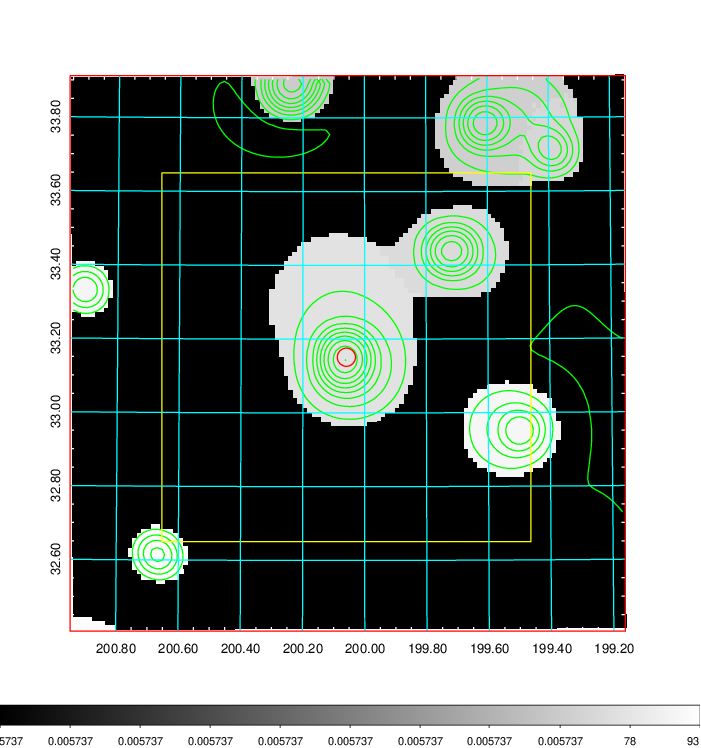  |

|[Exposure image](../image/497/497_mex.pdf)| [nH image](../image/497/497_nh.pdf)| [Planck image](../image/497/497_p.pdf)|
|-------------------|--------------------|-------------------|
|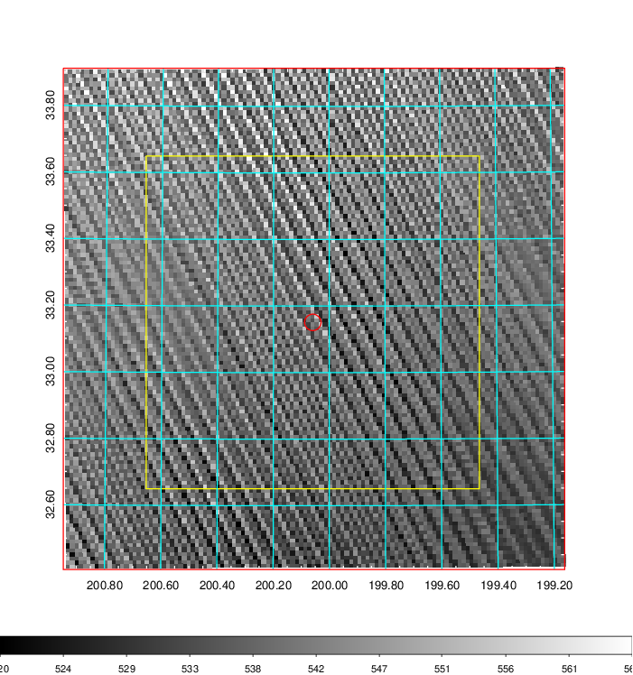   | 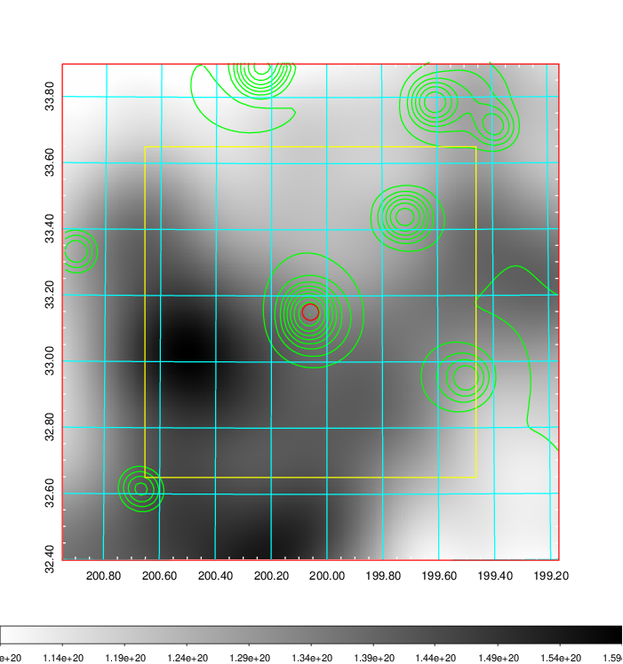    | 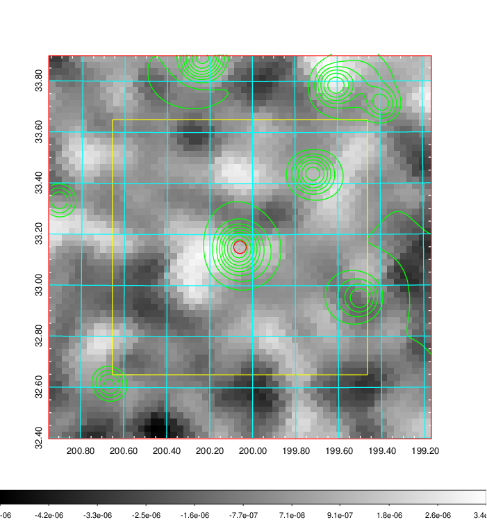 |

|[Redshift Histogram](../image/497/497_zg.pdf) | [DSS image(z1)](../image/497/497_dss_z1.pdf)      |  [DSS image(z2)](../image/497/497_dss_z2.pdf)    |
|-------------------|--------------------|-------------------|
|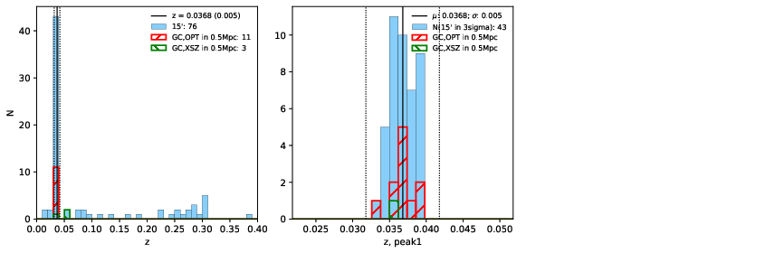 |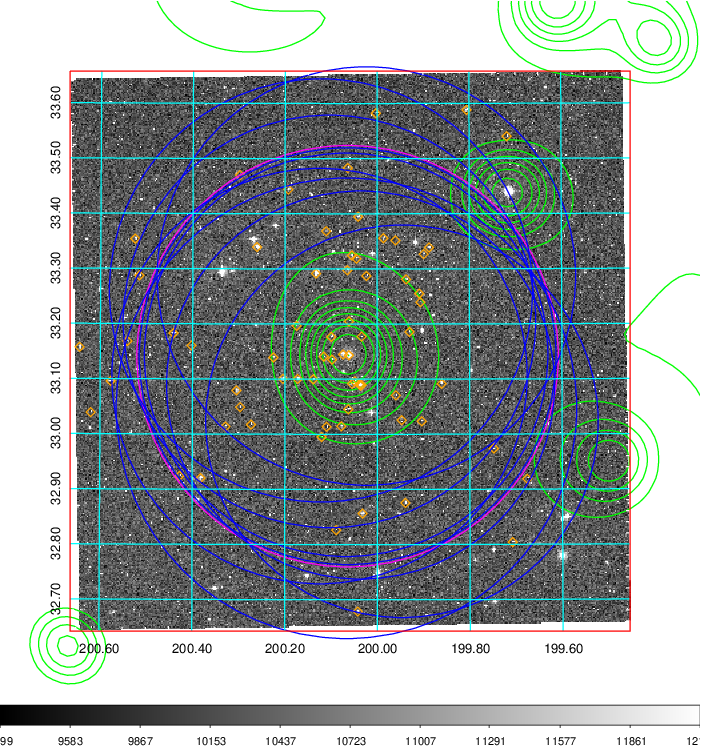  Blue circle for optical clusters;  Magenta circle for XSZ clusters;  all with r=1Mpc;  Only GC with Delta_z<0.01 are shown. | 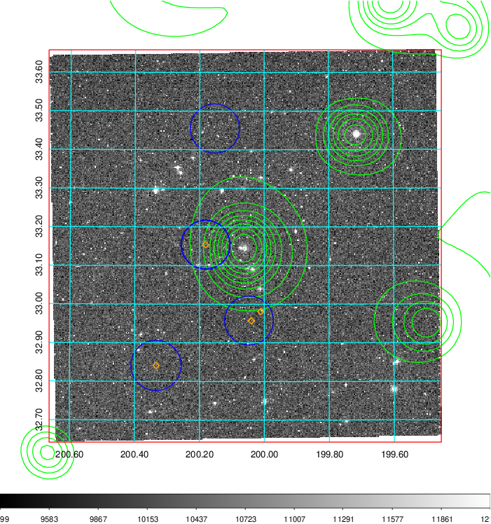 Blue circle for optical clusters;  Magenta circle for XSZ clusters;  all with r=1Mpc;  Only GC with Delta_z<0.01 are shown.  |

|[Previous-identified clusters](../image/497/497_gc.pdf) | [2MASS image](../image/497/497_2mass.pdf)      |[SDSS image](../image/497/497_sdss.pdf)   |
|-------------------|-------------------|-------------------|
|  Green, magenta, and blue circles  for optical, X-ray and SZ clusters  respectively, with redshift of clusters  labelled. The radius of circles  are 1Mpc.|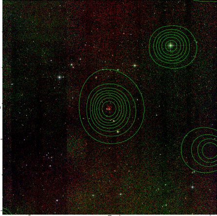  | 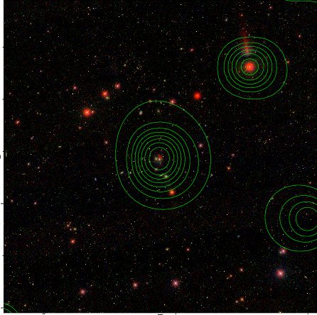  |

