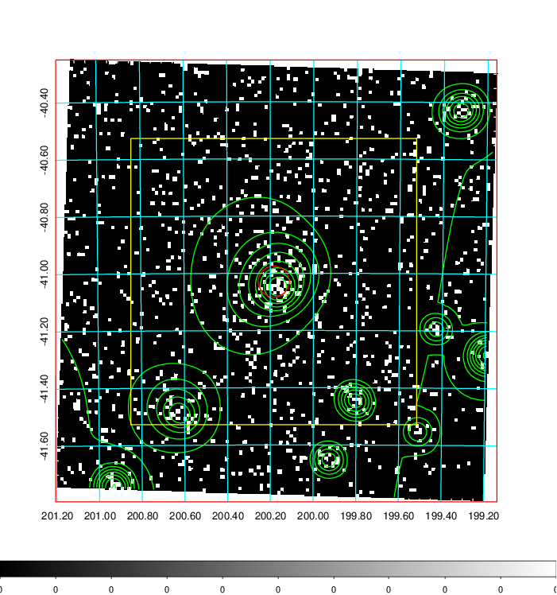
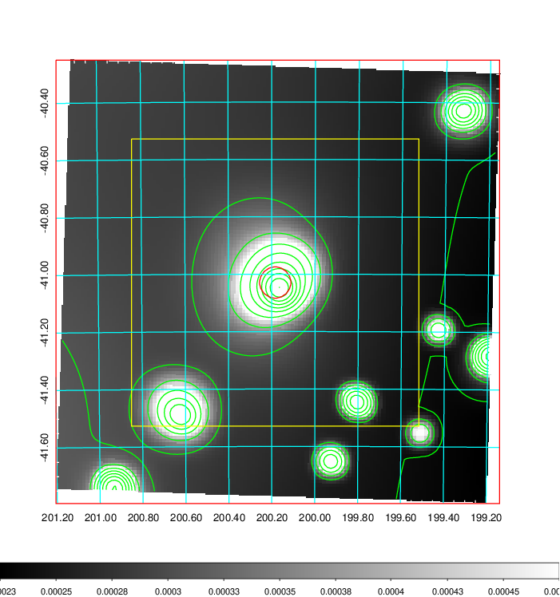
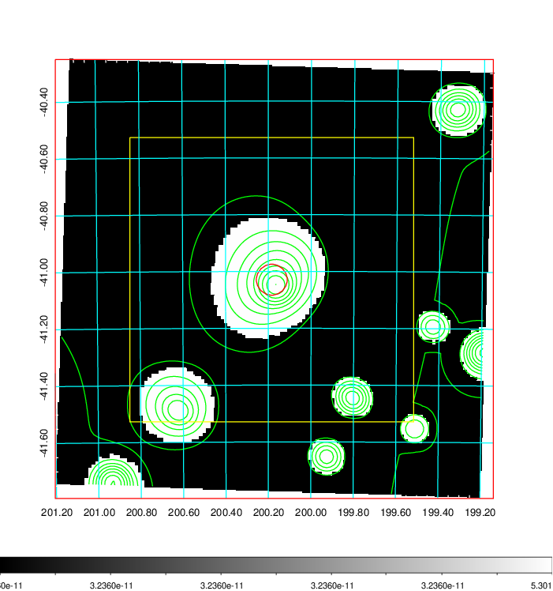
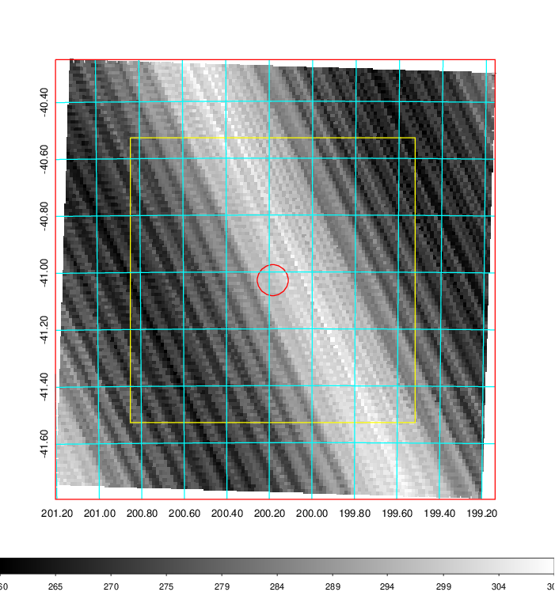
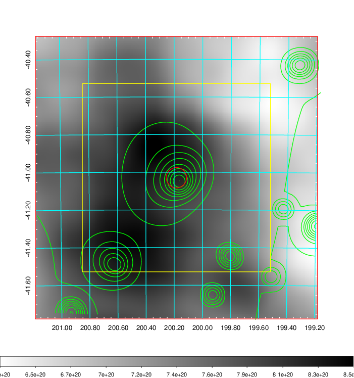
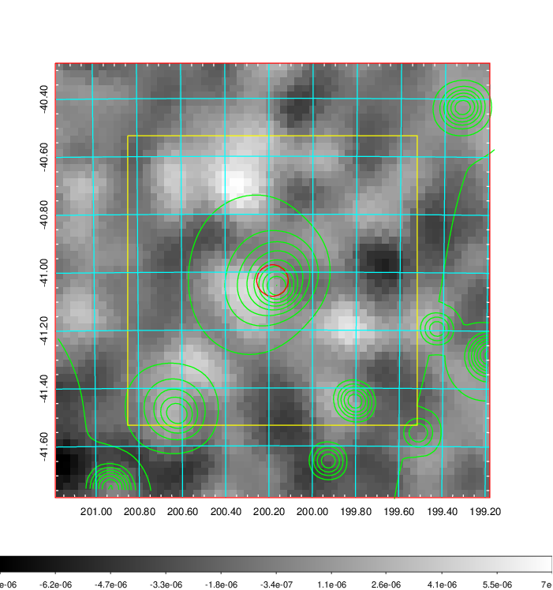
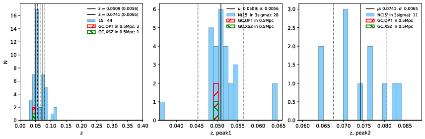
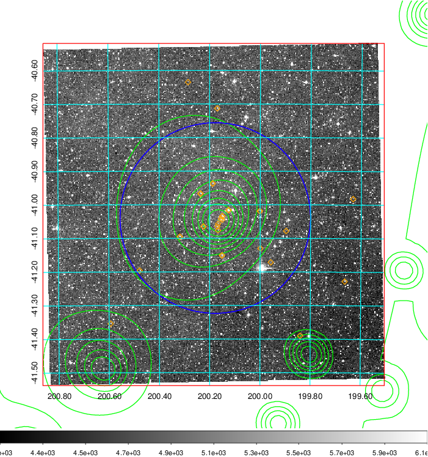
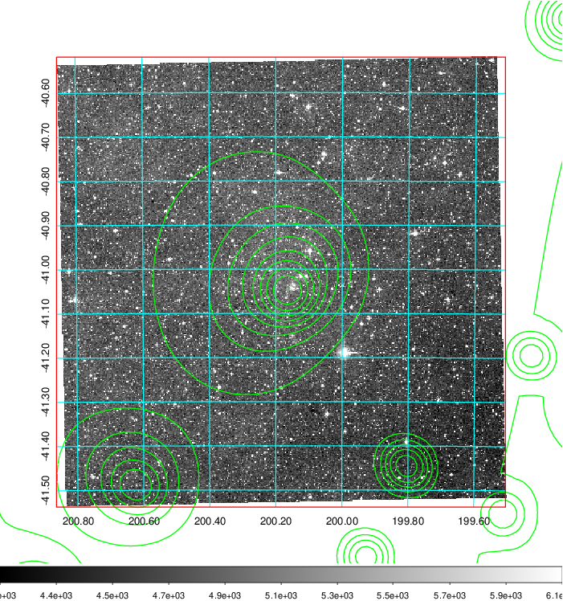
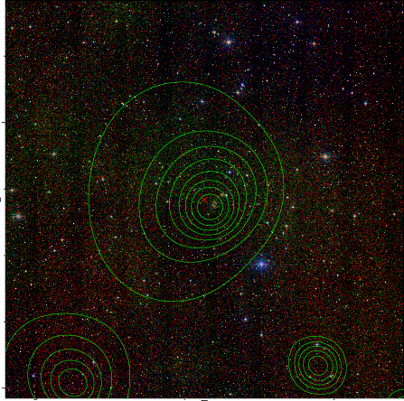

### 498

|Name|RAJ2000[deg]|DEJ2000[deg] |Ext[arcmin]| Ext,ml | z | z_src| C|GC(XSZ,Delta_z<0.01)| GC(OPT,Delta_z<0.01)|GC| R_sig[arcmin] | R500[arcmin] | R500[Mpc]| CRsig[c/s] | CR500[c/s] |L500[1E44 erg/s]|F500[1E-12 erg/s/cm^2]| M500[1E14 Msun]|Tx[keV]|Cnt_sig|Beta|Rc[arcmin]|Comment|Alias|
|---|---|---|---|---|---|------|---|--------|---------|----------|---|---|---|---|---|---|---|---|---|---|---|---|---|---|
|498| 200.184| -41.029| 3.26| 42.35| 0.0509(0.006)| z1, z_xsz| B| MCXC| A| A, MCXC, N| 16.112| 12.368| 0.738| 0.270(0.055)| 0.260(0.053)| 0.259(0.028)| 4.221(0.450)| 1.20(0.07)| 2.43(0.08)| 87.9| 0.852(-0.144+0.103)| 5.468(-1.164+0.860)| -| k403|

|[RASS image](../image/498/498_img.pdf)|[filtered image](../image/498/498_fil.pdf)|[Segment image](../image/498/498_seg.pdf)|
|-------------------|--------------------|-------------------|
|   |    |   |

|[Exposure image](../image/498/498_mex.pdf)| [nH image](../image/498/498_nh.pdf)| [Planck image](../image/498/498_p.pdf)|
|-------------------|--------------------|-------------------|
|   |     |  |

|[Redshift Histogram](../image/498/498_zg.pdf) | [DSS image(z1)](../image/498/498_dss_z1.pdf)      |  [DSS image(z2)](../image/498/498_dss_z2.pdf)    |
|-------------------|--------------------|-------------------|
| |  Blue circle for optical clusters;  Magenta circle for XSZ clusters;  all with r=1Mpc;  Only GC with Delta_z<0.01 are shown. |  Blue circle for optical clusters;  Magenta circle for XSZ clusters;  all with r=1Mpc;  Only GC with Delta_z<0.01 are shown.  |

|[known Abell/XSZ clusters](../image/498/498_gc.pdf) | [2MASS image](../image/498/498_2mass.pdf)      |
|-------------------|-------------------|
|  Magenta, blue and green circles  for optical, X-ray and SZ clusters  respectively, with redshift of clusters  labelled. The radius of circles  are 1Mpc.|  |

