

### 499

|Name|RAJ2000[deg]|DEJ2000[deg] |Ext[arcmin]| Ext,ml | z | z_src| C|GC(XSZ,Delta_z<0.01)| GC(OPT,Delta_z<0.01)|GC| R_sig[arcmin] | R500[arcmin] | R500[Mpc]| CRsig[c/s] | CR500[c/s] |L500[1E44 erg/s]|F500[1E-12 erg/s/cm^2]| M500[1E14 Msun]|Tx[keV]|Cnt_sig|Beta|Rc[arcmin]|Comment|Alias|
|---|---|---|---|---|---|------|---|--------|---------|----------|---|---|---|---|---|---|---|---|---|---|---|---|---|---|
|499| 200.339| 26.661| 2.41| 27.26| 0.0717(0.005)| z1, z_xsz| B| F20| W| F20, N, W| 11.725| 7.375| 0.605| 0.064(0.024)| 0.060(0.022)| 0.131(0.041)| 1.049(0.325)| 0.67(0.11)| 1.71(0.17)| 41.9| 0.817(-0.165+0.128)| 6.039(-1.453+1.086)| -| t088|

|[RASS image](../image/499/499_img.pdf)|[filtered image](../image/499/499_fil.pdf)|[Segment image](../image/499/499_seg.pdf)|
|-------------------|--------------------|-------------------|
| 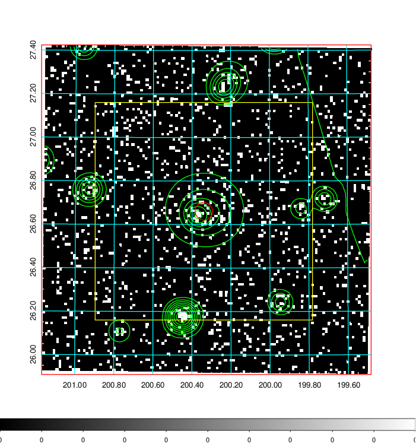  | 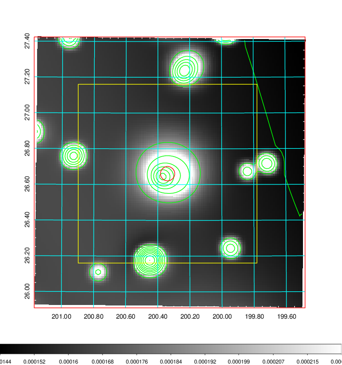   | 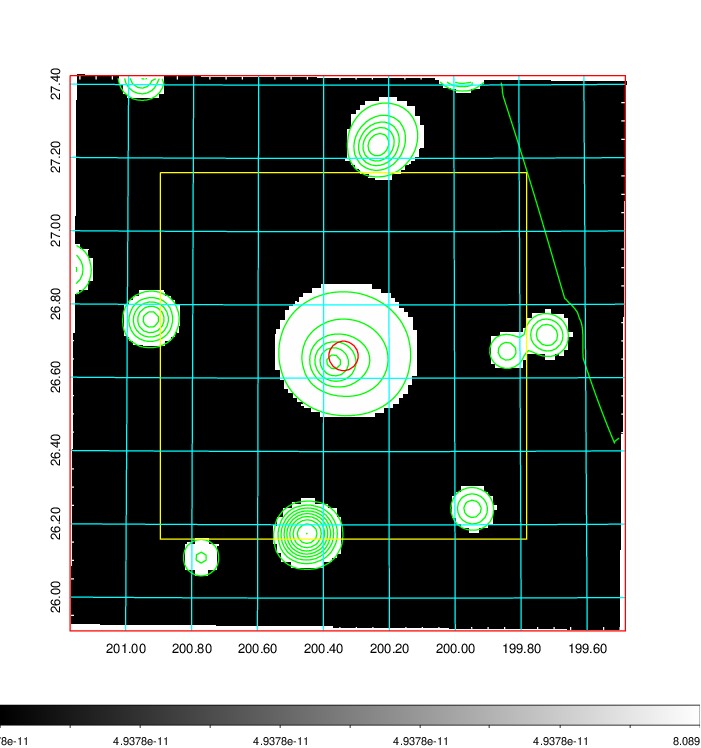  |

|[Exposure image](../image/499/499_mex.pdf)| [nH image](../image/499/499_nh.pdf)| [Planck image](../image/499/499_p.pdf)|
|-------------------|--------------------|-------------------|
|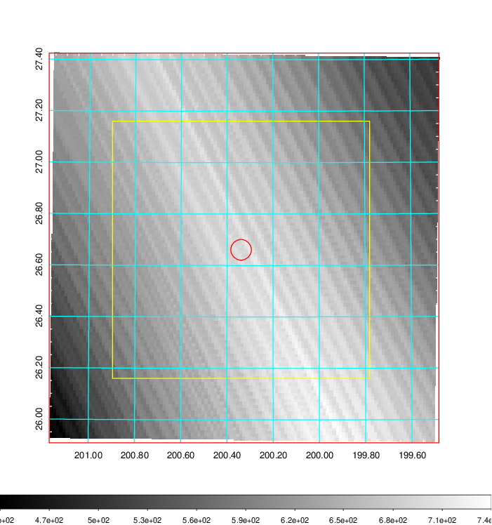   | 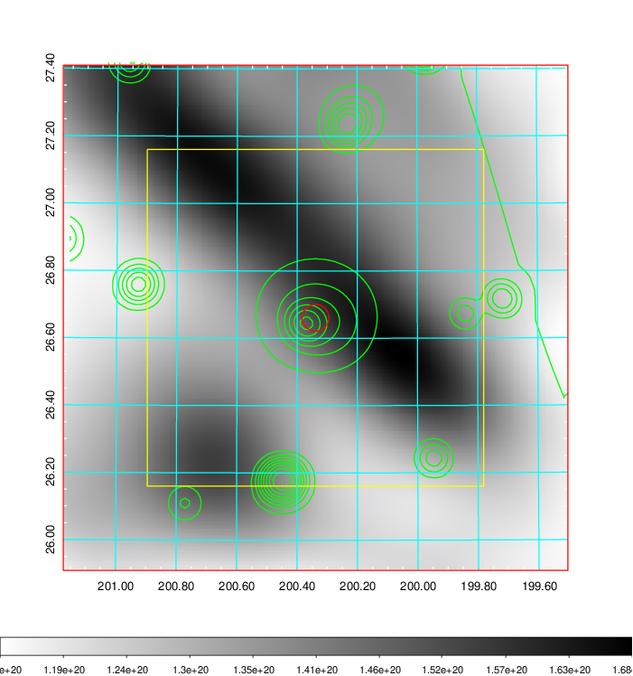    | 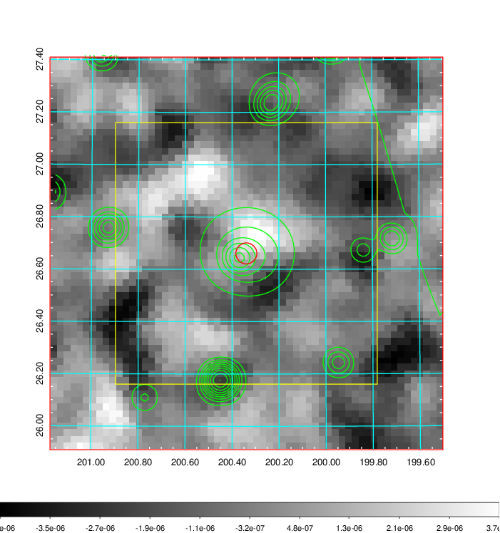 |

|[Redshift Histogram](../image/499/499_zg.pdf) | [DSS image(z1)](../image/499/499_dss_z1.pdf)      |  [DSS image(z2)](../image/499/499_dss_z2.pdf)    |
|-------------------|--------------------|-------------------|
|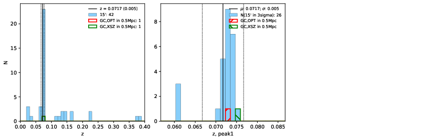 |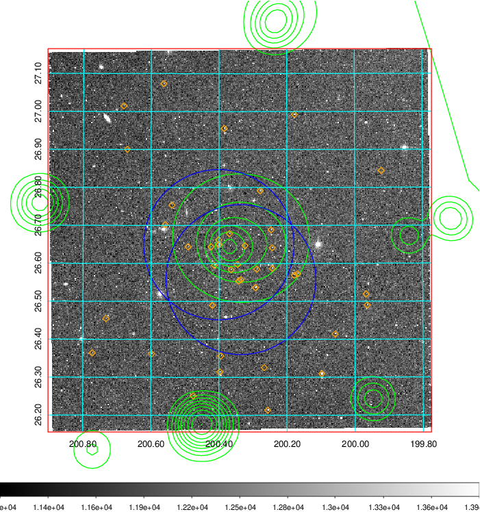  Blue circle for optical clusters;  Magenta circle for XSZ clusters;  all with r=1Mpc;  Only GC with Delta_z<0.01 are shown. | 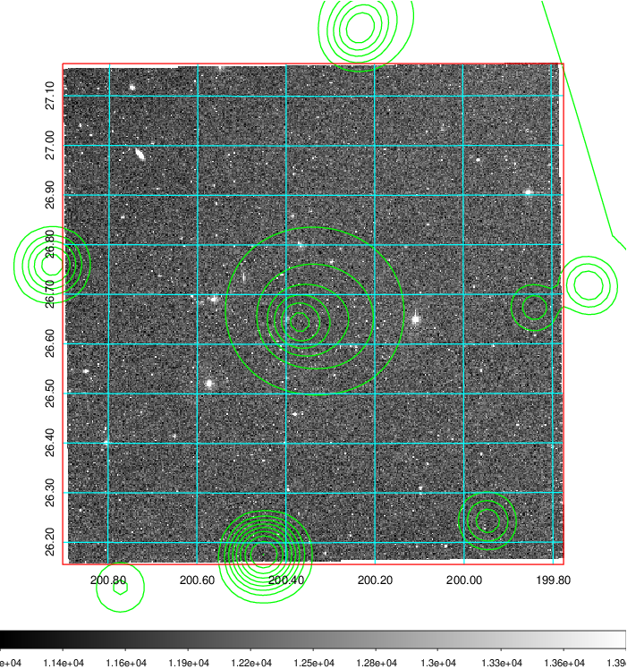 Blue circle for optical clusters;  Magenta circle for XSZ clusters;  all with r=1Mpc;  Only GC with Delta_z<0.01 are shown.  |

|[known Abell/XSZ clusters](../image/499/499_gc.pdf) | [2MASS image](../image/499/499_2mass.pdf)      |[SDSS image](../image/499/499_sdss.pdf)   |
|-------------------|-------------------|-------------------|
|  Magenta, blue and green circles  for optical, X-ray and SZ clusters  respectively, with redshift of clusters  labelled. The radius of circles  are 1Mpc.|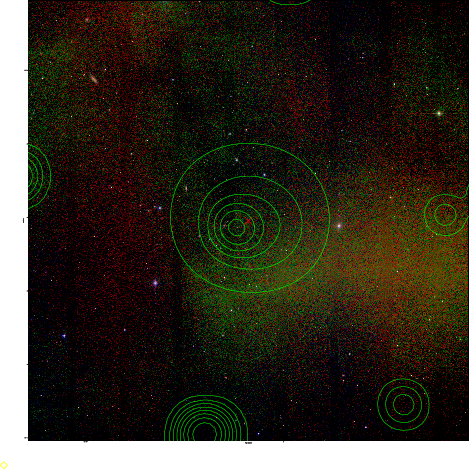  | 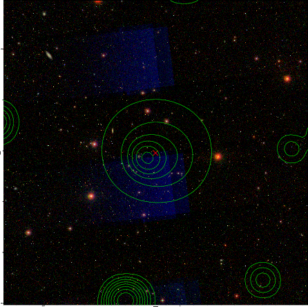  |

