

### 50

|Name|RAJ2000[deg]|DEJ2000[deg] |Ext[arcmin]| Ext,ml | z | z_src| C|GC(XSZ,Delta_z<0.01)| GC(OPT,Delta_z<0.01)|GC| R_sig[arcmin] | R500[arcmin] | R500[Mpc]| CRsig[c/s] | CR500[c/s] |L500[1E44 erg/s]|F500[1E-12 erg/s/cm^2]| M500[1E14 Msun]|Tx[keV]|Cnt_sig|Beta|Rc[arcmin]|Comment|Alias|
|---|---|---|---|---|---|------|---|--------|---------|----------|---|---|---|---|---|---|---|---|---|---|---|---|---|---|
|50| 16.331| 36.014| 8.05| 30.75| 0.0570(0.005)| z1,| G| -| -| -| 27.169| 10.594| 0.702| 0.195(0.055)| 0.177(0.050)| 0.236(0.074)| 3.034(0.948)| 1.04(0.17)| 2.23(0.23)| 126.8| 0.532(-0.024+0.047)| 6.289(-0.769+1.006)| -| t393|

|[RASS image](../image/50/50_img.pdf)|[filtered image](../image/50/50_fil.pdf)|[Segment image](../image/50/50_seg.pdf)|
|-------------------|--------------------|-------------------|
| 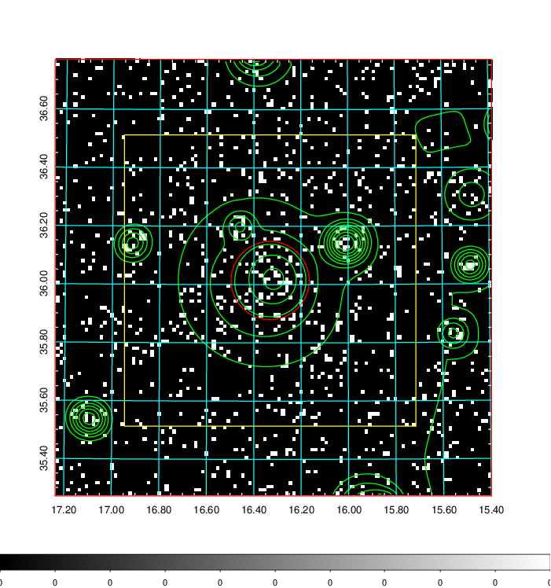  | 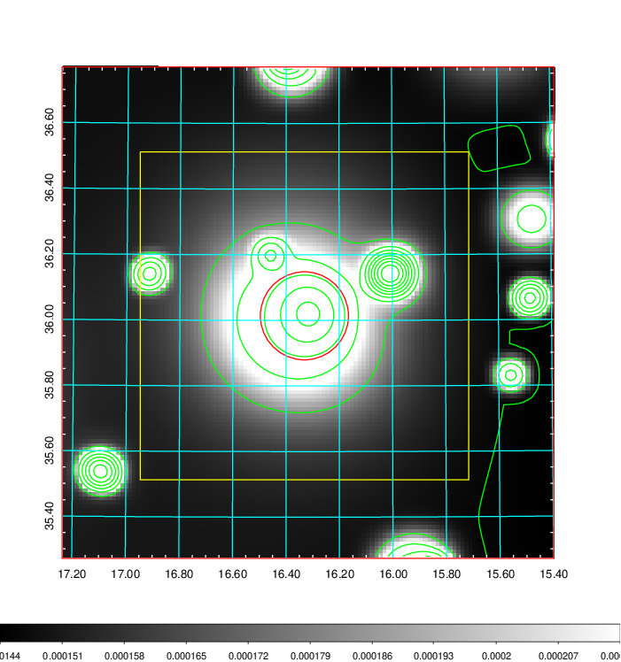   | 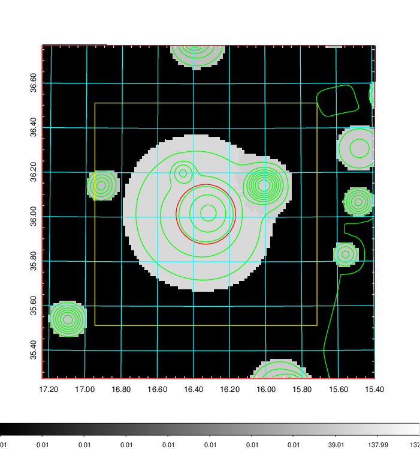  |

|[Exposure image](../image/50/50_mex.pdf)| [nH image](../image/50/50_nh.pdf)| [Planck image](../image/50/50_p.pdf)|
|-------------------|--------------------|-------------------|
|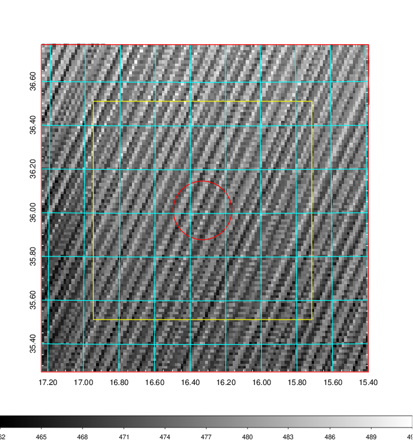   | 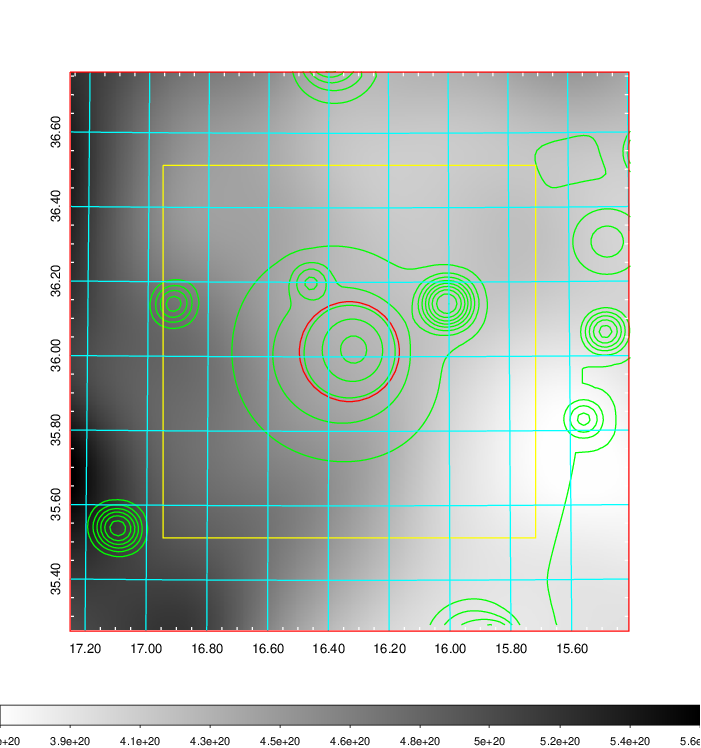    | 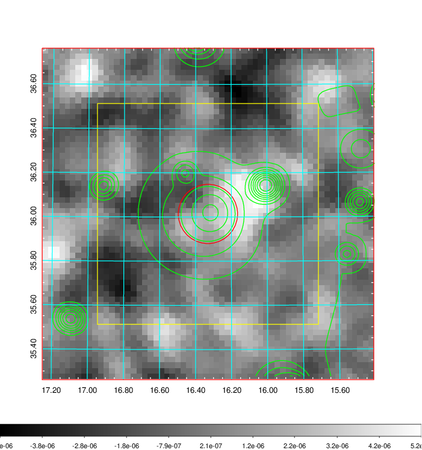 |

|[Redshift Histogram](../image/50/50_zg.pdf) | [DSS image(z1)](../image/50/50_dss_z1.pdf)      |  [DSS image(z2)](../image/50/50_dss_z2.pdf)    |
|-------------------|--------------------|-------------------|
|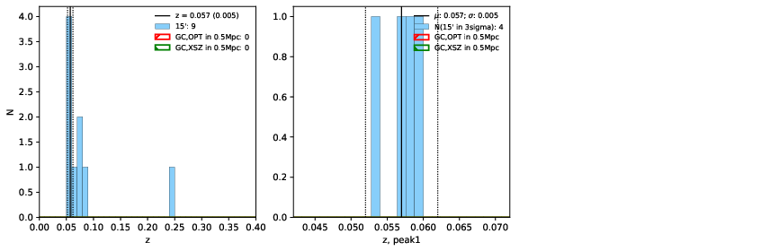 |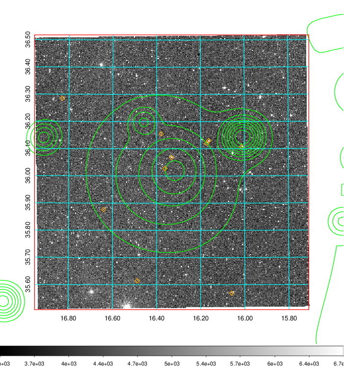  Blue circle for optical clusters;  Magenta circle for XSZ clusters;  all with r=1Mpc;  Only GC with Delta_z<0.01 are shown. | 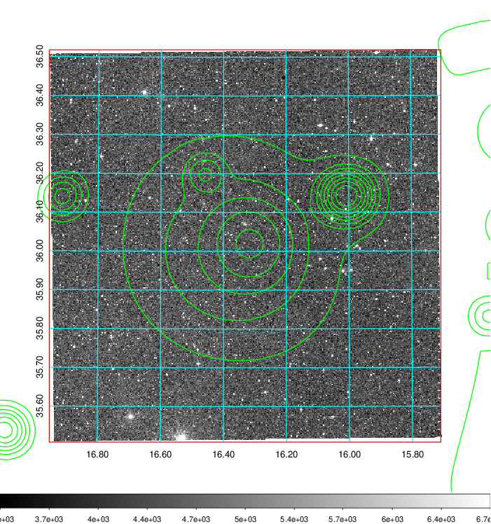 Blue circle for optical clusters;  Magenta circle for XSZ clusters;  all with r=1Mpc;  Only GC with Delta_z<0.01 are shown.  |

|[Previous-identified clusters](../image/50/50_gc.pdf) | [2MASS image](../image/50/50_2mass.pdf)      |
|-------------------|-------------------|
|  Green, magenta, and blue circles  for optical, X-ray and SZ clusters  respectively, with redshift of clusters  labelled. The radius of circles  are 1Mpc.|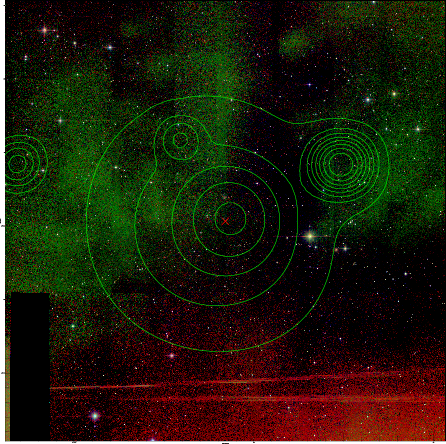  |

|[PS1 image](../image/50/50_ps1.pdf)            |
|-------------------|
| 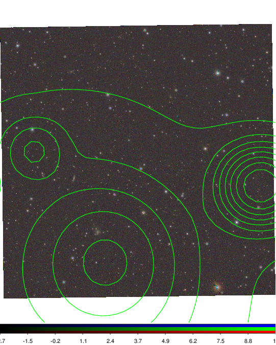  |
