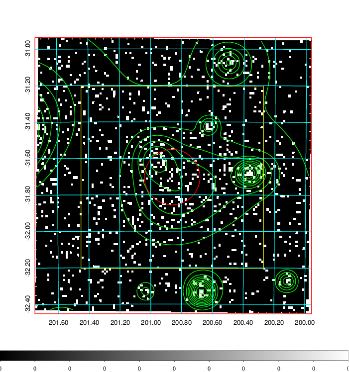
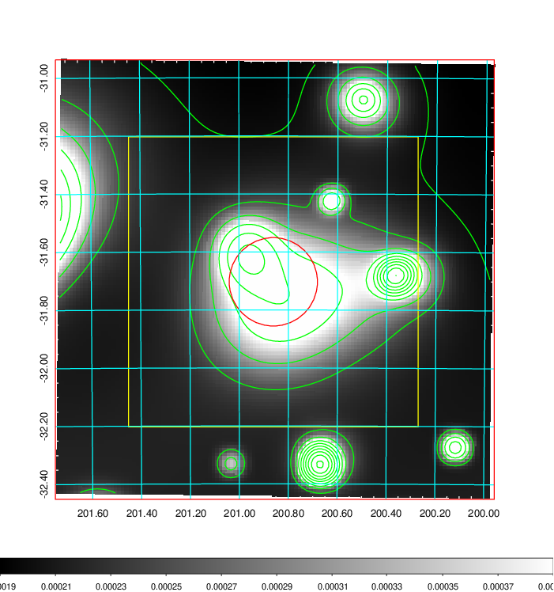
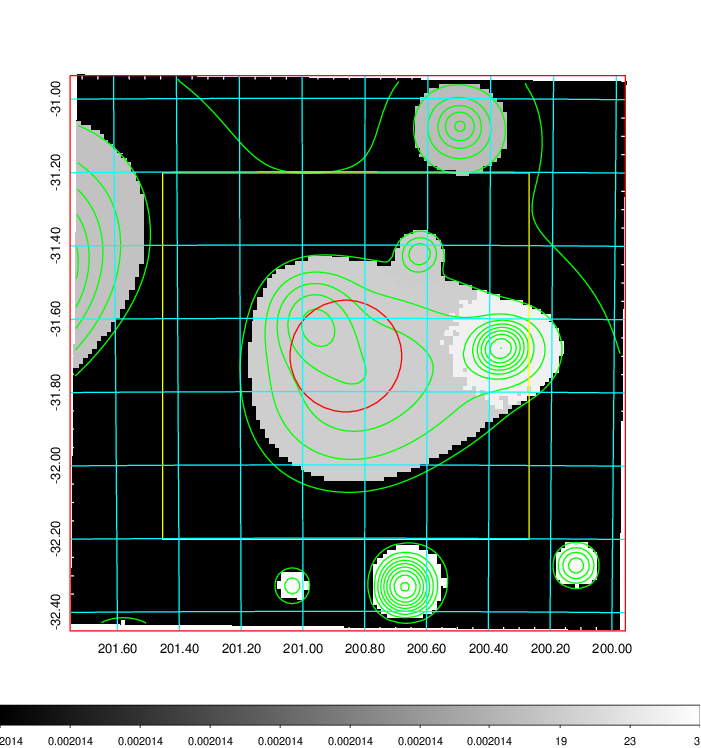
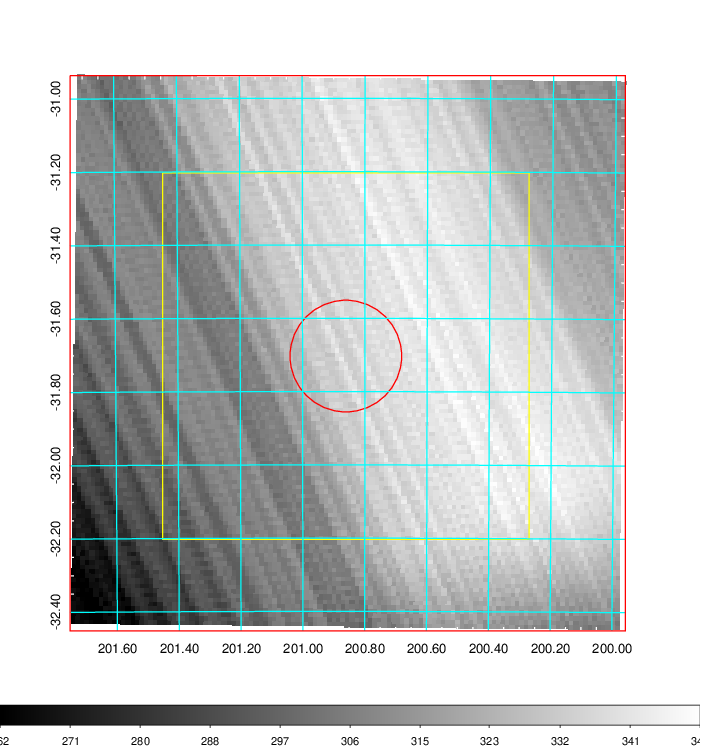
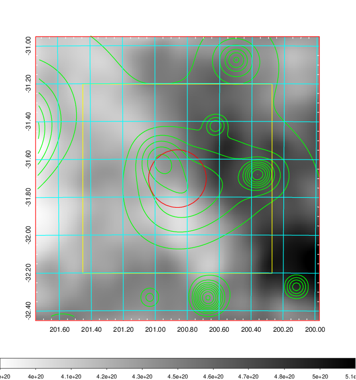
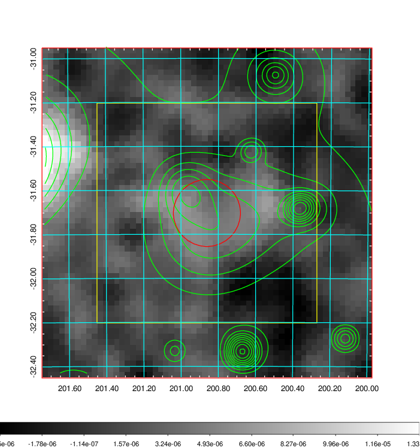
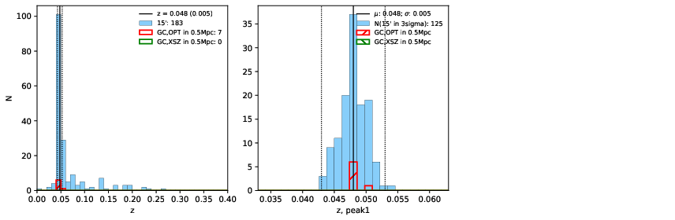
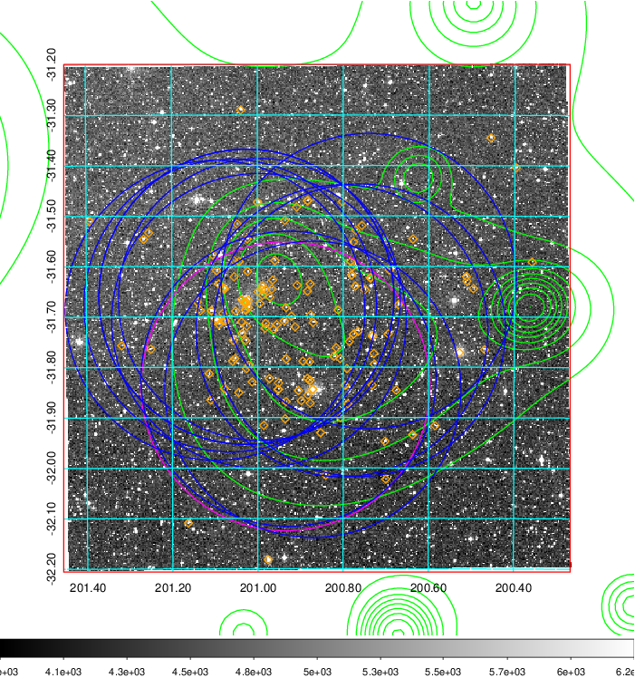
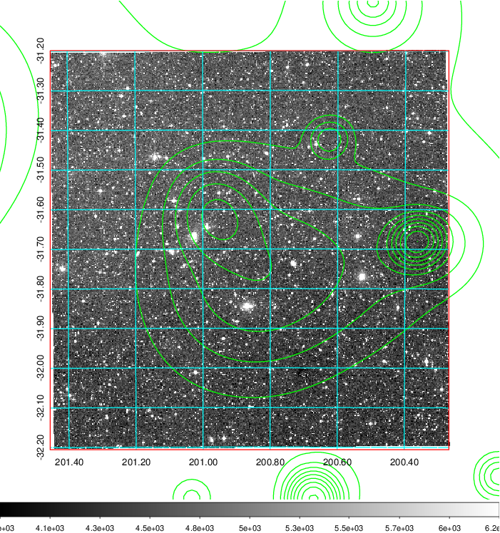
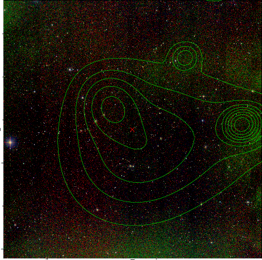

### 500

|Name|RAJ2000[deg]|DEJ2000[deg] |Ext[arcmin]| Ext,ml | z | z_src| C|GC(XSZ,Delta_z<0.01)| GC(OPT,Delta_z<0.01)|GC| R_sig[arcmin] | R500[arcmin] | R500[Mpc]| CRsig[c/s] | CR500[c/s] |L500[1E44 erg/s]|F500[1E-12 erg/s/cm^2]| M500[1E14 Msun]|Tx[keV]|Cnt_sig|Beta|Rc[arcmin]|Comment|Alias|
|---|---|---|---|---|---|------|---|--------|---------|----------|---|---|---|---|---|---|---|---|---|---|---|---|---|---|
|500| 200.861| -31.703| 9.14| 45.41| 0.0480(0.005)| z1, z_opt| S| -| N, W| A, N, W, XB| 20.256| 12.377| 0.699| 0.252(0.078)| 0.237(0.073)| 0.223(0.057)| 4.111(1.054)| 1.01(0.13)| 2.19(0.18)| 97.8| 0.905(-0.113+0.068)| 13.409(-1.898+1.386)| An X-ray cluster with $z$ = 0.0490 and offset = 0.51 Mpc(8.94 arcmin),| t417|

|[RASS image](../image/500/500_img.pdf)|[filtered image](../image/500/500_fil.pdf)|[Segment image](../image/500/500_seg.pdf)|
|-------------------|--------------------|-------------------|
|   |    |   |

|[Exposure image](../image/500/500_mex.pdf)| [nH image](../image/500/500_nh.pdf)| [Planck image](../image/500/500_p.pdf)|
|-------------------|--------------------|-------------------|
|   |     |  |

|[Redshift Histogram](../image/500/500_zg.pdf) | [DSS image(z1)](../image/500/500_dss_z1.pdf)      |  [DSS image(z2)](../image/500/500_dss_z2.pdf)    |
|-------------------|--------------------|-------------------|
| |  Blue circle for optical clusters;  Magenta circle for XSZ clusters;  all with r=1Mpc;  Only GC with Delta_z<0.01 are shown. |  Blue circle for optical clusters;  Magenta circle for XSZ clusters;  all with r=1Mpc;  Only GC with Delta_z<0.01 are shown.  |

|[known Abell/XSZ clusters](../image/500/500_gc.pdf) | [2MASS image](../image/500/500_2mass.pdf)      |
|-------------------|-------------------|
|  Magenta, blue and green circles  for optical, X-ray and SZ clusters  respectively, with redshift of clusters  labelled. The radius of circles  are 1Mpc.|  |

