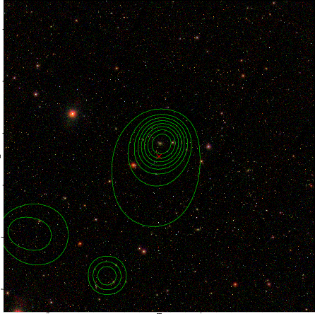

### 501

|Name|RAJ2000[deg]|DEJ2000[deg] |Ext[arcmin]| Ext,ml | z | z_src| C|GC(XSZ,Delta_z<0.01)| GC(OPT,Delta_z<0.01)|GC| R_sig[arcmin] | R500[arcmin] | R500[Mpc]| CRsig[c/s] | CR500[c/s] |L500[1E44 erg/s]|F500[1E-12 erg/s/cm^2]| M500[1E14 Msun]|Tx[keV]|Cnt_sig|Beta|Rc[arcmin]|Comment|Alias|
|---|---|---|---|---|---|------|---|--------|---------|----------|---|---|---|---|---|---|---|---|---|---|---|---|---|---|
|501| 200.886| 11.260| 1.75| 27.73| 0.0875(0.006)| z1, z_xsz| B| F20, MCXC| A, N, RM, W| A, C, F20, MCXC, N, W| 13.188| 8.978| 0.882| 0.257(0.056)| 0.244(0.053)| 0.898(0.118)| 4.706(0.618)| 2.12(0.14)| 3.50(0.15)| 80.2| 0.842(-0.139+0.110)| 5.142(-1.070+0.825)| -| k166|

|[RASS image](../image/501/501_img.pdf)|[filtered image](../image/501/501_fil.pdf)|[Segment image](../image/501/501_seg.pdf)|
|-------------------|--------------------|-------------------|
|   |    |   |

|[Exposure image](../image/501/501_mex.pdf)| [nH image](../image/501/501_nh.pdf)| [Planck image](../image/501/501_p.pdf)|
|-------------------|--------------------|-------------------|
|   |     |  |

|[Redshift Histogram](../image/501/501_zg.pdf) | [DSS image(z1)](../image/501/501_dss_z1.pdf)      |  [DSS image(z2)](../image/501/501_dss_z2.pdf)    |
|-------------------|--------------------|-------------------|
| |  Blue circle for optical clusters;  Magenta circle for XSZ clusters;  all with r=1Mpc;  Only GC with Delta_z<0.01 are shown. |  Blue circle for optical clusters;  Magenta circle for XSZ clusters;  all with r=1Mpc;  Only GC with Delta_z<0.01 are shown.  |

|[Previous-identified clusters](../image/501/501_gc.pdf) | [2MASS image](../image/501/501_2mass.pdf)      |[SDSS image](../image/501/501_sdss.pdf)   |
|-------------------|-------------------|-------------------|
|  Green, magenta, and blue circles  for optical, X-ray and SZ clusters  respectively, with redshift of clusters  labelled. The radius of circles  are 1Mpc.|  |   |

