

### 502

|Name|RAJ2000[deg]|DEJ2000[deg] |Ext[arcmin]| Ext,ml | z | z_src| C|GC(XSZ,Delta_z<0.01)| GC(OPT,Delta_z<0.01)|GC| R_sig[arcmin] | R500[arcmin] | R500[Mpc]| CRsig[c/s] | CR500[c/s] |L500[1E44 erg/s]|F500[1E-12 erg/s/cm^2]| M500[1E14 Msun]|Tx[keV]|Cnt_sig|Beta|Rc[arcmin]|Comment|Alias|
|---|---|---|---|---|---|------|---|--------|---------|----------|---|---|---|---|---|---|---|---|---|---|---|---|---|---|
|502| 201.575| 0.229| 1.18| 28.32| 0.0830(0.005)| z1, z_xsz| B| F20, MCXC| N, W| C, F20, MCXC, N, W| 5.875| 9.737| 0.912| 0.281(0.044)| 0.315(0.049)| 1.059(0.092)| 6.208(0.540)| 2.34(0.10)| 3.71(0.10)| 76.8| 0.902(-0.106+0.070)| 3.081(-0.543+0.400)| -| k058|

|[RASS image](../image/502/502_img.pdf)|[filtered image](../image/502/502_fil.pdf)|[Segment image](../image/502/502_seg.pdf)|
|-------------------|--------------------|-------------------|
| 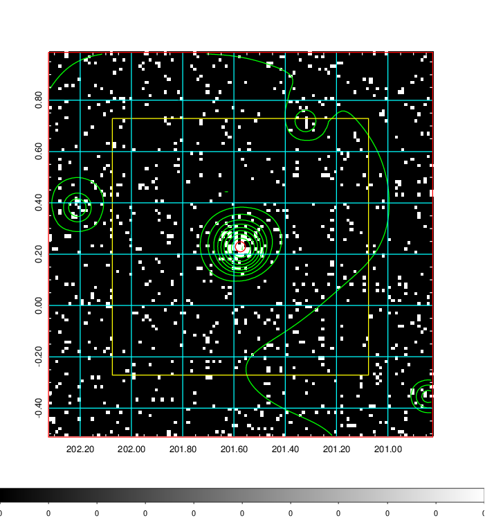  | 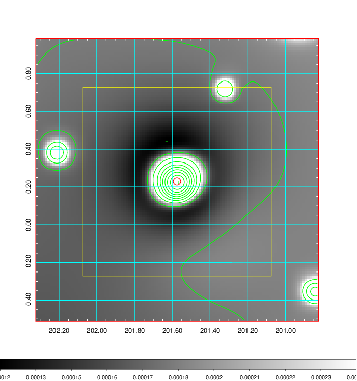   | 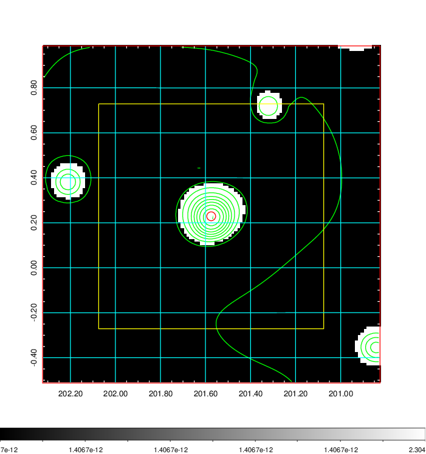  |

|[Exposure image](../image/502/502_mex.pdf)| [nH image](../image/502/502_nh.pdf)| [Planck image](../image/502/502_p.pdf)|
|-------------------|--------------------|-------------------|
|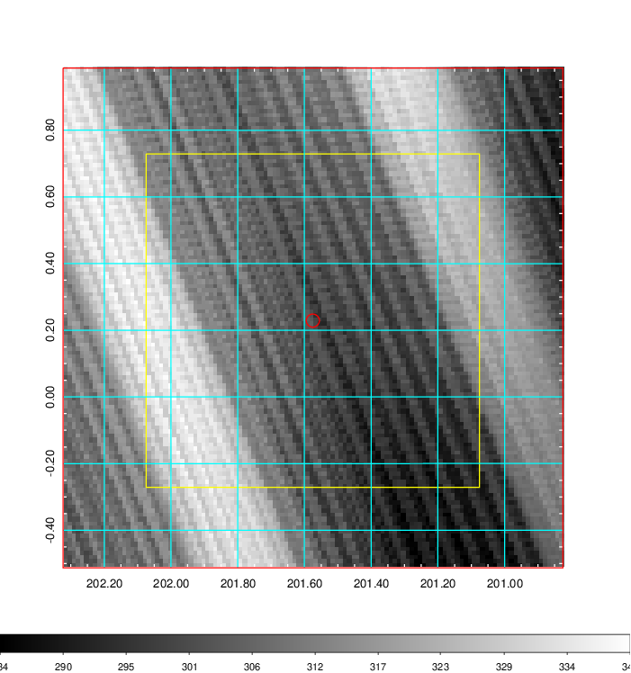   | 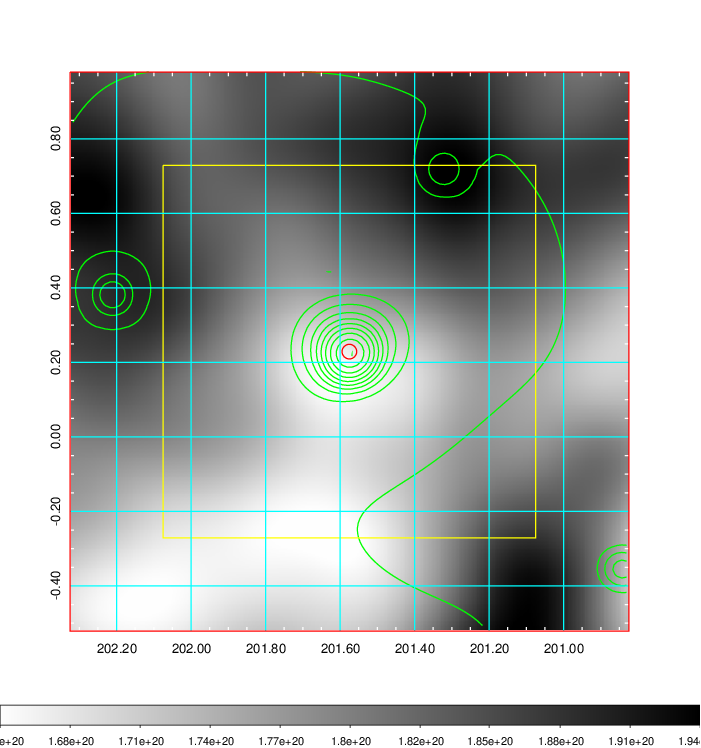    | 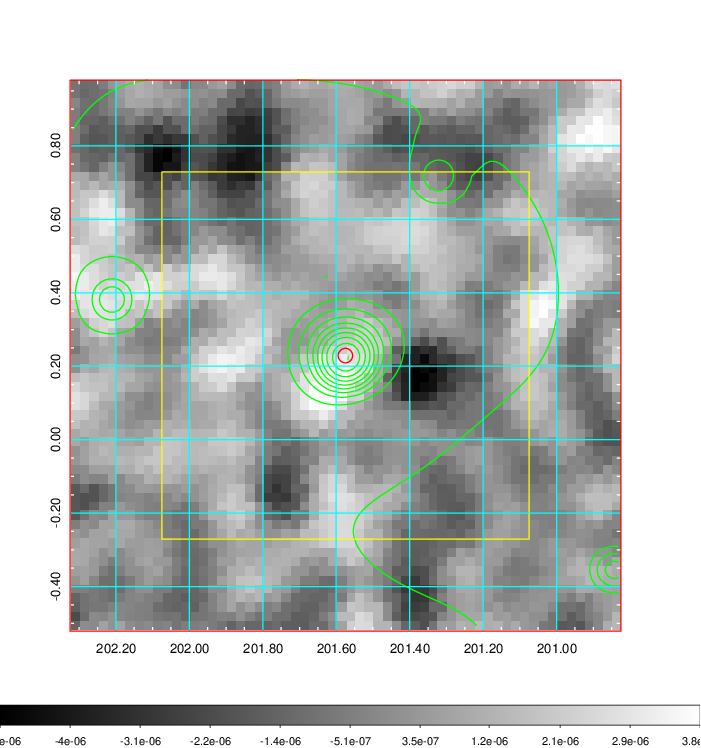 |

|[Redshift Histogram](../image/502/502_zg.pdf) | [DSS image(z1)](../image/502/502_dss_z1.pdf)      |  [DSS image(z2)](../image/502/502_dss_z2.pdf)    |
|-------------------|--------------------|-------------------|
|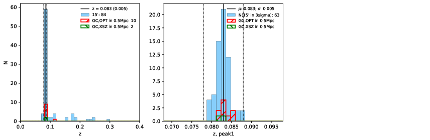 |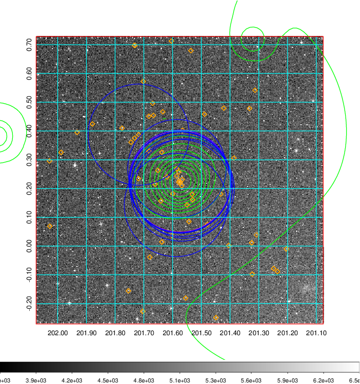  Blue circle for optical clusters;  Magenta circle for XSZ clusters;  all with r=1Mpc;  Only GC with Delta_z<0.01 are shown. | 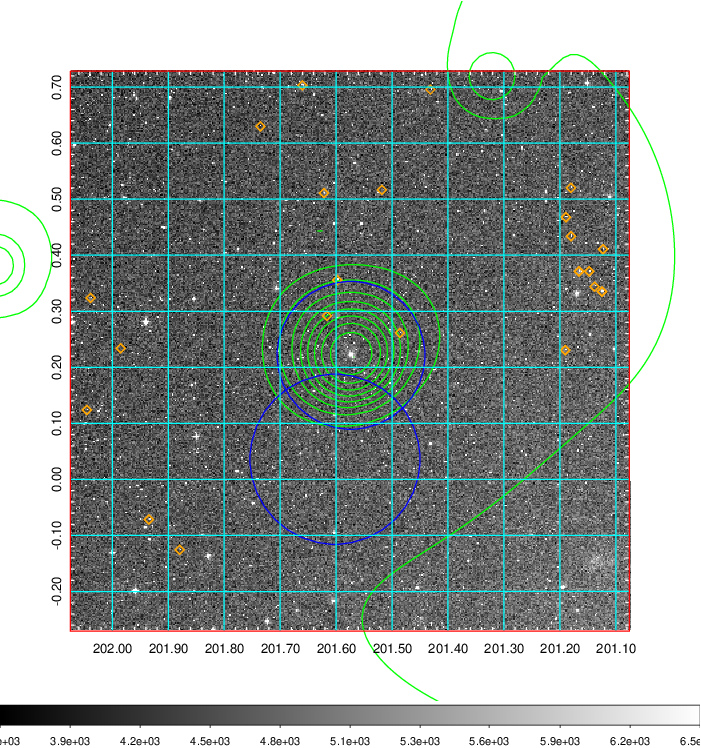 Blue circle for optical clusters;  Magenta circle for XSZ clusters;  all with r=1Mpc;  Only GC with Delta_z<0.01 are shown.  |

|[known Abell/XSZ clusters](../image/502/502_gc.pdf) | [2MASS image](../image/502/502_2mass.pdf)      |[SDSS image](../image/502/502_sdss.pdf)   |
|-------------------|-------------------|-------------------|
|  Magenta, blue and green circles  for optical, X-ray and SZ clusters  respectively, with redshift of clusters  labelled. The radius of circles  are 1Mpc.|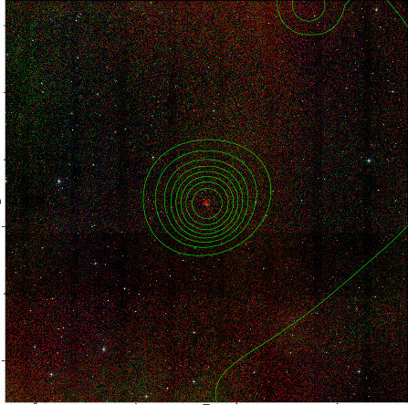  | 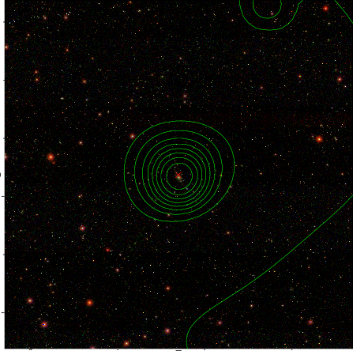  |

