

### 503

|Name|RAJ2000[deg]|DEJ2000[deg] |Ext[arcmin]| Ext,ml | z | z_src| C|GC(XSZ,Delta_z<0.01)| GC(OPT,Delta_z<0.01)|GC| R_sig[arcmin] | R500[arcmin] | R500[Mpc]| CRsig[c/s] | CR500[c/s] |L500[1E44 erg/s]|F500[1E-12 erg/s/cm^2]| M500[1E14 Msun]|Tx[keV]|Cnt_sig|Beta|Rc[arcmin]|Comment|Alias|
|---|---|---|---|---|---|------|---|--------|---------|----------|---|---|---|---|---|---|---|---|---|---|---|---|---|---|
|503| 201.761| -27.154| 6.67| 603.09| 0.0446(0.005)| z1, z_xsz| B| MCXC, PSZ2, Tar, XB| A, N| A, MCXC, N, PSZ2, Tar, XB| 32.680| 18.733| 0.986| 1.570(0.132)| 1.467(0.124)| 1.251(0.059)| 26.808(1.261)| 2.85(0.07)| 4.14(0.06)| 605.3| 0.686(-0.026+0.030)| 7.889(-0.550+0.608)| -| k554|

|[RASS image](../image/503/503_img.pdf)|[filtered image](../image/503/503_fil.pdf)|[Segment image](../image/503/503_seg.pdf)|
|-------------------|--------------------|-------------------|
| 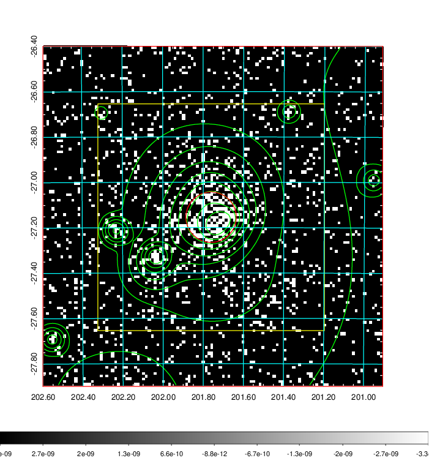  | 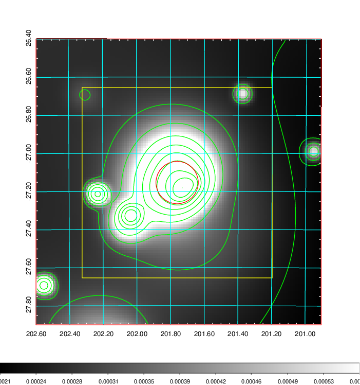   | 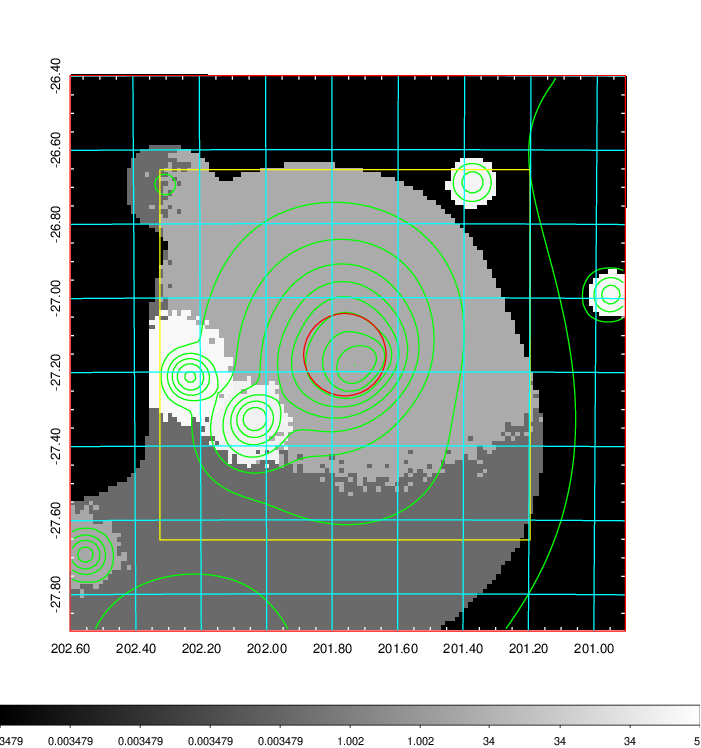  |

|[Exposure image](../image/503/503_mex.pdf)| [nH image](../image/503/503_nh.pdf)| [Planck image](../image/503/503_p.pdf)|
|-------------------|--------------------|-------------------|
|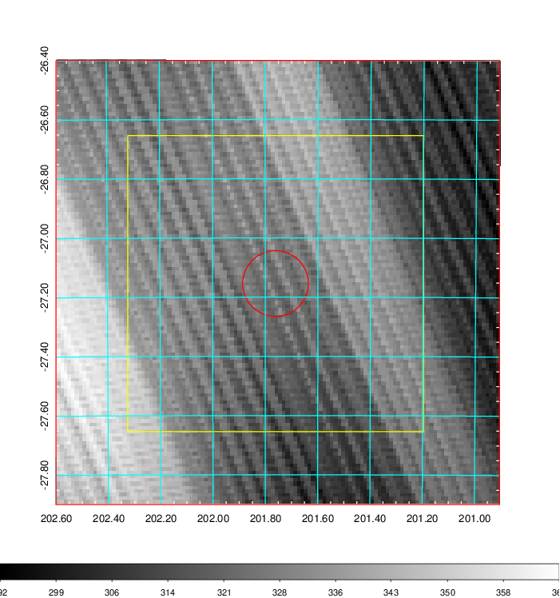   | 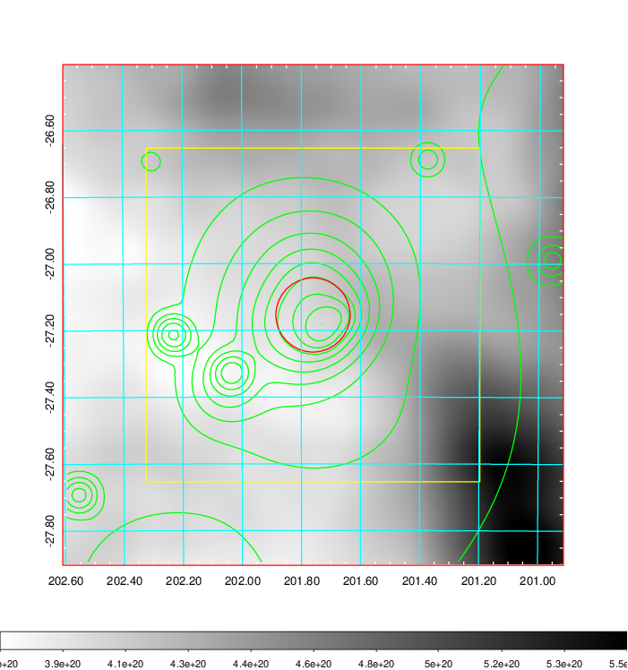    | 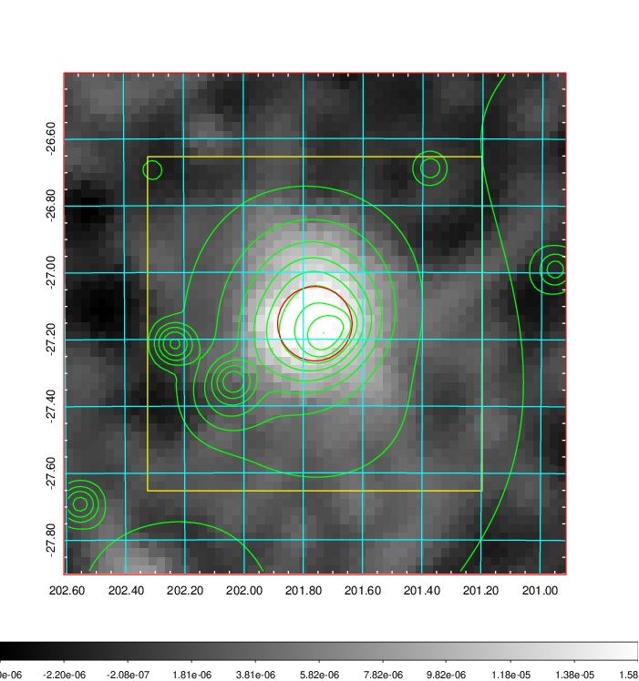 |

|[Redshift Histogram](../image/503/503_zg.pdf) | [DSS image(z1)](../image/503/503_dss_z1.pdf)      |  [DSS image(z2)](../image/503/503_dss_z2.pdf)    |
|-------------------|--------------------|-------------------|
|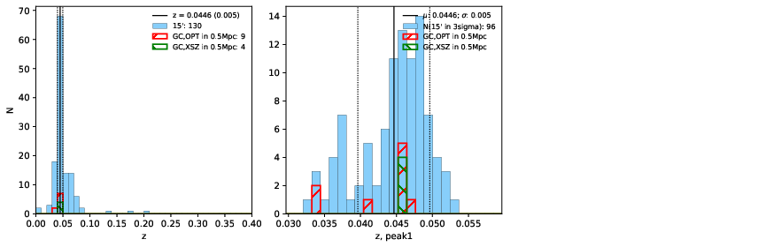 |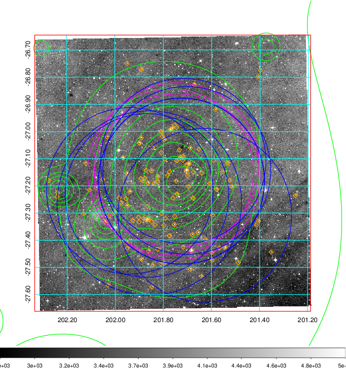  Blue circle for optical clusters;  Magenta circle for XSZ clusters;  all with r=1Mpc;  Only GC with Delta_z<0.01 are shown. | 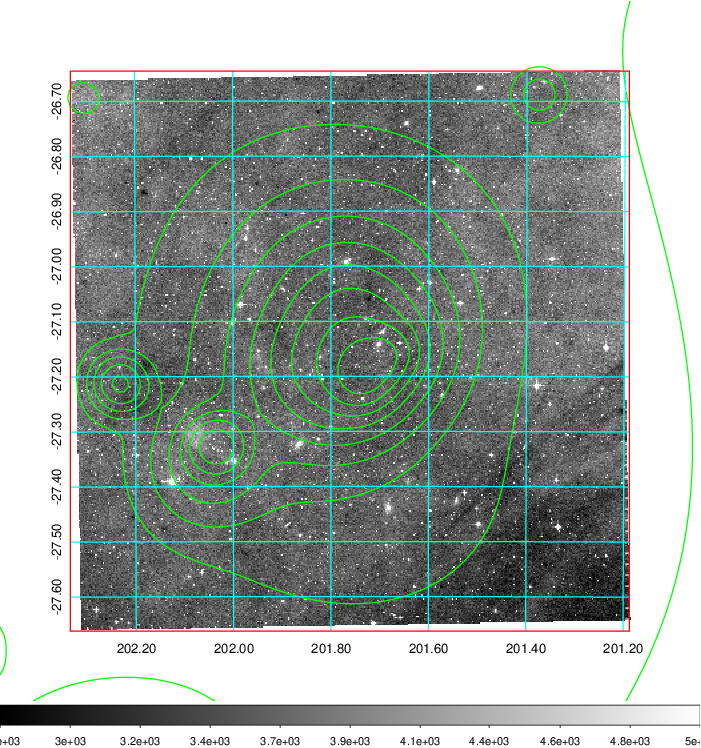 Blue circle for optical clusters;  Magenta circle for XSZ clusters;  all with r=1Mpc;  Only GC with Delta_z<0.01 are shown.  |

|[Previous-identified clusters](../image/503/503_gc.pdf) | [2MASS image](../image/503/503_2mass.pdf)      |
|-------------------|-------------------|
|  Green, magenta, and blue circles  for optical, X-ray and SZ clusters  respectively, with redshift of clusters  labelled. The radius of circles  are 1Mpc.|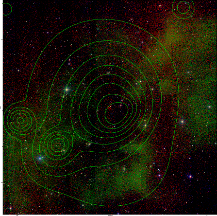  |

|[PS1 image](../image/503/503_ps1.pdf)            |
|-------------------|
| 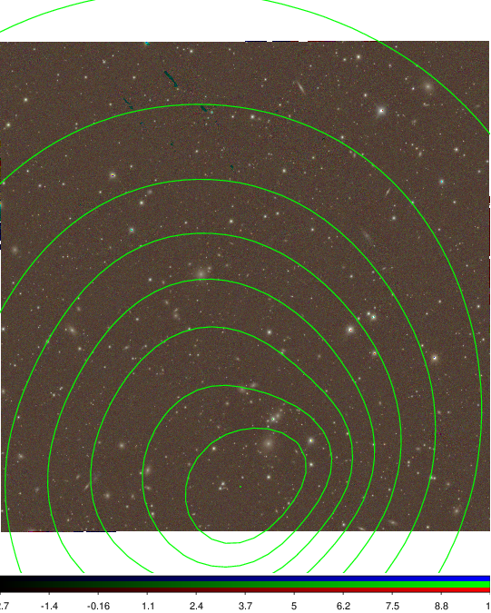  |
