

### 504

|Name|RAJ2000[deg]|DEJ2000[deg] |Ext[arcmin]| Ext,ml | z | z_src| C|GC(XSZ,Delta_z<0.01)| GC(OPT,Delta_z<0.01)|GC| R_sig[arcmin] | R500[arcmin] | R500[Mpc]| CRsig[c/s] | CR500[c/s] |L500[1E44 erg/s]|F500[1E-12 erg/s/cm^2]| M500[1E14 Msun]|Tx[keV]|Cnt_sig|Beta|Rc[arcmin]|Comment|Alias|
|---|---|---|---|---|---|------|---|--------|---------|----------|---|---|---|---|---|---|---|---|---|---|---|---|---|---|
|504| 201.928| 14.124| 14.66| 57.66| 0.1472(0.005)| z1, z_opt| S| -| N| N, W| 10.750| 6.043| 0.933| 0.130(0.047)| 0.122(0.044)| 1.402(0.516)| 2.400(0.883)| 2.67(0.48)| 4.11(0.47)| 57.2| 0.837(-0.171+0.117)| 11.629(-2.417+2.347)| -| t529|

|[RASS image](../image/504/504_img.pdf)|[filtered image](../image/504/504_fil.pdf)|[Segment image](../image/504/504_seg.pdf)|
|-------------------|--------------------|-------------------|
| 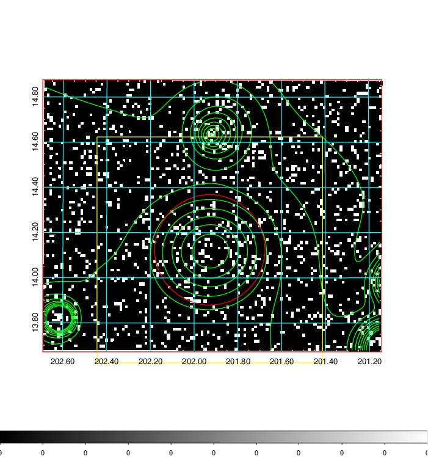  | 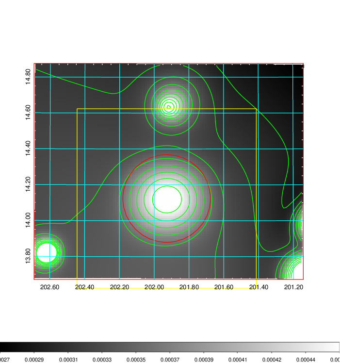   | 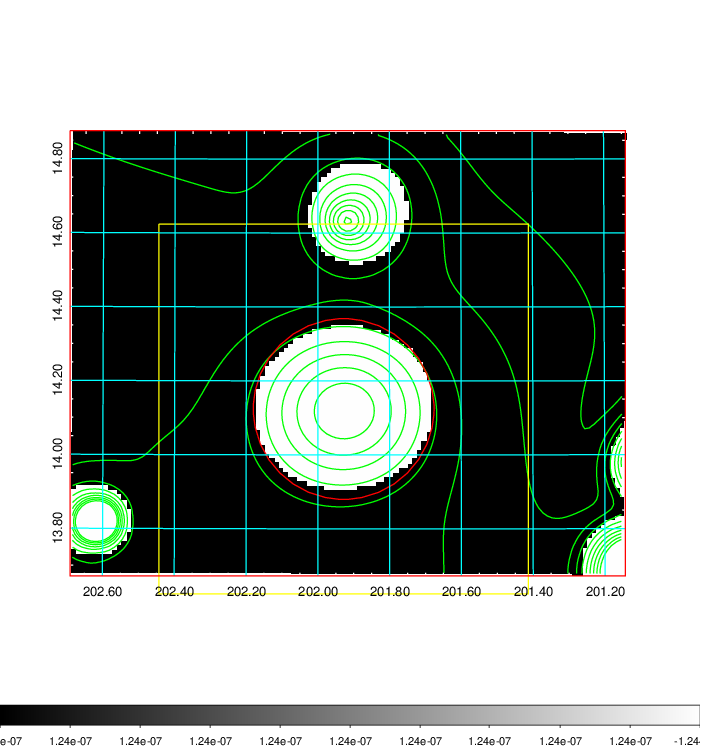  |

|[Exposure image](../image/504/504_mex.pdf)| [nH image](../image/504/504_nh.pdf)| [Planck image](../image/504/504_p.pdf)|
|-------------------|--------------------|-------------------|
|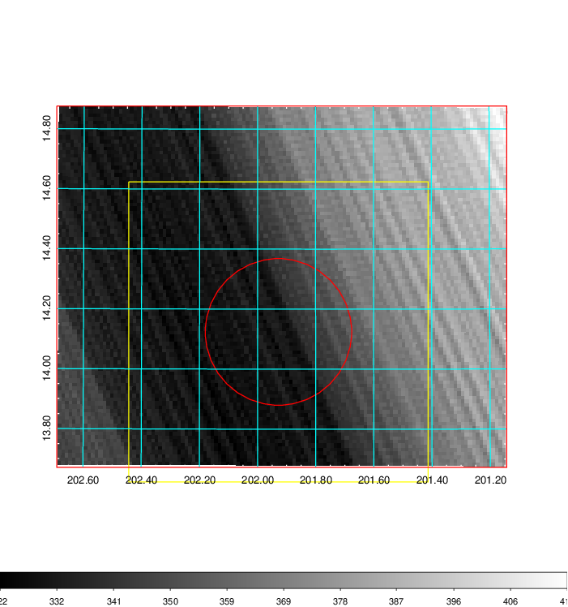   | 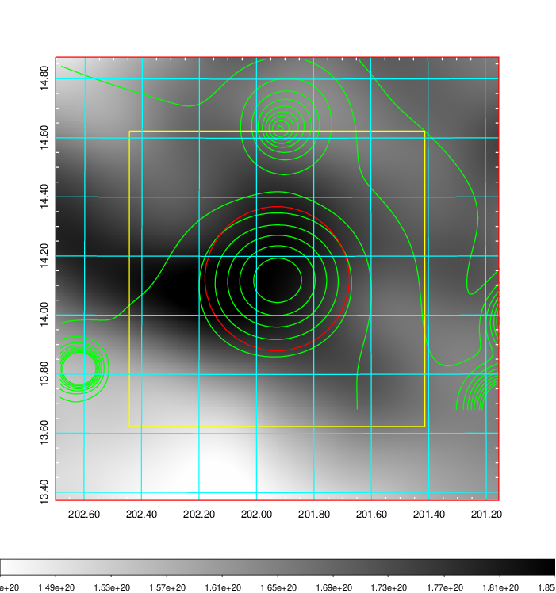    | 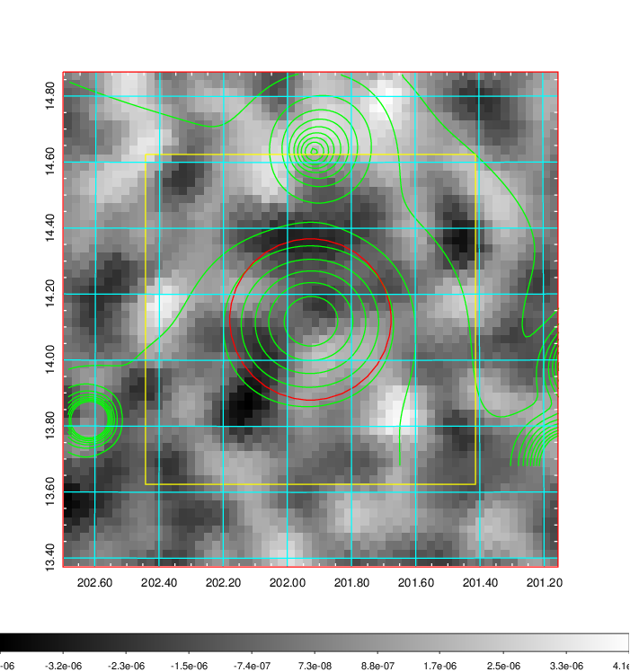 |

|[Redshift Histogram](../image/504/504_zg.pdf) | [DSS image(z1)](../image/504/504_dss_z1.pdf)      |  [DSS image(z2)](../image/504/504_dss_z2.pdf)    |
|-------------------|--------------------|-------------------|
|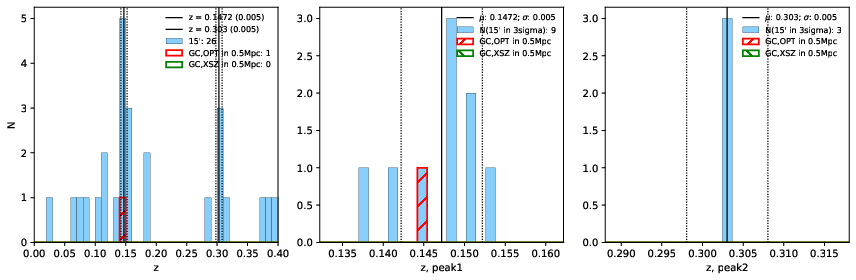 |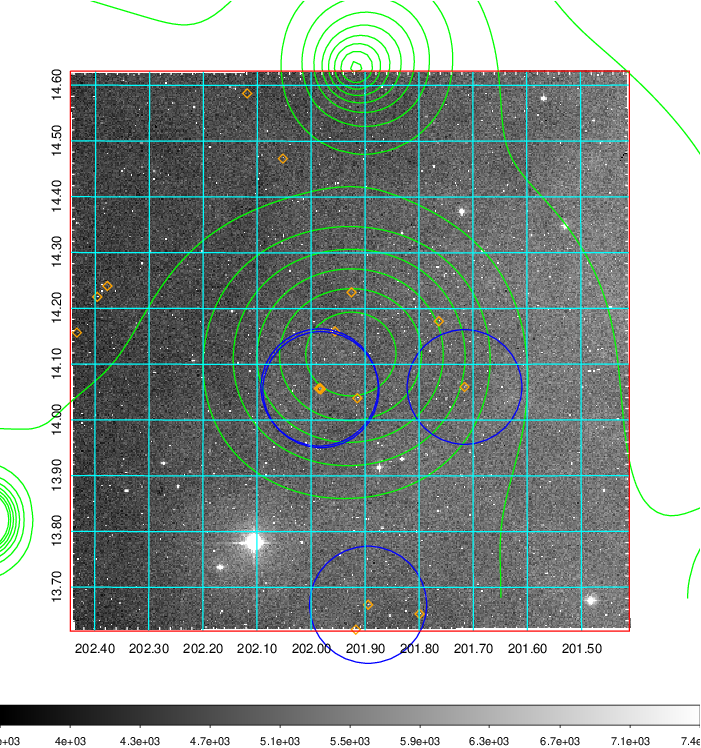  Blue circle for optical clusters;  Magenta circle for XSZ clusters;  all with r=1Mpc;  Only GC with Delta_z<0.01 are shown. | 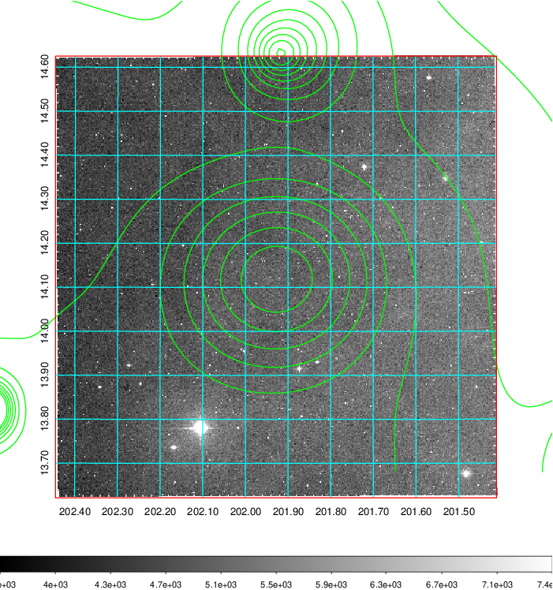 Blue circle for optical clusters;  Magenta circle for XSZ clusters;  all with r=1Mpc;  Only GC with Delta_z<0.01 are shown.  |

|[Previous-identified clusters](../image/504/504_gc.pdf) | [2MASS image](../image/504/504_2mass.pdf)      |[SDSS image](../image/504/504_sdss.pdf)   |
|-------------------|-------------------|-------------------|
|  Green, magenta, and blue circles  for optical, X-ray and SZ clusters  respectively, with redshift of clusters  labelled. The radius of circles  are 1Mpc.|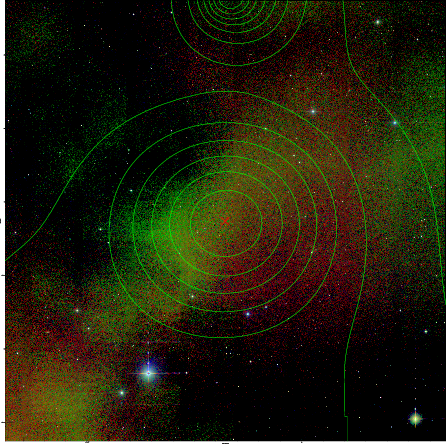  | 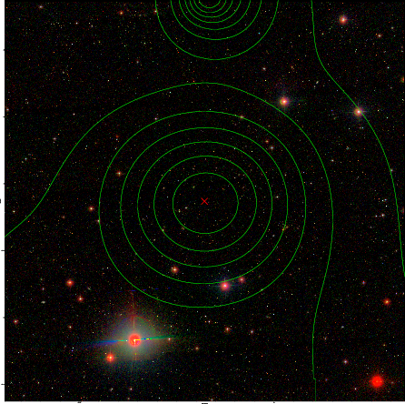  |

