

### 505

|Name|RAJ2000[deg]|DEJ2000[deg] |Ext[arcmin]| Ext,ml | z | z_src| C|GC(XSZ,Delta_z<0.01)| GC(OPT,Delta_z<0.01)|GC| R_sig[arcmin] | R500[arcmin] | R500[Mpc]| CRsig[c/s] | CR500[c/s] |L500[1E44 erg/s]|F500[1E-12 erg/s/cm^2]| M500[1E14 Msun]|Tx[keV]|Cnt_sig|Beta|Rc[arcmin]|Comment|Alias|
|---|---|---|---|---|---|------|---|--------|---------|----------|---|---|---|---|---|---|---|---|---|---|---|---|---|---|
|505| 201.981| -24.436| 24.98| 74.98| 0.0422(0.007)| z1,| G| -| -| N| 29.144| 14.205| 0.710| 0.357(0.088)| 0.329(0.081)| 0.227(0.077)| 5.447(1.839)| 1.06(0.18)| 2.25(0.25)| 183.5| 0.517(-0.013+0.031)| 8.315(-0.508+0.710)| -| t614|

|[RASS image](../image/505/505_img.pdf)|[filtered image](../image/505/505_fil.pdf)|[Segment image](../image/505/505_seg.pdf)|
|-------------------|--------------------|-------------------|
| 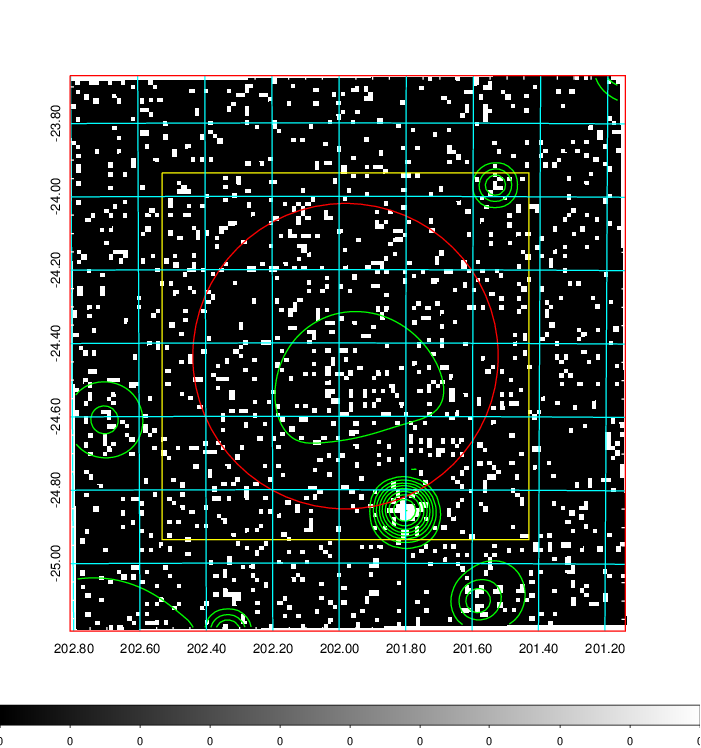  | 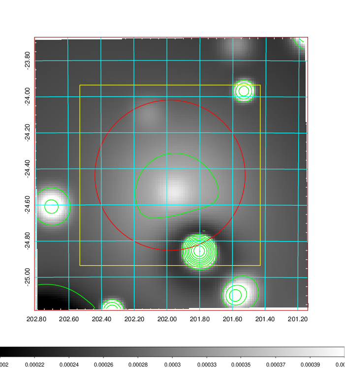   | 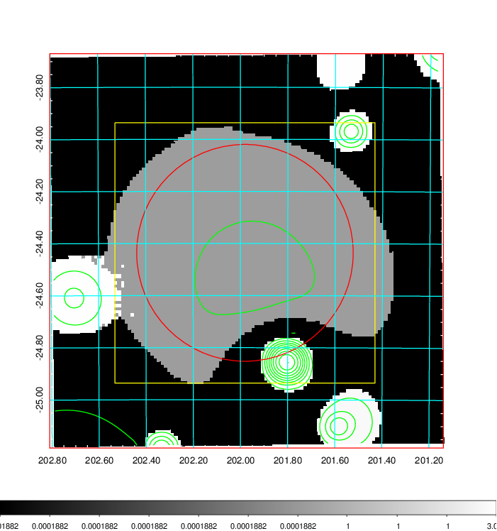  |

|[Exposure image](../image/505/505_mex.pdf)| [nH image](../image/505/505_nh.pdf)| [Planck image](../image/505/505_p.pdf)|
|-------------------|--------------------|-------------------|
|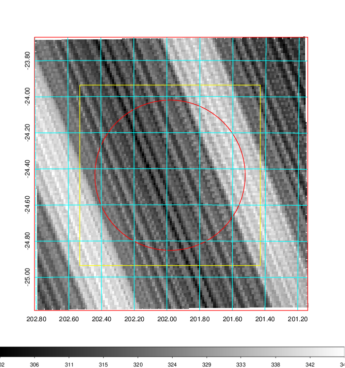   | 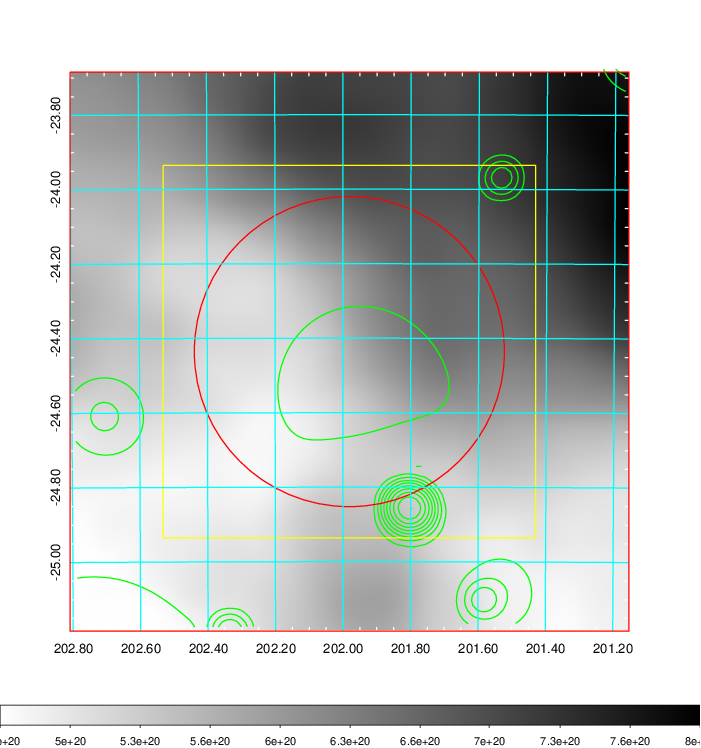    | 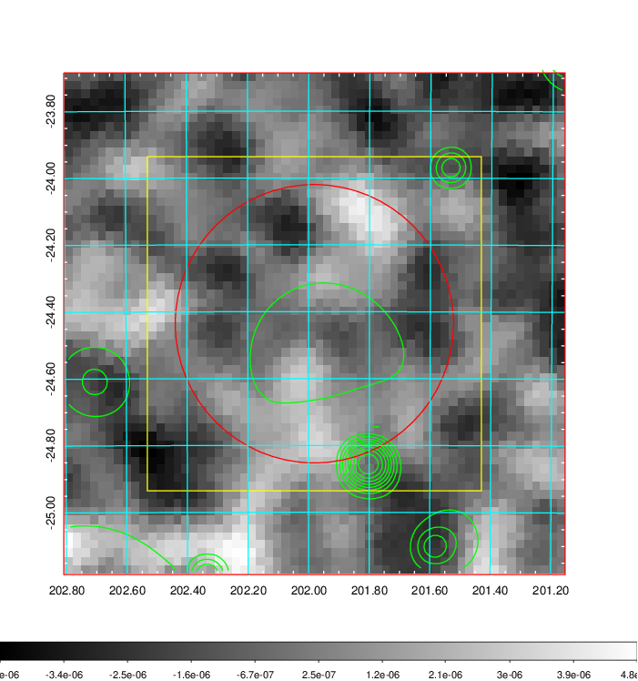 |

|[Redshift Histogram](../image/505/505_zg.pdf) | [DSS image(z1)](../image/505/505_dss_z1.pdf)      |  [DSS image(z2)](../image/505/505_dss_z2.pdf)    |
|-------------------|--------------------|-------------------|
|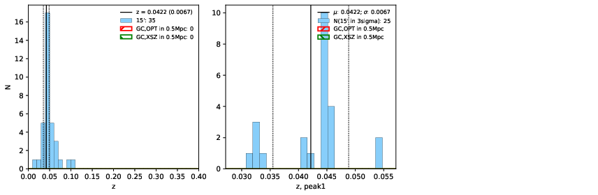 |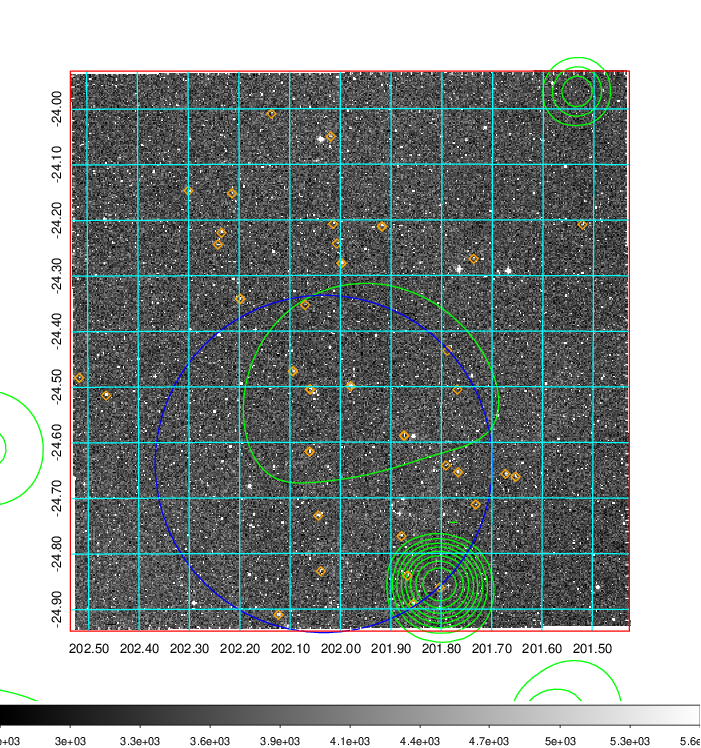  Blue circle for optical clusters;  Magenta circle for XSZ clusters;  all with r=1Mpc;  Only GC with Delta_z<0.01 are shown. | 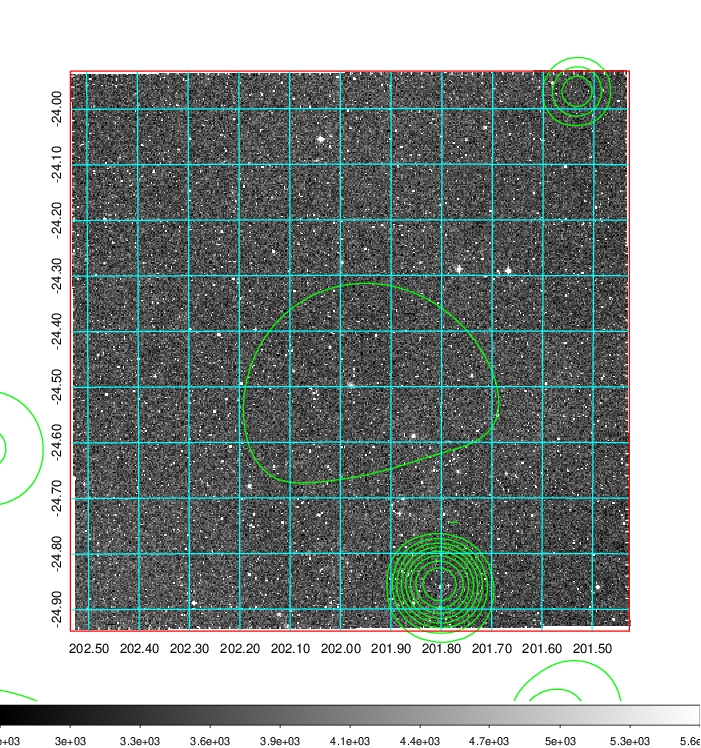 Blue circle for optical clusters;  Magenta circle for XSZ clusters;  all with r=1Mpc;  Only GC with Delta_z<0.01 are shown.  |

|[Previous-identified clusters](../image/505/505_gc.pdf) | [2MASS image](../image/505/505_2mass.pdf)      |
|-------------------|-------------------|
|  Green, magenta, and blue circles  for optical, X-ray and SZ clusters  respectively, with redshift of clusters  labelled. The radius of circles  are 1Mpc.|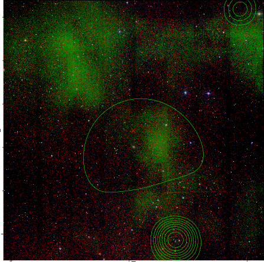  |

|[PS1 image](../image/505/505_ps1.pdf)            |
|-------------------|
| 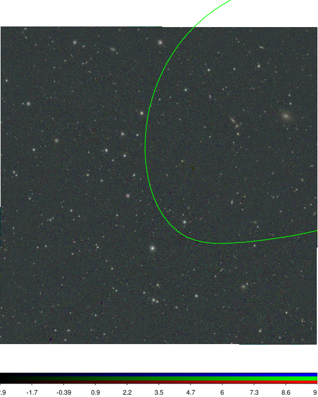  |
