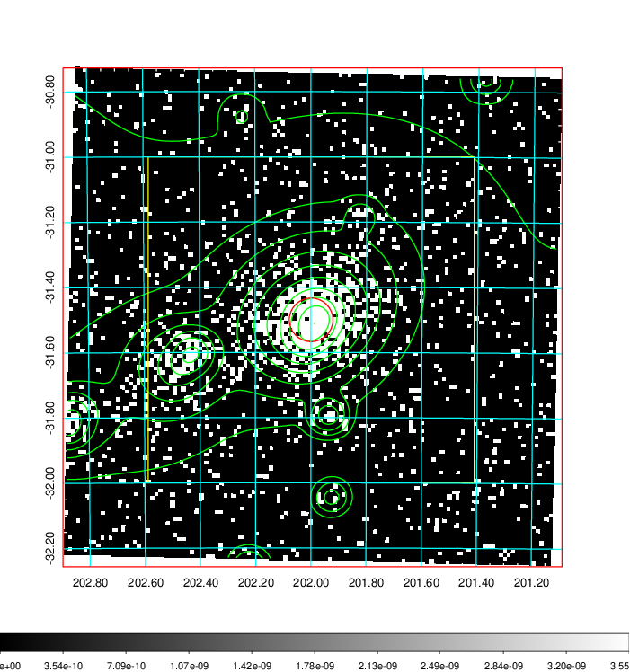
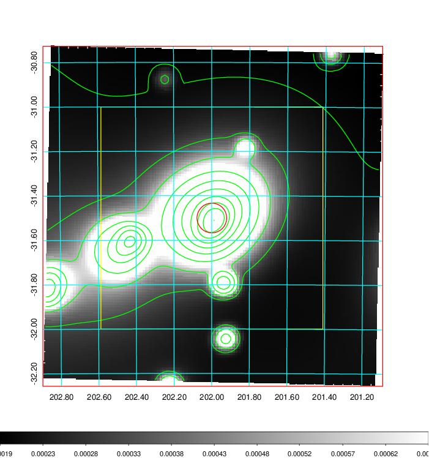
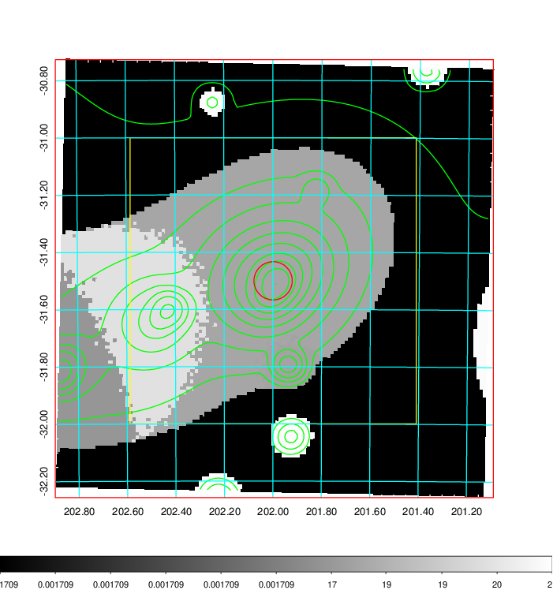
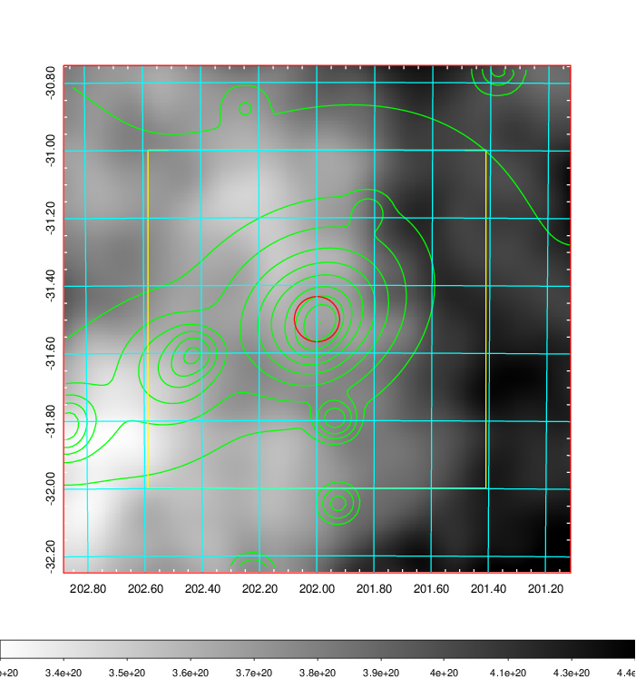
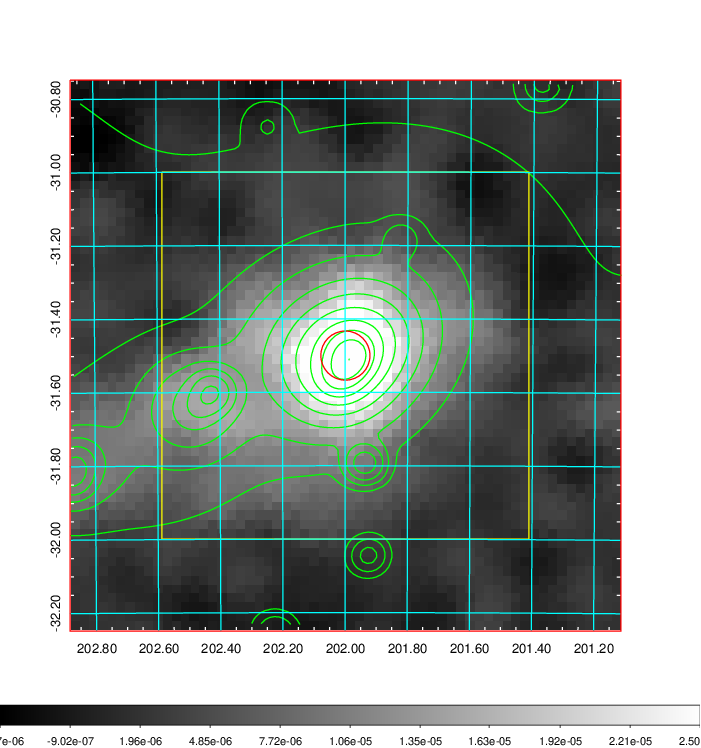
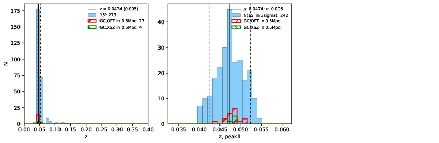
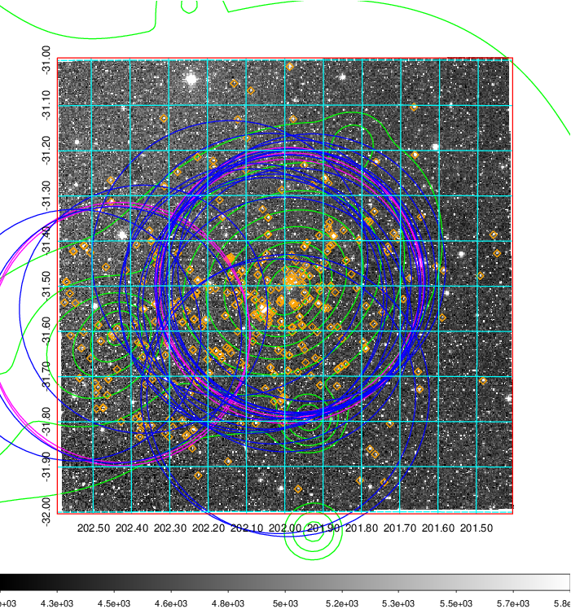
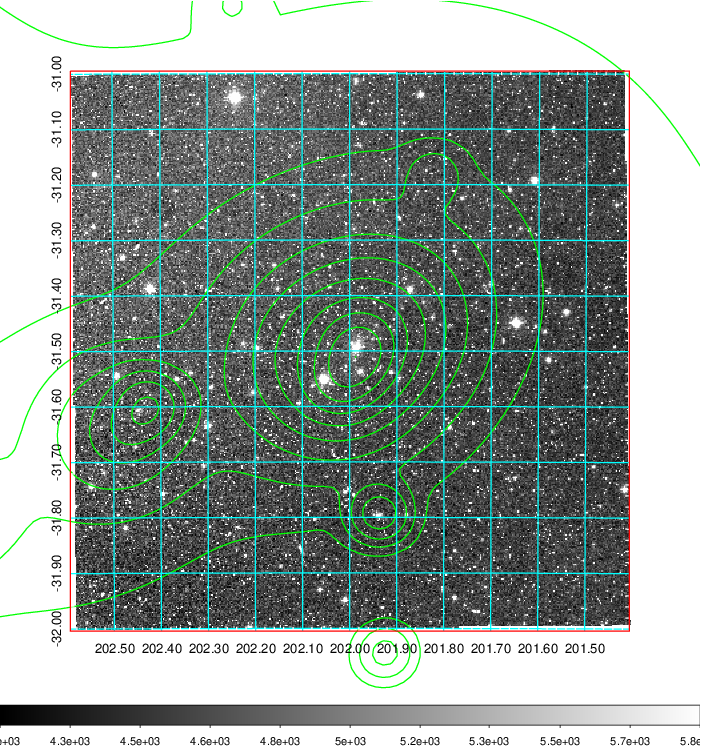
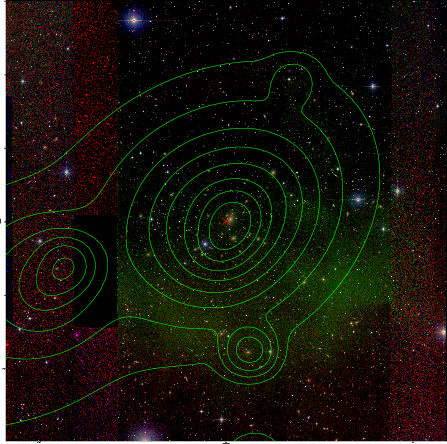

### 506

|Name|RAJ2000[deg]|DEJ2000[deg] |Ext[arcmin]| Ext,ml | z | z_src| C|GC(XSZ,Delta_z<0.01)| GC(OPT,Delta_z<0.01)|GC| R_sig[arcmin] | R500[arcmin] | R500[Mpc]| CRsig[c/s] | CR500[c/s] |L500[1E44 erg/s]|F500[1E-12 erg/s/cm^2]| M500[1E14 Msun]|Tx[keV]|Cnt_sig|Beta|Rc[arcmin]|Comment|Alias|
|---|---|---|---|---|---|------|---|--------|---------|----------|---|---|---|---|---|---|---|---|---|---|---|---|---|---|
|506| 201.999| -31.500| 4.02| 1408.60| 0.0474(0.005)| z1, z_xsz| B| MCXC, PSZ2, Tar, XB| A, N, W| A, MCXC, N, PSZ2, Tar, W, XB| 25.688| 21.036| 1.173| 3.063(0.134)| 2.974(0.130)| 2.947(0.050)| 55.674(0.945)| 4.80(0.04)| 5.72(0.03)| 961.8| 0.767(-0.029+0.033)| 5.837(-0.359+0.400)| -| k478|

|[RASS image](../image/506/506_img.pdf)|[filtered image](../image/506/506_fil.pdf)|[Segment image](../image/506/506_seg.pdf)|
|-------------------|--------------------|-------------------|
|   |    |   |

|[Exposure image](../image/506/506_mex.pdf)| [nH image](../image/506/506_nh.pdf)| [Planck image](../image/506/506_p.pdf)|
|-------------------|--------------------|-------------------|
|   |     |  |

|[Redshift Histogram](../image/506/506_zg.pdf) | [DSS image(z1)](../image/506/506_dss_z1.pdf)      |  [DSS image(z2)](../image/506/506_dss_z2.pdf)    |
|-------------------|--------------------|-------------------|
| |  Blue circle for optical clusters;  Magenta circle for XSZ clusters;  all with r=1Mpc;  Only GC with Delta_z<0.01 are shown. |  Blue circle for optical clusters;  Magenta circle for XSZ clusters;  all with r=1Mpc;  Only GC with Delta_z<0.01 are shown.  |

|[Previous-identified clusters](../image/506/506_gc.pdf) | [2MASS image](../image/506/506_2mass.pdf)      |
|-------------------|-------------------|
|  Green, magenta, and blue circles  for optical, X-ray and SZ clusters  respectively, with redshift of clusters  labelled. The radius of circles  are 1Mpc.|  |

