

### 507

|Name|RAJ2000[deg]|DEJ2000[deg] |Ext[arcmin]| Ext,ml | z | z_src| C|GC(XSZ,Delta_z<0.01)| GC(OPT,Delta_z<0.01)|GC| R_sig[arcmin] | R500[arcmin] | R500[Mpc]| CRsig[c/s] | CR500[c/s] |L500[1E44 erg/s]|F500[1E-12 erg/s/cm^2]| M500[1E14 Msun]|Tx[keV]|Cnt_sig|Beta|Rc[arcmin]|Comment|Alias|
|---|---|---|---|---|---|------|---|--------|---------|----------|---|---|---|---|---|---|---|---|---|---|---|---|---|---|
|507| 202.237| -28.041| 22.48| 89.78| 0.0339(0.005)| z1, z_opt| S| -| N| N, Tar| 11.238| 12.979| 0.526| 0.133(0.045)| 0.136(0.046)| 0.050(0.010)| 1.902(0.370)| 0.43(0.04)| 1.28(0.08)| 58.7| 0.730(-0.167+0.203)| 10.532(-2.387+2.520)| An SZ cluster with no $z$ and offset = 0.36 Mpc| t597|

|[RASS image](../image/507/507_img.pdf)|[filtered image](../image/507/507_fil.pdf)|[Segment image](../image/507/507_seg.pdf)|
|-------------------|--------------------|-------------------|
| 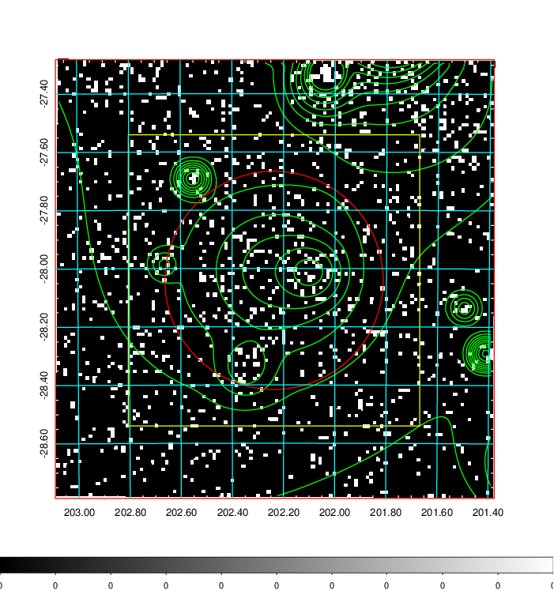  | 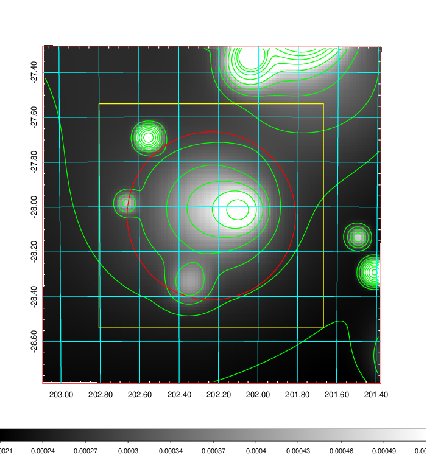   | 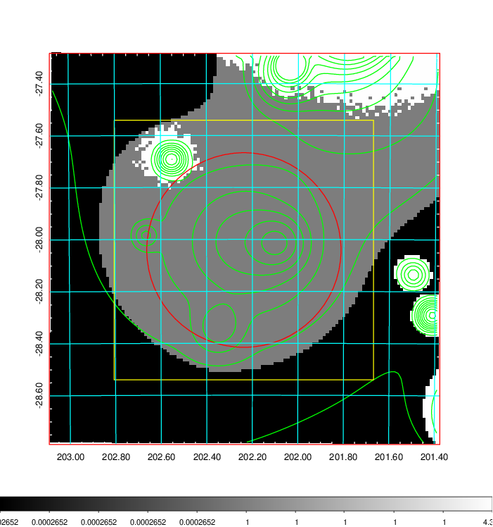  |

|[Exposure image](../image/507/507_mex.pdf)| [nH image](../image/507/507_nh.pdf)| [Planck image](../image/507/507_p.pdf)|
|-------------------|--------------------|-------------------|
|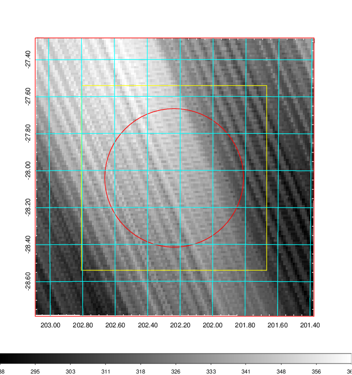   | 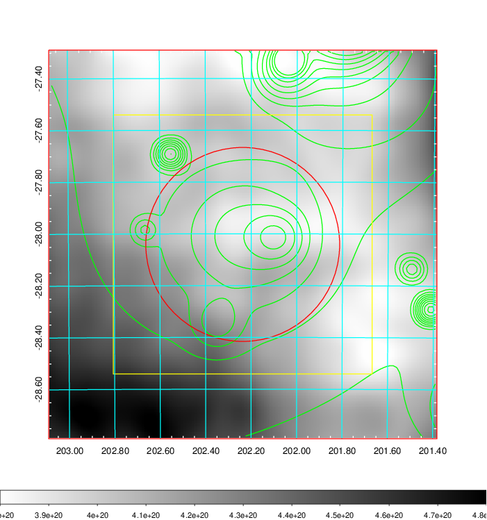    | 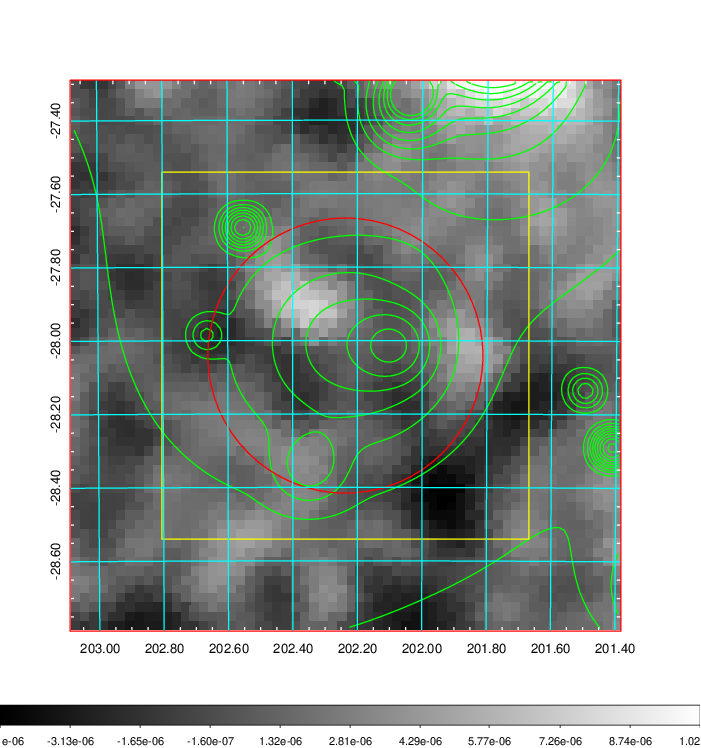 |

|[Redshift Histogram](../image/507/507_zg.pdf) | [DSS image(z1)](../image/507/507_dss_z1.pdf)      |  [DSS image(z2)](../image/507/507_dss_z2.pdf)    |
|-------------------|--------------------|-------------------|
|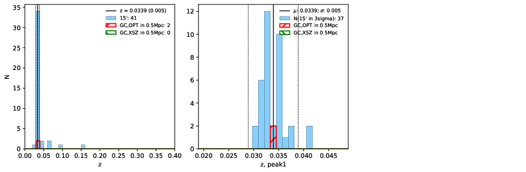 |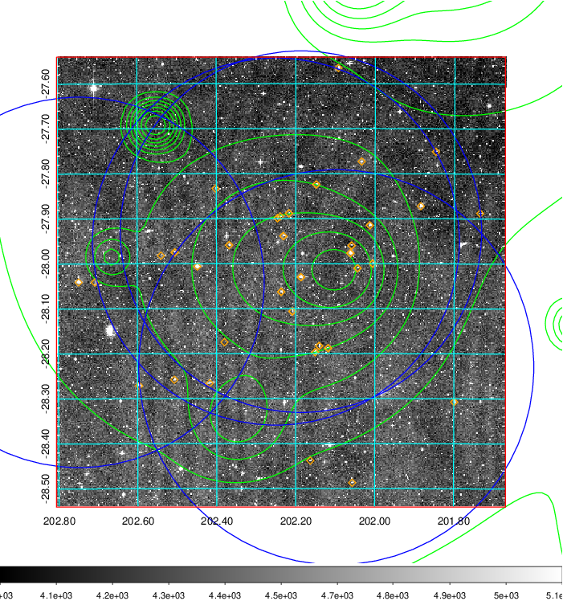  Blue circle for optical clusters;  Magenta circle for XSZ clusters;  all with r=1Mpc;  Only GC with Delta_z<0.01 are shown. | 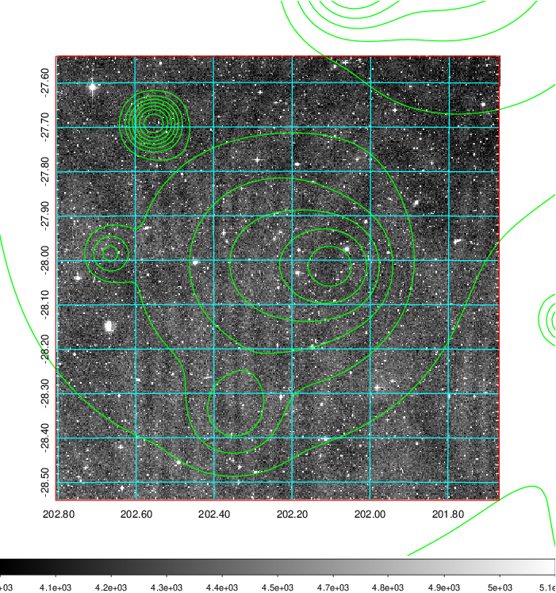 Blue circle for optical clusters;  Magenta circle for XSZ clusters;  all with r=1Mpc;  Only GC with Delta_z<0.01 are shown.  |

|[Previous-identified clusters](../image/507/507_gc.pdf) | [2MASS image](../image/507/507_2mass.pdf)      |
|-------------------|-------------------|
|  Green, magenta, and blue circles  for optical, X-ray and SZ clusters  respectively, with redshift of clusters  labelled. The radius of circles  are 1Mpc.|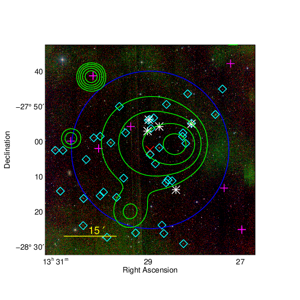  |

|[PS1 image](../image/507/507_ps1.pdf)            |
|-------------------|
| 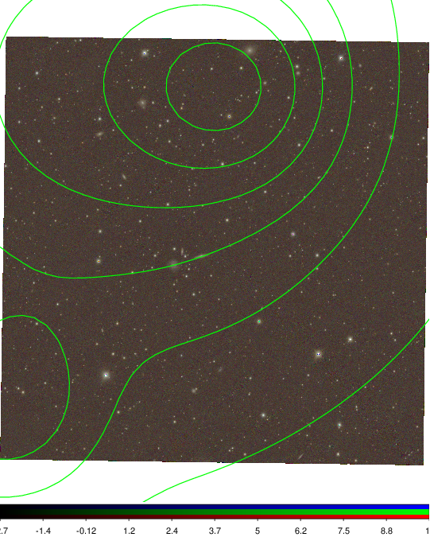  |
