

### 508

|Name|RAJ2000[deg]|DEJ2000[deg] |Ext[arcmin]| Ext,ml | z | z_src| C|GC(XSZ,Delta_z<0.01)| GC(OPT,Delta_z<0.01)|GC| R_sig[arcmin] | R500[arcmin] | R500[Mpc]| CRsig[c/s] | CR500[c/s] |L500[1E44 erg/s]|F500[1E-12 erg/s/cm^2]| M500[1E14 Msun]|Tx[keV]|Cnt_sig|Beta|Rc[arcmin]|Comment|Alias|
|---|---|---|---|---|---|------|---|--------|---------|----------|---|---|---|---|---|---|---|---|---|---|---|---|---|---|
|508| 202.419| 11.779| 6.38| 64.27| 0.0230(0.005)| z1, z_xsz| B| MCXC| N| F20, MCXC, N, W| 14.331| 19.508| 0.544| 0.323(0.077)| 0.343(0.081)| 0.064(0.011)| 5.347(0.886)| 0.47(0.04)| 1.35(0.07)| 119.1| 0.907(-0.099+0.066)| 8.584(-1.190+0.865)| -| k549|

|[RASS image](../image/508/508_img.pdf)|[filtered image](../image/508/508_fil.pdf)|[Segment image](../image/508/508_seg.pdf)|
|-------------------|--------------------|-------------------|
| 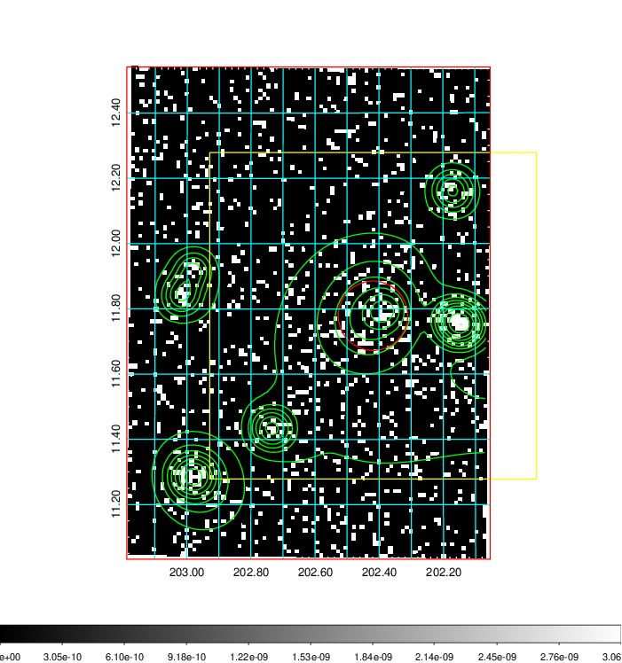  | 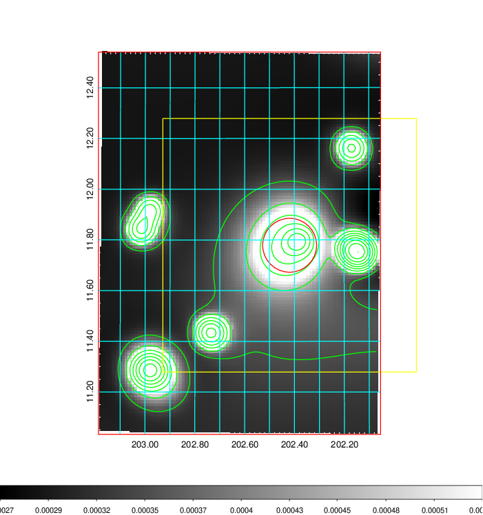   | 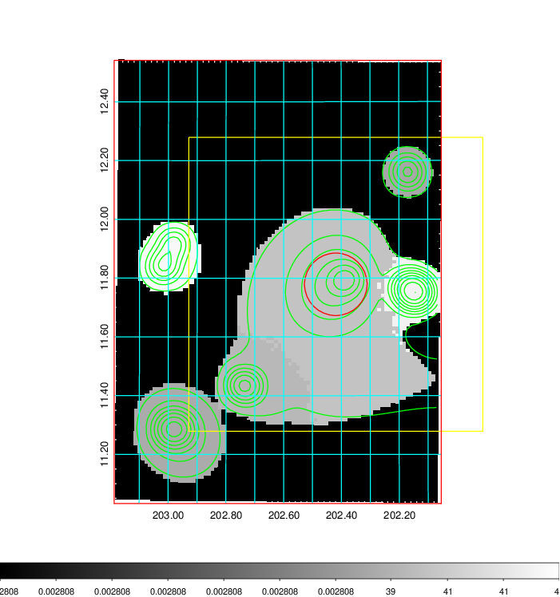  |

|[Exposure image](../image/508/508_mex.pdf)| [nH image](../image/508/508_nh.pdf)| [Planck image](../image/508/508_p.pdf)|
|-------------------|--------------------|-------------------|
|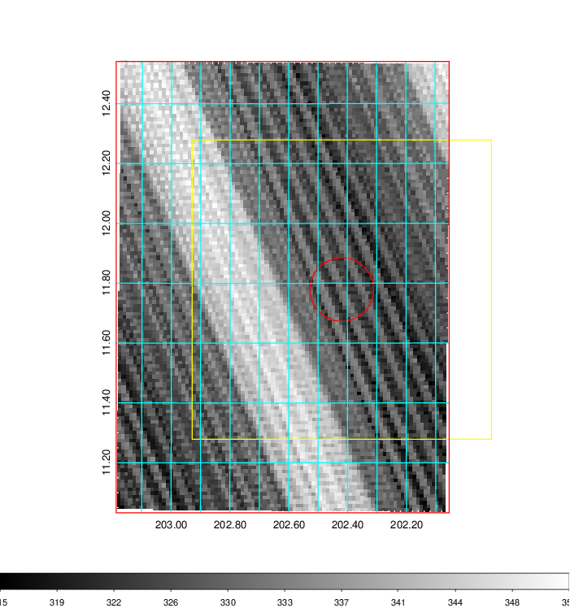   | 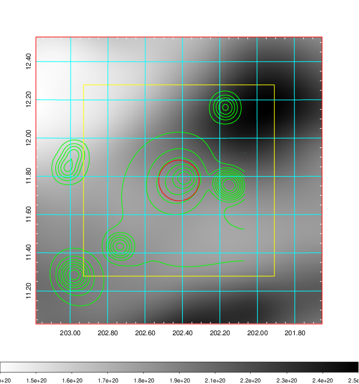    | 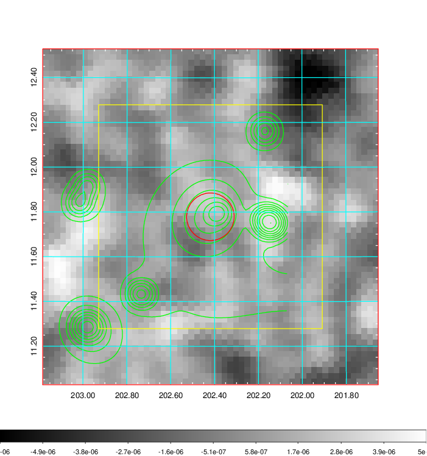 |

|[Redshift Histogram](../image/508/508_zg.pdf) | [DSS image(z1)](../image/508/508_dss_z1.pdf)      |  [DSS image(z2)](../image/508/508_dss_z2.pdf)    |
|-------------------|--------------------|-------------------|
|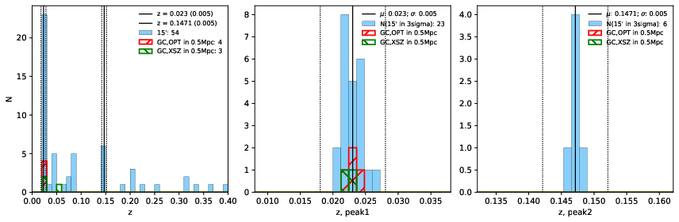 |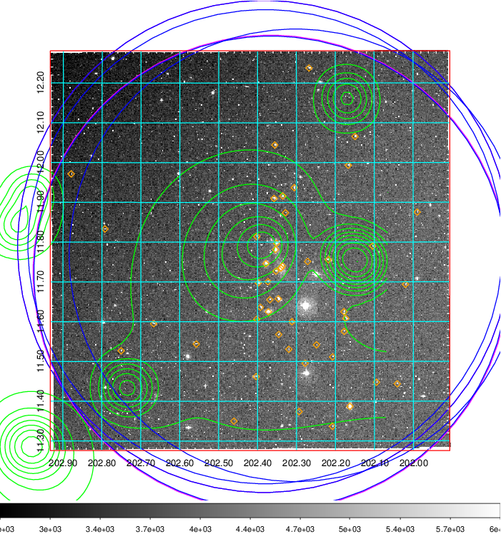  Blue circle for optical clusters;  Magenta circle for XSZ clusters;  all with r=1Mpc;  Only GC with Delta_z<0.01 are shown. | 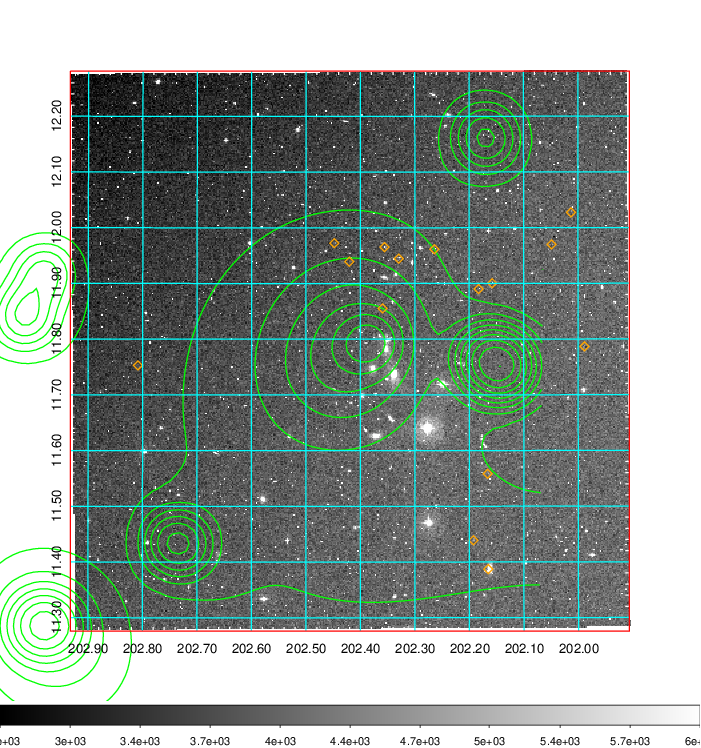 Blue circle for optical clusters;  Magenta circle for XSZ clusters;  all with r=1Mpc;  Only GC with Delta_z<0.01 are shown.  |

|[Previous-identified clusters](../image/508/508_gc.pdf) | [2MASS image](../image/508/508_2mass.pdf)      |[SDSS image](../image/508/508_sdss.pdf)   |
|-------------------|-------------------|-------------------|
|  Green, magenta, and blue circles  for optical, X-ray and SZ clusters  respectively, with redshift of clusters  labelled. The radius of circles  are 1Mpc.|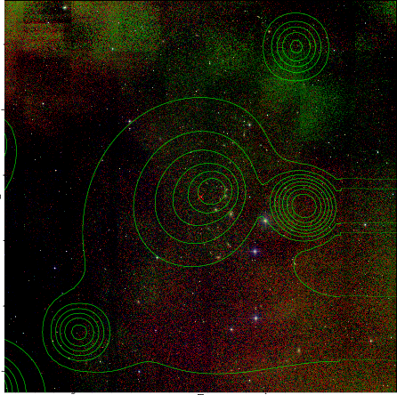  | 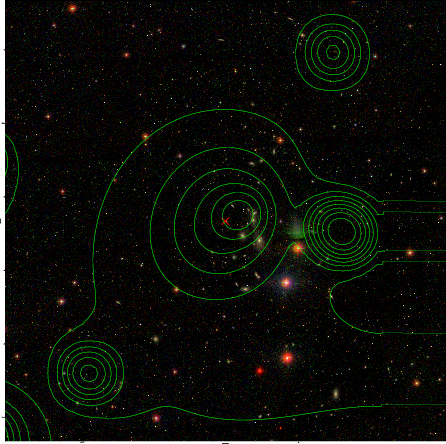  |

