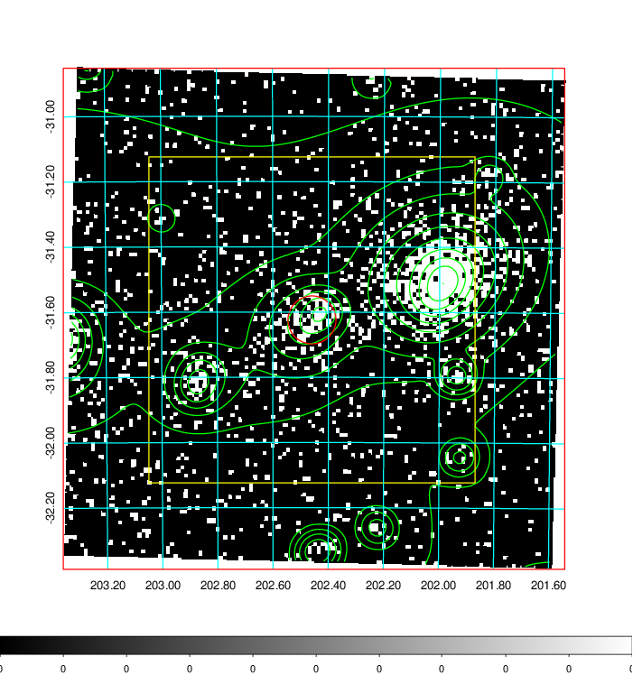
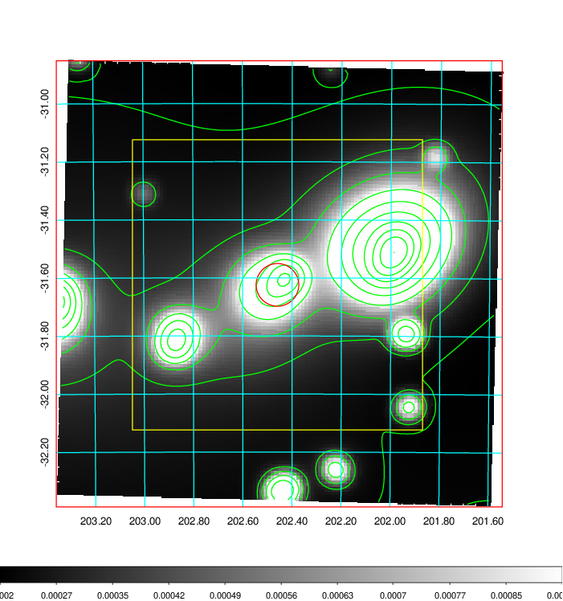
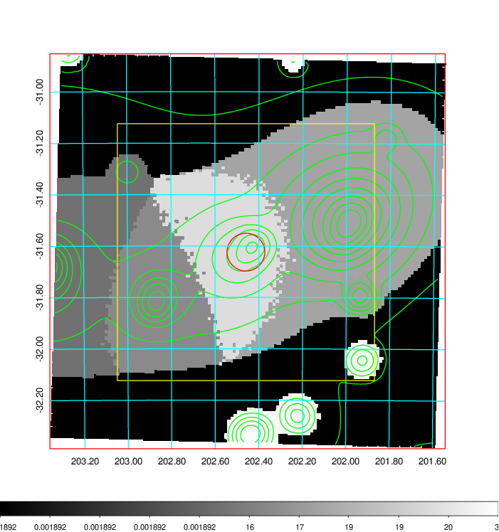
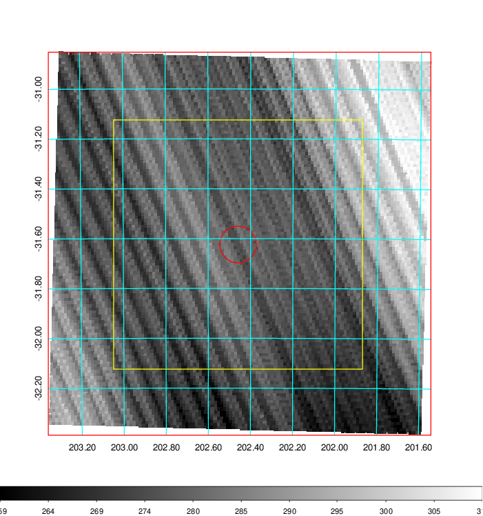
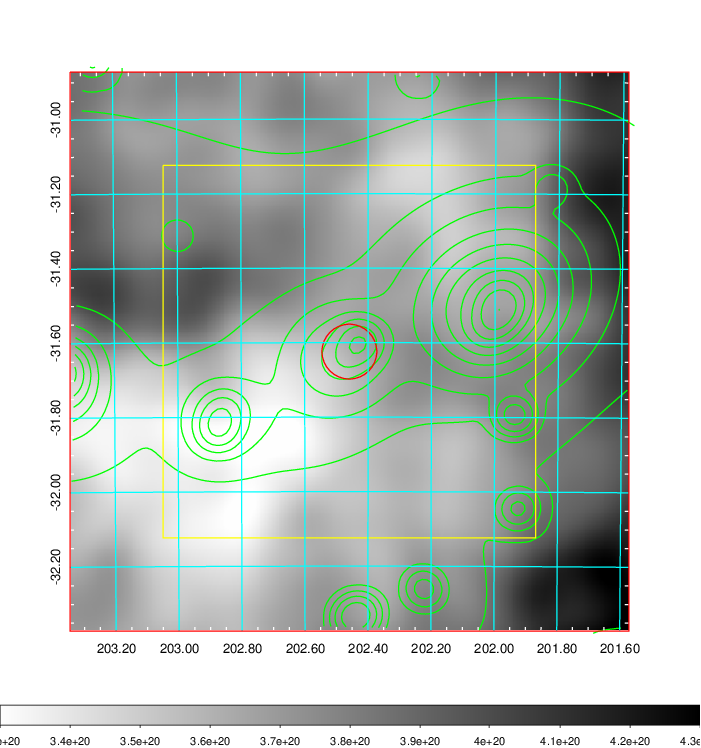
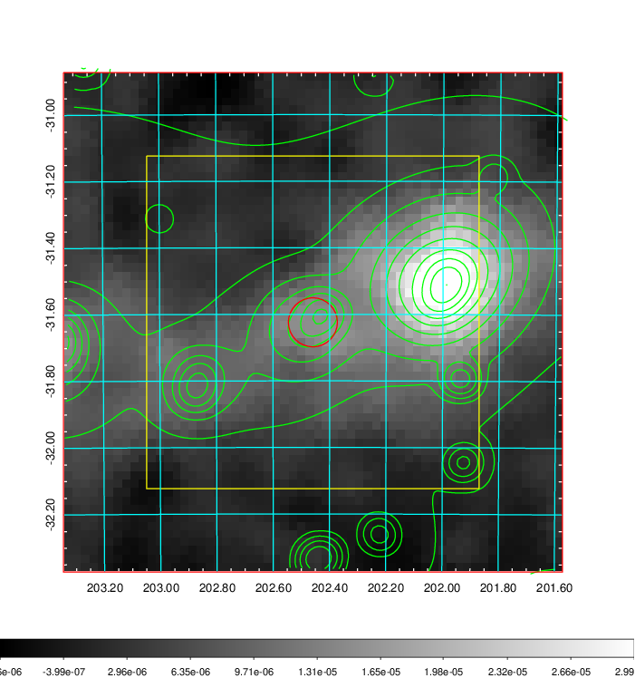
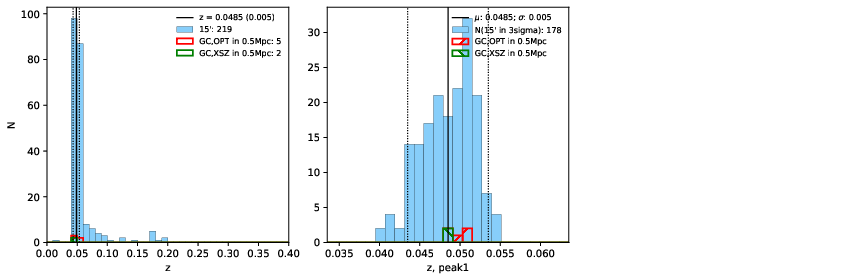
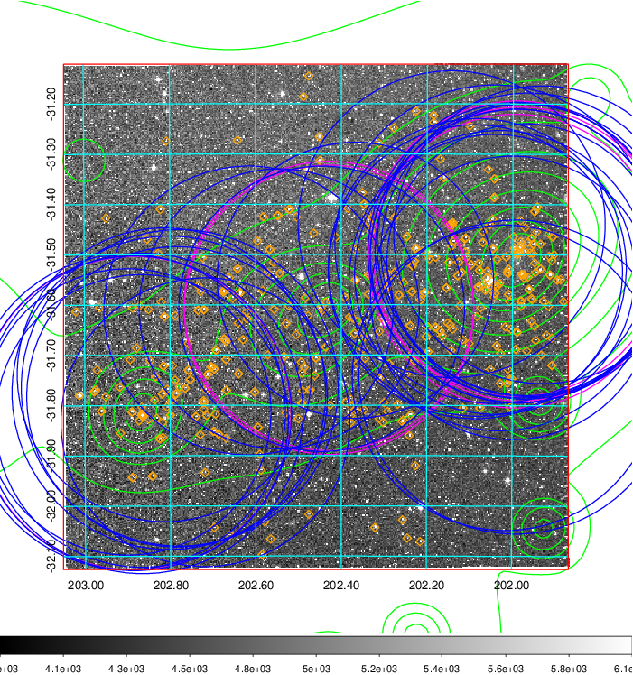
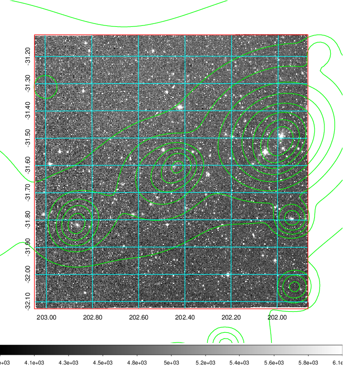
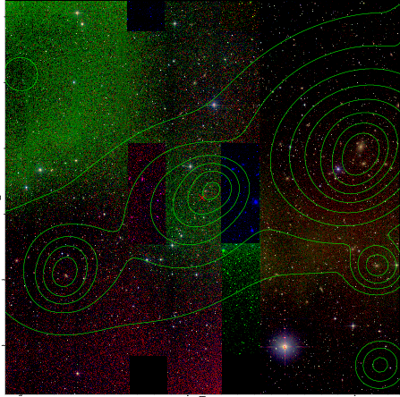

### 509

|Name|RAJ2000[deg]|DEJ2000[deg] |Ext[arcmin]| Ext,ml | z | z_src| C|GC(XSZ,Delta_z<0.01)| GC(OPT,Delta_z<0.01)|GC| R_sig[arcmin] | R500[arcmin] | R500[Mpc]| CRsig[c/s] | CR500[c/s] |L500[1E44 erg/s]|F500[1E-12 erg/s/cm^2]| M500[1E14 Msun]|Tx[keV]|Cnt_sig|Beta|Rc[arcmin]|Comment|Alias|
|---|---|---|---|---|---|------|---|--------|---------|----------|---|---|---|---|---|---|---|---|---|---|---|---|---|---|
|509| 202.459| -31.624| 4.41| 130.29| 0.0485(0.005)| z1, z_xsz| B| MCXC, Tar| A, N, W| A, MCXC, N, Tar, W| 26.675| 17.459| 0.995| 1.371(0.122)| 1.297(0.115)| 1.340(0.086)| 24.136(1.550)| 2.93(0.09)| 4.22(0.09)| 867.8| 0.504(-0.003+0.006)| 5.295(-0.258+0.288)| -| k503|

|[RASS image](../image/509/509_img.pdf)|[filtered image](../image/509/509_fil.pdf)|[Segment image](../image/509/509_seg.pdf)|
|-------------------|--------------------|-------------------|
|   |    |   |

|[Exposure image](../image/509/509_mex.pdf)| [nH image](../image/509/509_nh.pdf)| [Planck image](../image/509/509_p.pdf)|
|-------------------|--------------------|-------------------|
|   |     |  |

|[Redshift Histogram](../image/509/509_zg.pdf) | [DSS image(z1)](../image/509/509_dss_z1.pdf)      |  [DSS image(z2)](../image/509/509_dss_z2.pdf)    |
|-------------------|--------------------|-------------------|
| |  Blue circle for optical clusters;  Magenta circle for XSZ clusters;  all with r=1Mpc;  Only GC with Delta_z<0.01 are shown. |  Blue circle for optical clusters;  Magenta circle for XSZ clusters;  all with r=1Mpc;  Only GC with Delta_z<0.01 are shown.  |

|[known Abell/XSZ clusters](../image/509/509_gc.pdf) | [2MASS image](../image/509/509_2mass.pdf)      |
|-------------------|-------------------|
|  Magenta, blue and green circles  for optical, X-ray and SZ clusters  respectively, with redshift of clusters  labelled. The radius of circles  are 1Mpc.|  |

