

### 51

|Name|RAJ2000[deg]|DEJ2000[deg] |Ext[arcmin]| Ext,ml | z | z_src| C|GC(XSZ,Delta_z<0.01)| GC(OPT,Delta_z<0.01)|GC| R_sig[arcmin] | R500[arcmin] | R500[Mpc]| CRsig[c/s] | CR500[c/s] |L500[1E44 erg/s]|F500[1E-12 erg/s/cm^2]| M500[1E14 Msun]|Tx[keV]|Cnt_sig|Beta|Rc[arcmin]|Comment|Alias|
|---|---|---|---|---|---|------|---|--------|---------|----------|---|---|---|---|---|---|---|---|---|---|---|---|---|---|
|51| 16.400| -24.648| 1.89| 46.48| 0.2300(0.000)| z_xsz| B| MCXC, PSZ2, Tar, XB| A| A, MCXC, PSZ2, Tar, W, XB| 5.875| 5.447| 1.201| 0.193(0.040)| 0.191(0.039)| 6.130(0.547)| 3.897(0.348)| 6.20(0.26)| 7.12(0.19)| 62.1| 0.952(-0.068+0.035)| 4.207(-0.401+0.353)| -| k192|

|[RASS image](../image/51/51_img.pdf)|[filtered image](../image/51/51_fil.pdf)|[Segment image](../image/51/51_seg.pdf)|
|-------------------|--------------------|-------------------|
| 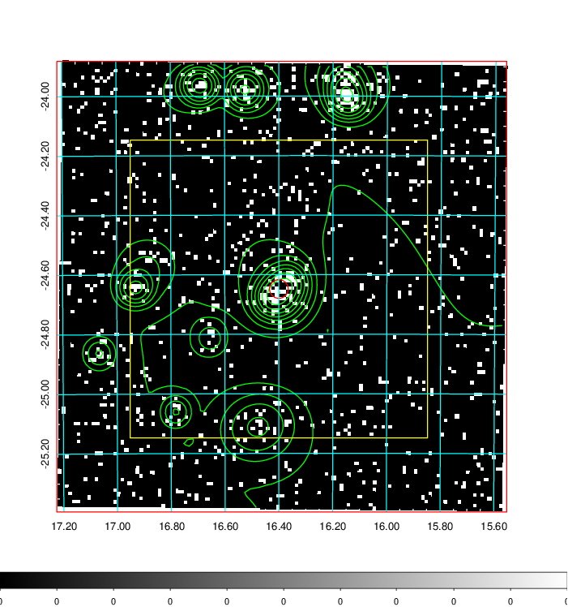  | 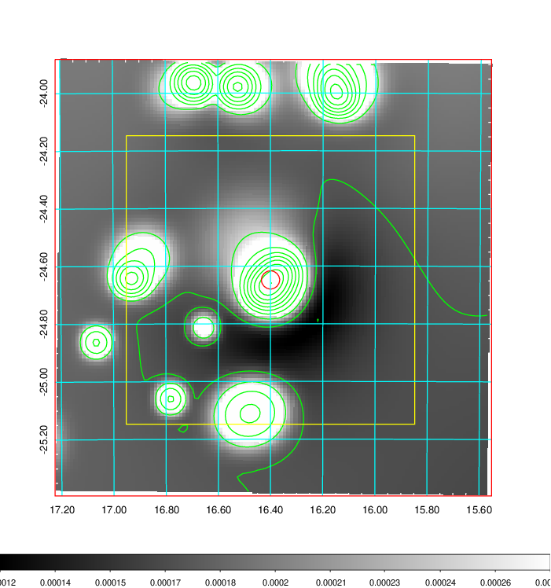   | 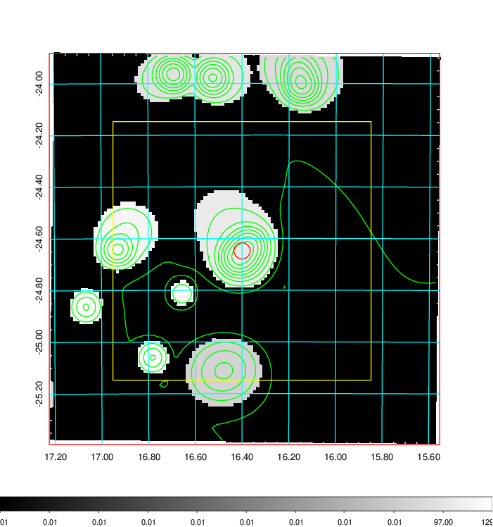  |

|[Exposure image](../image/51/51_mex.pdf)| [nH image](../image/51/51_nh.pdf)| [Planck image](../image/51/51_p.pdf)|
|-------------------|--------------------|-------------------|
|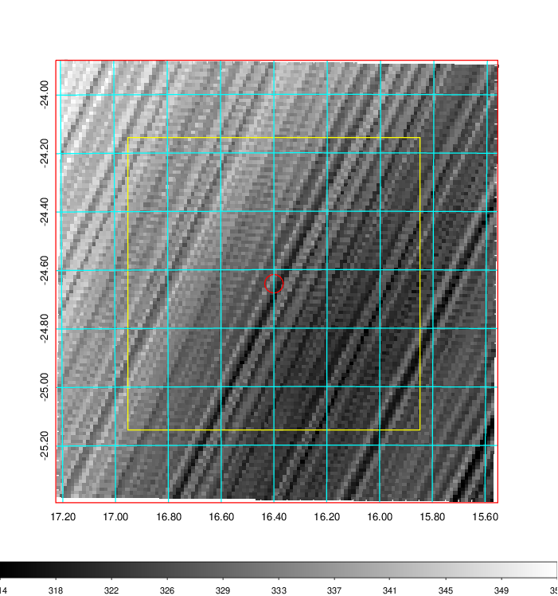   | 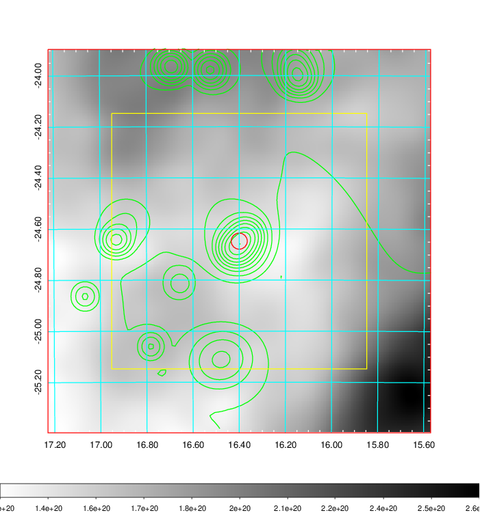    | 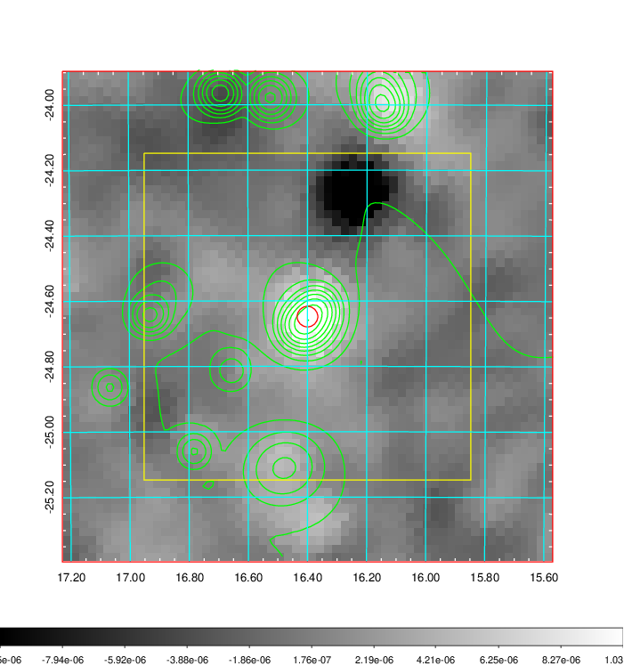 |

|[Redshift Histogram](../image/51/51_zg.pdf) | [DSS image(z1)](../image/51/51_dss_z1.pdf)      |  [DSS image(z2)](../image/51/51_dss_z2.pdf)    |
|-------------------|--------------------|-------------------|
|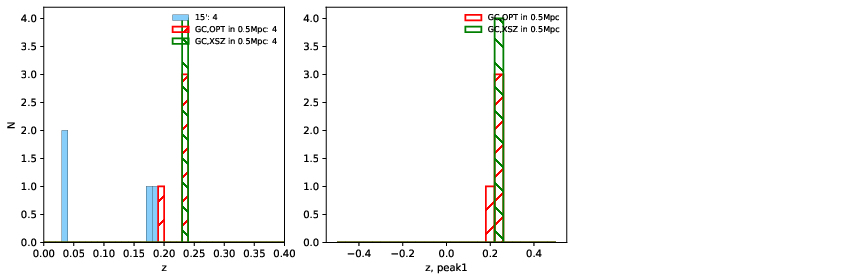 |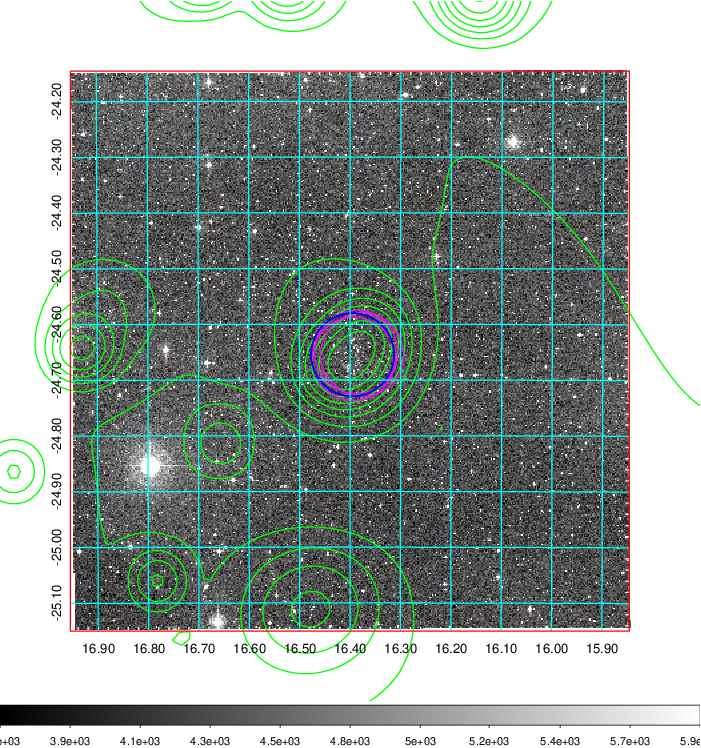  Blue circle for optical clusters;  Magenta circle for XSZ clusters;  all with r=1Mpc;  Only GC with Delta_z<0.01 are shown. | 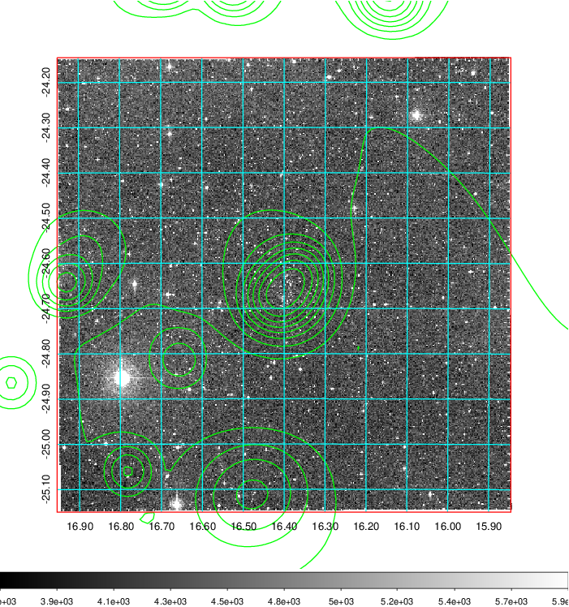 Blue circle for optical clusters;  Magenta circle for XSZ clusters;  all with r=1Mpc;  Only GC with Delta_z<0.01 are shown.  |

|[Previous-identified clusters](../image/51/51_gc.pdf) | [2MASS image](../image/51/51_2mass.pdf)      |
|-------------------|-------------------|
|  Green, magenta, and blue circles  for optical, X-ray and SZ clusters  respectively, with redshift of clusters  labelled. The radius of circles  are 1Mpc.|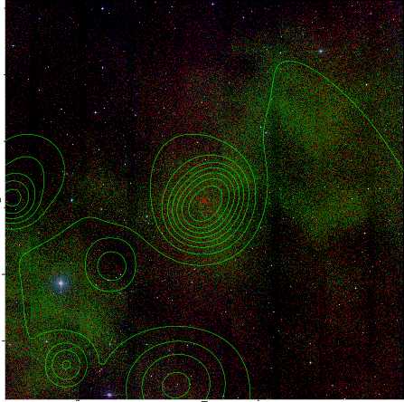  |

|[DES image](../image/51/51_des.pdf)   |[ATLAS image](../image/51/51_s.pdf)        |
|-------------------|-------------------|
| 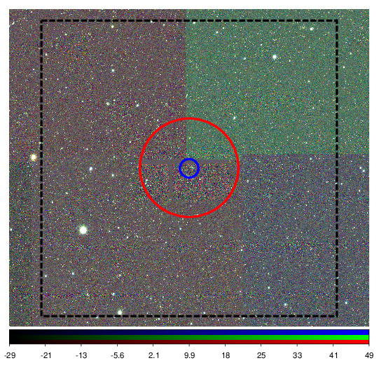  | 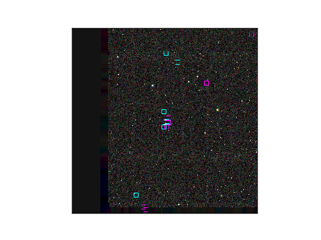  |
