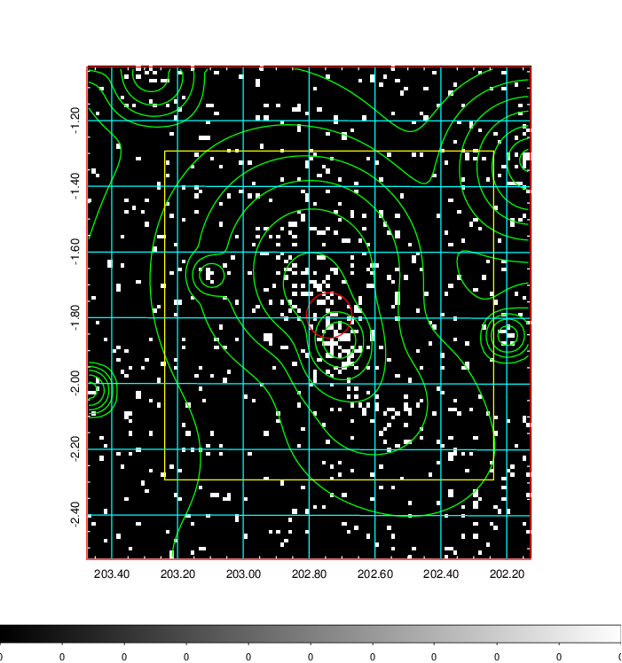
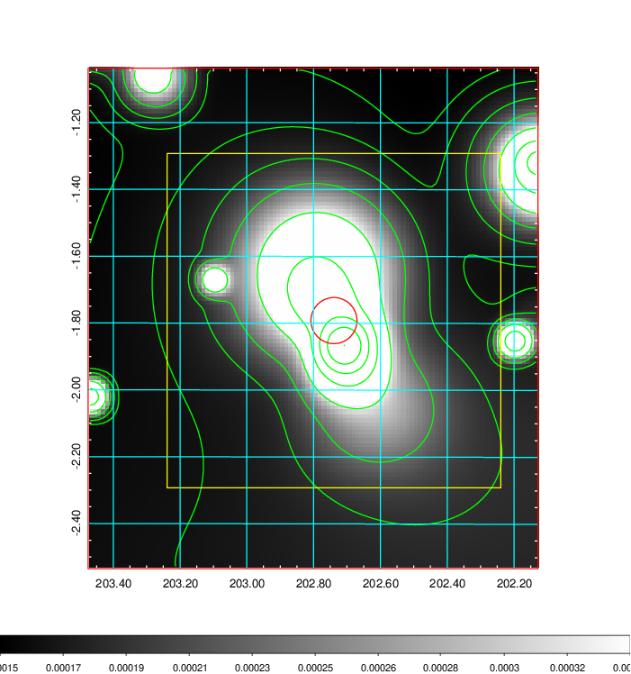
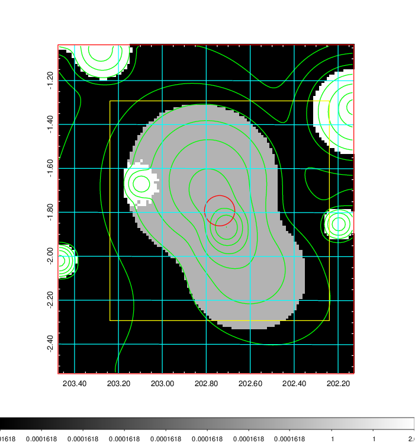
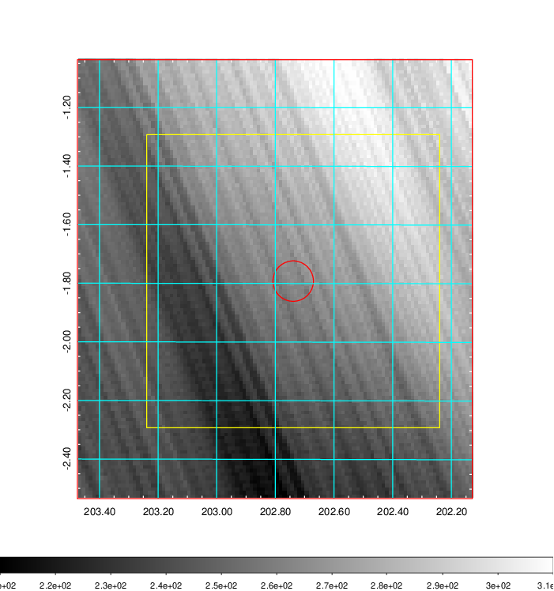
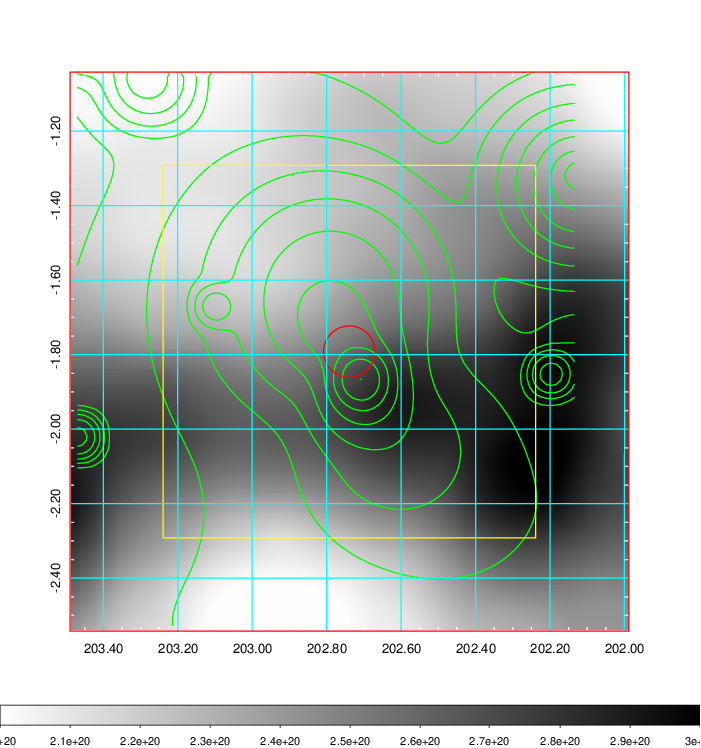
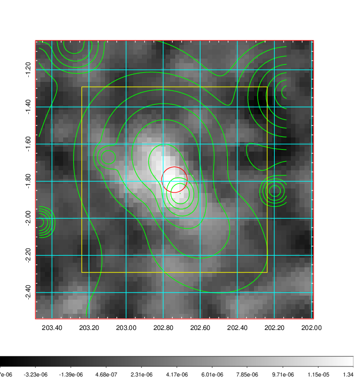
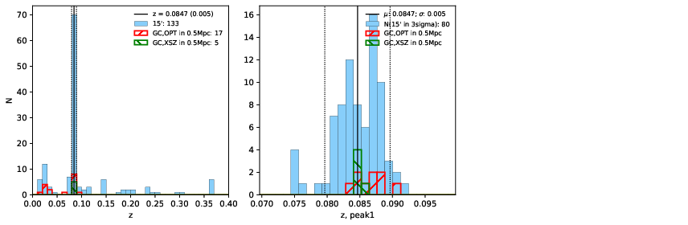
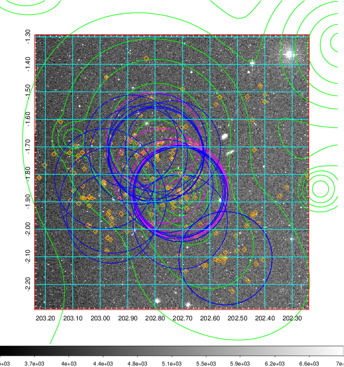
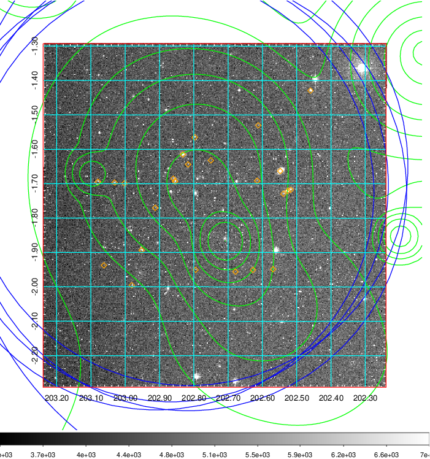
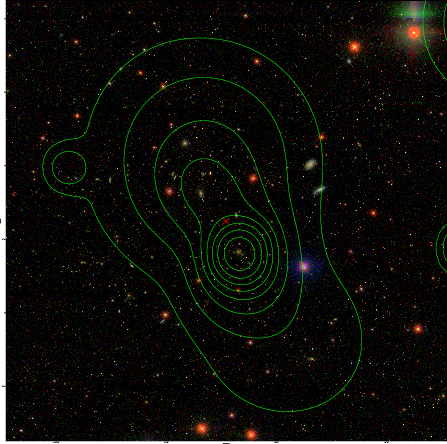

### 510

|Name|RAJ2000[deg]|DEJ2000[deg] |Ext[arcmin]| Ext,ml | z | z_src| C|GC(XSZ,Delta_z<0.01)| GC(OPT,Delta_z<0.01)|GC| R_sig[arcmin] | R500[arcmin] | R500[Mpc]| CRsig[c/s] | CR500[c/s] |L500[1E44 erg/s]|F500[1E-12 erg/s/cm^2]| M500[1E14 Msun]|Tx[keV]|Cnt_sig|Beta|Rc[arcmin]|Comment|Alias|
|---|---|---|---|---|---|------|---|--------|---------|----------|---|---|---|---|---|---|---|---|---|---|---|---|---|---|
|510| 202.739| -1.792| 4.14| 83.05| 0.0847(0.005)| z1, z_xsz| B| L03, PSZ2, Tar, XB| N, RM, W| A, C, F20, L03, MCXC, N, PSZ2, Tar, W, XB, XCS| 23.219| 10.434| 0.995| 0.496(0.082)| 0.454(0.075)| 1.551(0.211)| 8.705(1.187)| 3.04(0.21)| 4.37(0.19)| 171.8| 0.890(-0.105+0.077)| 10.604(-1.520+1.099)| -| k487|

|[RASS image](../image/510/510_img.pdf)|[filtered image](../image/510/510_fil.pdf)|[Segment image](../image/510/510_seg.pdf)|
|-------------------|--------------------|-------------------|
|   |    |   |

|[Exposure image](../image/510/510_mex.pdf)| [nH image](../image/510/510_nh.pdf)| [Planck image](../image/510/510_p.pdf)|
|-------------------|--------------------|-------------------|
|   |     |  |

|[Redshift Histogram](../image/510/510_zg.pdf) | [DSS image(z1)](../image/510/510_dss_z1.pdf)      |  [DSS image(z2)](../image/510/510_dss_z2.pdf)    |
|-------------------|--------------------|-------------------|
| |  Blue circle for optical clusters;  Magenta circle for XSZ clusters;  all with r=1Mpc;  Only GC with Delta_z<0.01 are shown. |  Blue circle for optical clusters;  Magenta circle for XSZ clusters;  all with r=1Mpc;  Only GC with Delta_z<0.01 are shown.  |

|[known Abell/XSZ clusters](../image/510/510_gc.pdf) | [2MASS image](../image/510/510_2mass.pdf)      |[SDSS image](../image/510/510_sdss.pdf)   |
|-------------------|-------------------|-------------------|
|  Magenta, blue and green circles  for optical, X-ray and SZ clusters  respectively, with redshift of clusters  labelled. The radius of circles  are 1Mpc.|  |   |

