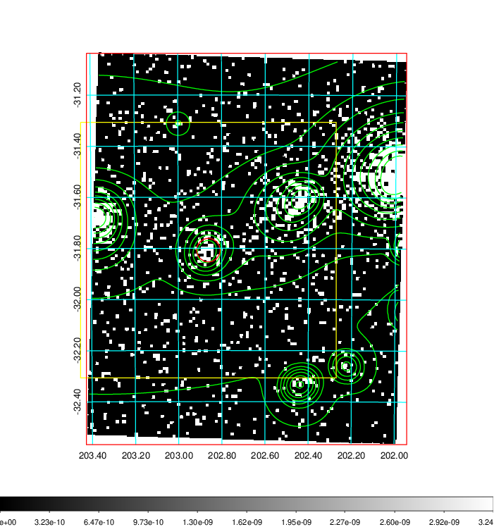
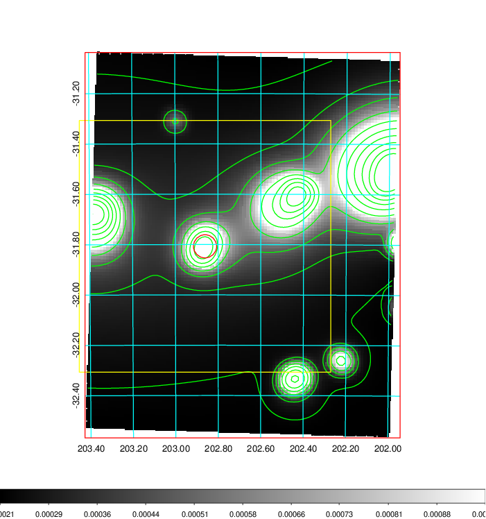
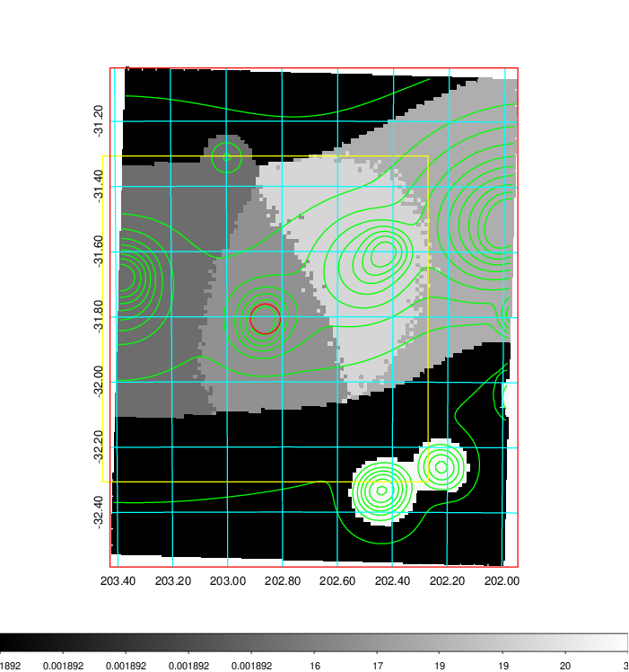
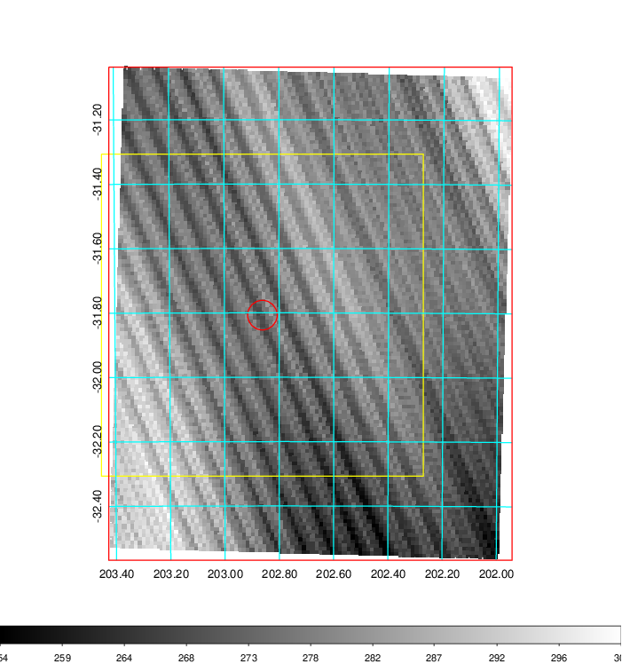
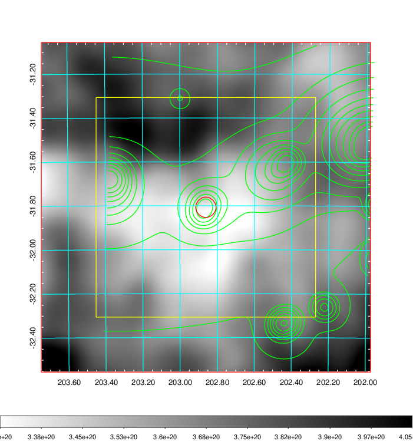
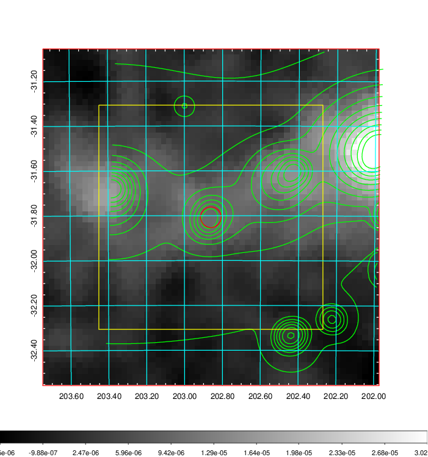
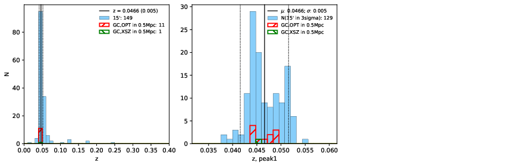
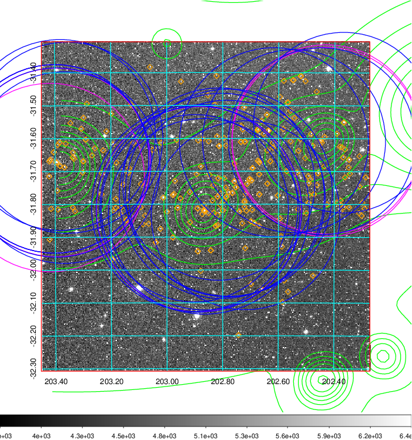
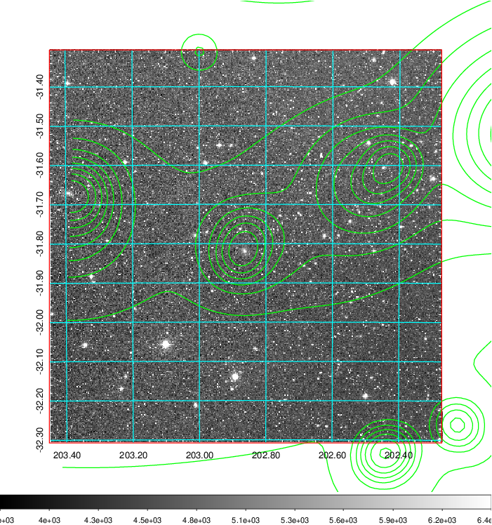
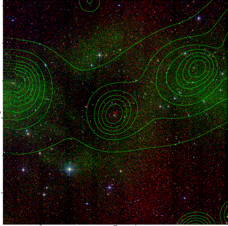

### 511

|Name|RAJ2000[deg]|DEJ2000[deg] |Ext[arcmin]| Ext,ml | z | z_src| C|GC(XSZ,Delta_z<0.01)| GC(OPT,Delta_z<0.01)|GC| R_sig[arcmin] | R500[arcmin] | R500[Mpc]| CRsig[c/s] | CR500[c/s] |L500[1E44 erg/s]|F500[1E-12 erg/s/cm^2]| M500[1E14 Msun]|Tx[keV]|Cnt_sig|Beta|Rc[arcmin]|Comment|Alias|
|---|---|---|---|---|---|------|---|--------|---------|----------|---|---|---|---|---|---|---|---|---|---|---|---|---|---|
|511| 202.861| -31.807| 2.77| 47.65| 0.0466(0.005)| z1, z_xsz| B| MCXC| A, N| A, MCXC, N| 47.530| 17.191| 0.943| 1.222(0.132)| 1.105(0.120)| 1.041(0.149)| 20.372(2.907)| 2.50(0.18)| 3.82(0.17)| 982.3| 0.503(-0.002+0.005)| 10.496(-0.558+0.606)| -| k344|

|[RASS image](../image/511/511_img.pdf)|[filtered image](../image/511/511_fil.pdf)|[Segment image](../image/511/511_seg.pdf)|
|-------------------|--------------------|-------------------|
|   |    |   |

|[Exposure image](../image/511/511_mex.pdf)| [nH image](../image/511/511_nh.pdf)| [Planck image](../image/511/511_p.pdf)|
|-------------------|--------------------|-------------------|
|   |     |  |

|[Redshift Histogram](../image/511/511_zg.pdf) | [DSS image(z1)](../image/511/511_dss_z1.pdf)      |  [DSS image(z2)](../image/511/511_dss_z2.pdf)    |
|-------------------|--------------------|-------------------|
| |  Blue circle for optical clusters;  Magenta circle for XSZ clusters;  all with r=1Mpc;  Only GC with Delta_z<0.01 are shown. |  Blue circle for optical clusters;  Magenta circle for XSZ clusters;  all with r=1Mpc;  Only GC with Delta_z<0.01 are shown.  |

|[Previous-identified clusters](../image/511/511_gc.pdf) | [2MASS image](../image/511/511_2mass.pdf)      |
|-------------------|-------------------|
|  Green, magenta, and blue circles  for optical, X-ray and SZ clusters  respectively, with redshift of clusters  labelled. The radius of circles  are 1Mpc.|  |

