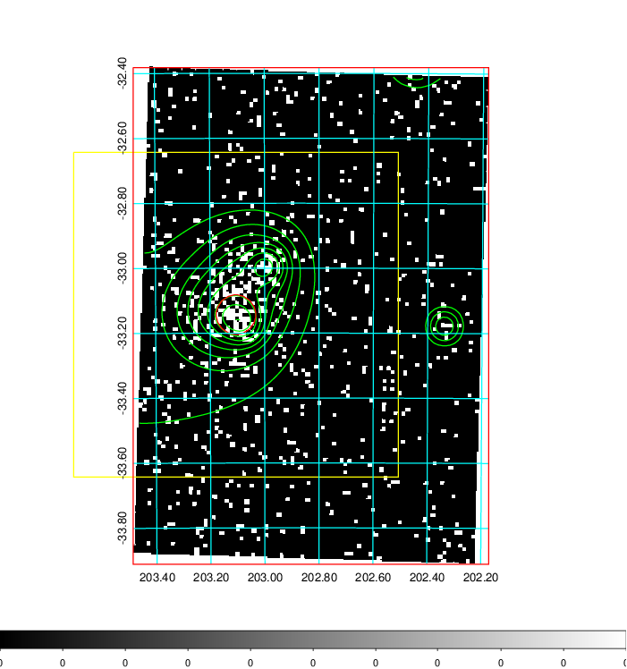
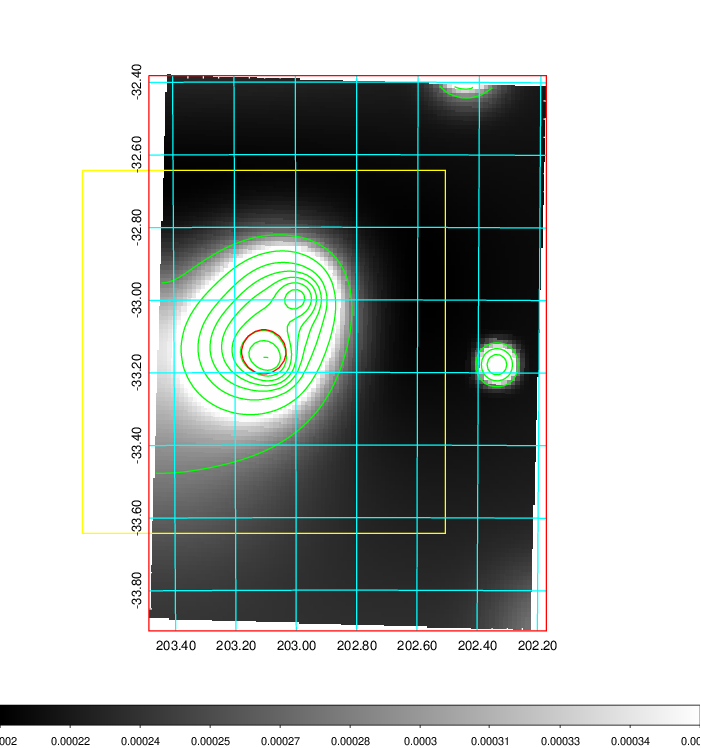
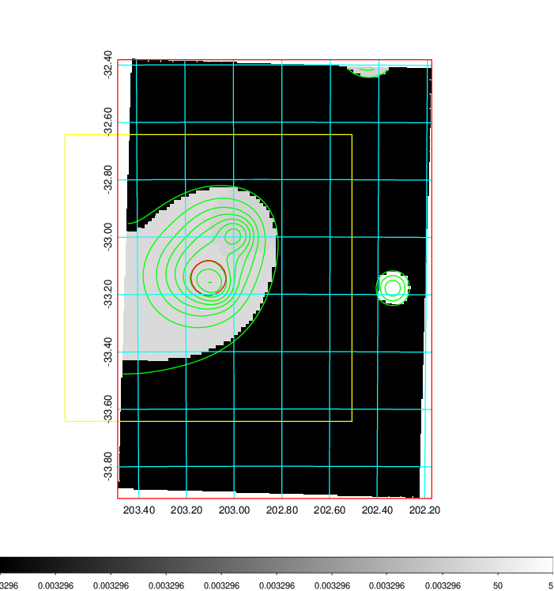
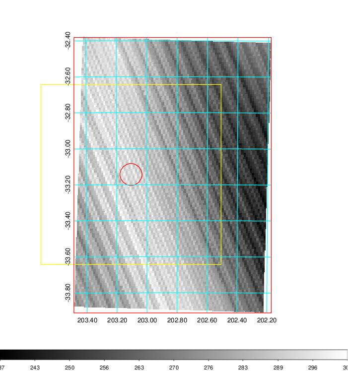
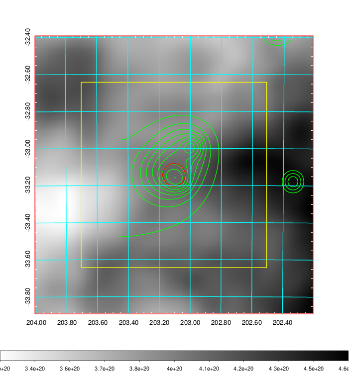
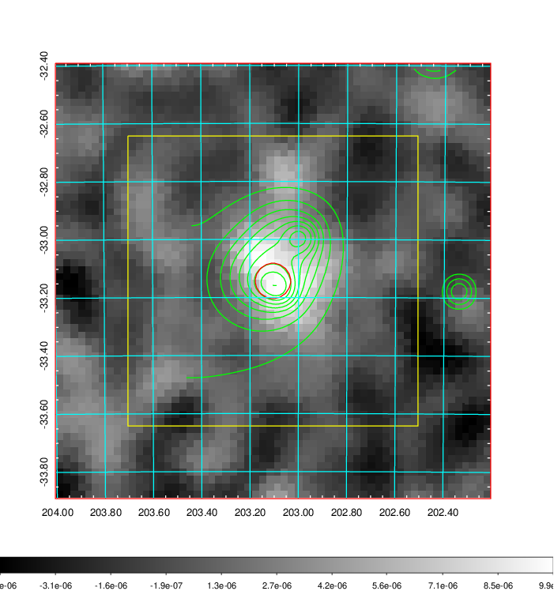
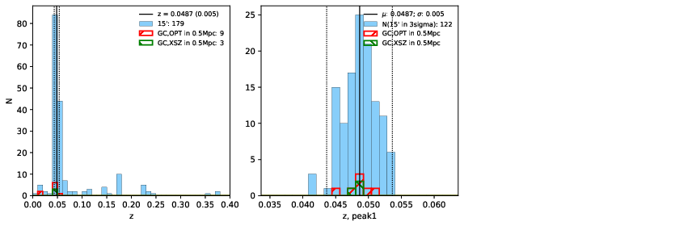
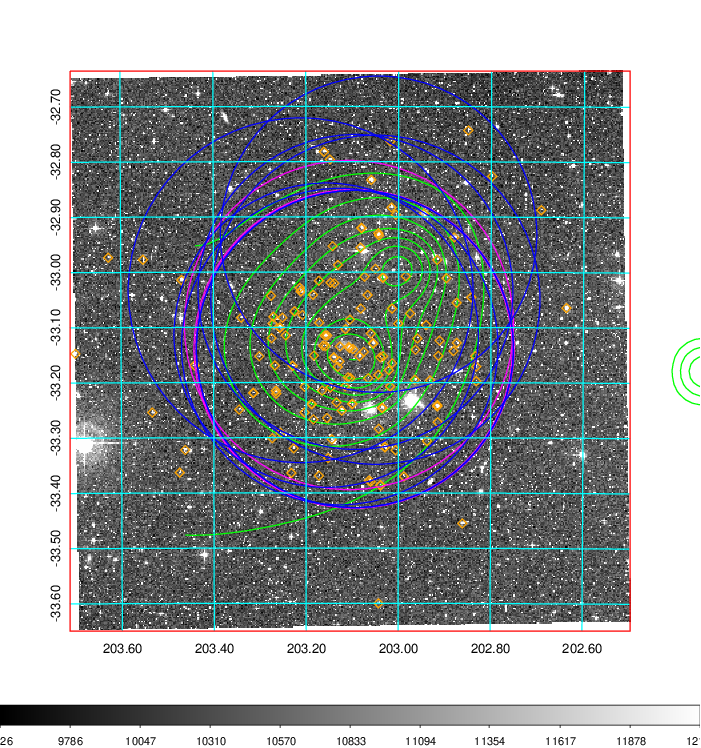
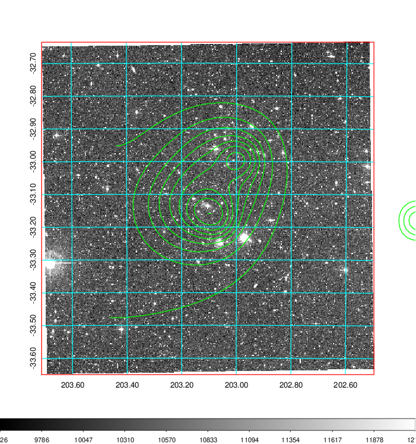
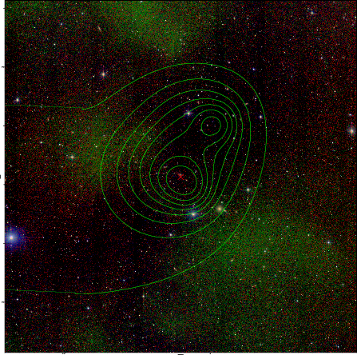

### 512

|Name|RAJ2000[deg]|DEJ2000[deg] |Ext[arcmin]| Ext,ml | z | z_src| C|GC(XSZ,Delta_z<0.01)| GC(OPT,Delta_z<0.01)|GC| R_sig[arcmin] | R500[arcmin] | R500[Mpc]| CRsig[c/s] | CR500[c/s] |L500[1E44 erg/s]|F500[1E-12 erg/s/cm^2]| M500[1E14 Msun]|Tx[keV]|Cnt_sig|Beta|Rc[arcmin]|Comment|Alias|
|---|---|---|---|---|---|------|---|--------|---------|----------|---|---|---|---|---|---|---|---|---|---|---|---|---|---|
|512| 203.105| -33.143| 3.66| 111.94| 0.0487(0.005)| z1, z_xsz| B| MCXC, Tar, XB| A, N| A, MCXC, N, Tar, W, XB| 15.319| 14.667| 0.839| 0.571(0.079)| 0.567(0.079)| 0.569(0.039)| 10.170(0.694)| 1.76(0.06)| 3.08(0.07)| 197.1| 0.958(-0.054+0.030)| 7.224(-0.515+0.376)| -| k453|

|[RASS image](../image/512/512_img.pdf)|[filtered image](../image/512/512_fil.pdf)|[Segment image](../image/512/512_seg.pdf)|
|-------------------|--------------------|-------------------|
|   |    |   |

|[Exposure image](../image/512/512_mex.pdf)| [nH image](../image/512/512_nh.pdf)| [Planck image](../image/512/512_p.pdf)|
|-------------------|--------------------|-------------------|
|   |     |  |

|[Redshift Histogram](../image/512/512_zg.pdf) | [DSS image(z1)](../image/512/512_dss_z1.pdf)      |  [DSS image(z2)](../image/512/512_dss_z2.pdf)    |
|-------------------|--------------------|-------------------|
| |  Blue circle for optical clusters;  Magenta circle for XSZ clusters;  all with r=1Mpc;  Only GC with Delta_z<0.01 are shown. |  Blue circle for optical clusters;  Magenta circle for XSZ clusters;  all with r=1Mpc;  Only GC with Delta_z<0.01 are shown.  |

|[known Abell/XSZ clusters](../image/512/512_gc.pdf) | [2MASS image](../image/512/512_2mass.pdf)      |
|-------------------|-------------------|
|  Magenta, blue and green circles  for optical, X-ray and SZ clusters  respectively, with redshift of clusters  labelled. The radius of circles  are 1Mpc.|  |

