

### 513

|Name|RAJ2000[deg]|DEJ2000[deg] |Ext[arcmin]| Ext,ml | z | z_src| C|GC(XSZ,Delta_z<0.01)| GC(OPT,Delta_z<0.01)|GC| R_sig[arcmin] | R500[arcmin] | R500[Mpc]| CRsig[c/s] | CR500[c/s] |L500[1E44 erg/s]|F500[1E-12 erg/s/cm^2]| M500[1E14 Msun]|Tx[keV]|Cnt_sig|Beta|Rc[arcmin]|Comment|Alias|
|---|---|---|---|---|---|------|---|--------|---------|----------|---|---|---|---|---|---|---|---|---|---|---|---|---|---|
|513| 203.176| 50.548| 1.52| 41.41| 0.2760(0.005)| z1, z_xsz| B| MCXC, PSZ2, Tar, XB| A, C, N, W| A, C, F20, MCXC, N, PSZ2, SPI, Tar, W, XB, XCS| 9.775| 5.147| 1.297| 0.225(0.029)| 0.209(0.027)| 10.400(0.746)| 4.367(0.313)| 8.23(0.27)| 8.61(0.18)| 148.1| 0.747(-0.106+0.143)| 3.033(-0.802+0.878)| -| k119|

|[RASS image](../image/513/513_img.pdf)|[filtered image](../image/513/513_fil.pdf)|[Segment image](../image/513/513_seg.pdf)|
|-------------------|--------------------|-------------------|
| 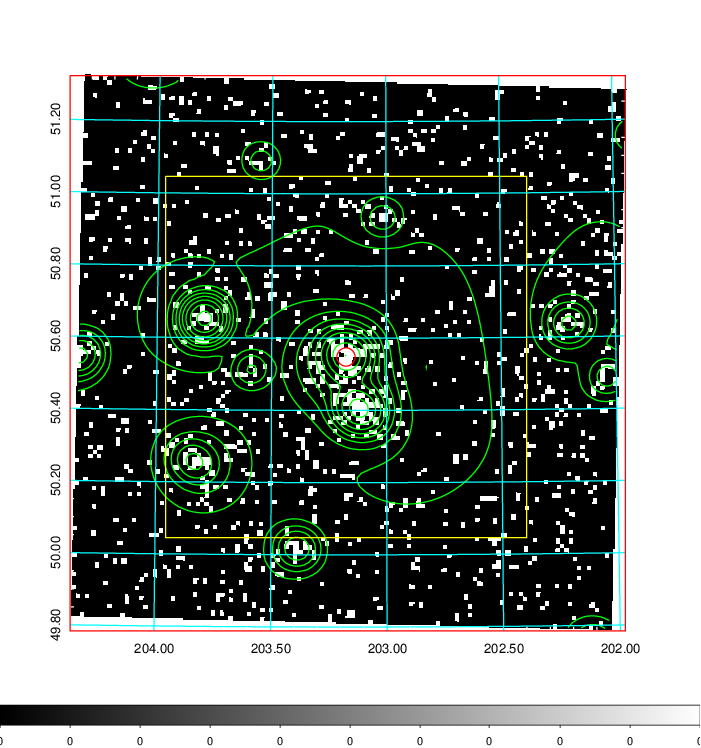  | 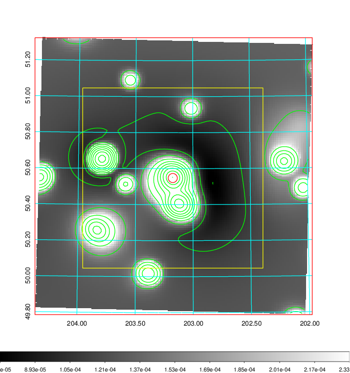   | 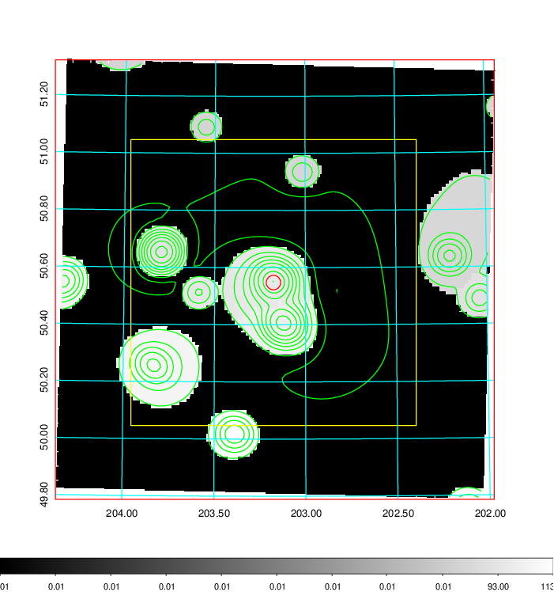  |

|[Exposure image](../image/513/513_mex.pdf)| [nH image](../image/513/513_nh.pdf)| [Planck image](../image/513/513_p.pdf)|
|-------------------|--------------------|-------------------|
|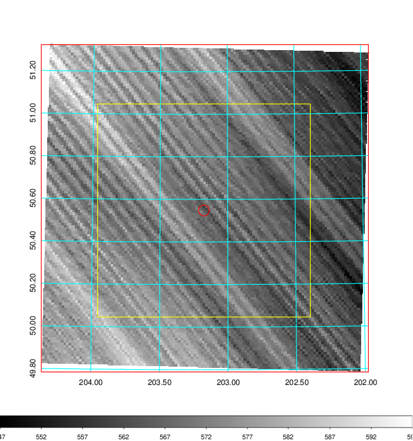   | 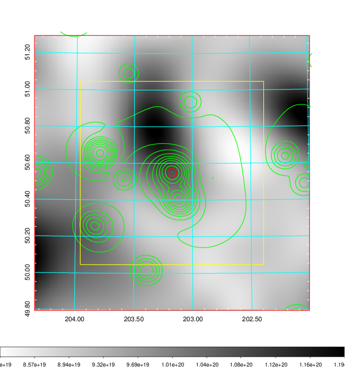    | 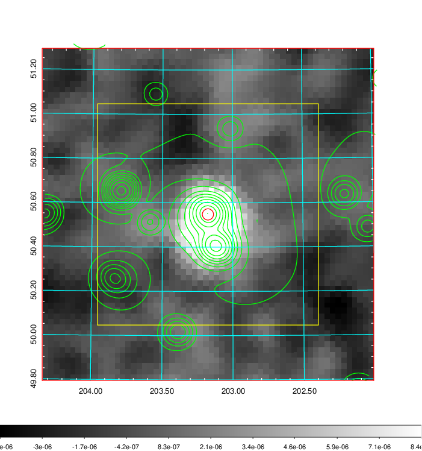 |

|[Redshift Histogram](../image/513/513_zg.pdf) | [DSS image(z1)](../image/513/513_dss_z1.pdf)      |  [DSS image(z2)](../image/513/513_dss_z2.pdf)    |
|-------------------|--------------------|-------------------|
|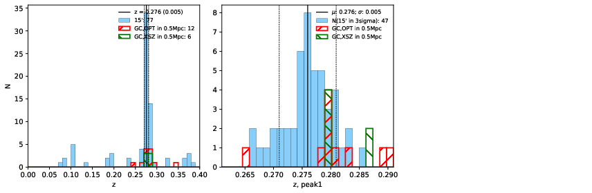 |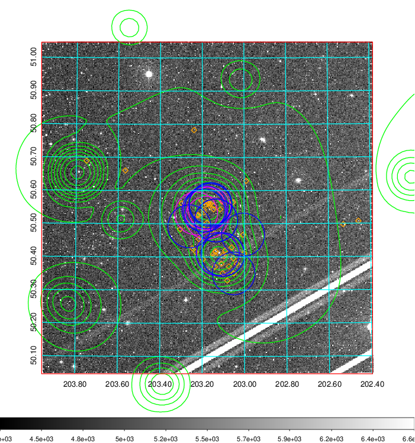  Blue circle for optical clusters;  Magenta circle for XSZ clusters;  all with r=1Mpc;  Only GC with Delta_z<0.01 are shown. | 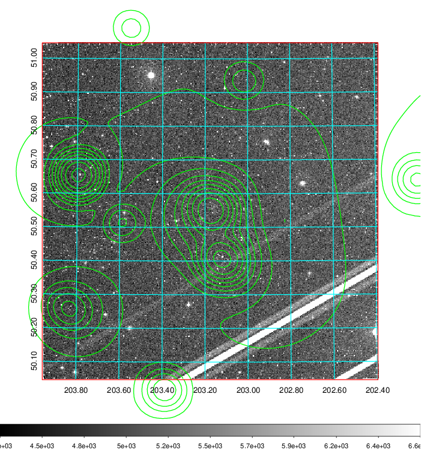 Blue circle for optical clusters;  Magenta circle for XSZ clusters;  all with r=1Mpc;  Only GC with Delta_z<0.01 are shown.  |

|[Previous-identified clusters](../image/513/513_gc.pdf) | [2MASS image](../image/513/513_2mass.pdf)      |[SDSS image](../image/513/513_sdss.pdf)   |
|-------------------|-------------------|-------------------|
|  Green, magenta, and blue circles  for optical, X-ray and SZ clusters  respectively, with redshift of clusters  labelled. The radius of circles  are 1Mpc.|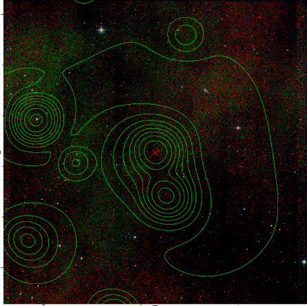  | 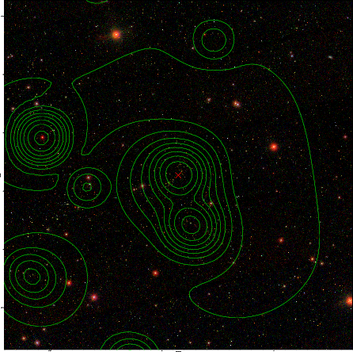  |

