

### 515

|Name|RAJ2000[deg]|DEJ2000[deg] |Ext[arcmin]| Ext,ml | z | z_src| C|GC(XSZ,Delta_z<0.01)| GC(OPT,Delta_z<0.01)|GC| R_sig[arcmin] | R500[arcmin] | R500[Mpc]| CRsig[c/s] | CR500[c/s] |L500[1E44 erg/s]|F500[1E-12 erg/s/cm^2]| M500[1E14 Msun]|Tx[keV]|Cnt_sig|Beta|Rc[arcmin]|Comment|Alias|
|---|---|---|---|---|---|------|---|--------|---------|----------|---|---|---|---|---|---|---|---|---|---|---|---|---|---|
|515| 203.408| 15.822| 14.38| 43.95| 0.0914(0.005)| z1,| G| -| -| C, F20, N, W| 40.105| 9.664| 0.987| 0.433(0.126)| 0.384(0.112)| 1.597(0.916)| 7.627(4.375)| 2.99(0.85)| 4.33(0.78)| 266.5| 0.532(-0.024+0.061)| 11.786(-1.617+2.847)| -| t524|

|[RASS image](../image/515/515_img.pdf)|[filtered image](../image/515/515_fil.pdf)|[Segment image](../image/515/515_seg.pdf)|
|-------------------|--------------------|-------------------|
| 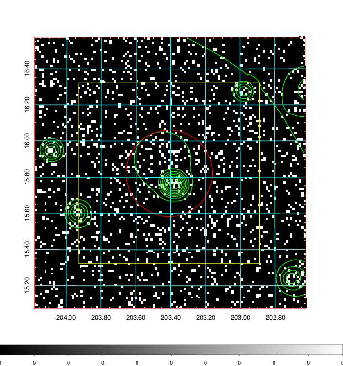  | 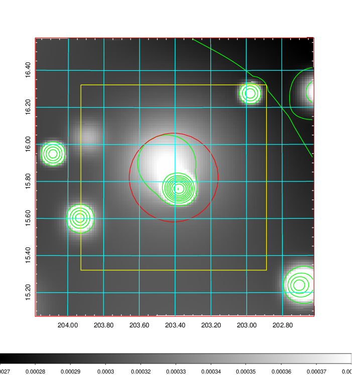   | 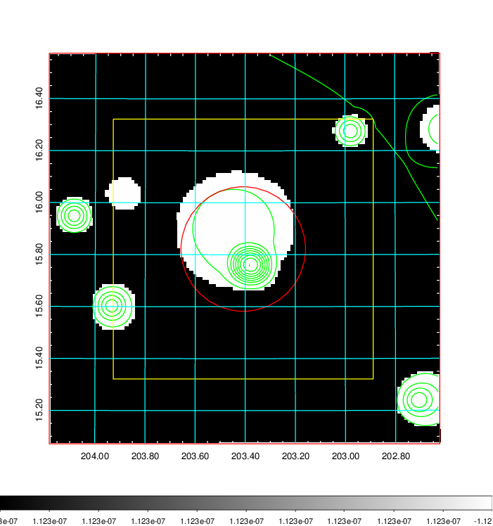  |

|[Exposure image](../image/515/515_mex.pdf)| [nH image](../image/515/515_nh.pdf)| [Planck image](../image/515/515_p.pdf)|
|-------------------|--------------------|-------------------|
|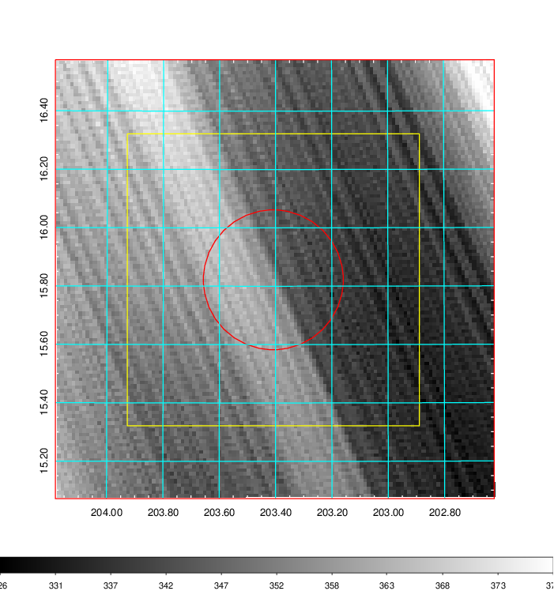   | 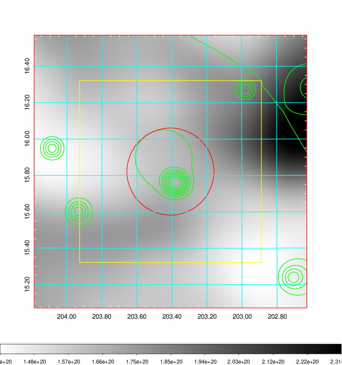    | 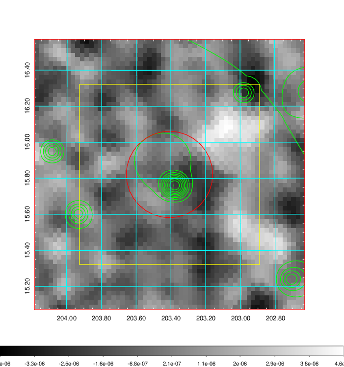 |

|[Redshift Histogram](../image/515/515_zg.pdf) | [DSS image(z1)](../image/515/515_dss_z1.pdf)      |  [DSS image(z2)](../image/515/515_dss_z2.pdf)    |
|-------------------|--------------------|-------------------|
|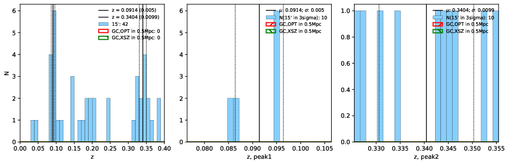 |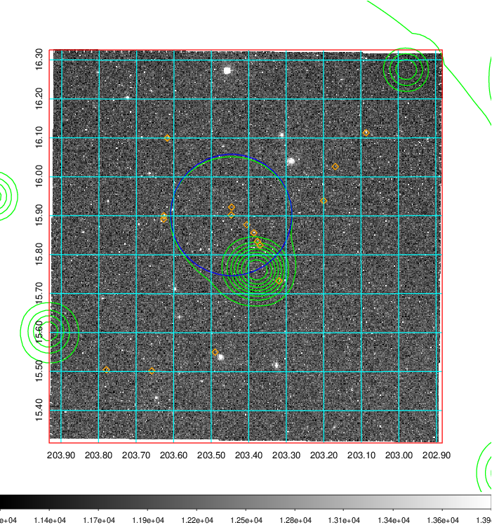  Blue circle for optical clusters;  Magenta circle for XSZ clusters;  all with r=1Mpc;  Only GC with Delta_z<0.01 are shown. | 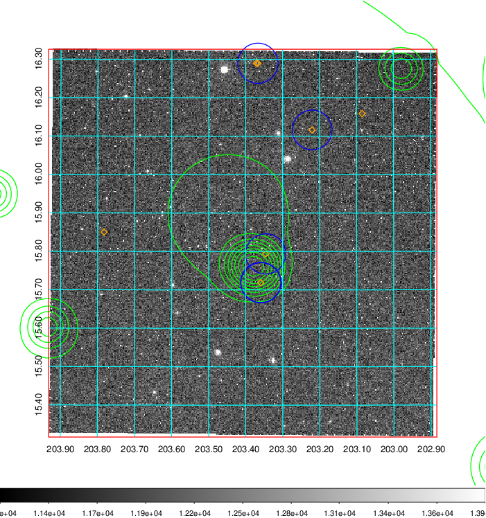 Blue circle for optical clusters;  Magenta circle for XSZ clusters;  all with r=1Mpc;  Only GC with Delta_z<0.01 are shown.  |

|[known Abell/XSZ clusters](../image/515/515_gc.pdf) | [2MASS image](../image/515/515_2mass.pdf)      |[SDSS image](../image/515/515_sdss.pdf)   |
|-------------------|-------------------|-------------------|
|  Magenta, blue and green circles  for optical, X-ray and SZ clusters  respectively, with redshift of clusters  labelled. The radius of circles  are 1Mpc.|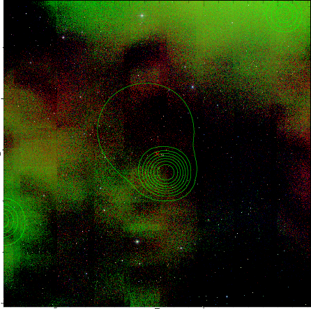  | 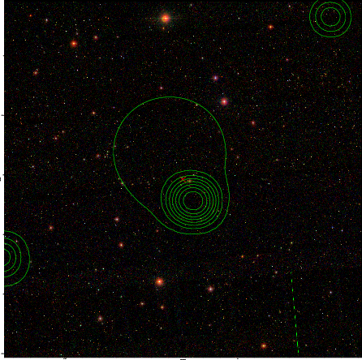  |

