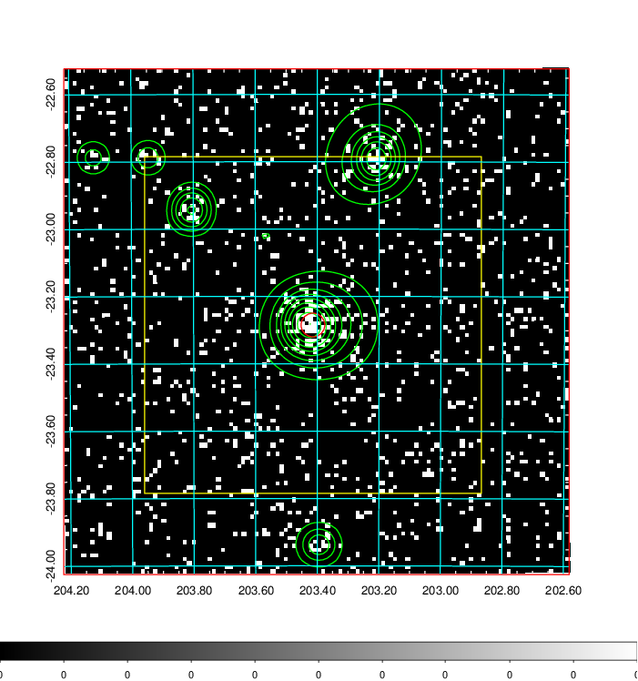
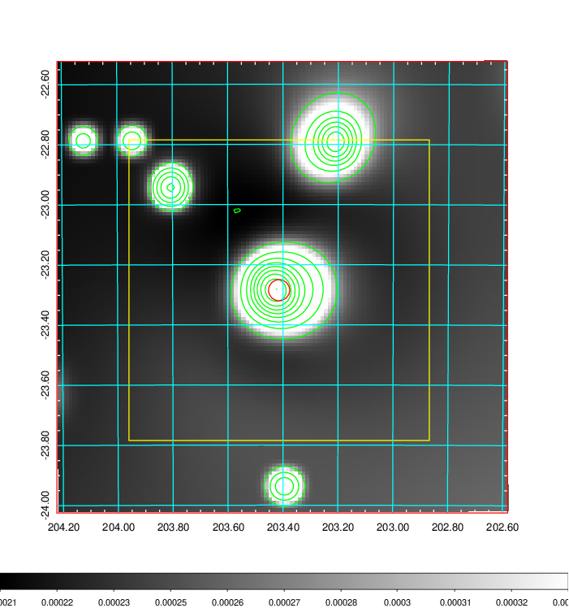
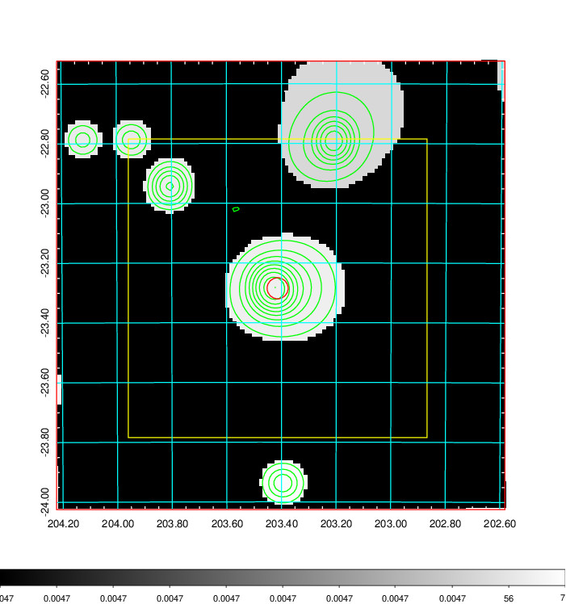
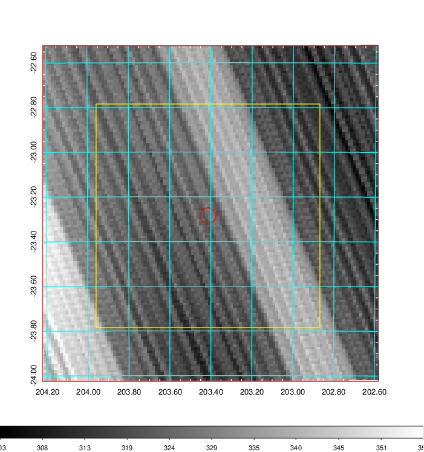
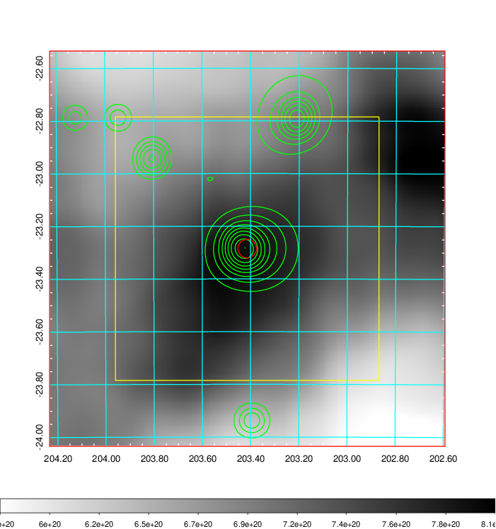
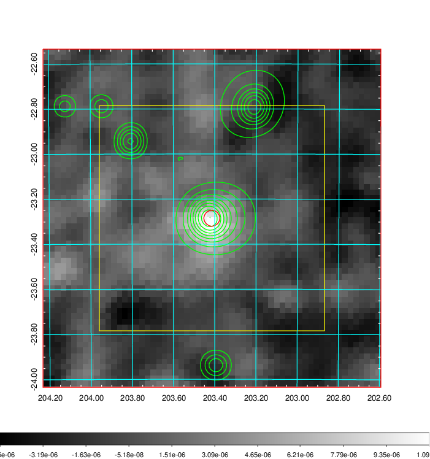
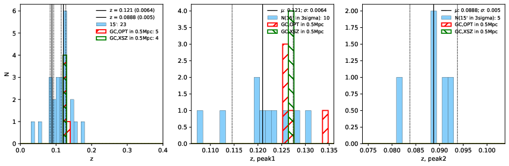
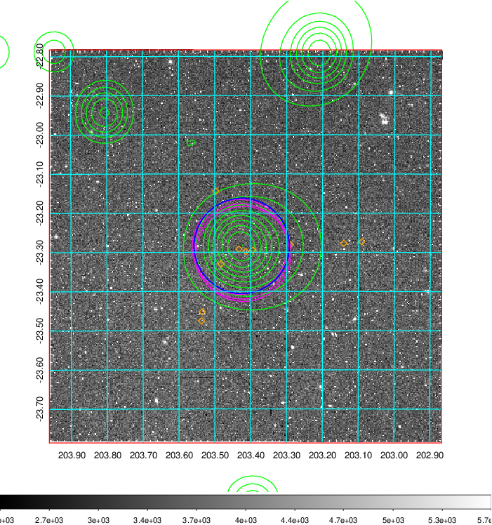
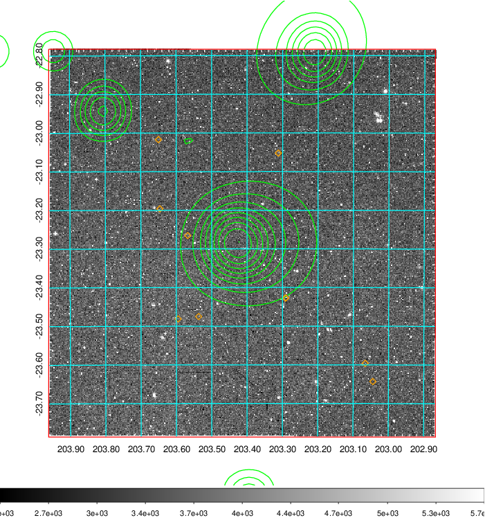
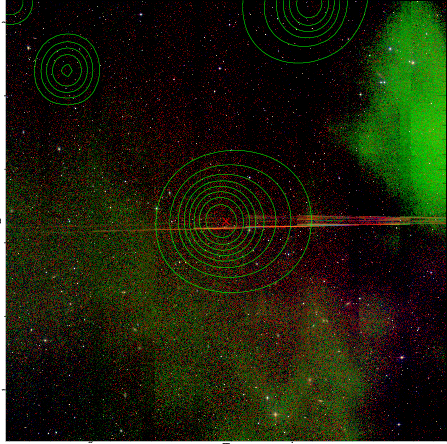

### 517

|Name|RAJ2000[deg]|DEJ2000[deg] |Ext[arcmin]| Ext,ml | z | z_src| C|GC(XSZ,Delta_z<0.01)| GC(OPT,Delta_z<0.01)|GC| R_sig[arcmin] | R500[arcmin] | R500[Mpc]| CRsig[c/s] | CR500[c/s] |L500[1E44 erg/s]|F500[1E-12 erg/s/cm^2]| M500[1E14 Msun]|Tx[keV]|Cnt_sig|Beta|Rc[arcmin]|Comment|Alias|
|---|---|---|---|---|---|------|---|--------|---------|----------|---|---|---|---|---|---|---|---|---|---|---|---|---|---|
|517| 203.414| -23.285| 2.12| 60.11| 0.1210(0.006)| z1, z_xsz| B| MCXC, PSZ2, Tar, XB| A, N| A, MCXC, N, PSZ2, Tar, W, XB| 7.338| 8.213| 1.074| 0.293(0.047)| 0.298(0.048)| 2.042(0.120)| 5.352(0.315)| 3.96(0.11)| 5.20(0.10)| 91.6| 0.931(-0.087+0.050)| 4.191(-0.503+0.378)| -| k239|

|[RASS image](../image/517/517_img.pdf)|[filtered image](../image/517/517_fil.pdf)|[Segment image](../image/517/517_seg.pdf)|
|-------------------|--------------------|-------------------|
|   |    |   |

|[Exposure image](../image/517/517_mex.pdf)| [nH image](../image/517/517_nh.pdf)| [Planck image](../image/517/517_p.pdf)|
|-------------------|--------------------|-------------------|
|   |     |  |

|[Redshift Histogram](../image/517/517_zg.pdf) | [DSS image(z1)](../image/517/517_dss_z1.pdf)      |  [DSS image(z2)](../image/517/517_dss_z2.pdf)    |
|-------------------|--------------------|-------------------|
| |  Blue circle for optical clusters;  Magenta circle for XSZ clusters;  all with r=1Mpc;  Only GC with Delta_z<0.01 are shown. |  Blue circle for optical clusters;  Magenta circle for XSZ clusters;  all with r=1Mpc;  Only GC with Delta_z<0.01 are shown.  |

|[known Abell/XSZ clusters](../image/517/517_gc.pdf) | [2MASS image](../image/517/517_2mass.pdf)      |
|-------------------|-------------------|
|  Magenta, blue and green circles  for optical, X-ray and SZ clusters  respectively, with redshift of clusters  labelled. The radius of circles  are 1Mpc.|  |

|[PS1 image](../image/517/517_ps1.pdf)            |
|-------------------|
|   |
