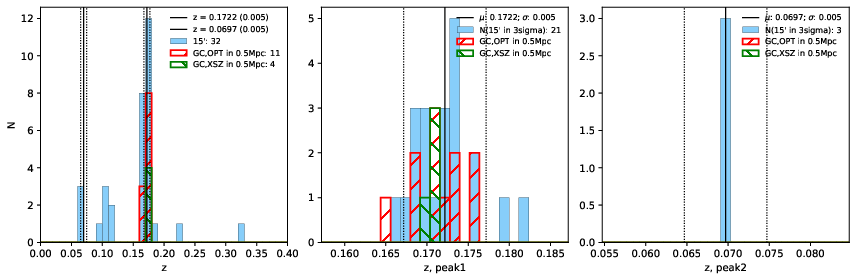

### 518

|Name|RAJ2000[deg]|DEJ2000[deg] |Ext[arcmin]| Ext,ml | z | z_src| C|GC(XSZ,Delta_z<0.01)| GC(OPT,Delta_z<0.01)|GC| R_sig[arcmin] | R500[arcmin] | R500[Mpc]| CRsig[c/s] | CR500[c/s] |L500[1E44 erg/s]|F500[1E-12 erg/s/cm^2]| M500[1E14 Msun]|Tx[keV]|Cnt_sig|Beta|Rc[arcmin]|Comment|Alias|
|---|---|---|---|---|---|------|---|--------|---------|----------|---|---|---|---|---|---|---|---|---|---|---|---|---|---|
|518| 203.528| 20.222| 2.38| 41.20| 0.1722(0.005)| z1, z_xsz| B| F20, MCXC, PSZ2, Tar| A, C, N, RM, W, Zw| A, C, F20, MCXC, N, PSZ2, Tar, W| 28.650| 6.077| 1.068| 0.197(0.067)| 0.174(0.059)| 2.844(0.543)| 3.450(0.658)| 4.10(0.38)| 5.40(0.32)| 157.9| 0.735(-0.086+0.120)| 4.069(-0.915+1.109)| -| k278|

|[RASS image](../image/518/518_img.pdf)|[filtered image](../image/518/518_fil.pdf)|[Segment image](../image/518/518_seg.pdf)|
|-------------------|--------------------|-------------------|
|   |    |   |

|[Exposure image](../image/518/518_mex.pdf)| [nH image](../image/518/518_nh.pdf)| [Planck image](../image/518/518_p.pdf)|
|-------------------|--------------------|-------------------|
|   |     |  |

|[Redshift Histogram](../image/518/518_zg.pdf) | [DSS image(z1)](../image/518/518_dss_z1.pdf)      |  [DSS image(z2)](../image/518/518_dss_z2.pdf)    |
|-------------------|--------------------|-------------------|
| |  Blue circle for optical clusters;  Magenta circle for XSZ clusters;  all with r=1Mpc;  Only GC with Delta_z<0.01 are shown. |  Blue circle for optical clusters;  Magenta circle for XSZ clusters;  all with r=1Mpc;  Only GC with Delta_z<0.01 are shown.  |

|[known Abell/XSZ clusters](../image/518/518_gc.pdf) | [2MASS image](../image/518/518_2mass.pdf)      |[SDSS image](../image/518/518_sdss.pdf)   |
|-------------------|-------------------|-------------------|
|  Magenta, blue and green circles  for optical, X-ray and SZ clusters  respectively, with redshift of clusters  labelled. The radius of circles  are 1Mpc.|  |   |

