

### 519

|Name|RAJ2000[deg]|DEJ2000[deg] |Ext[arcmin]| Ext,ml | z | z_src| C|GC(XSZ,Delta_z<0.01)| GC(OPT,Delta_z<0.01)|GC| R_sig[arcmin] | R500[arcmin] | R500[Mpc]| CRsig[c/s] | CR500[c/s] |L500[1E44 erg/s]|F500[1E-12 erg/s/cm^2]| M500[1E14 Msun]|Tx[keV]|Cnt_sig|Beta|Rc[arcmin]|Comment|Alias|
|---|---|---|---|---|---|------|---|--------|---------|----------|---|---|---|---|---|---|---|---|---|---|---|---|---|---|
|519| 203.627| 34.703| 2.52| 42.15| 0.0242(0.005)| z1, z_xsz| B| MCXC| N| C, F20, MCXC, N, W| 16.800| 16.286| 0.477| 0.175(0.040)| 0.174(0.039)| 0.034(0.006)| 2.576(0.474)| 0.32(0.03)| 1.06(0.06)| 110.1| 0.762(-0.104+0.130)| 4.393(-0.993+1.068)| -| k299|

|[RASS image](../image/519/519_img.pdf)|[filtered image](../image/519/519_fil.pdf)|[Segment image](../image/519/519_seg.pdf)|
|-------------------|--------------------|-------------------|
| 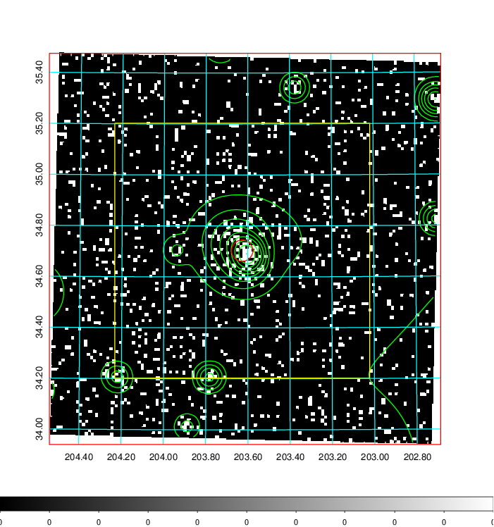  | 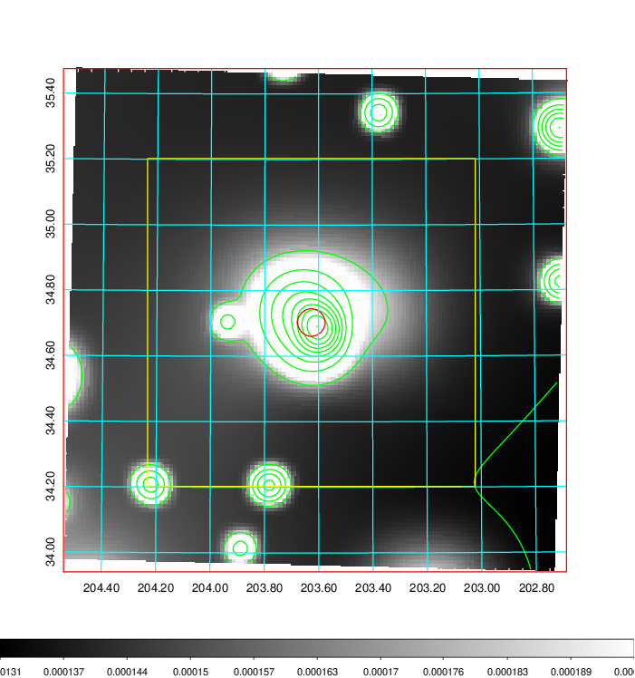   | 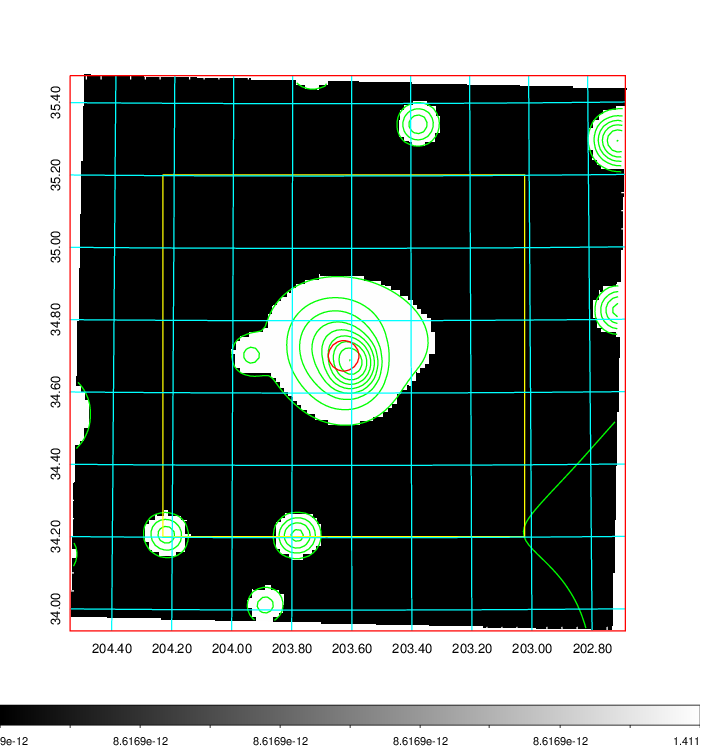  |

|[Exposure image](../image/519/519_mex.pdf)| [nH image](../image/519/519_nh.pdf)| [Planck image](../image/519/519_p.pdf)|
|-------------------|--------------------|-------------------|
|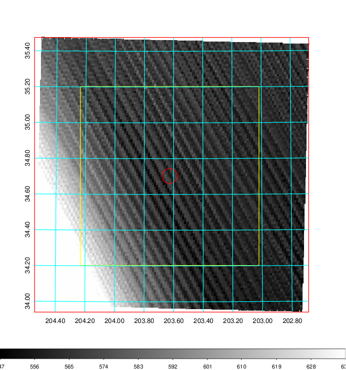   | 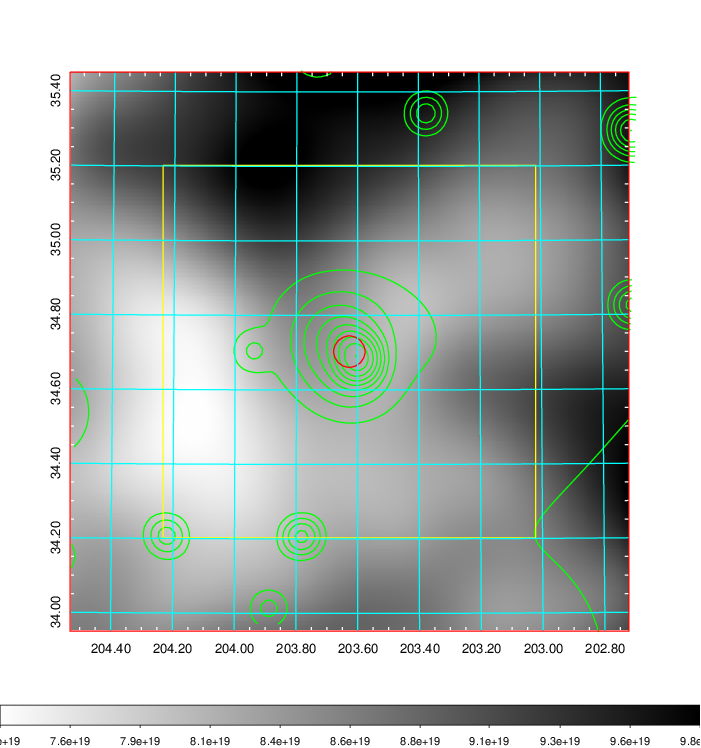    | 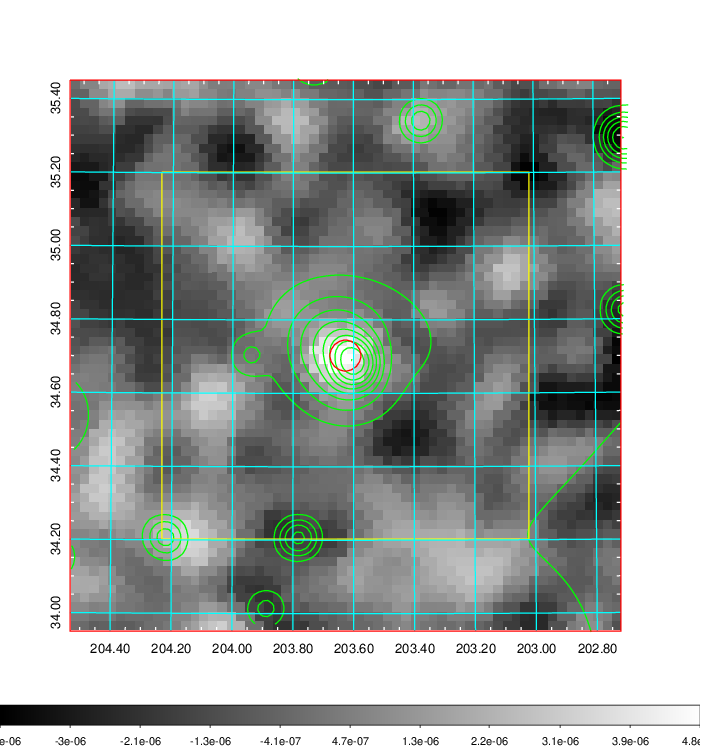 |

|[Redshift Histogram](../image/519/519_zg.pdf) | [DSS image(z1)](../image/519/519_dss_z1.pdf)      |  [DSS image(z2)](../image/519/519_dss_z2.pdf)    |
|-------------------|--------------------|-------------------|
|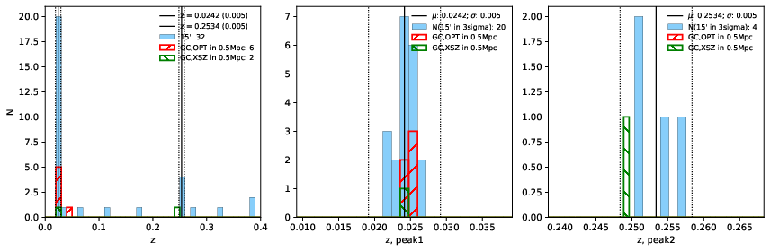 |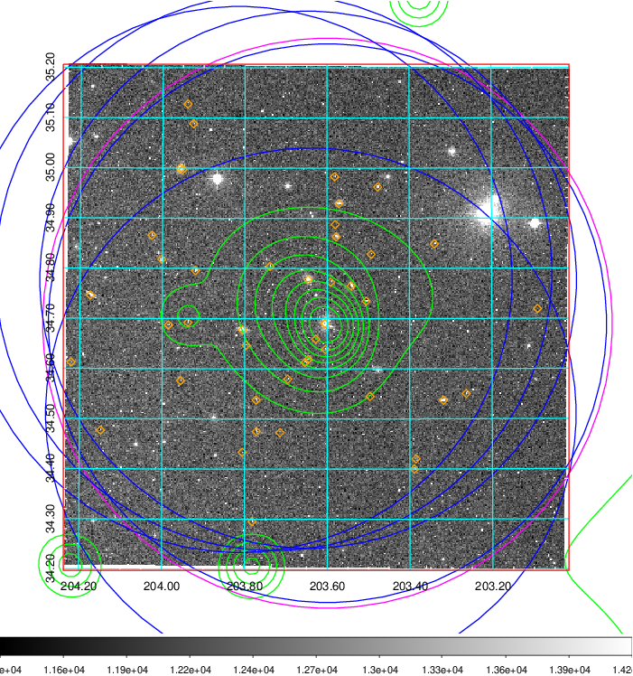  Blue circle for optical clusters;  Magenta circle for XSZ clusters;  all with r=1Mpc;  Only GC with Delta_z<0.01 are shown. | 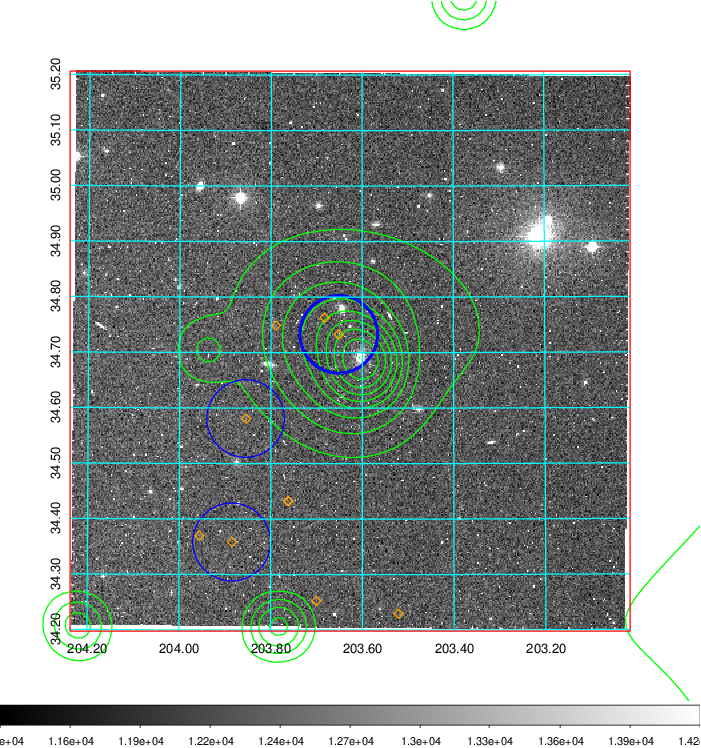 Blue circle for optical clusters;  Magenta circle for XSZ clusters;  all with r=1Mpc;  Only GC with Delta_z<0.01 are shown.  |

|[known Abell/XSZ clusters](../image/519/519_gc.pdf) | [2MASS image](../image/519/519_2mass.pdf)      |[SDSS image](../image/519/519_sdss.pdf)   |
|-------------------|-------------------|-------------------|
|  Magenta, blue and green circles  for optical, X-ray and SZ clusters  respectively, with redshift of clusters  labelled. The radius of circles  are 1Mpc.|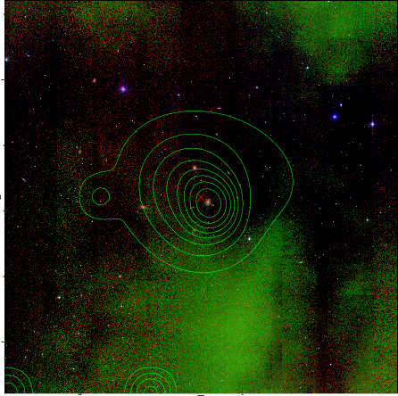  | 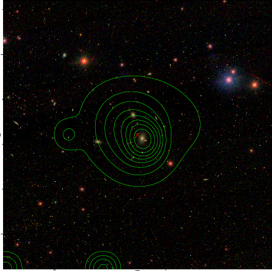  |

