

### 52

|Name|RAJ2000[deg]|DEJ2000[deg] |Ext[arcmin]| Ext,ml | z | z_src| C|GC(XSZ,Delta_z<0.01)| GC(OPT,Delta_z<0.01)|GC| R_sig[arcmin] | R500[arcmin] | R500[Mpc]| CRsig[c/s] | CR500[c/s] |L500[1E44 erg/s]|F500[1E-12 erg/s/cm^2]| M500[1E14 Msun]|Tx[keV]|Cnt_sig|Beta|Rc[arcmin]|Comment|Alias|
|---|---|---|---|---|---|------|---|--------|---------|----------|---|---|---|---|---|---|---|---|---|---|---|---|---|---|
|52| 16.535| 4.266| 13.01| 30.94| 0.1095(0.005)| z1, z_opt| S| -| N, RM| C, N, W| 9.775| 6.140| 0.736| 0.071(0.030)| 0.066(0.028)| 0.377(0.187)| 1.225(0.607)| 1.26(0.32)| 2.55(0.40)| 33.3| 0.713(-0.151+0.184)| 5.542(-1.522+1.556)| -| t506|

|[RASS image](../image/52/52_img.pdf)|[filtered image](../image/52/52_fil.pdf)|[Segment image](../image/52/52_seg.pdf)|
|-------------------|--------------------|-------------------|
| 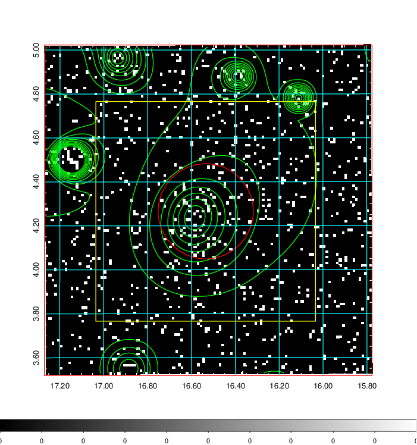  | 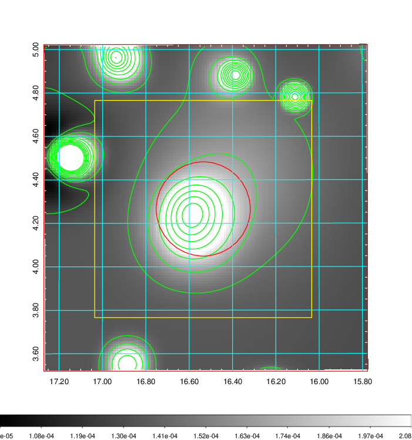   | 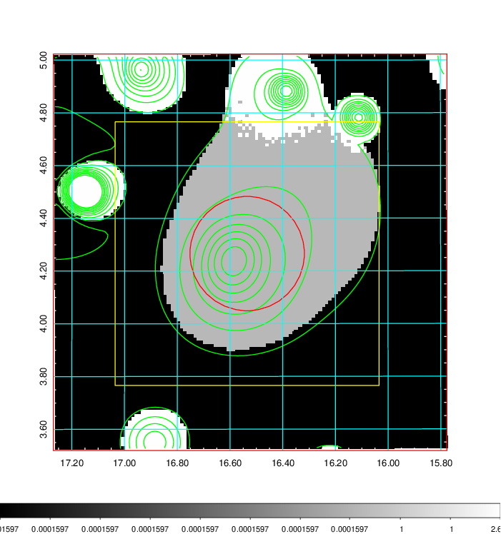  |

|[Exposure image](../image/52/52_mex.pdf)| [nH image](../image/52/52_nh.pdf)| [Planck image](../image/52/52_p.pdf)|
|-------------------|--------------------|-------------------|
|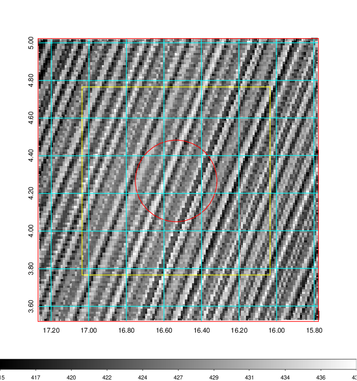   | 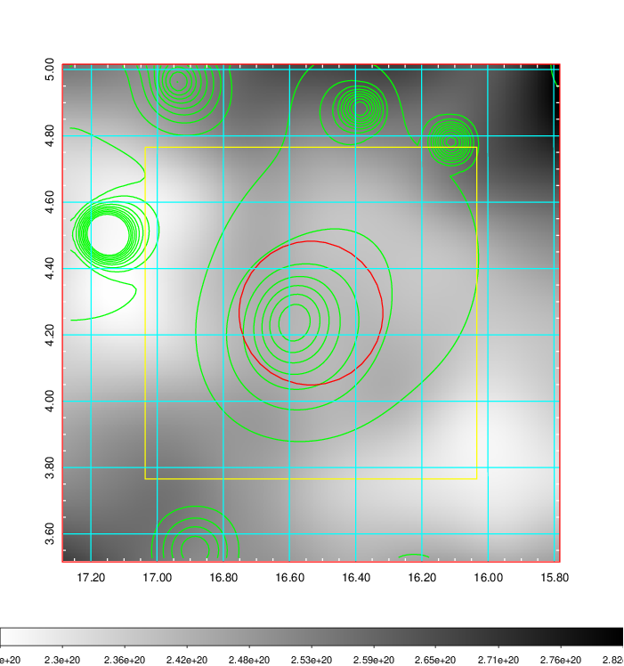    | 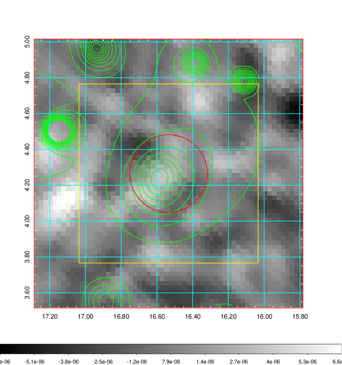 |

|[Redshift Histogram](../image/52/52_zg.pdf) | [DSS image(z1)](../image/52/52_dss_z1.pdf)      |  [DSS image(z2)](../image/52/52_dss_z2.pdf)    |
|-------------------|--------------------|-------------------|
|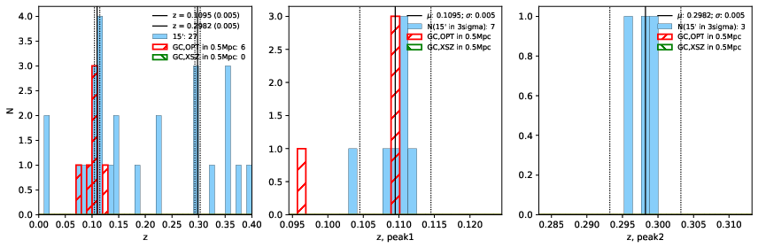 |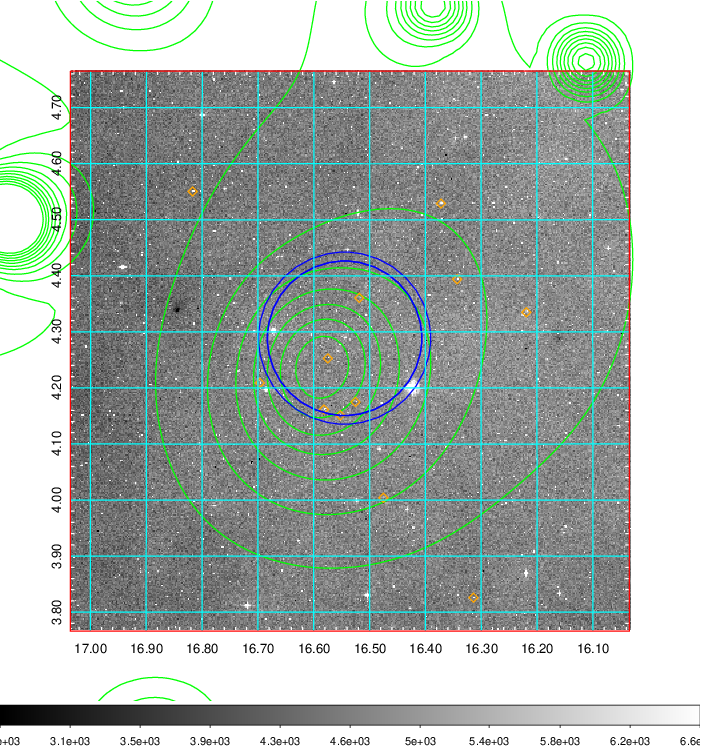  Blue circle for optical clusters;  Magenta circle for XSZ clusters;  all with r=1Mpc;  Only GC with Delta_z<0.01 are shown. | 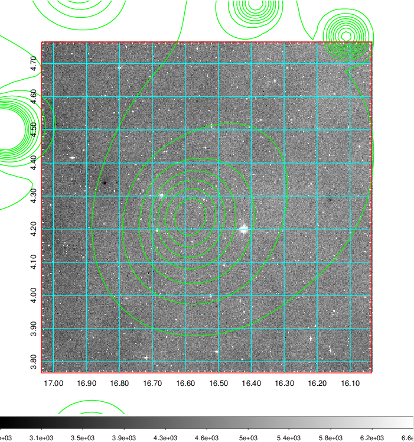 Blue circle for optical clusters;  Magenta circle for XSZ clusters;  all with r=1Mpc;  Only GC with Delta_z<0.01 are shown.  |

|[Previous-identified clusters](../image/52/52_gc.pdf) | [2MASS image](../image/52/52_2mass.pdf)      |[SDSS image](../image/52/52_sdss.pdf)   |
|-------------------|-------------------|-------------------|
|  Green, magenta, and blue circles  for optical, X-ray and SZ clusters  respectively, with redshift of clusters  labelled. The radius of circles  are 1Mpc.|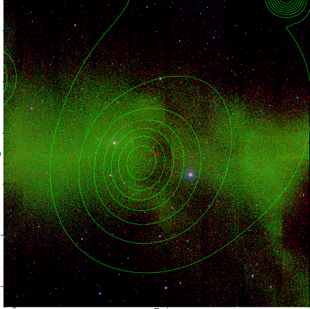  | 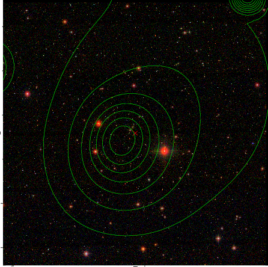  |

|[DES image](../image/52/52_des.pdf)   |
|-------------------|
| 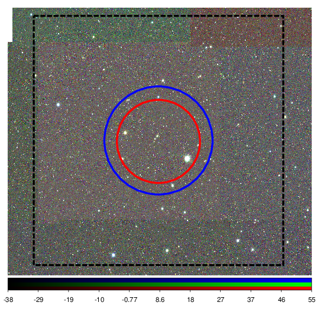  |
