

### 521

|Name|RAJ2000[deg]|DEJ2000[deg] |Ext[arcmin]| Ext,ml | z | z_src| C|GC(XSZ,Delta_z<0.01)| GC(OPT,Delta_z<0.01)|GC| R_sig[arcmin] | R500[arcmin] | R500[Mpc]| CRsig[c/s] | CR500[c/s] |L500[1E44 erg/s]|F500[1E-12 erg/s/cm^2]| M500[1E14 Msun]|Tx[keV]|Cnt_sig|Beta|Rc[arcmin]|Comment|Alias|
|---|---|---|---|---|---|------|---|--------|---------|----------|---|---|---|---|---|---|---|---|---|---|---|---|---|---|
|521| 204.028| 59.213| 2.59| 454.61| 0.0700(0.005)| z1, z_xsz| B| F20, L03, MCXC, PSZ2, SPI, Tar, XB| A, N, W| A, C, F20, L03, MCXC, N, PSZ2, SPI, Tar, W, XB| 11.238| 12.336| 0.989| 0.646(0.037)| 0.657(0.038)| 1.539(0.045)| 12.905(0.378)| 2.94(0.04)| 4.26(0.04)| 436.4| 0.926(-0.075+0.052)| 5.071(-0.498+0.342)| -| k314|

|[RASS image](../image/521/521_img.pdf)|[filtered image](../image/521/521_fil.pdf)|[Segment image](../image/521/521_seg.pdf)|
|-------------------|--------------------|-------------------|
| 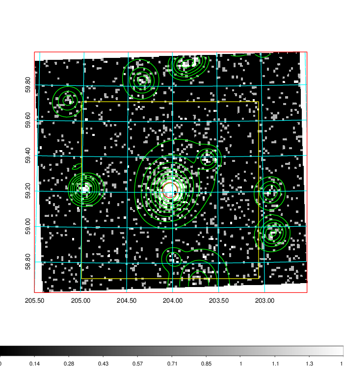  | 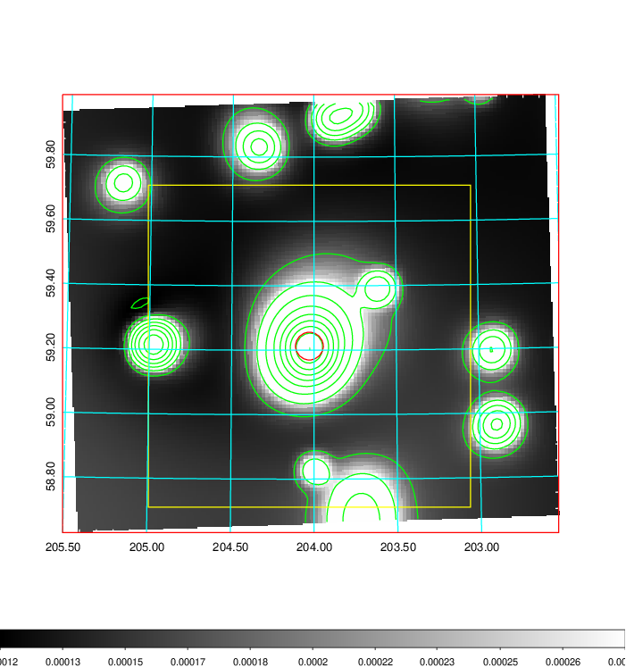   | 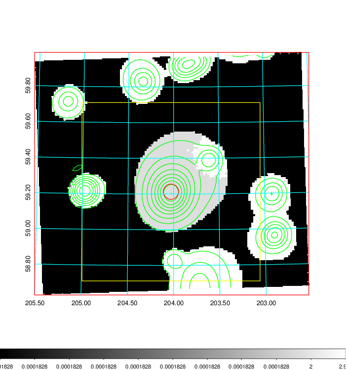  |

|[Exposure image](../image/521/521_mex.pdf)| [nH image](../image/521/521_nh.pdf)| [Planck image](../image/521/521_p.pdf)|
|-------------------|--------------------|-------------------|
|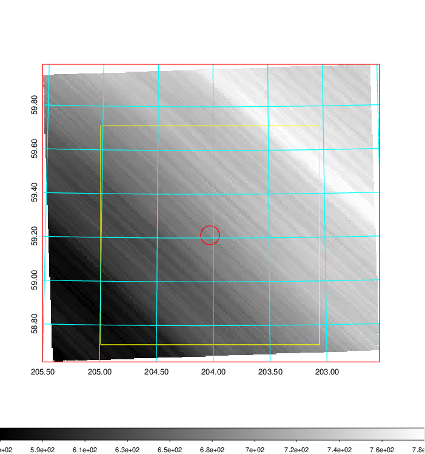   | 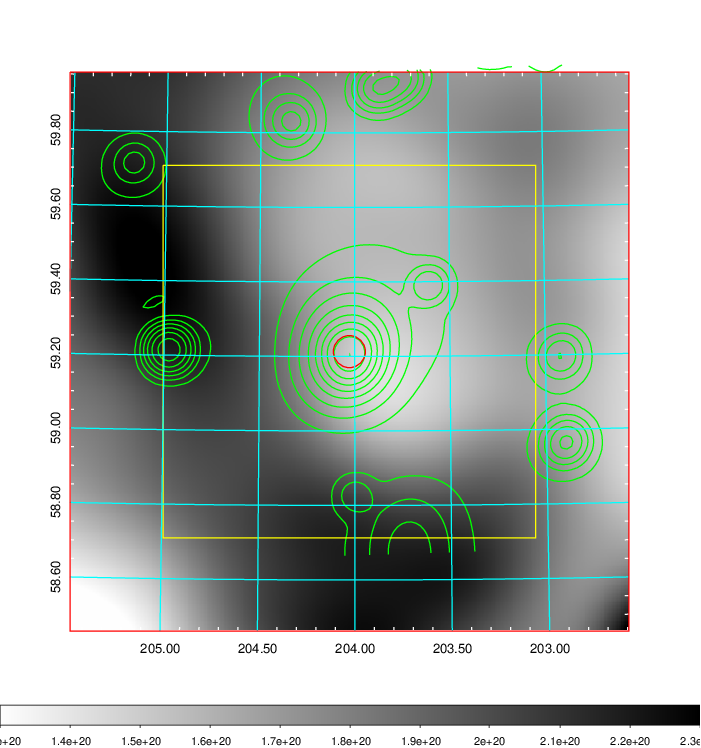    | 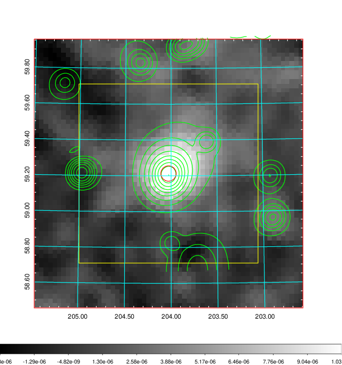 |

|[Redshift Histogram](../image/521/521_zg.pdf) | [DSS image(z1)](../image/521/521_dss_z1.pdf)      |  [DSS image(z2)](../image/521/521_dss_z2.pdf)    |
|-------------------|--------------------|-------------------|
|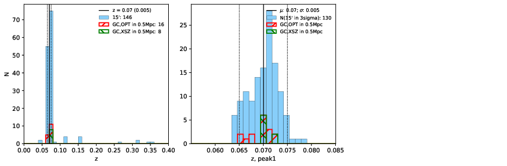 |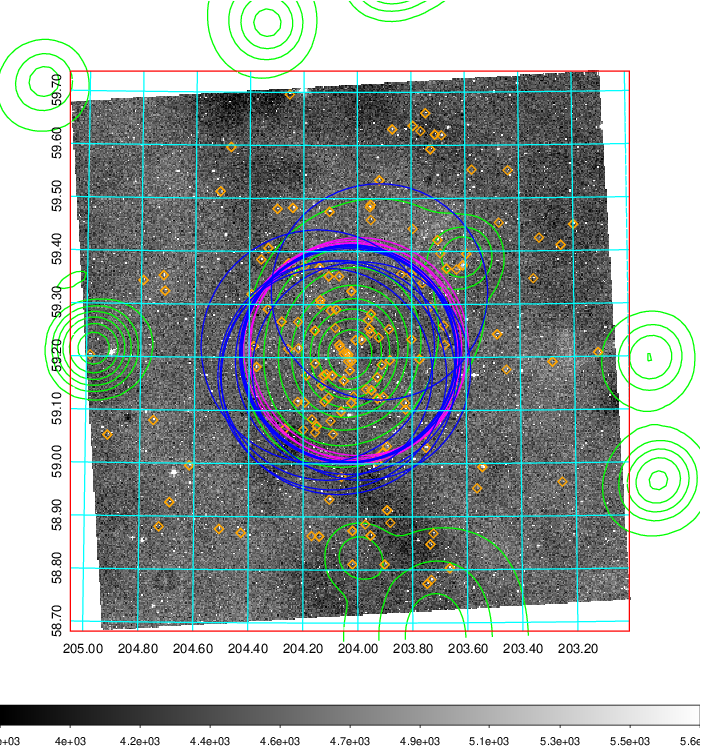  Blue circle for optical clusters;  Magenta circle for XSZ clusters;  all with r=1Mpc;  Only GC with Delta_z<0.01 are shown. | 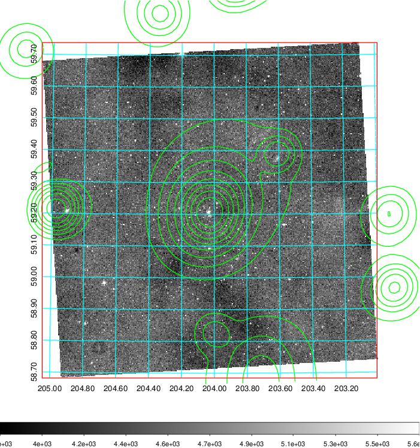 Blue circle for optical clusters;  Magenta circle for XSZ clusters;  all with r=1Mpc;  Only GC with Delta_z<0.01 are shown.  |

|[Previous-identified clusters](../image/521/521_gc.pdf) | [2MASS image](../image/521/521_2mass.pdf)      |[SDSS image](../image/521/521_sdss.pdf)   |
|-------------------|-------------------|-------------------|
|  Green, magenta, and blue circles  for optical, X-ray and SZ clusters  respectively, with redshift of clusters  labelled. The radius of circles  are 1Mpc.|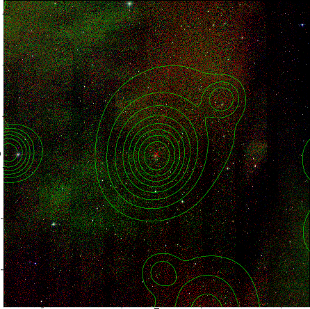  | 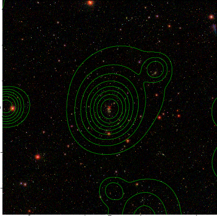  |

