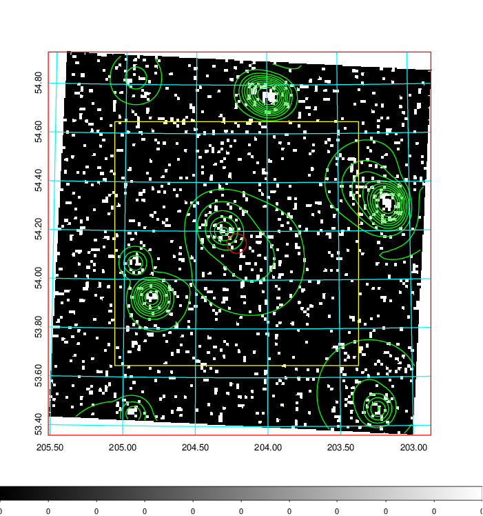
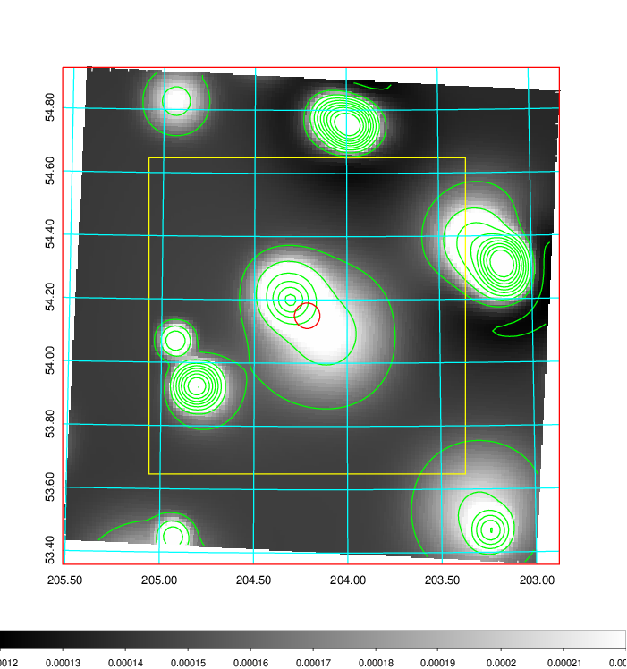
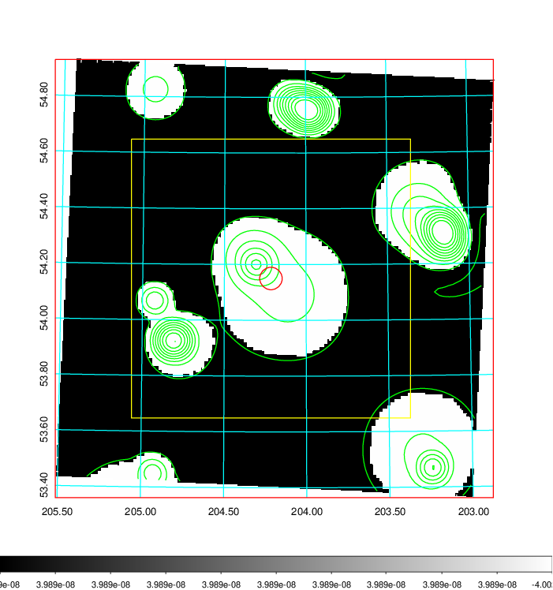
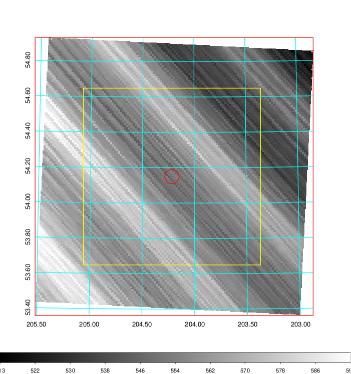
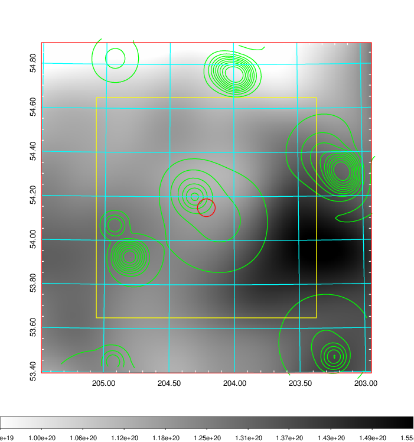
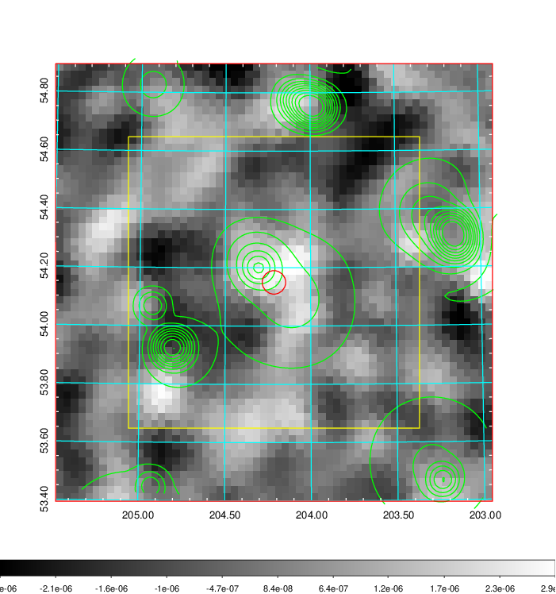
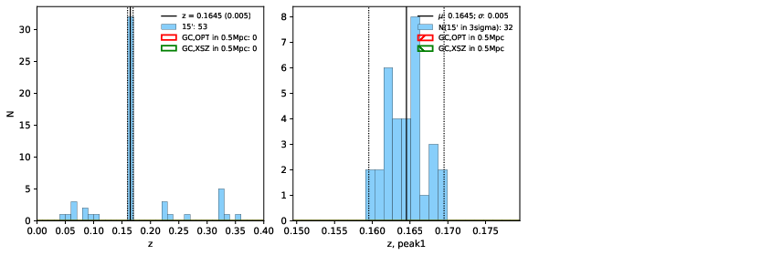
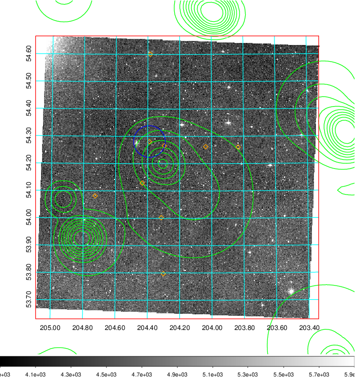
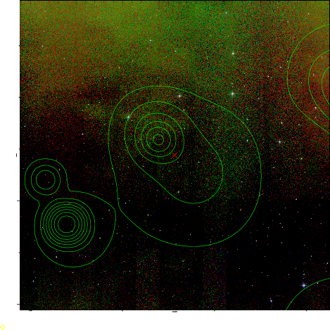
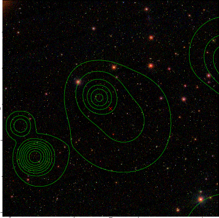

### 522

|Name|RAJ2000[deg]|DEJ2000[deg] |Ext[arcmin]| Ext,ml | z | z_src| C|GC(XSZ,Delta_z<0.01)| GC(OPT,Delta_z<0.01)|GC| R_sig[arcmin] | R500[arcmin] | R500[Mpc]| CRsig[c/s] | CR500[c/s] |L500[1E44 erg/s]|F500[1E-12 erg/s/cm^2]| M500[1E14 Msun]|Tx[keV]|Cnt_sig|Beta|Rc[arcmin]|Comment|Alias|
|---|---|---|---|---|---|------|---|--------|---------|----------|---|---|---|---|---|---|---|---|---|---|---|---|---|---|
|522| 204.215| 54.150| 2.42| 25.52| 0.1645(0.005)| z1,| G| -| -| C, F20, N, SPI, W| 14.650| 5.277| 0.893| 0.091(0.027)| 0.082(0.025)| 1.245(0.734)| 1.671(0.985)| 2.38(0.69)| 3.85(0.71)| 56.1| 0.571(-0.054+0.140)| 4.673(-0.638+1.352)| -| t089|

|[RASS image](../image/522/522_img.pdf)|[filtered image](../image/522/522_fil.pdf)|[Segment image](../image/522/522_seg.pdf)|
|-------------------|--------------------|-------------------|
|   |    |   |

|[Exposure image](../image/522/522_mex.pdf)| [nH image](../image/522/522_nh.pdf)| [Planck image](../image/522/522_p.pdf)|
|-------------------|--------------------|-------------------|
|   |     |  |

|[Redshift Histogram](../image/522/522_zg.pdf) | [DSS image(z1)](../image/522/522_dss_z1.pdf)      |  [DSS image(z2)](../image/522/522_dss_z2.pdf)    |
|-------------------|--------------------|-------------------|
| |  Blue circle for optical clusters;  Magenta circle for XSZ clusters;  all with r=1Mpc;  Only GC with Delta_z<0.01 are shown. |  Blue circle for optical clusters;  Magenta circle for XSZ clusters;  all with r=1Mpc;  Only GC with Delta_z<0.01 are shown.  |

|[known Abell/XSZ clusters](../image/522/522_gc.pdf) | [2MASS image](../image/522/522_2mass.pdf)      |[SDSS image](../image/522/522_sdss.pdf)   |
|-------------------|-------------------|-------------------|
|  Magenta, blue and green circles  for optical, X-ray and SZ clusters  respectively, with redshift of clusters  labelled. The radius of circles  are 1Mpc.|  |   |

