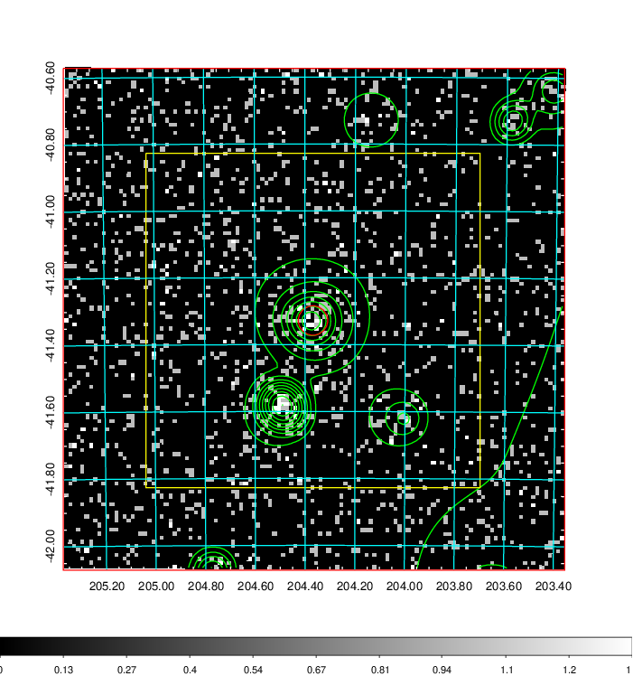
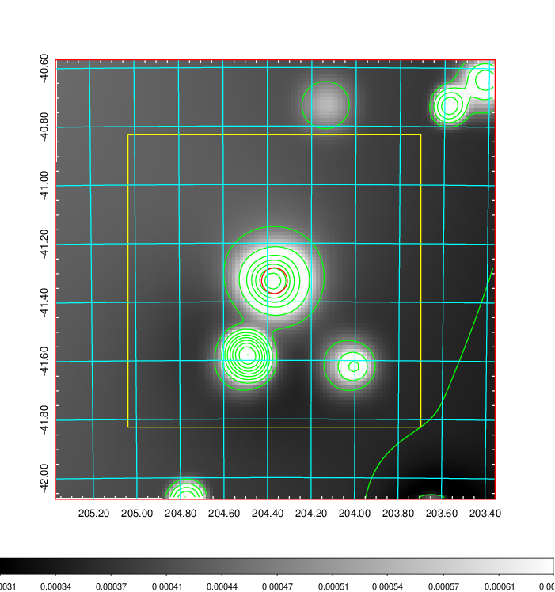
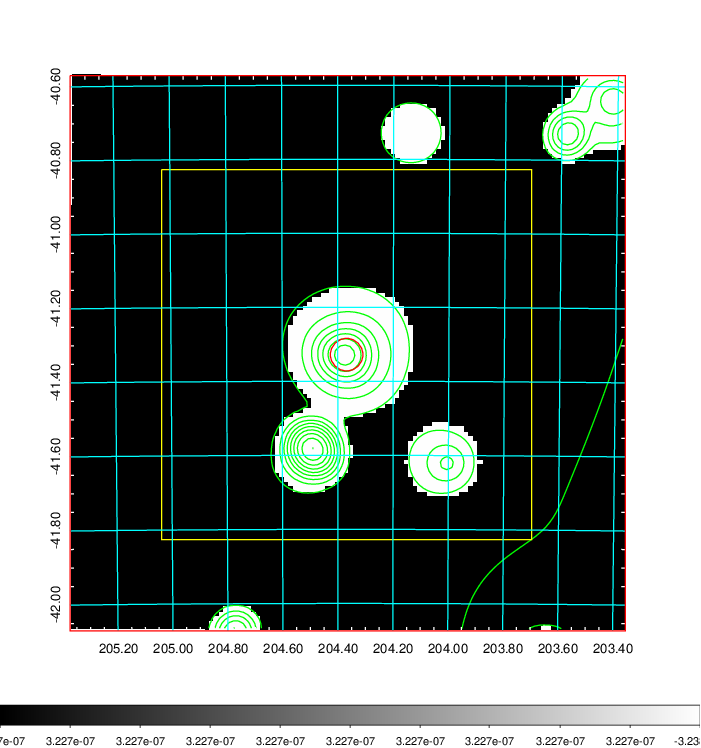
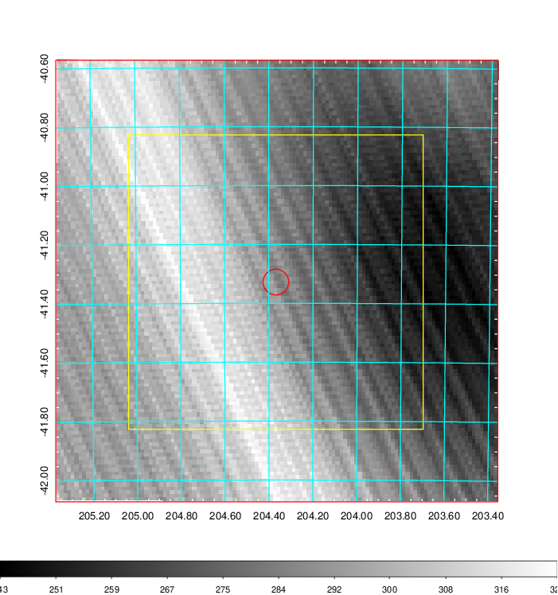
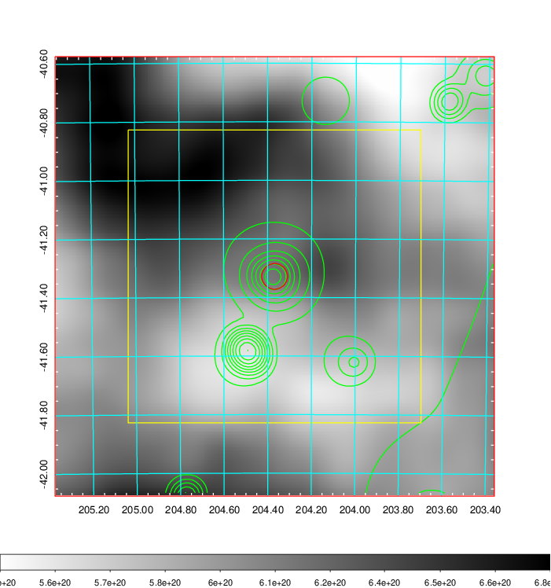
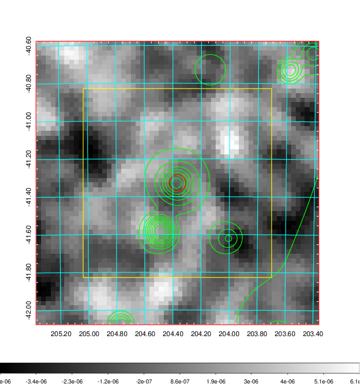
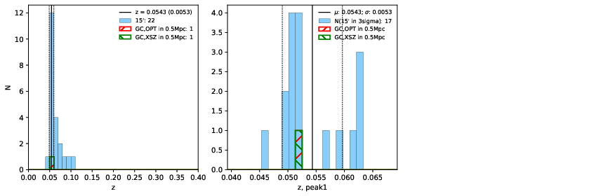
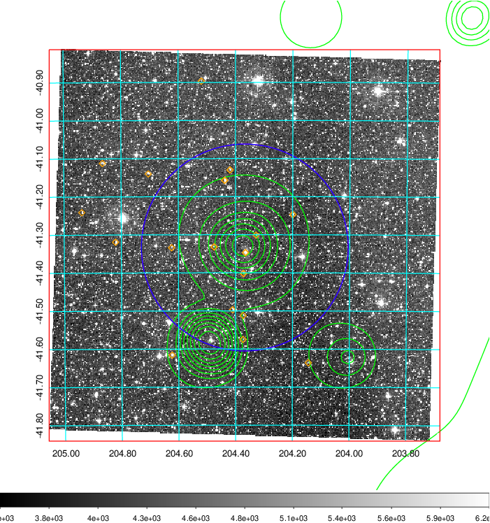
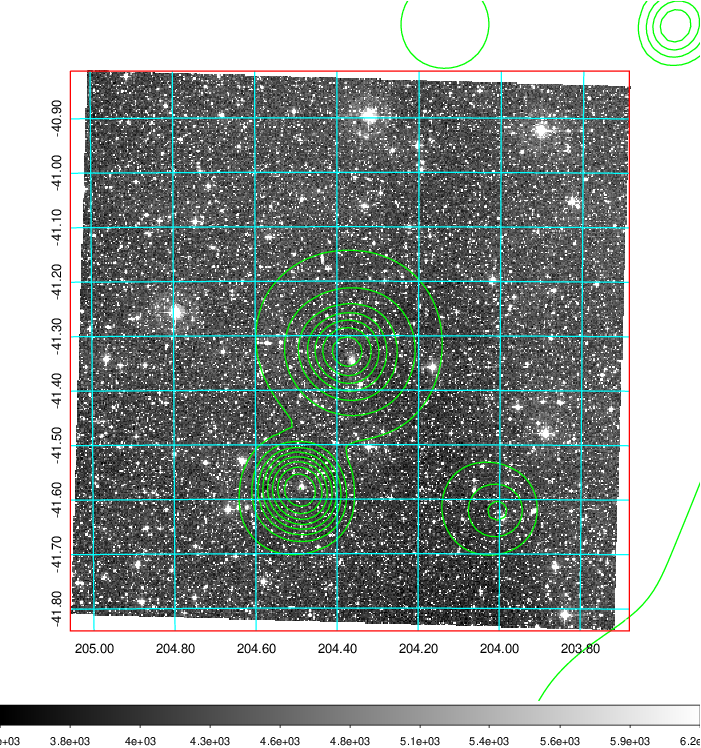
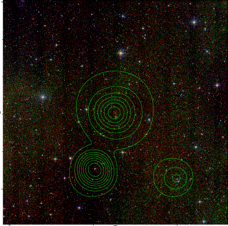

### 523

|Name|RAJ2000[deg]|DEJ2000[deg] |Ext[arcmin]| Ext,ml | z | z_src| C|GC(XSZ,Delta_z<0.01)| GC(OPT,Delta_z<0.01)|GC| R_sig[arcmin] | R500[arcmin] | R500[Mpc]| CRsig[c/s] | CR500[c/s] |L500[1E44 erg/s]|F500[1E-12 erg/s/cm^2]| M500[1E14 Msun]|Tx[keV]|Cnt_sig|Beta|Rc[arcmin]|Comment|Alias|
|---|---|---|---|---|---|------|---|--------|---------|----------|---|---|---|---|---|---|---|---|---|---|---|---|---|---|
|523| 204.368| -41.328| 2.64| 30.45| 0.0543(0.005)| z1, z_xsz| B| MCXC| N| MCXC, N| 19.269| 12.068| 0.765| 0.298(0.108)| 0.281(0.101)| 0.335(0.072)| 4.782(1.032)| 1.34(0.15)| 2.61(0.18)| 149.6| 0.550(-0.034+0.059)| 2.590(-0.561+0.865)| -| k326|

|[RASS image](../image/523/523_img.pdf)|[filtered image](../image/523/523_fil.pdf)|[Segment image](../image/523/523_seg.pdf)|
|-------------------|--------------------|-------------------|
|   |    |   |

|[Exposure image](../image/523/523_mex.pdf)| [nH image](../image/523/523_nh.pdf)| [Planck image](../image/523/523_p.pdf)|
|-------------------|--------------------|-------------------|
|   |     |  |

|[Redshift Histogram](../image/523/523_zg.pdf) | [DSS image(z1)](../image/523/523_dss_z1.pdf)      |  [DSS image(z2)](../image/523/523_dss_z2.pdf)    |
|-------------------|--------------------|-------------------|
| |  Blue circle for optical clusters;  Magenta circle for XSZ clusters;  all with r=1Mpc;  Only GC with Delta_z<0.01 are shown. |  Blue circle for optical clusters;  Magenta circle for XSZ clusters;  all with r=1Mpc;  Only GC with Delta_z<0.01 are shown.  |

|[known Abell/XSZ clusters](../image/523/523_gc.pdf) | [2MASS image](../image/523/523_2mass.pdf)      |
|-------------------|-------------------|
|  Magenta, blue and green circles  for optical, X-ray and SZ clusters  respectively, with redshift of clusters  labelled. The radius of circles  are 1Mpc.|  |

