

### 524

|Name|RAJ2000[deg]|DEJ2000[deg] |Ext[arcmin]| Ext,ml | z | z_src| C|GC(XSZ,Delta_z<0.01)| GC(OPT,Delta_z<0.01)|GC| R_sig[arcmin] | R500[arcmin] | R500[Mpc]| CRsig[c/s] | CR500[c/s] |L500[1E44 erg/s]|F500[1E-12 erg/s/cm^2]| M500[1E14 Msun]|Tx[keV]|Cnt_sig|Beta|Rc[arcmin]|Comment|Alias|
|---|---|---|---|---|---|------|---|--------|---------|----------|---|---|---|---|---|---|---|---|---|---|---|---|---|---|
|524| 205.259| 16.876| 15.49| 40.75| 0.0933(0.006)| z1,| G| -| -| C, N, W| 15.812| 7.922| 0.824| 0.172(0.077)| 0.159(0.072)| 0.680(0.436)| 3.109(1.992)| 1.74(0.56)| 3.10(0.63)| 68.8| 0.905(-0.116+0.069)| 15.502(-2.159+1.782)| -| t543|

|[RASS image](../image/524/524_img.pdf)|[filtered image](../image/524/524_fil.pdf)|[Segment image](../image/524/524_seg.pdf)|
|-------------------|--------------------|-------------------|
| 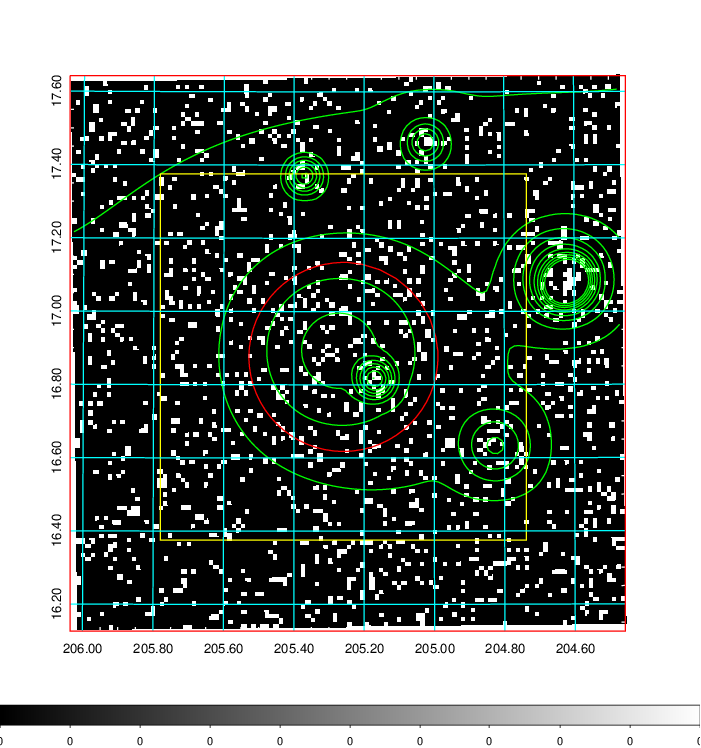  | 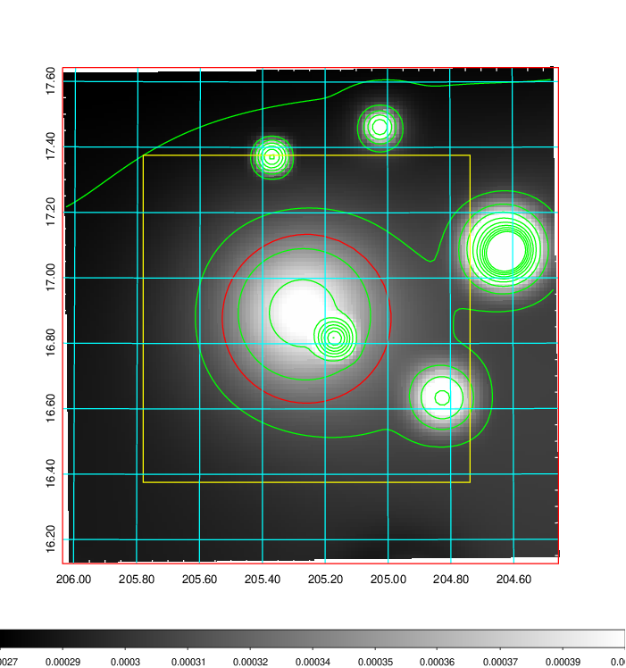   | 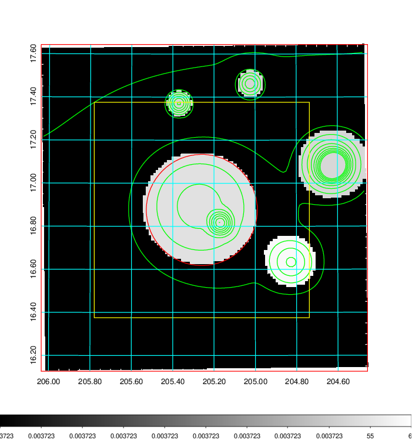  |

|[Exposure image](../image/524/524_mex.pdf)| [nH image](../image/524/524_nh.pdf)| [Planck image](../image/524/524_p.pdf)|
|-------------------|--------------------|-------------------|
|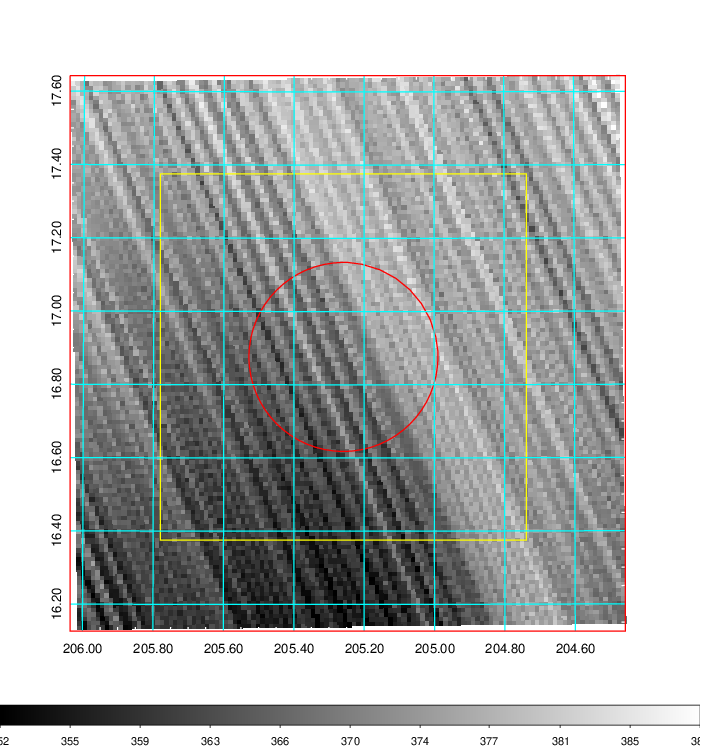   | 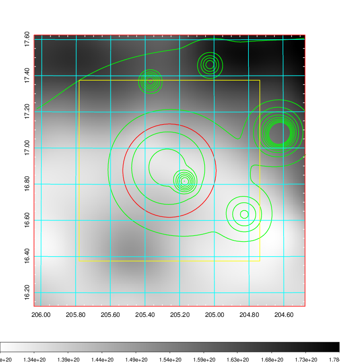    | 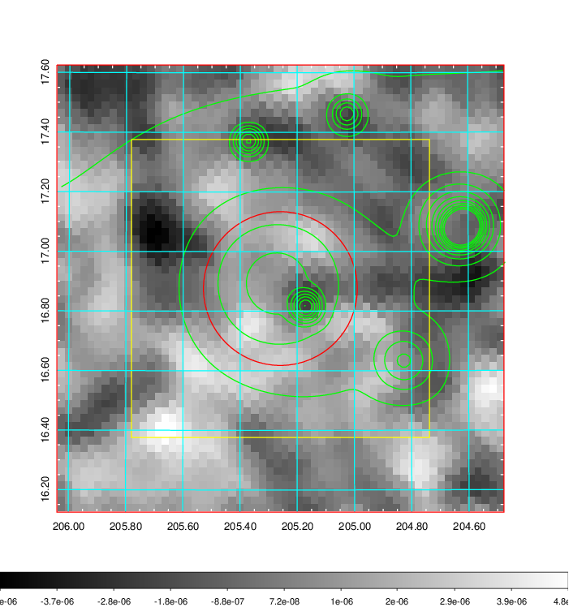 |

|[Redshift Histogram](../image/524/524_zg.pdf) | [DSS image(z1)](../image/524/524_dss_z1.pdf)      |  [DSS image(z2)](../image/524/524_dss_z2.pdf)    |
|-------------------|--------------------|-------------------|
|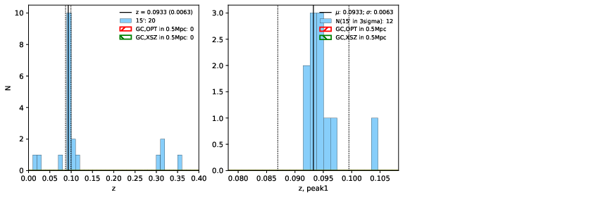 |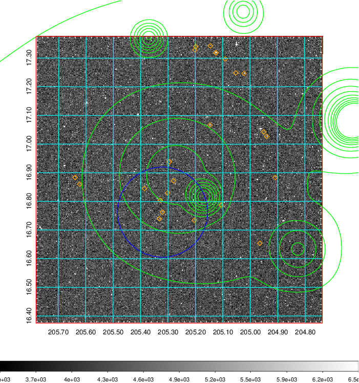  Blue circle for optical clusters;  Magenta circle for XSZ clusters;  all with r=1Mpc;  Only GC with Delta_z<0.01 are shown. | 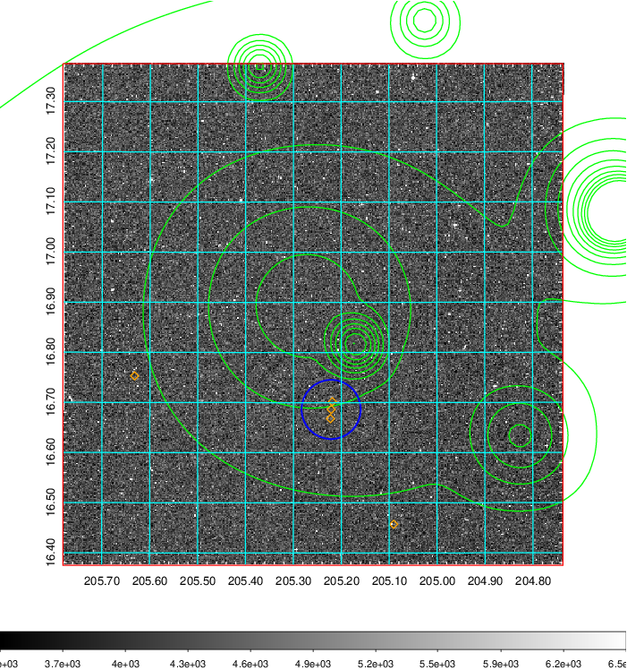 Blue circle for optical clusters;  Magenta circle for XSZ clusters;  all with r=1Mpc;  Only GC with Delta_z<0.01 are shown.  |

|[Previous-identified clusters](../image/524/524_gc.pdf) | [2MASS image](../image/524/524_2mass.pdf)      |[SDSS image](../image/524/524_sdss.pdf)   |
|-------------------|-------------------|-------------------|
|  Green, magenta, and blue circles  for optical, X-ray and SZ clusters  respectively, with redshift of clusters  labelled. The radius of circles  are 1Mpc.|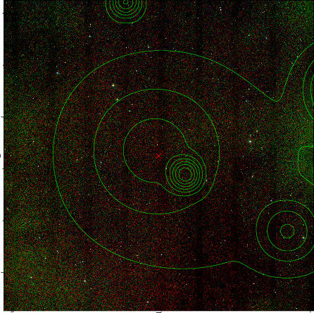  | 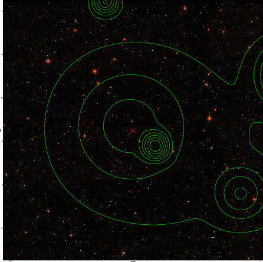  |

