

### 525

|Name|RAJ2000[deg]|DEJ2000[deg] |Ext[arcmin]| Ext,ml | z | z_src| C|GC(XSZ,Delta_z<0.01)| GC(OPT,Delta_z<0.01)|GC| R_sig[arcmin] | R500[arcmin] | R500[Mpc]| CRsig[c/s] | CR500[c/s] |L500[1E44 erg/s]|F500[1E-12 erg/s/cm^2]| M500[1E14 Msun]|Tx[keV]|Cnt_sig|Beta|Rc[arcmin]|Comment|Alias|
|---|---|---|---|---|---|------|---|--------|---------|----------|---|---|---|---|---|---|---|---|---|---|---|---|---|---|
|525| 205.459| 26.392| 1.60| 131.24| 0.0732(0.005)| z1, z_xsz| B| F20, L03, MCXC, PSZ2, Tar, XB| A, N, RM| A, F20, L03, MCXC, N, PSZ2, Tar, W, XB| 17.575| 11.988| 1.002| 0.674(0.049)| 0.640(0.047)| 1.711(0.071)| 13.069(0.543)| 3.06(0.06)| 4.37(0.06)| 250.8| 0.631(-0.050+0.067)| 2.589(-0.467+0.556)| -| k138|

|[RASS image](../image/525/525_img.pdf)|[filtered image](../image/525/525_fil.pdf)|[Segment image](../image/525/525_seg.pdf)|
|-------------------|--------------------|-------------------|
| 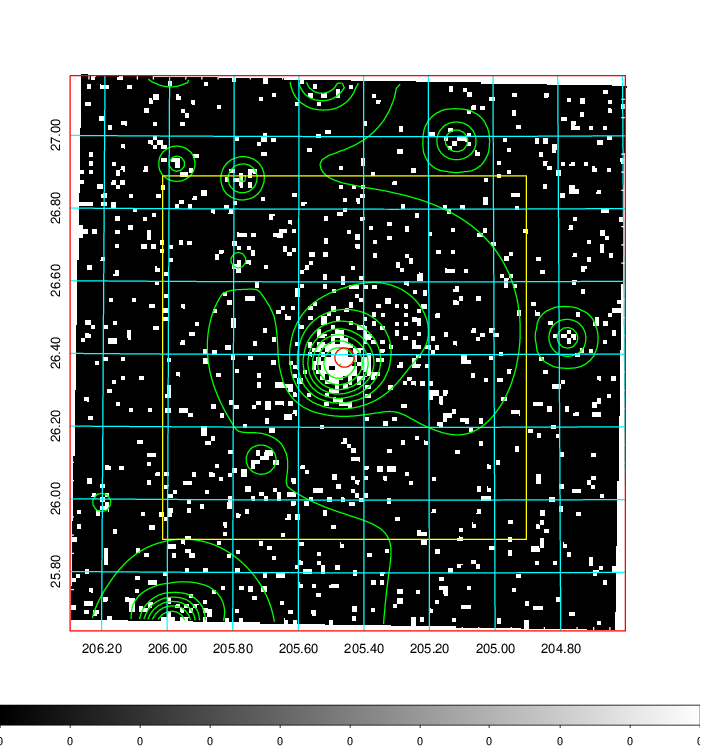  | 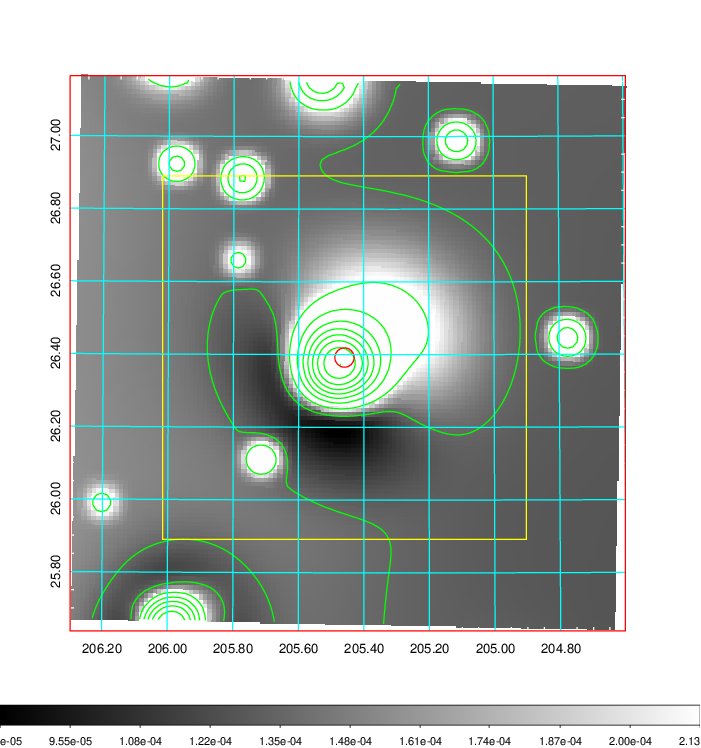   | 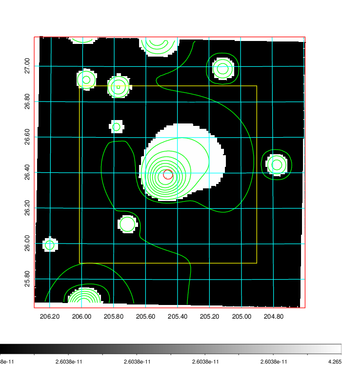  |

|[Exposure image](../image/525/525_mex.pdf)| [nH image](../image/525/525_nh.pdf)| [Planck image](../image/525/525_p.pdf)|
|-------------------|--------------------|-------------------|
|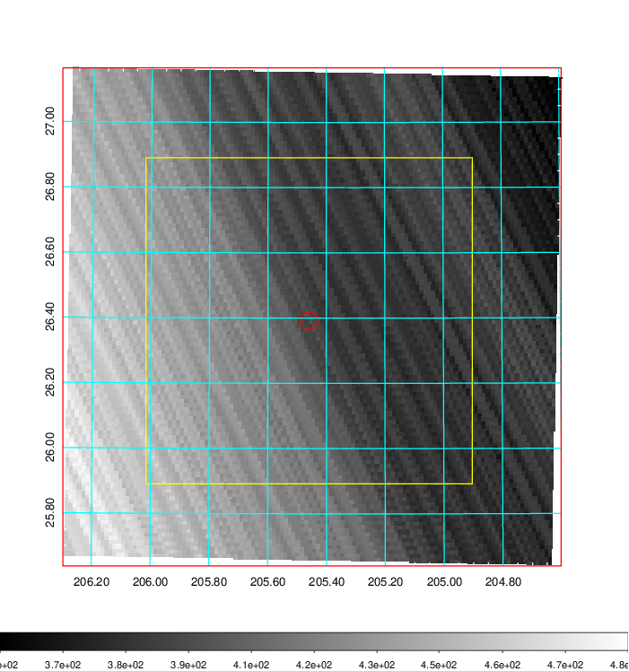   | 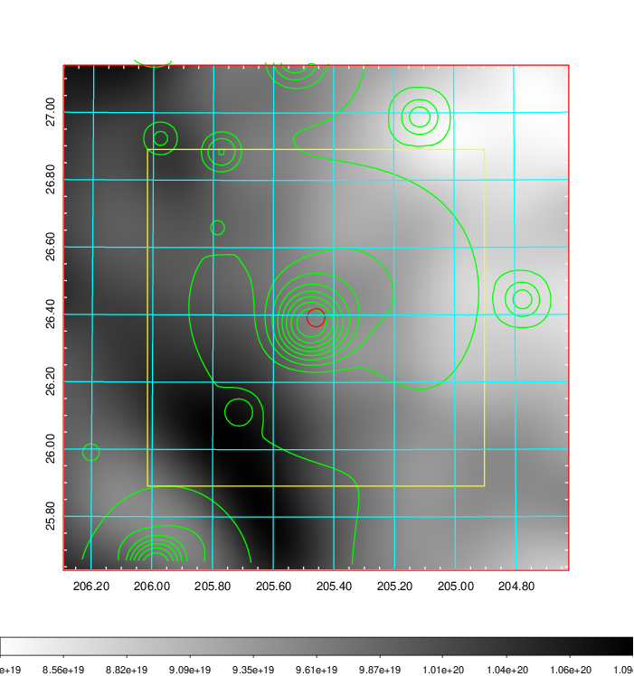    | 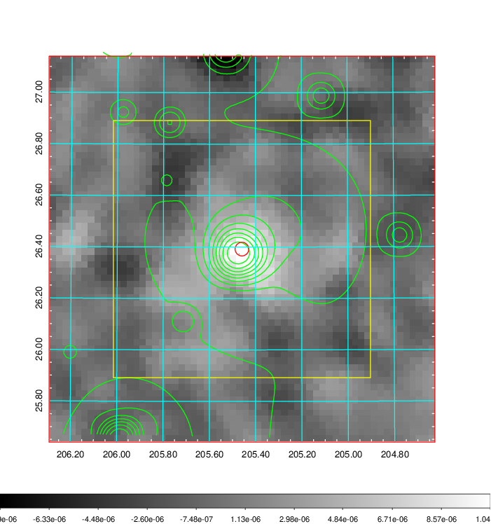 |

|[Redshift Histogram](../image/525/525_zg.pdf) | [DSS image(z1)](../image/525/525_dss_z1.pdf)      |  [DSS image(z2)](../image/525/525_dss_z2.pdf)    |
|-------------------|--------------------|-------------------|
|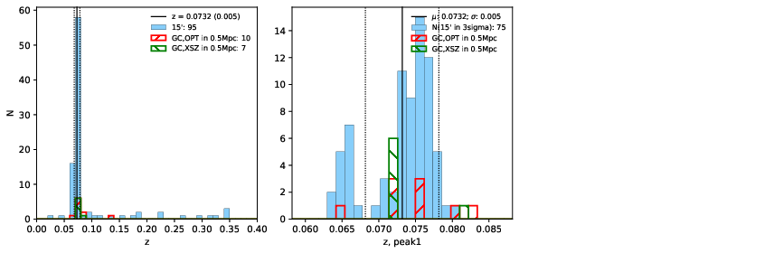 |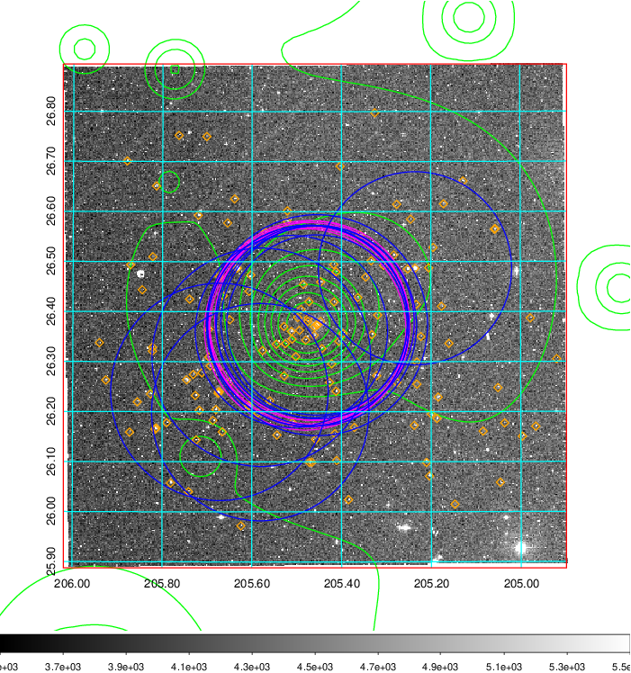  Blue circle for optical clusters;  Magenta circle for XSZ clusters;  all with r=1Mpc;  Only GC with Delta_z<0.01 are shown. | 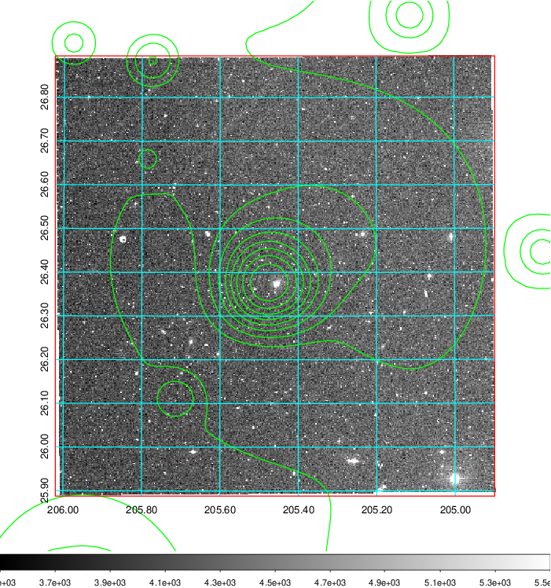 Blue circle for optical clusters;  Magenta circle for XSZ clusters;  all with r=1Mpc;  Only GC with Delta_z<0.01 are shown.  |

|[Previous-identified clusters](../image/525/525_gc.pdf) | [2MASS image](../image/525/525_2mass.pdf)      |[SDSS image](../image/525/525_sdss.pdf)   |
|-------------------|-------------------|-------------------|
|  Green, magenta, and blue circles  for optical, X-ray and SZ clusters  respectively, with redshift of clusters  labelled. The radius of circles  are 1Mpc.|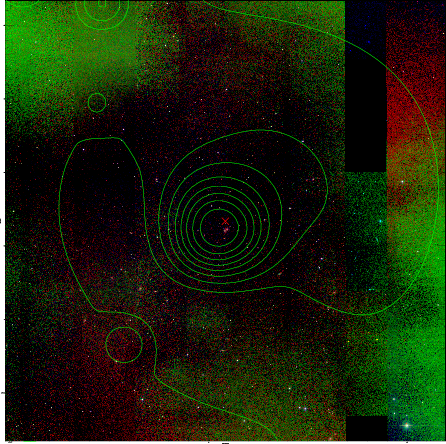  | 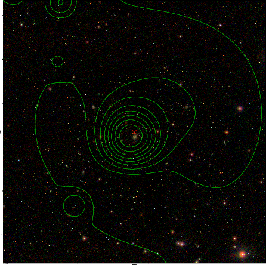  |

