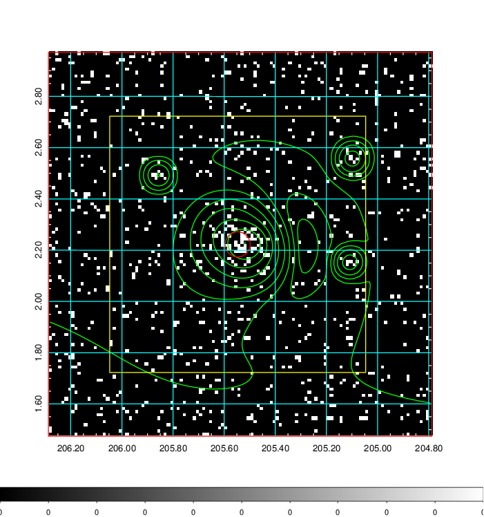
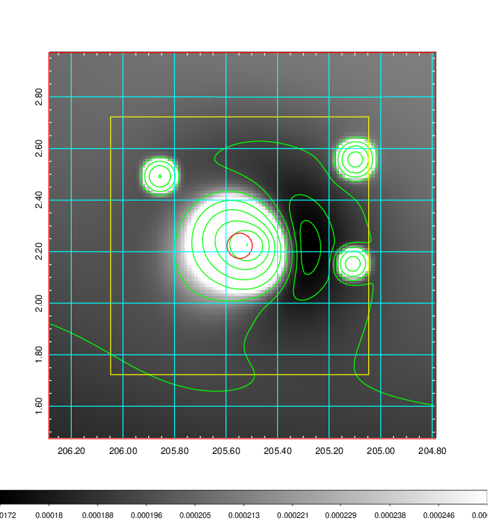
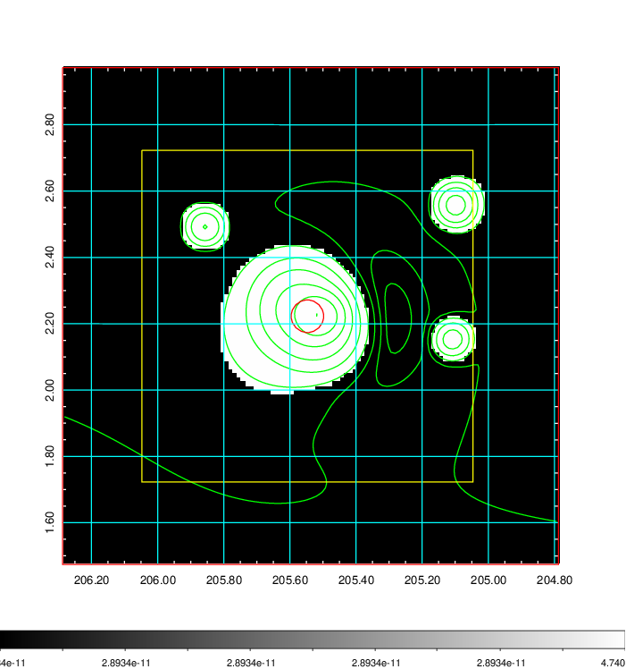
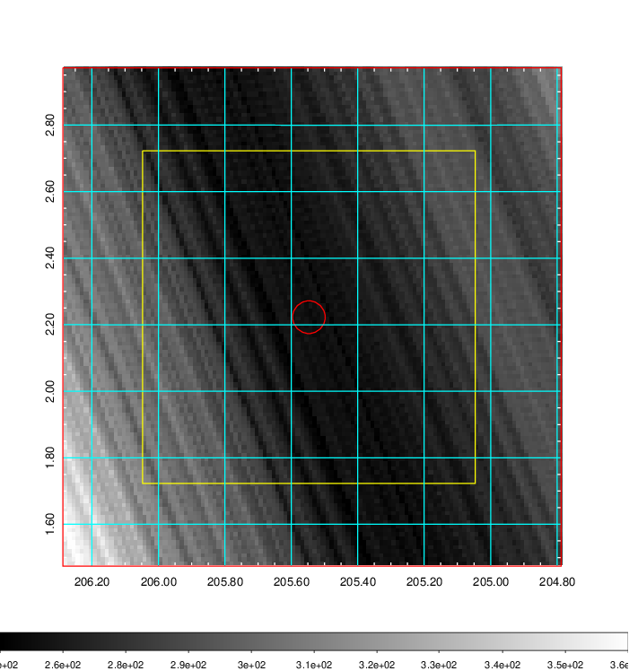
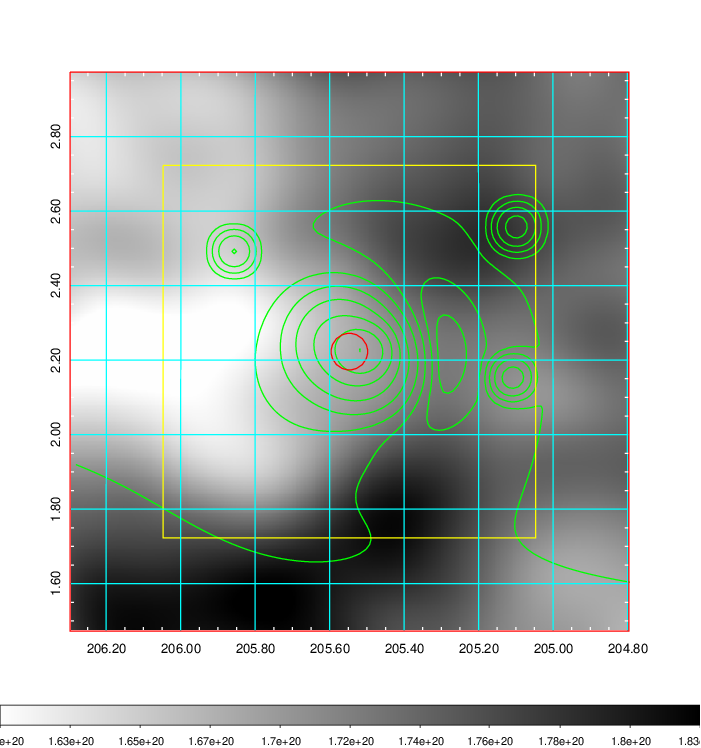
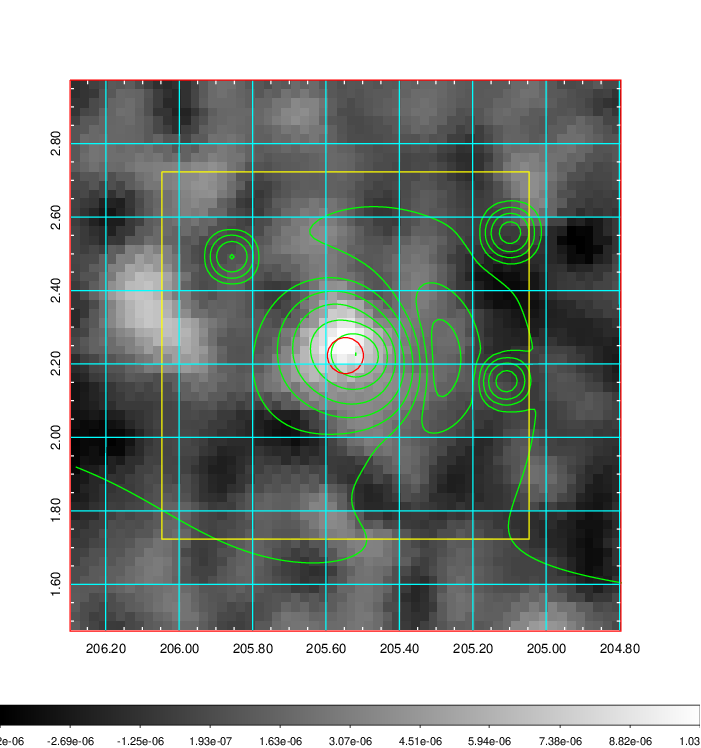
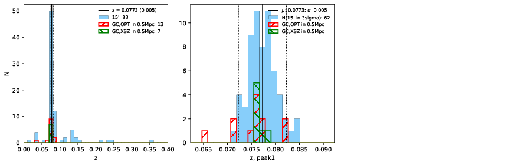
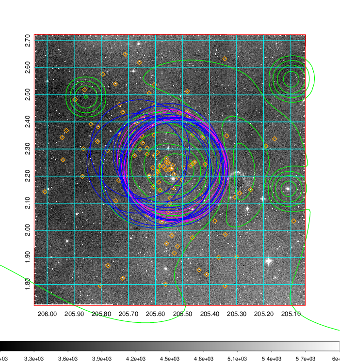
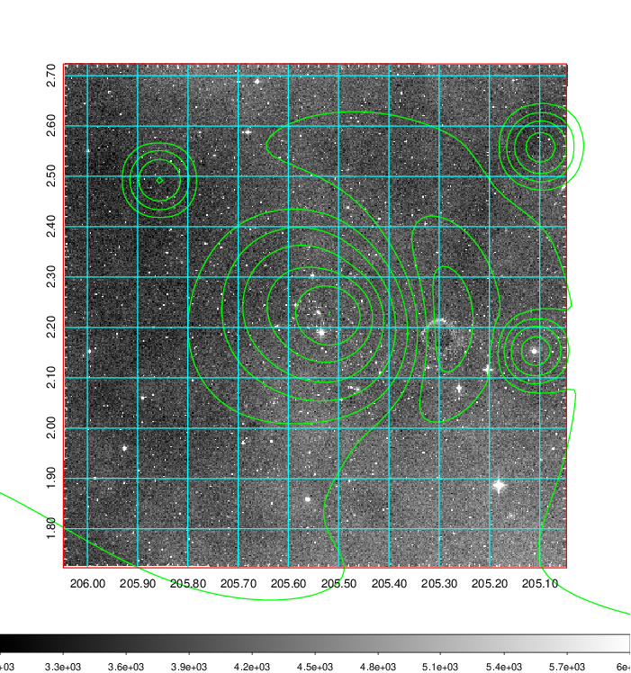
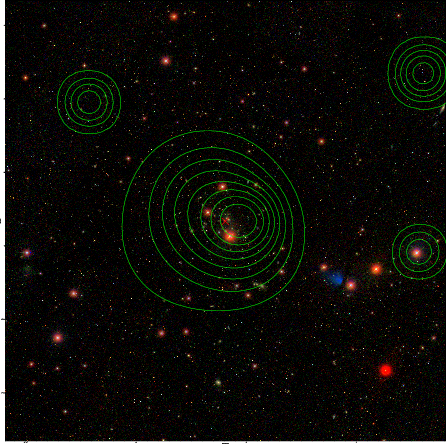

### 526

|Name|RAJ2000[deg]|DEJ2000[deg] |Ext[arcmin]| Ext,ml | z | z_src| C|GC(XSZ,Delta_z<0.01)| GC(OPT,Delta_z<0.01)|GC| R_sig[arcmin] | R500[arcmin] | R500[Mpc]| CRsig[c/s] | CR500[c/s] |L500[1E44 erg/s]|F500[1E-12 erg/s/cm^2]| M500[1E14 Msun]|Tx[keV]|Cnt_sig|Beta|Rc[arcmin]|Comment|Alias|
|---|---|---|---|---|---|------|---|--------|---------|----------|---|---|---|---|---|---|---|---|---|---|---|---|---|---|
|526| 205.547| 2.223| 2.95| 72.42| 0.0773(0.005)| z1, z_xsz| B| F20, L03, MCXC, PSZ2, Tar, XB| A, N, W| A, C, F20, L03, MCXC, N, PSZ2, Tar, W, XB| 9.288| 9.749| 0.856| 0.266(0.049)| 0.268(0.050)| 0.764(0.081)| 5.203(0.554)| 1.92(0.10)| 3.28(0.11)| 76.5| 0.922(-0.096+0.057)| 5.101(-0.652+0.516)| -| k369|

|[RASS image](../image/526/526_img.pdf)|[filtered image](../image/526/526_fil.pdf)|[Segment image](../image/526/526_seg.pdf)|
|-------------------|--------------------|-------------------|
|   |    |   |

|[Exposure image](../image/526/526_mex.pdf)| [nH image](../image/526/526_nh.pdf)| [Planck image](../image/526/526_p.pdf)|
|-------------------|--------------------|-------------------|
|   |     |  |

|[Redshift Histogram](../image/526/526_zg.pdf) | [DSS image(z1)](../image/526/526_dss_z1.pdf)      |  [DSS image(z2)](../image/526/526_dss_z2.pdf)    |
|-------------------|--------------------|-------------------|
| |  Blue circle for optical clusters;  Magenta circle for XSZ clusters;  all with r=1Mpc;  Only GC with Delta_z<0.01 are shown. |  Blue circle for optical clusters;  Magenta circle for XSZ clusters;  all with r=1Mpc;  Only GC with Delta_z<0.01 are shown.  |

|[known Abell/XSZ clusters](../image/526/526_gc.pdf) | [2MASS image](../image/526/526_2mass.pdf)      |[SDSS image](../image/526/526_sdss.pdf)   |
|-------------------|-------------------|-------------------|
|  Magenta, blue and green circles  for optical, X-ray and SZ clusters  respectively, with redshift of clusters  labelled. The radius of circles  are 1Mpc.|  |   |

