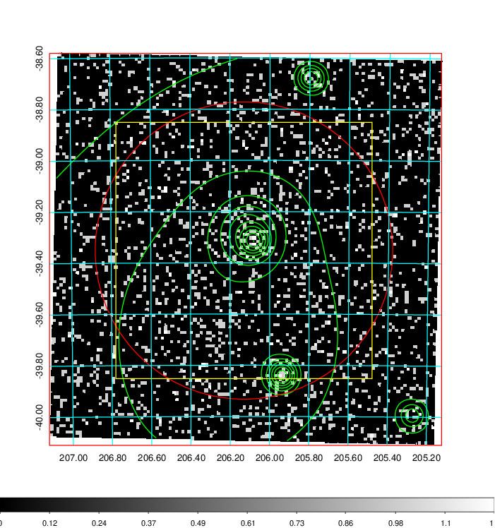
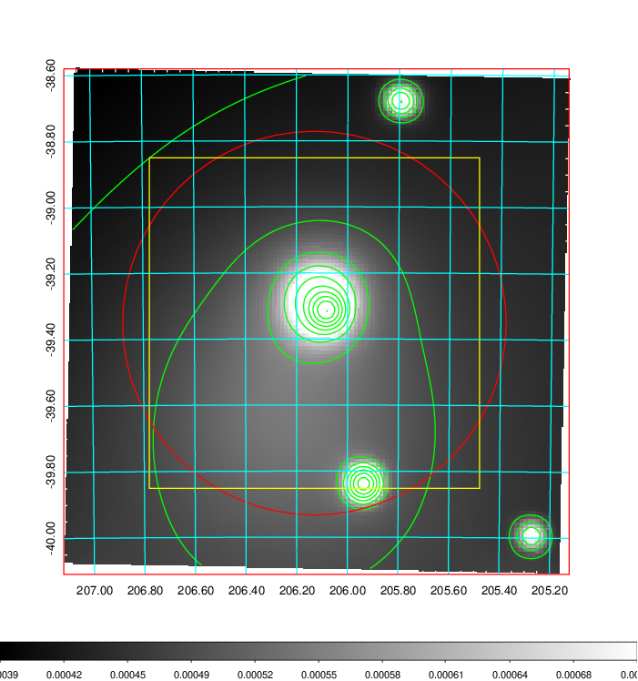
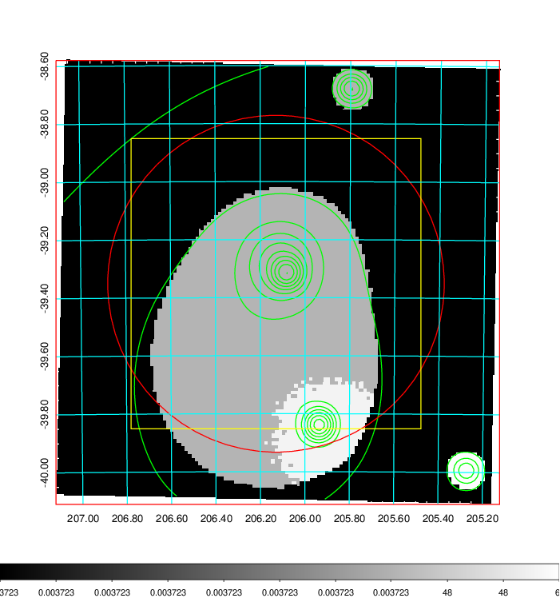
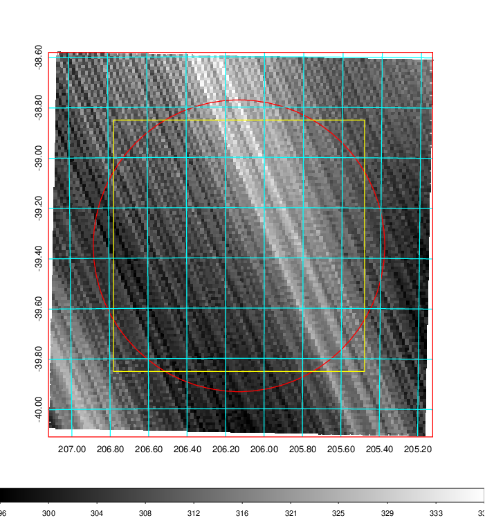
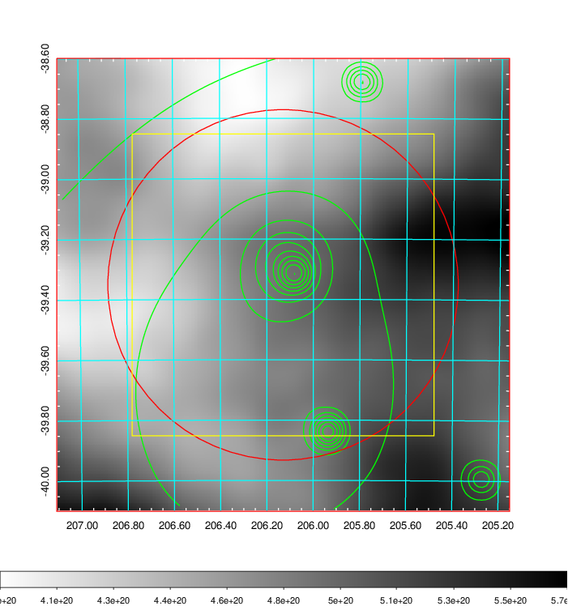
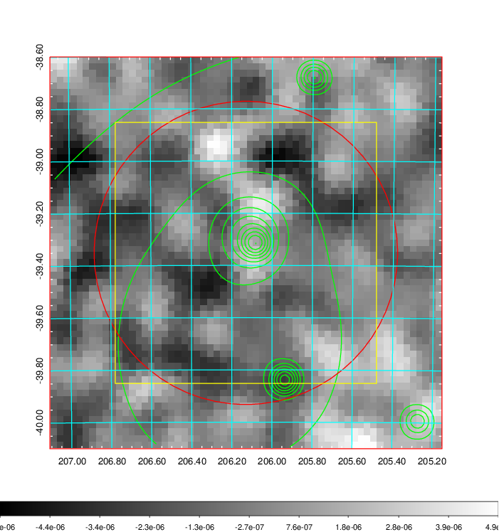
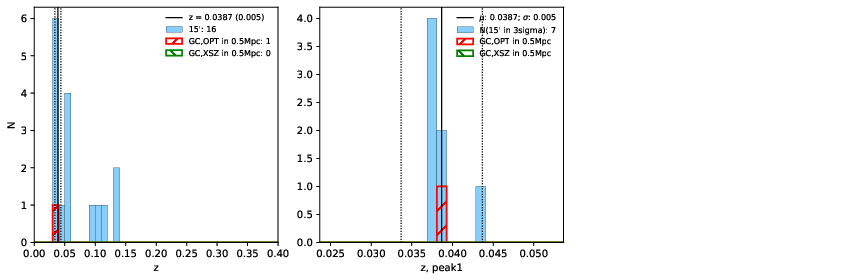
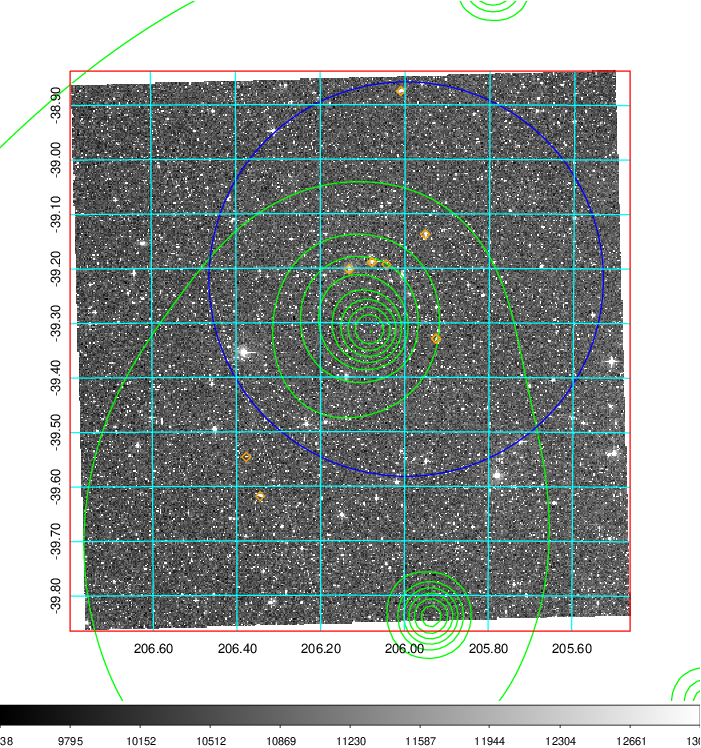
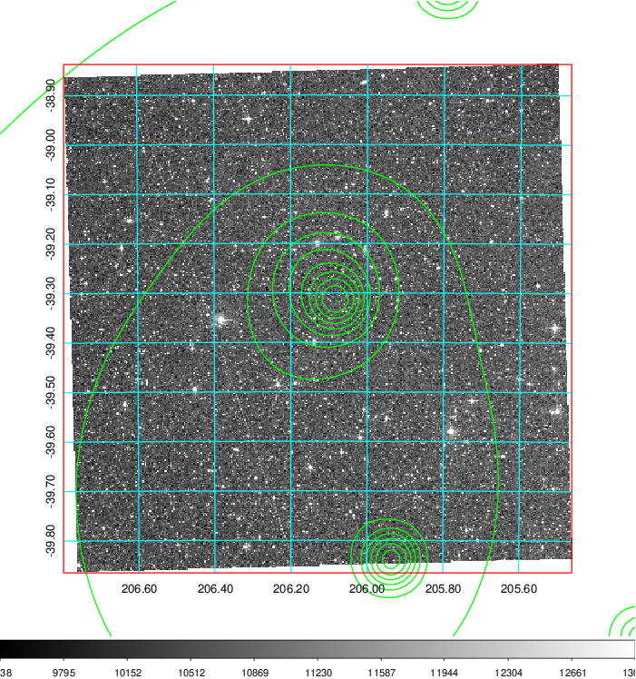
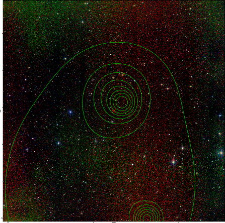

### 528

|Name|RAJ2000[deg]|DEJ2000[deg] |Ext[arcmin]| Ext,ml | z | z_src| C|GC(XSZ,Delta_z<0.01)| GC(OPT,Delta_z<0.01)|GC| R_sig[arcmin] | R500[arcmin] | R500[Mpc]| CRsig[c/s] | CR500[c/s] |L500[1E44 erg/s]|F500[1E-12 erg/s/cm^2]| M500[1E14 Msun]|Tx[keV]|Cnt_sig|Beta|Rc[arcmin]|Comment|Alias|
|---|---|---|---|---|---|------|---|--------|---------|----------|---|---|---|---|---|---|---|---|---|---|---|---|---|---|
|528| 206.130| -39.352| 34.83| 87.44| 0.0387(0.005)| z1, z_opt| S| -| N| N| 30.131| 15.267| 0.702| 0.402(0.116)| 0.371(0.107)| 0.219(0.056)| 6.292(1.616)| 1.02(0.13)| 2.20(0.18)| 231.2| 0.536(-0.027+0.069)| 7.094(-1.152+1.966)| -| t658|

|[RASS image](../image/528/528_img.pdf)|[filtered image](../image/528/528_fil.pdf)|[Segment image](../image/528/528_seg.pdf)|
|-------------------|--------------------|-------------------|
|   |    |   |

|[Exposure image](../image/528/528_mex.pdf)| [nH image](../image/528/528_nh.pdf)| [Planck image](../image/528/528_p.pdf)|
|-------------------|--------------------|-------------------|
|   |     |  |

|[Redshift Histogram](../image/528/528_zg.pdf) | [DSS image(z1)](../image/528/528_dss_z1.pdf)      |  [DSS image(z2)](../image/528/528_dss_z2.pdf)    |
|-------------------|--------------------|-------------------|
| |  Blue circle for optical clusters;  Magenta circle for XSZ clusters;  all with r=1Mpc;  Only GC with Delta_z<0.01 are shown. |  Blue circle for optical clusters;  Magenta circle for XSZ clusters;  all with r=1Mpc;  Only GC with Delta_z<0.01 are shown.  |

|[Previous-identified clusters](../image/528/528_gc.pdf) | [2MASS image](../image/528/528_2mass.pdf)      |
|-------------------|-------------------|
|  Green, magenta, and blue circles  for optical, X-ray and SZ clusters  respectively, with redshift of clusters  labelled. The radius of circles  are 1Mpc.|  |

