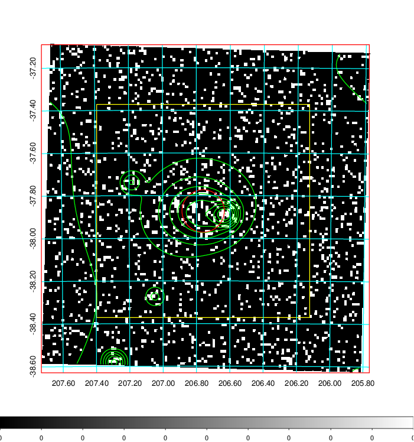
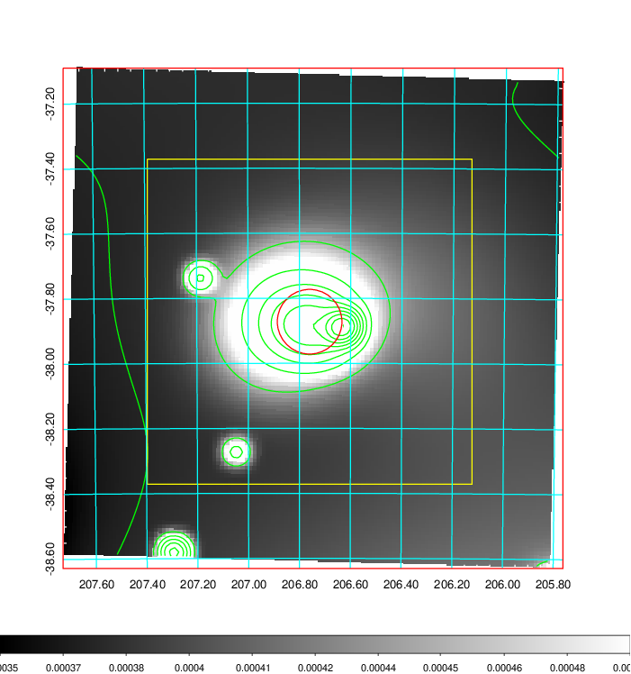
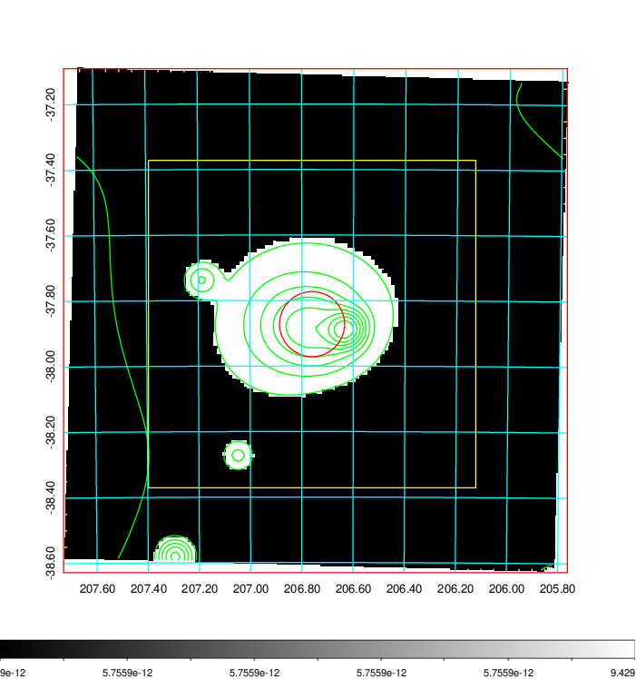
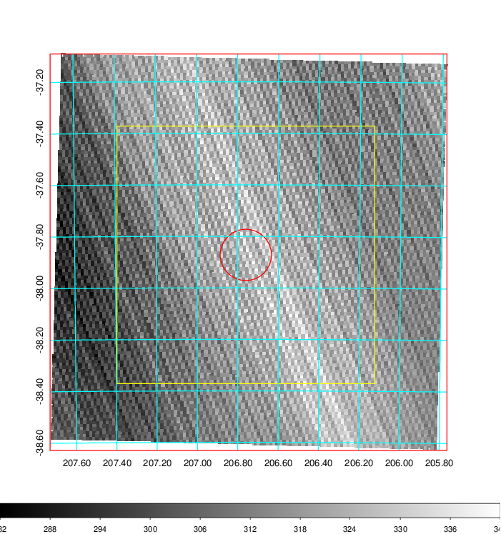
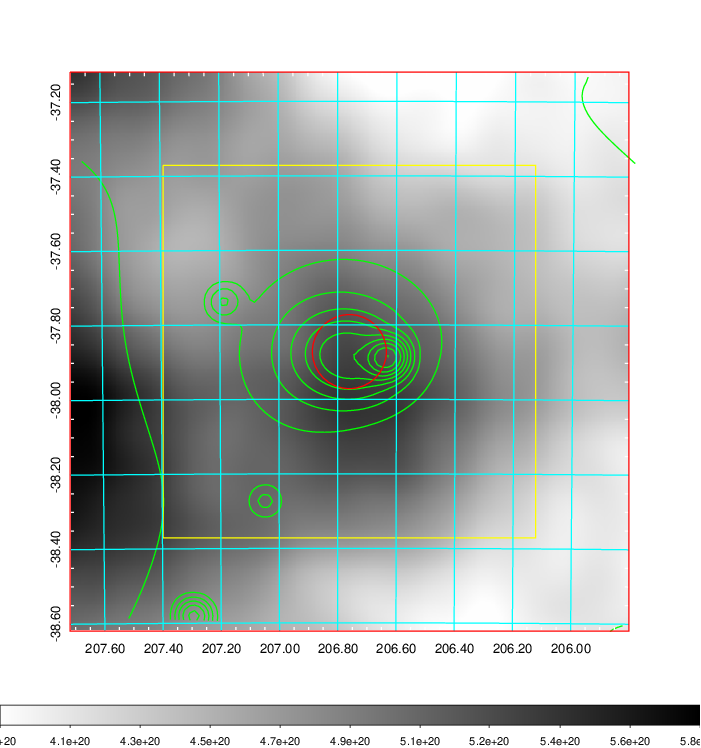
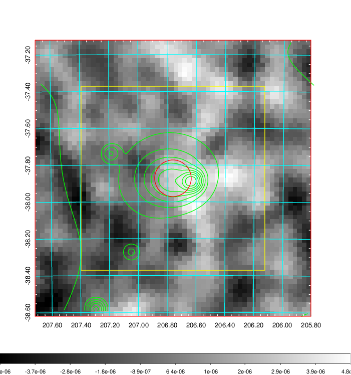
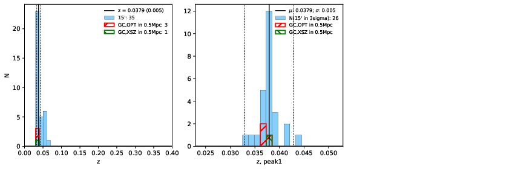
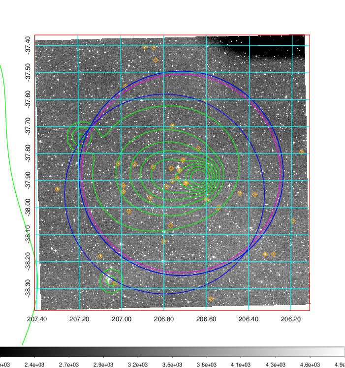
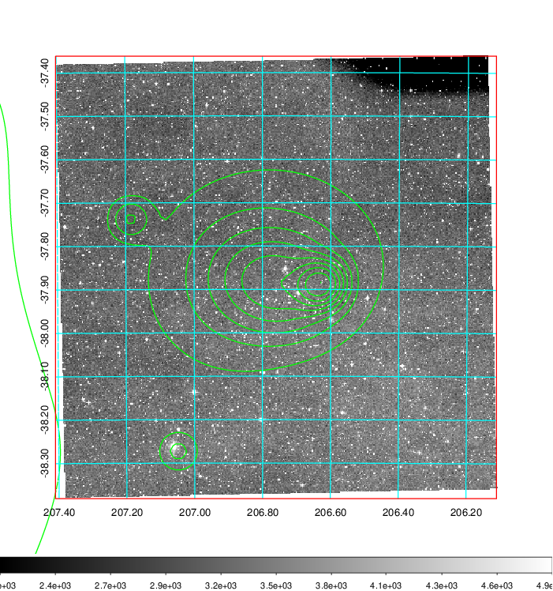
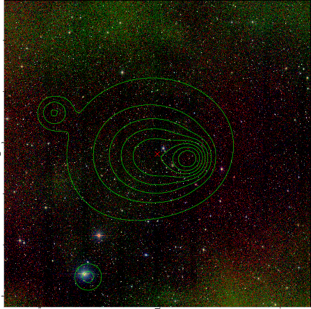

### 529

|Name|RAJ2000[deg]|DEJ2000[deg] |Ext[arcmin]| Ext,ml | z | z_src| C|GC(XSZ,Delta_z<0.01)| GC(OPT,Delta_z<0.01)|GC| R_sig[arcmin] | R500[arcmin] | R500[Mpc]| CRsig[c/s] | CR500[c/s] |L500[1E44 erg/s]|F500[1E-12 erg/s/cm^2]| M500[1E14 Msun]|Tx[keV]|Cnt_sig|Beta|Rc[arcmin]|Comment|Alias|
|---|---|---|---|---|---|------|---|--------|---------|----------|---|---|---|---|---|---|---|---|---|---|---|---|---|---|
|529| 206.760| -37.872| 5.97| 56.40| 0.0379(0.005)| z1, z_xsz| B| MCXC| A, N| A, MCXC, N, SWXCS| 13.188| 14.293| 0.645| 0.252(0.058)| 0.255(0.059)| 0.139(0.017)| 4.159(0.504)| 0.79(0.05)| 1.87(0.07)| 99.3| 0.879(-0.138+0.088)| 8.746(-1.450+1.114)| -| k541|

|[RASS image](../image/529/529_img.pdf)|[filtered image](../image/529/529_fil.pdf)|[Segment image](../image/529/529_seg.pdf)|
|-------------------|--------------------|-------------------|
|   |    |   |

|[Exposure image](../image/529/529_mex.pdf)| [nH image](../image/529/529_nh.pdf)| [Planck image](../image/529/529_p.pdf)|
|-------------------|--------------------|-------------------|
|   |     |  |

|[Redshift Histogram](../image/529/529_zg.pdf) | [DSS image(z1)](../image/529/529_dss_z1.pdf)      |  [DSS image(z2)](../image/529/529_dss_z2.pdf)    |
|-------------------|--------------------|-------------------|
| |  Blue circle for optical clusters;  Magenta circle for XSZ clusters;  all with r=1Mpc;  Only GC with Delta_z<0.01 are shown. |  Blue circle for optical clusters;  Magenta circle for XSZ clusters;  all with r=1Mpc;  Only GC with Delta_z<0.01 are shown.  |

|[Previous-identified clusters](../image/529/529_gc.pdf) | [2MASS image](../image/529/529_2mass.pdf)      |
|-------------------|-------------------|
|  Green, magenta, and blue circles  for optical, X-ray and SZ clusters  respectively, with redshift of clusters  labelled. The radius of circles  are 1Mpc.|  |

