

### 53

|Name|RAJ2000[deg]|DEJ2000[deg] |Ext[arcmin]| Ext,ml | z | z_src| C|GC(XSZ,Delta_z<0.01)| GC(OPT,Delta_z<0.01)|GC| R_sig[arcmin] | R500[arcmin] | R500[Mpc]| CRsig[c/s] | CR500[c/s] |L500[1E44 erg/s]|F500[1E-12 erg/s/cm^2]| M500[1E14 Msun]|Tx[keV]|Cnt_sig|Beta|Rc[arcmin]|Comment|Alias|
|---|---|---|---|---|---|------|---|--------|---------|----------|---|---|---|---|---|---|---|---|---|---|---|---|---|---|
|53| 16.814| 32.405| 11.47| 338.68| 0.0175(0.005)| z1, z_xsz| B| MCXC| N| C, F20, MCXC, N, SPI, W| 32.106| 27.532| 0.588| 0.808(0.071)| 0.789(0.069)| 0.082(0.004)| 11.823(0.631)| 0.59(0.02)| 1.55(0.03)| 490.6| 0.512(-0.009+0.018)| 7.073(-0.397+0.573)| -| k574|

|[RASS image](../image/53/53_img.pdf)|[filtered image](../image/53/53_fil.pdf)|[Segment image](../image/53/53_seg.pdf)|
|-------------------|--------------------|-------------------|
| 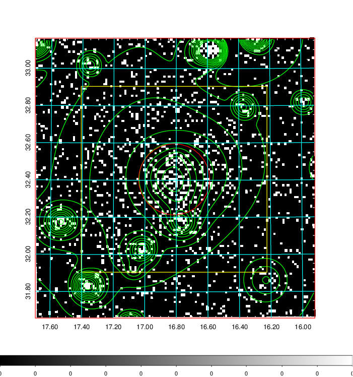  | 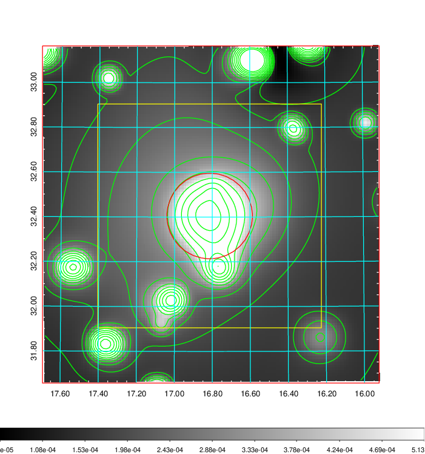   | 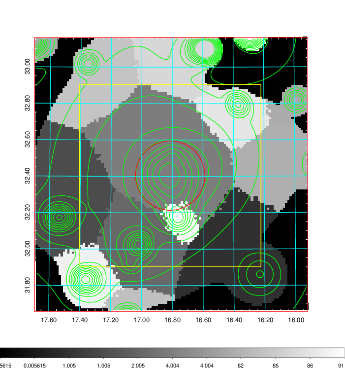  |

|[Exposure image](../image/53/53_mex.pdf)| [nH image](../image/53/53_nh.pdf)| [Planck image](../image/53/53_p.pdf)|
|-------------------|--------------------|-------------------|
|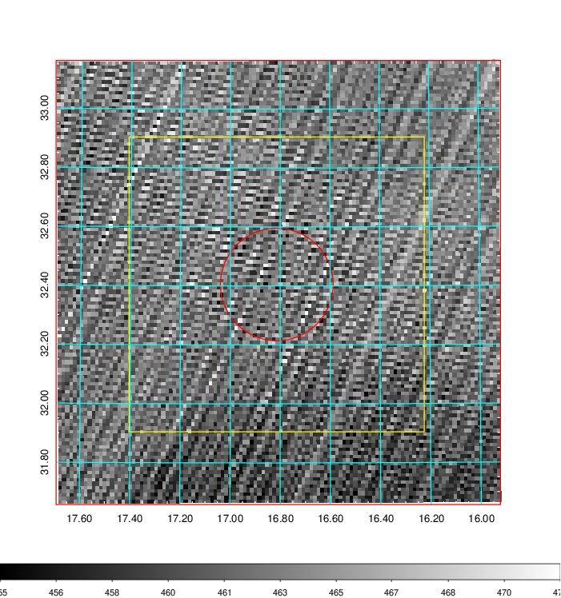   | 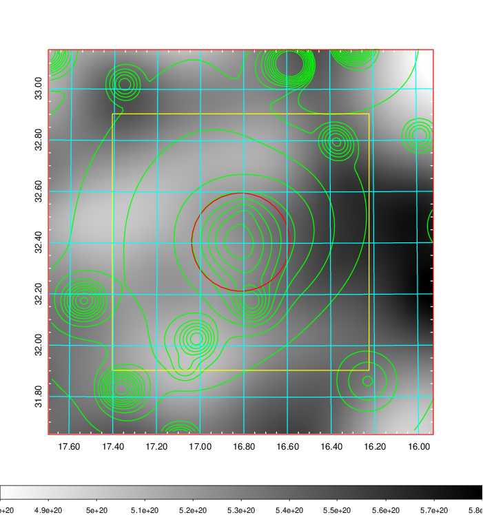    | 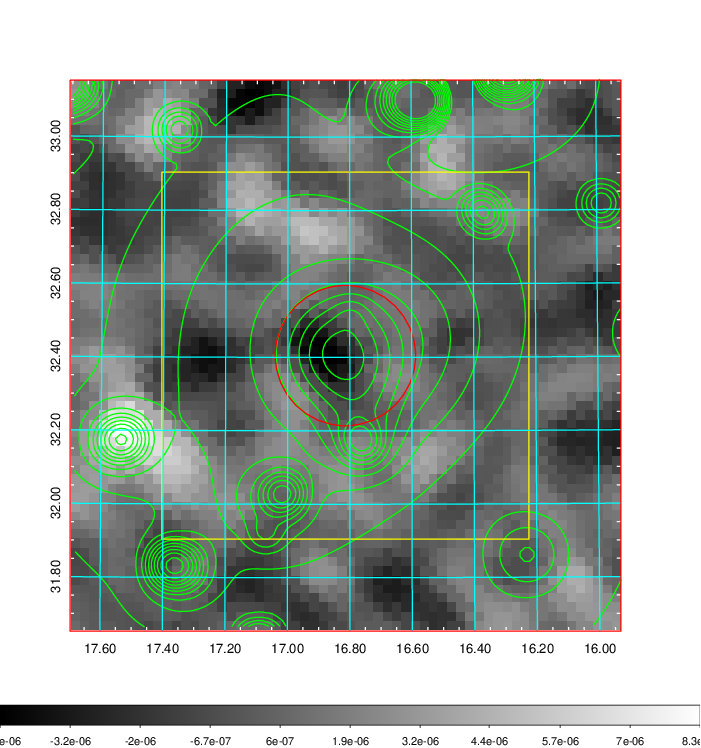 |

|[Redshift Histogram](../image/53/53_zg.pdf) | [DSS image(z1)](../image/53/53_dss_z1.pdf)      |  [DSS image(z2)](../image/53/53_dss_z2.pdf)    |
|-------------------|--------------------|-------------------|
|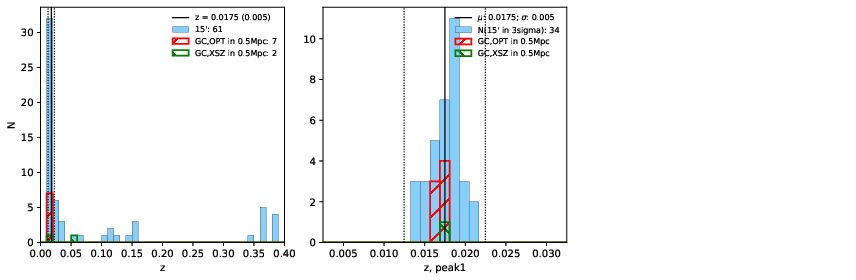 |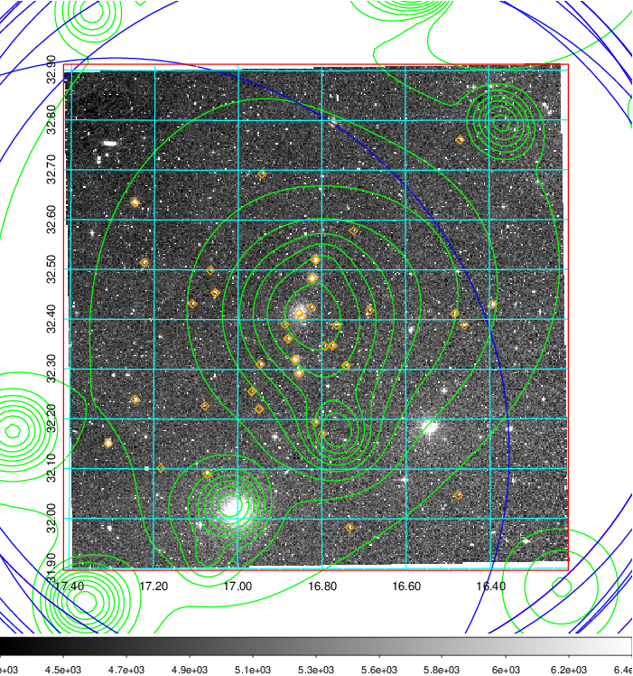  Blue circle for optical clusters;  Magenta circle for XSZ clusters;  all with r=1Mpc;  Only GC with Delta_z<0.01 are shown. | 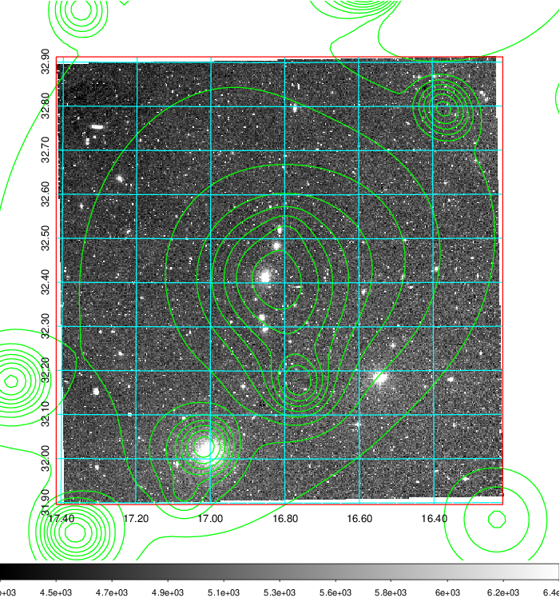 Blue circle for optical clusters;  Magenta circle for XSZ clusters;  all with r=1Mpc;  Only GC with Delta_z<0.01 are shown.  |

|[Previous-identified clusters](../image/53/53_gc.pdf) | [2MASS image](../image/53/53_2mass.pdf)      |[SDSS image](../image/53/53_sdss.pdf)   |
|-------------------|-------------------|-------------------|
|  Green, magenta, and blue circles  for optical, X-ray and SZ clusters  respectively, with redshift of clusters  labelled. The radius of circles  are 1Mpc.|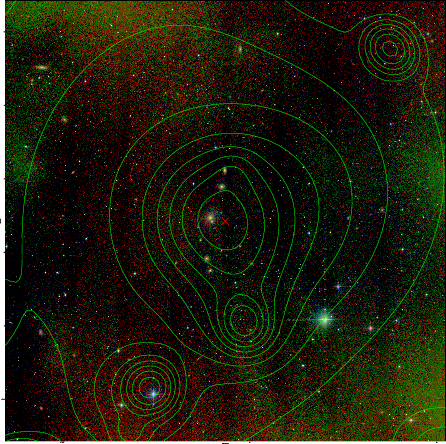  | 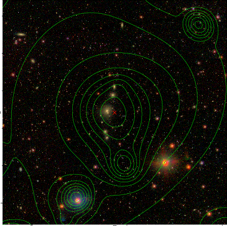  |

