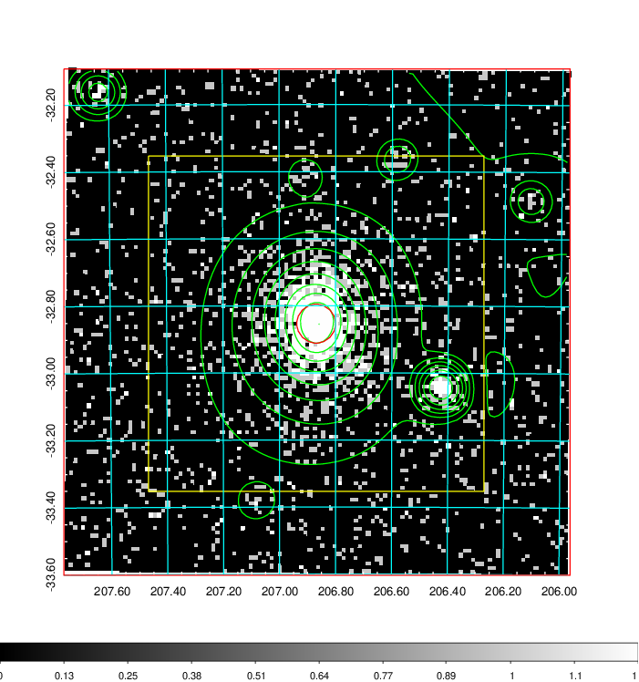
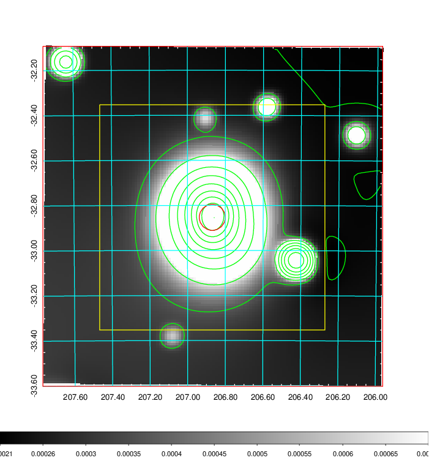
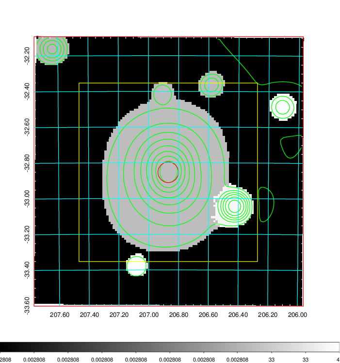
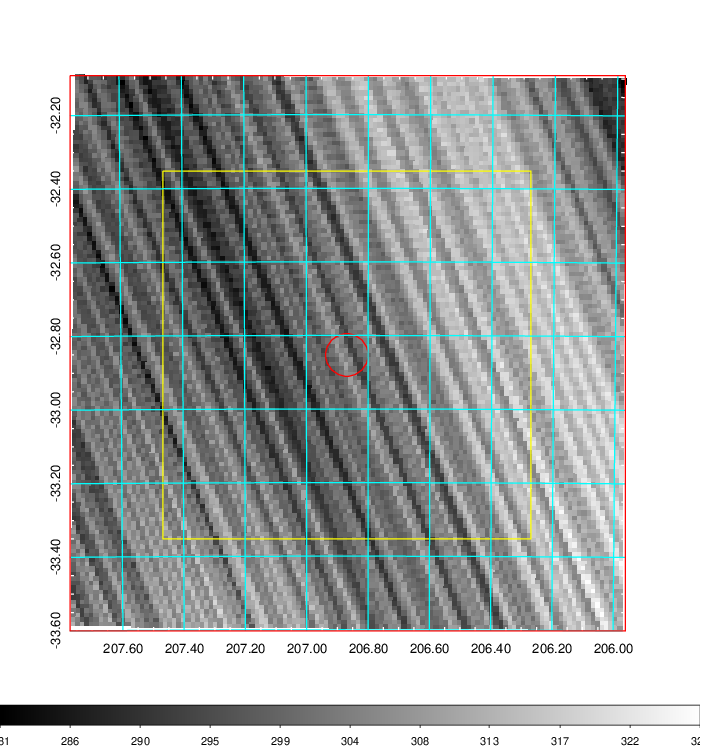
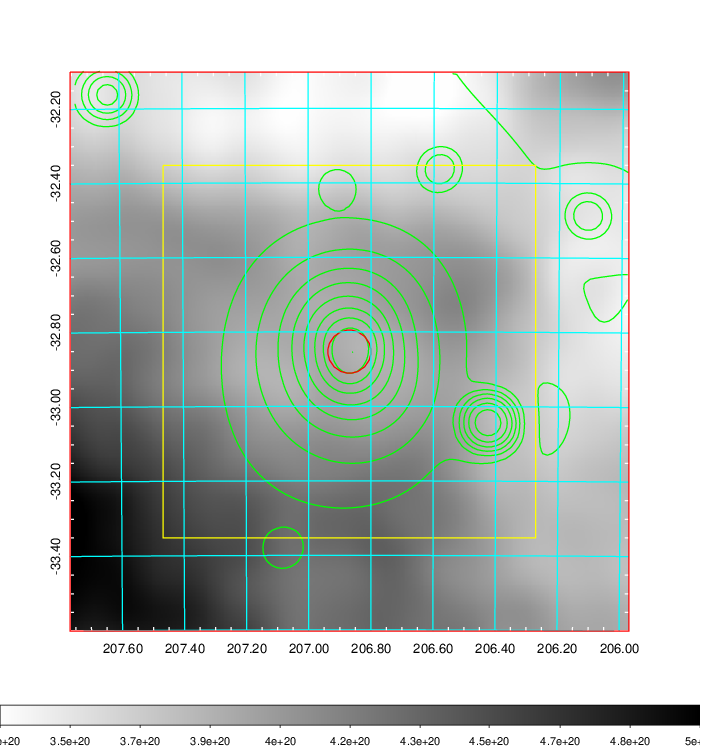
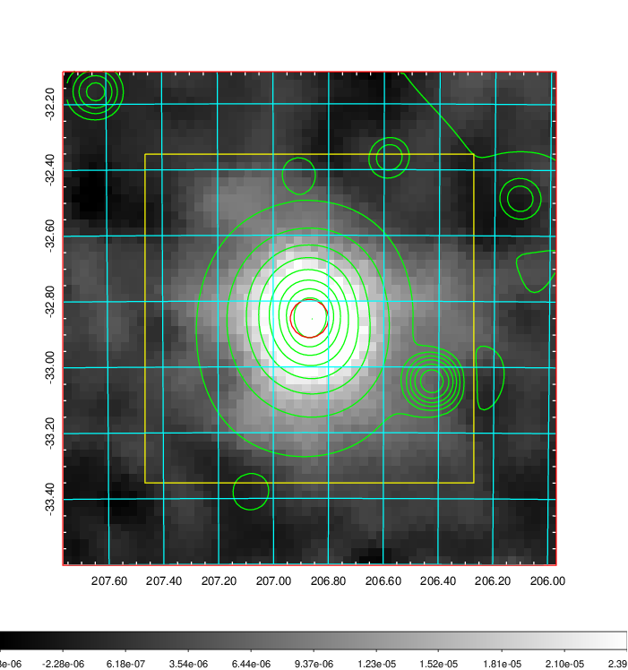
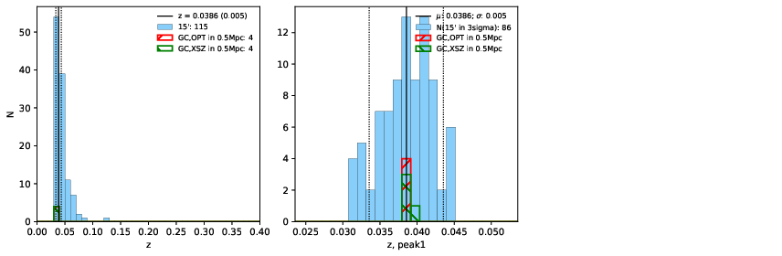
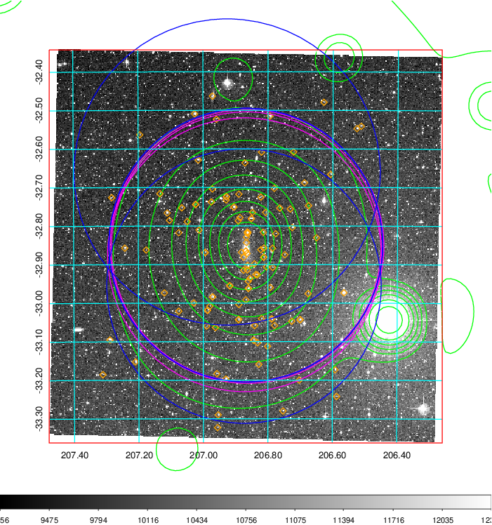
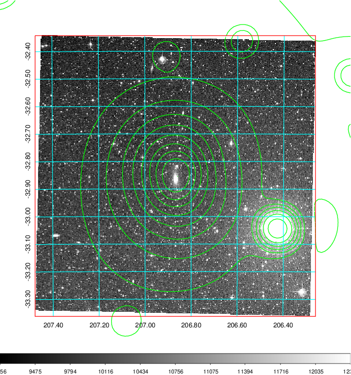
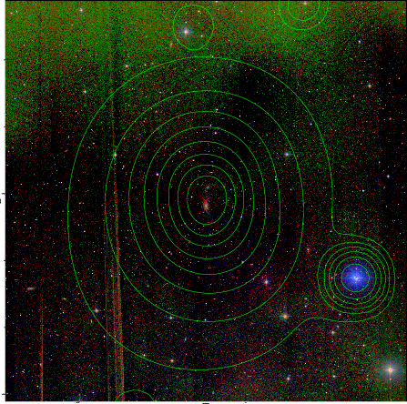

### 530

|Name|RAJ2000[deg]|DEJ2000[deg] |Ext[arcmin]| Ext,ml | z | z_src| C|GC(XSZ,Delta_z<0.01)| GC(OPT,Delta_z<0.01)|GC| R_sig[arcmin] | R500[arcmin] | R500[Mpc]| CRsig[c/s] | CR500[c/s] |L500[1E44 erg/s]|F500[1E-12 erg/s/cm^2]| M500[1E14 Msun]|Tx[keV]|Cnt_sig|Beta|Rc[arcmin]|Comment|Alias|
|---|---|---|---|---|---|------|---|--------|---------|----------|---|---|---|---|---|---|---|---|---|---|---|---|---|---|
|530| 206.869| -32.853| 3.47| 2510.01| 0.0386(0.005)| z1, z_xsz| B| MCXC, PSZ2, Tar, XB| A, N| A, MCXC, N, PSZ2, Tar, XB| 38.620| 26.548| 1.218| 5.569(0.184)| 5.296(0.175)| 3.422(0.042)| 98.728(1.203)| 5.34(0.03)| 6.09(0.02)| 1686.4| 0.700(-0.012+0.012)| 4.731(-0.170+0.178)| -| k425|

|[RASS image](../image/530/530_img.pdf)|[filtered image](../image/530/530_fil.pdf)|[Segment image](../image/530/530_seg.pdf)|
|-------------------|--------------------|-------------------|
|   |    |   |

|[Exposure image](../image/530/530_mex.pdf)| [nH image](../image/530/530_nh.pdf)| [Planck image](../image/530/530_p.pdf)|
|-------------------|--------------------|-------------------|
|   |     |  |

|[Redshift Histogram](../image/530/530_zg.pdf) | [DSS image(z1)](../image/530/530_dss_z1.pdf)      |  [DSS image(z2)](../image/530/530_dss_z2.pdf)    |
|-------------------|--------------------|-------------------|
| |  Blue circle for optical clusters;  Magenta circle for XSZ clusters;  all with r=1Mpc;  Only GC with Delta_z<0.01 are shown. |  Blue circle for optical clusters;  Magenta circle for XSZ clusters;  all with r=1Mpc;  Only GC with Delta_z<0.01 are shown.  |

|[known Abell/XSZ clusters](../image/530/530_gc.pdf) | [2MASS image](../image/530/530_2mass.pdf)      |
|-------------------|-------------------|
|  Magenta, blue and green circles  for optical, X-ray and SZ clusters  respectively, with redshift of clusters  labelled. The radius of circles  are 1Mpc.|  |

