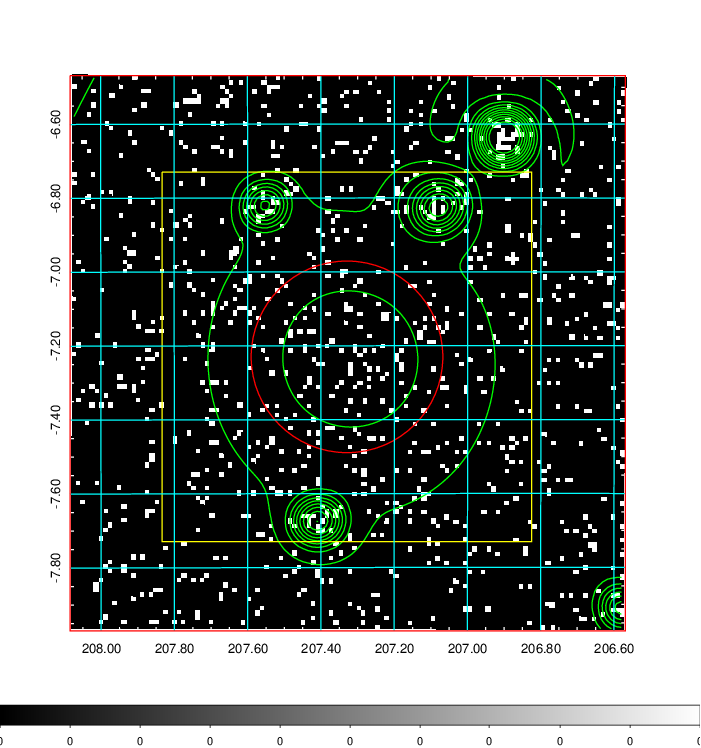
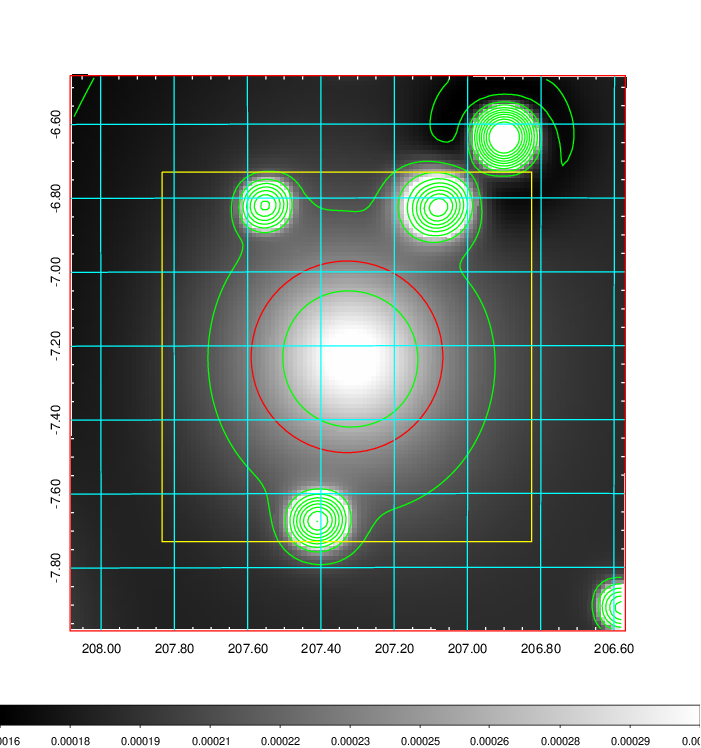
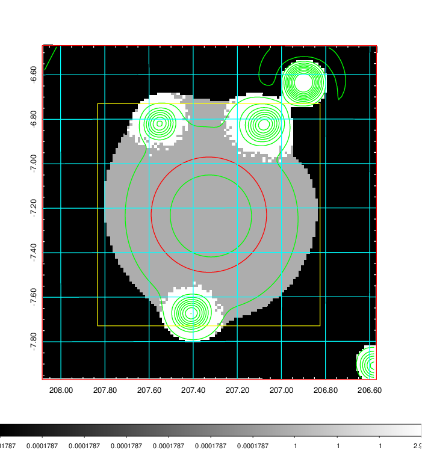
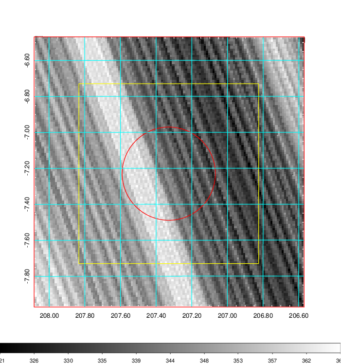
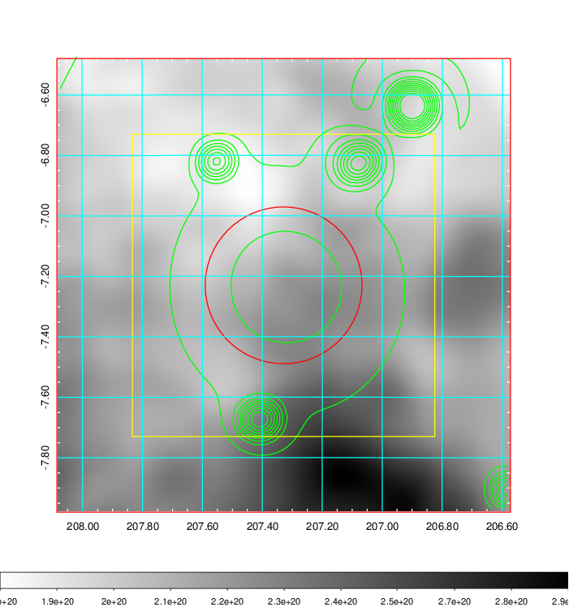
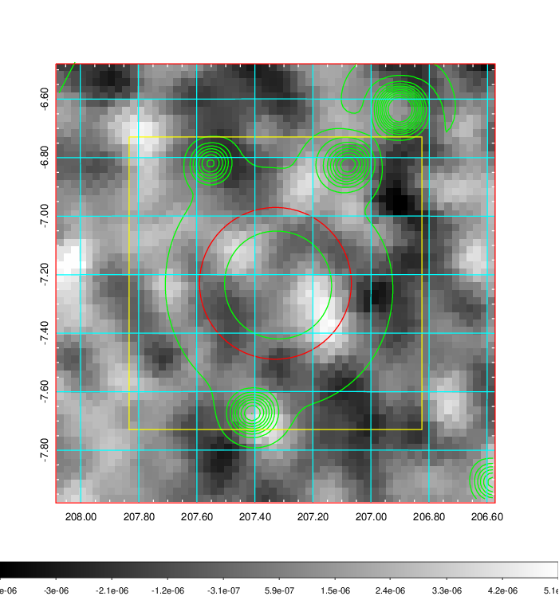
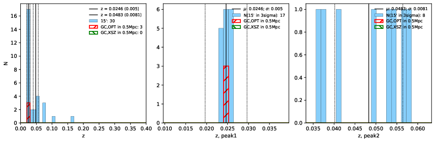
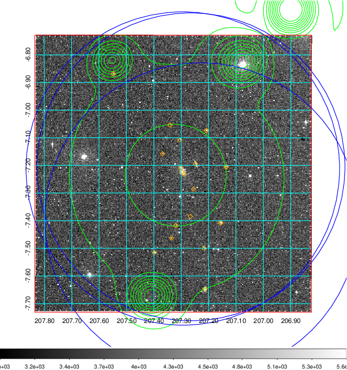
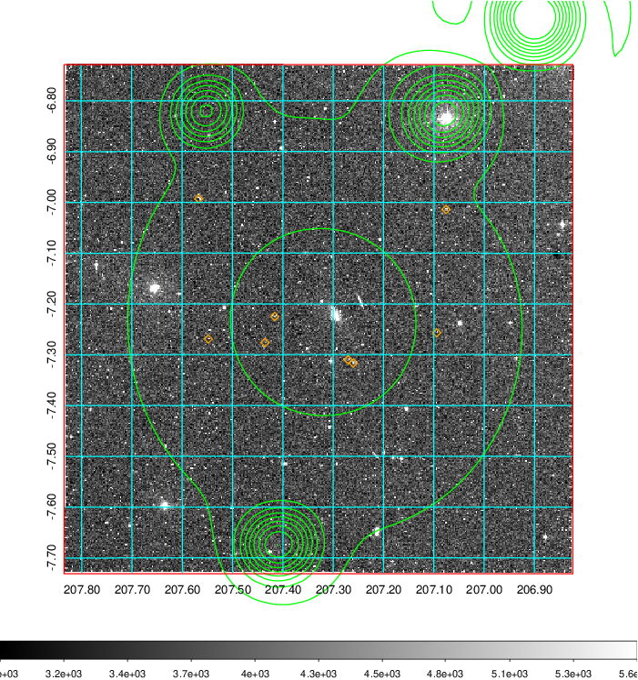
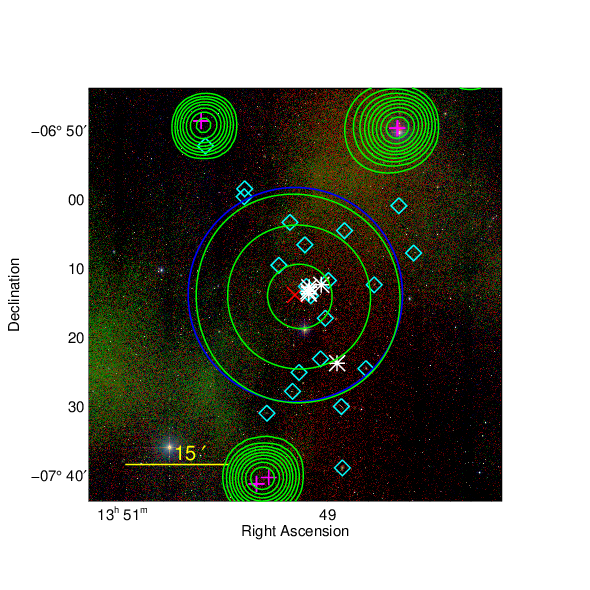

### 532

|Name|RAJ2000[deg]|DEJ2000[deg] |Ext[arcmin]| Ext,ml | z | z_src| C|GC(XSZ,Delta_z<0.01)| GC(OPT,Delta_z<0.01)|GC| R_sig[arcmin] | R500[arcmin] | R500[Mpc]| CRsig[c/s] | CR500[c/s] |L500[1E44 erg/s]|F500[1E-12 erg/s/cm^2]| M500[1E14 Msun]|Tx[keV]|Cnt_sig|Beta|Rc[arcmin]|Comment|Alias|
|---|---|---|---|---|---|------|---|--------|---------|----------|---|---|---|---|---|---|---|---|---|---|---|---|---|---|
|532| 207.329| -7.230| 15.56| 39.65| 0.0246(0.005)| z1, z_opt| S| -| N| N| 26.181| 16.354| 0.486| 0.195(0.073)| 0.184(0.068)| 0.035(0.013)| 2.530(0.976)| 0.34(0.07)| 1.10(0.14)| 113.9| 0.622(-0.092+0.196)| 12.088(-3.015+4.971)| -| t544|

|[RASS image](../image/532/532_img.pdf)|[filtered image](../image/532/532_fil.pdf)|[Segment image](../image/532/532_seg.pdf)|
|-------------------|--------------------|-------------------|
|   |    |   |

|[Exposure image](../image/532/532_mex.pdf)| [nH image](../image/532/532_nh.pdf)| [Planck image](../image/532/532_p.pdf)|
|-------------------|--------------------|-------------------|
|   |     |  |

|[Redshift Histogram](../image/532/532_zg.pdf) | [DSS image(z1)](../image/532/532_dss_z1.pdf)      |  [DSS image(z2)](../image/532/532_dss_z2.pdf)    |
|-------------------|--------------------|-------------------|
| |  Blue circle for optical clusters;  Magenta circle for XSZ clusters;  all with r=1Mpc;  Only GC with Delta_z<0.01 are shown. |  Blue circle for optical clusters;  Magenta circle for XSZ clusters;  all with r=1Mpc;  Only GC with Delta_z<0.01 are shown.  |

|[known Abell/XSZ clusters](../image/532/532_gc.pdf) | [2MASS image](../image/532/532_2mass.pdf)      |
|-------------------|-------------------|
|  Magenta, blue and green circles  for optical, X-ray and SZ clusters  respectively, with redshift of clusters  labelled. The radius of circles  are 1Mpc.|  |

|[ATLAS image](../image/532/532_s.pdf)        |
|-------------------|
|   |
