

### 533

|Name|RAJ2000[deg]|DEJ2000[deg] |Ext[arcmin]| Ext,ml | z | z_src| C|GC(XSZ,Delta_z<0.01)| GC(OPT,Delta_z<0.01)|GC| R_sig[arcmin] | R500[arcmin] | R500[Mpc]| CRsig[c/s] | CR500[c/s] |L500[1E44 erg/s]|F500[1E-12 erg/s/cm^2]| M500[1E14 Msun]|Tx[keV]|Cnt_sig|Beta|Rc[arcmin]|Comment|Alias|
|---|---|---|---|---|---|------|---|--------|---------|----------|---|---|---|---|---|---|---|---|---|---|---|---|---|---|
|533| 207.737| 7.697| 5.45| 32.53| 0.0739(0.006)| z1,| G| -| -| C, F20, N, W| 15.625| 9.199| 0.775| 0.194(0.054)| 0.181(0.051)| 0.460(0.093)| 3.443(0.697)| 1.42(0.15)| 2.72(0.18)| 66.5| 0.850(-0.150+0.105)| 6.557(-1.335+1.097)| -| t279|

|[RASS image](../image/533/533_img.pdf)|[filtered image](../image/533/533_fil.pdf)|[Segment image](../image/533/533_seg.pdf)|
|-------------------|--------------------|-------------------|
| 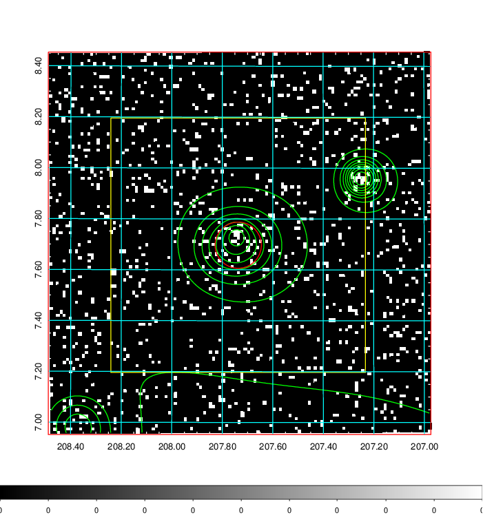  | 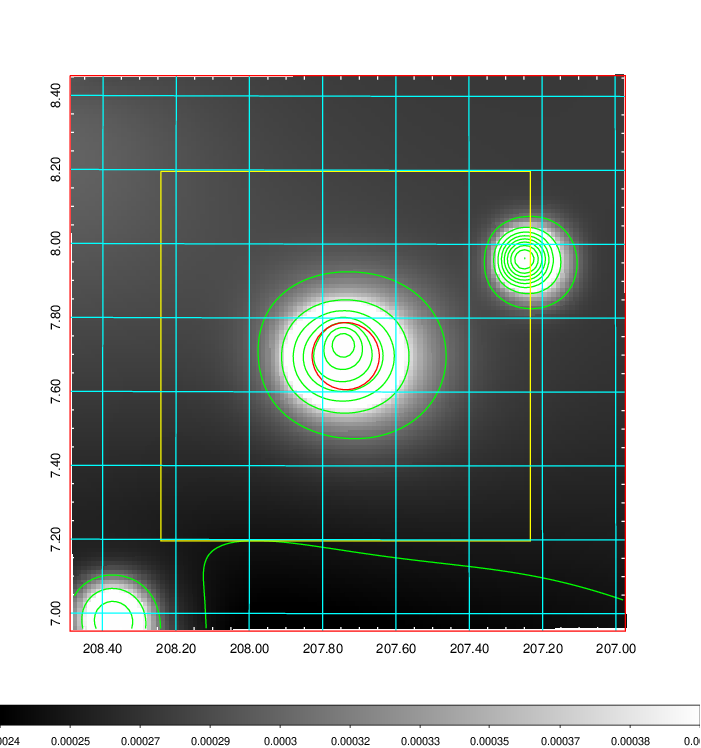   | 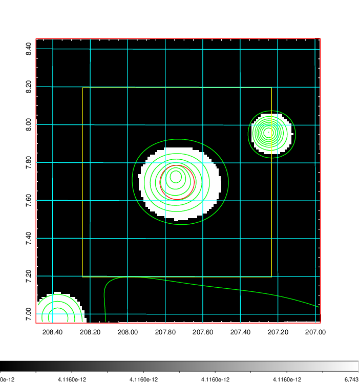  |

|[Exposure image](../image/533/533_mex.pdf)| [nH image](../image/533/533_nh.pdf)| [Planck image](../image/533/533_p.pdf)|
|-------------------|--------------------|-------------------|
|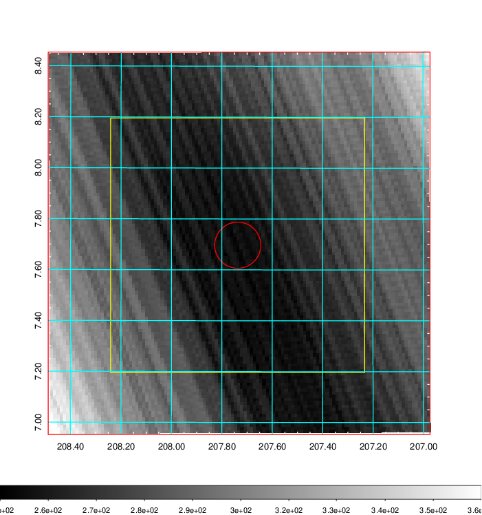   | 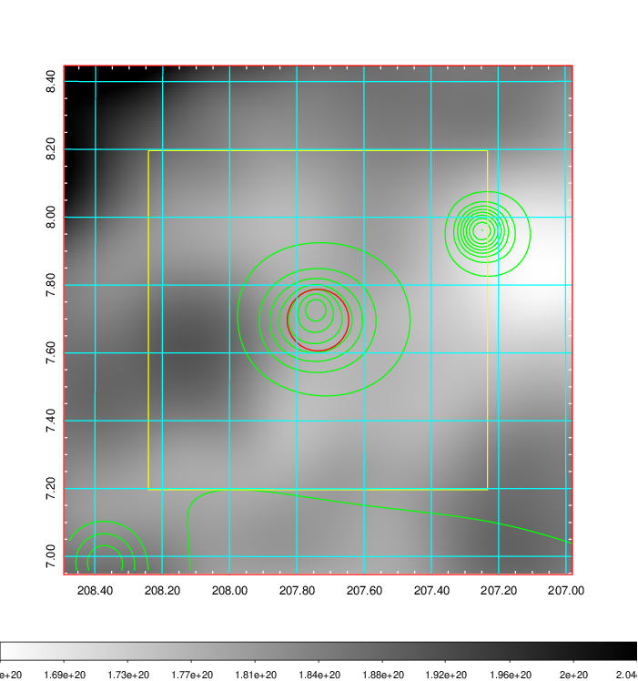    | 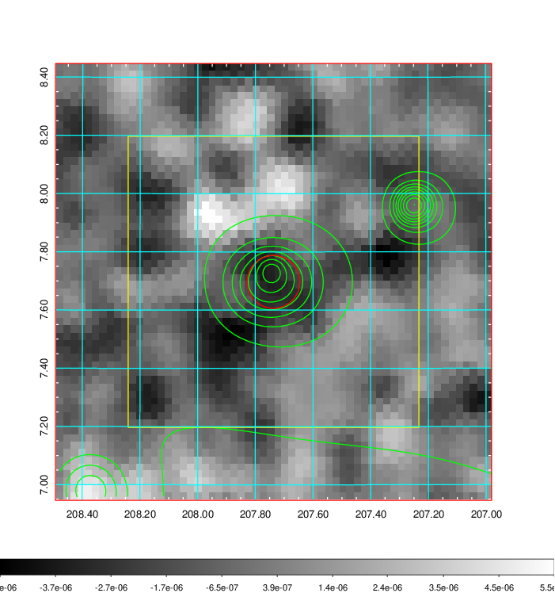 |

|[Redshift Histogram](../image/533/533_zg.pdf) | [DSS image(z1)](../image/533/533_dss_z1.pdf)      |  [DSS image(z2)](../image/533/533_dss_z2.pdf)    |
|-------------------|--------------------|-------------------|
|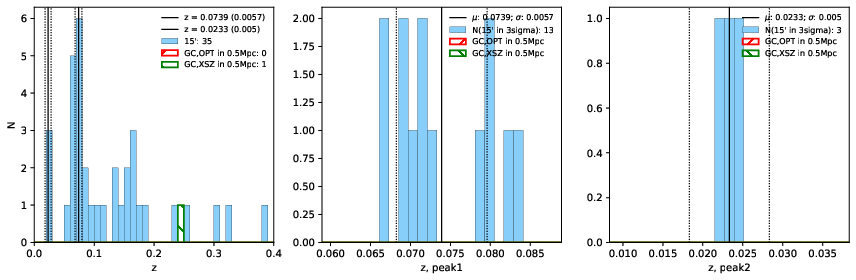 |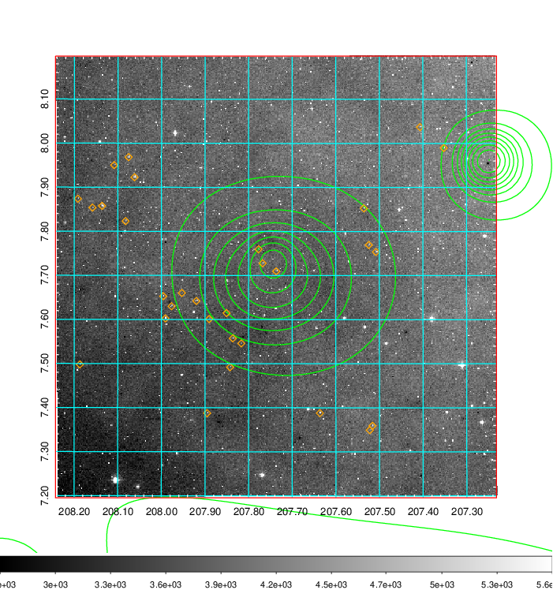  Blue circle for optical clusters;  Magenta circle for XSZ clusters;  all with r=1Mpc;  Only GC with Delta_z<0.01 are shown. | 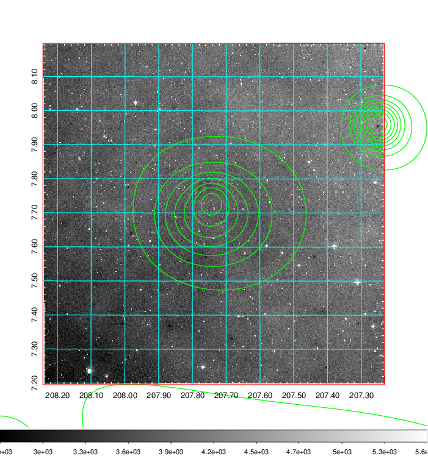 Blue circle for optical clusters;  Magenta circle for XSZ clusters;  all with r=1Mpc;  Only GC with Delta_z<0.01 are shown.  |

|[known Abell/XSZ clusters](../image/533/533_gc.pdf) | [2MASS image](../image/533/533_2mass.pdf)      |[SDSS image](../image/533/533_sdss.pdf)   |
|-------------------|-------------------|-------------------|
|  Magenta, blue and green circles  for optical, X-ray and SZ clusters  respectively, with redshift of clusters  labelled. The radius of circles  are 1Mpc.|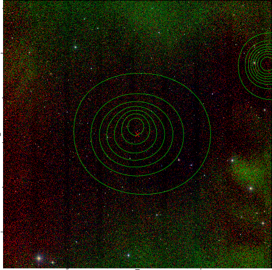  | 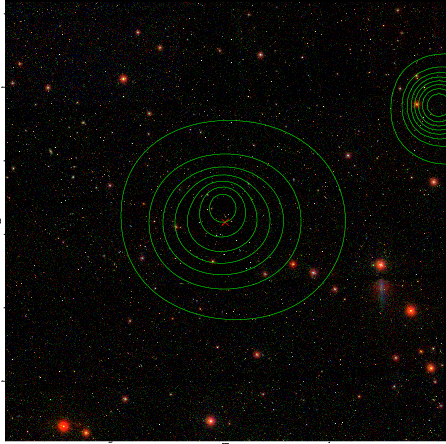  |

